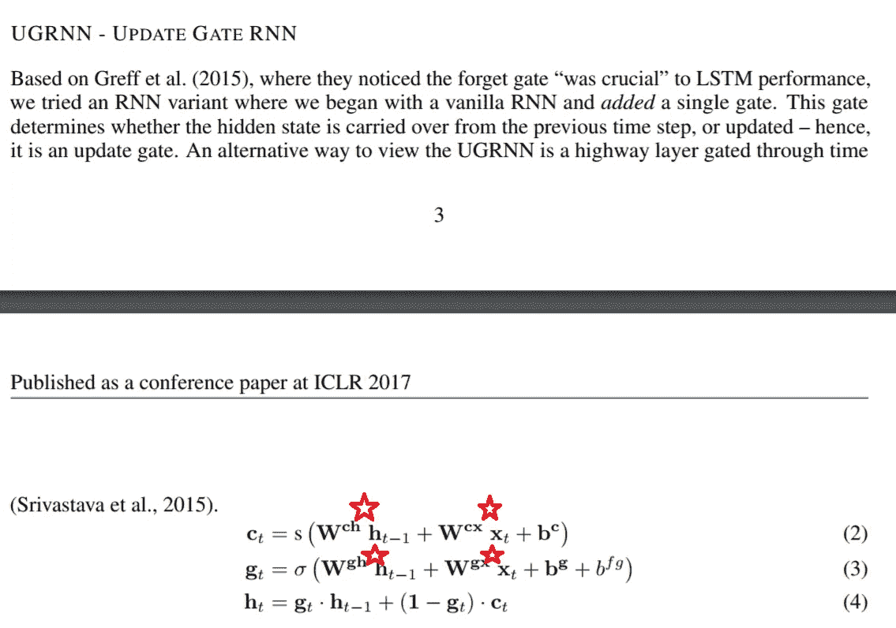
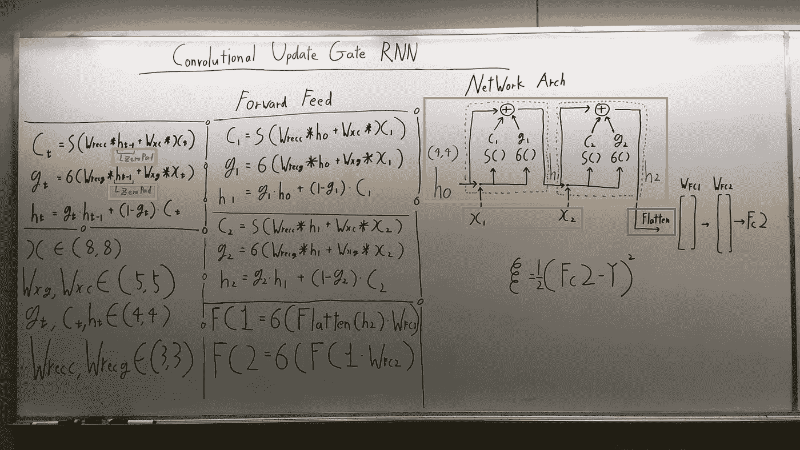
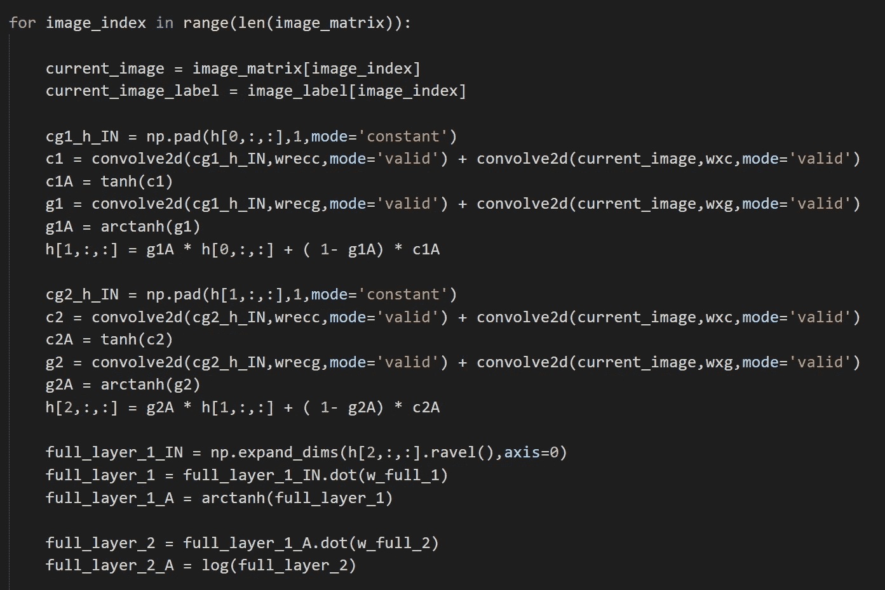
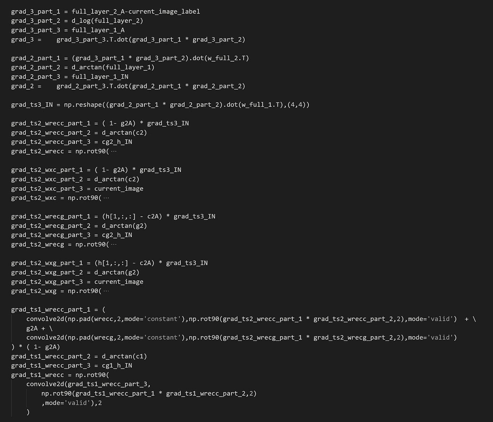
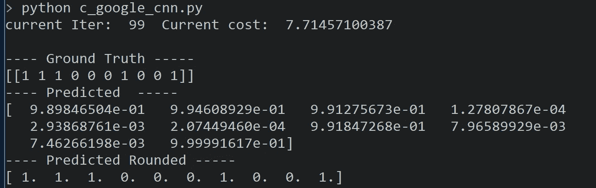
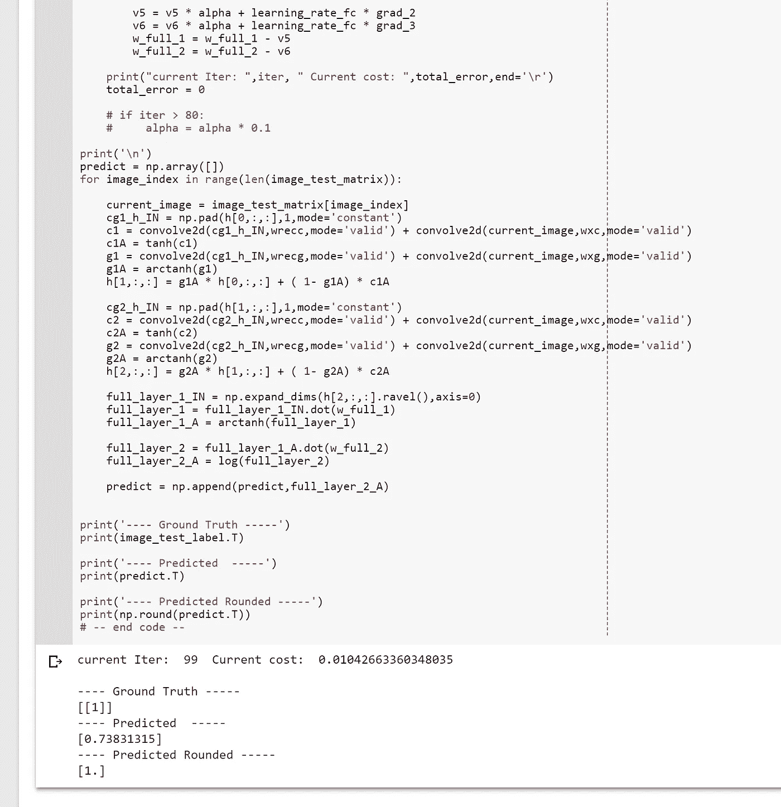

# 只有 Numpy:卷积更新门 RNN，用交互代码修改谷歌大脑的更新门 RNN(递归神经网络中的容量和可训练性)。

> 原文：<https://towardsdatascience.com/only-numpy-convolutional-update-gate-rnn-modifying-google-brains-update-gate-rnn-capacity-and-4a3e932eccf8?source=collection_archive---------7----------------------->

Gif from [here](https://giphy.com/gifs/neural-networks-IthDvtTlWezf2/download)

因此，我在这里发表了一篇文章，实现了本文中提出的各种不同的 RNN "[递归神经网络的容量和可训练性](https://arxiv.org/abs/1611.09913)"，请[点击这里的链接阅读我的中型博客文章](https://becominghuman.ai/only-numpy-implementing-and-comparing-google-brains-update-gate-capacity-and-trainability-in-940f0ad80649)。但是为什么就此打住呢？

让我们将更新门 RNN (URNN)转换为 CURNN，卷积更新 RNN。此外，我将使用动量优化器。我们正在对仅用于 0 和 1 图像的“[识别手写数字](http://scikit-learn.org/stable/auto_examples/classification/plot_digits_classification.html)”数据集执行一个非常简单的二进制任务。

# 热门人工智能文章:

> [1。反向传播非常简单。谁让它变得复杂了？](https://becominghuman.ai/back-propagation-is-very-simple-who-made-it-complicated-97b794c97e5c)
> 
> [2。用于算法交易的神经网络](https://becominghuman.ai/neural-networks-for-algorithmic-trading-multimodal-and-multitask-deep-learning-5498e0098caf)
> 
> [3。介绍 Ozlo](https://becominghuman.ai/introducing-ozlo-d5cce73d7ba5)

**网络架构:数学形式**

Image fr[om Original Pap](https://arxiv.org/abs/1611.09913)er

上面的图像只是一个复习，但是请注意红色的星形区域，我们将把这个操作从点积改为卷积操作。

**网络架构:图形形式/前馈操作**

上图中有很多东西，所以让我从最右边解释一下。

**浅绿色框** → **零填充隐藏状态以保留尺寸(** *注意这一点非常重要，因为我们需要保留尺寸！* **)**

**X** →尺寸为(8*8)
**Wxg，Wxc** →将要应用于尺寸为(5*5)的输入图像的卷积核

**g(t)，c(t)，h(t)** →各门输出，尺寸均为(4*4)

**Wrecc，Wrecg** →将要应用于先前隐藏状态维度(3*3)的卷积核

**Wfc1，Wfc2** →分类全连接层的权重

**橙色框** →我和 CURNN 的前馈假设有 2 个时间戳

**紫色方框** →对于两个时间戳来说，**输入是完全相同的图像！(所以我的想法是，网络可以通过再次显示相同的图像来学习得更好，LOL 不知道这是否可能是真的。)**

**蓝框** →矢量化隐藏状态(2)矩阵(4*4)成(1*16)矢量。

下面是代码实现。

**关于
Wfc2，Wfc1，c(2) —时间戳= 2，g(1) —时间戳= 1** 的反向传播

再一次，这张图片包含了很多东西。

**粉色星形/红色星形→** 全连接层的标准反向传播尊重 Wfc1、Wfc2

**蓝星** →时间标记 2 时相对于 c 门()的导数。请注意，我们对 c()求导，而不是对权重 Wrecc 或 Wxc 求导，这是因为一旦我们对 c()求导，我们就可以很容易地对这些变量进行反向传播。如果你想看 RNN 反向传播的完整例子。请通过[点击此处](https://medium.com/@SeoJaeDuk/only-numpy-deriving-forward-feed-and-back-propagation-in-long-short-term-memory-lstm-part-1-4ee82c14a652)或[点击此处](https://becominghuman.ai/only-numpy-implementing-and-comparing-google-brains-update-gate-capacity-and-trainability-in-940f0ad80649)阅读我的中帖。

**粉色星星** →故事同上，但针对 g 门()，时间标记为 1。

下面是反向传播的局部视图。

**培训和结果**

在使用超级参数后，(ALOT)我能够取得不错的成绩。然而，这是非常困难的训练。在一些点上，学习只是停止在成本 44 或类似的东西，所以它是相当令人沮丧的。

**互动码**

*注意:在线编译器没有“从 sklearn 导入数据集”，所以我不能复制并粘贴我在笔记本电脑上使用的代码。所以我复制了四个训练样本，分别代表手写数字 0，1，0，1，并调整了超参数。*

*更新:我为了交互代码搬到了 Google Colab！所以你需要一个谷歌帐户来查看代码，你也不能在谷歌实验室运行只读脚本，所以在你的操场上做一个副本。最后，我永远不会请求允许访问你在 Google Drive 上的文件，仅供参考。编码快乐！*

请[点击此处，进入互动码](https://colab.research.google.com/notebook#fileId=1Q4uM2nh3HrsCzY6aEVWyFAiEo-Yy_6Xq)。

## 最后的话

我真的需要使用不同的优化方法。在纯 SGD 或 Momentum 上训练复杂模型变得有点困难。

如果发现任何错误，请发电子邮件到 jae.duk.seo@gmail.com 找我。

同时，在我的 twitter 上关注我[这里](https://twitter.com/JaeDukSeo)，访问[我的网站](https://jaedukseo.me/)，或者我的 [Youtube 频道](https://www.youtube.com/c/JaeDukSeo)了解更多内容。如果你感兴趣的话，我还做了解耦神经网络[的比较。](https://becominghuman.ai/only-numpy-implementing-and-comparing-combination-of-google-brains-decoupled-neural-interfaces-6712e758c1af)

**参考文献**

1.  Collins，j .，Sohl-Dickstein，j .，和 Sussillo，D. (2016 年)。递归神经网络的容量和可训练性。 *arXiv 预印本 arXiv:1611.09913* 。
2.  Seo，J. D. (2018 年 1 月 24 日)。Only Numpy:实现和比较 Google Brain 的更新门(容量和可训练性 in…2018 年 1 月 29 日检索，来自[https://becoming human . ai/only-Numpy-Implementing-and-comparison-Google-brains-Update-Gate-Capacity-and-training ability-in-940 f0ad 80649](https://becominghuman.ai/only-numpy-implementing-and-comparing-google-brains-update-gate-capacity-and-trainability-in-940f0ad80649)
3.  Seo，J. D. (2018 年 1 月 11 日)。只有 Numpy:推导长期短期记忆中的前馈和反向传播(LSTM)第 1 部分。2018 年 1 月 29 日检索，来自[https://medium . com/@ SeoJaeDuk/only-numpy-derivating-forward-feed-and-back-propagation-in-long-short-term-memory-lstm-part-1-4 ee 82 c 14 a 652](https://medium.com/@SeoJaeDuk/only-numpy-deriving-forward-feed-and-back-propagation-in-long-short-term-memory-lstm-part-1-4ee82c14a652)
4.  Seo，J. D. (2018 年 1 月 29 日)。Only Numpy:(我为什么做手动反向传播)实现多通道/层卷积神经…2018 年 1 月 29 日检索自[https://medium . com/@ SeoJaeDuk/only-Numpy-Why-I-do-Manual-Back-Propagation-Implementing-Multi-Channel-Layer-con { volution-Neural-7d 83242 FCC 24](https://medium.com/@SeoJaeDuk/only-numpy-why-i-do-manual-back-propagation-implementing-multi-channel-layer-convolution-neural-7d83242fcc24)

