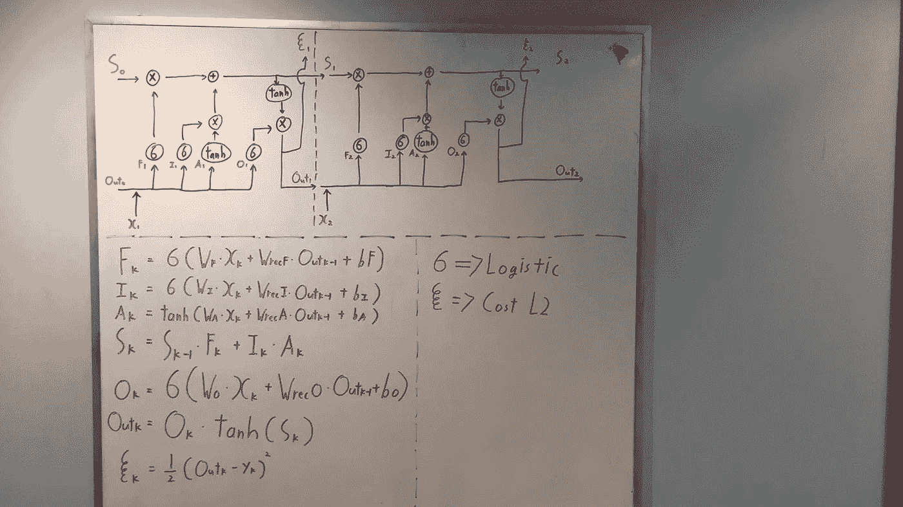
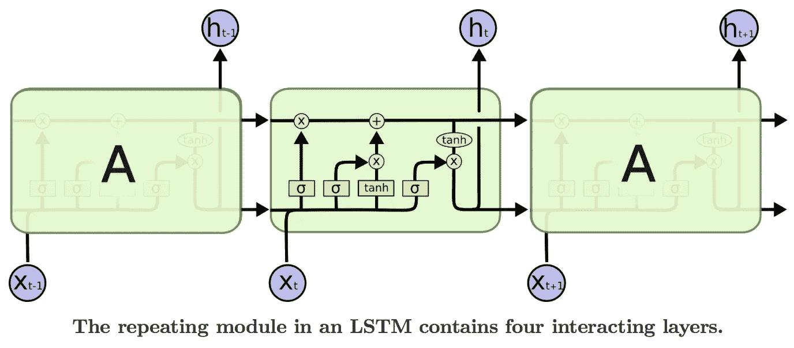
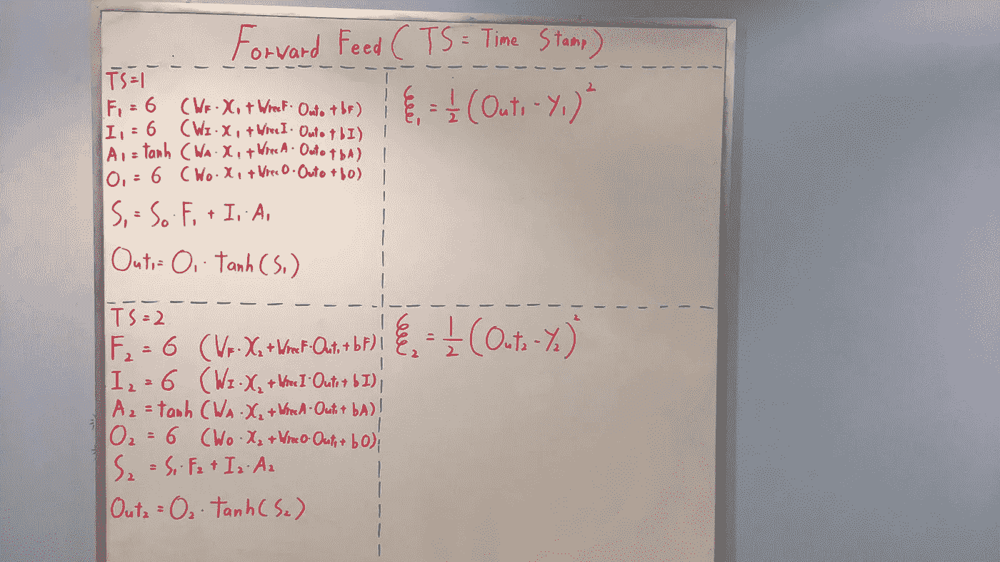
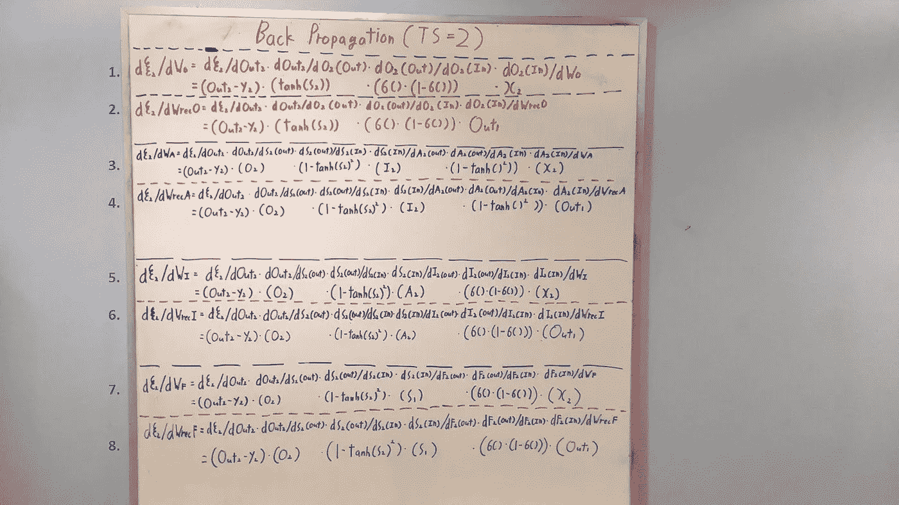
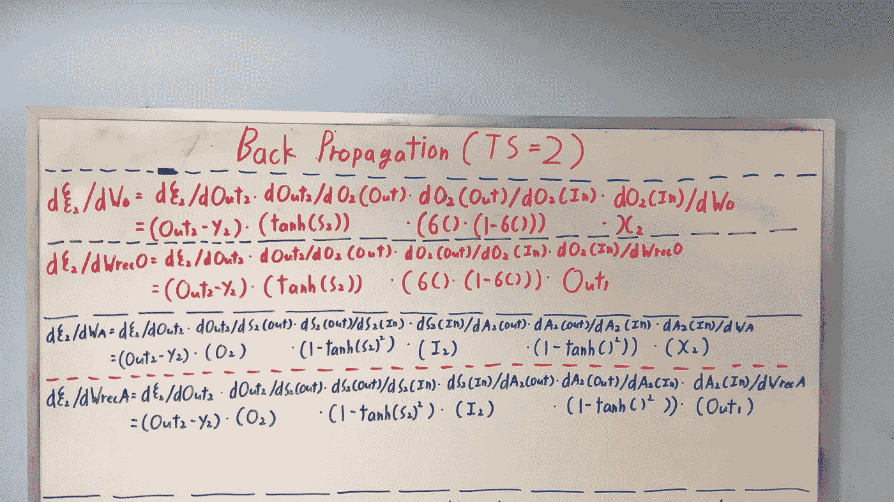
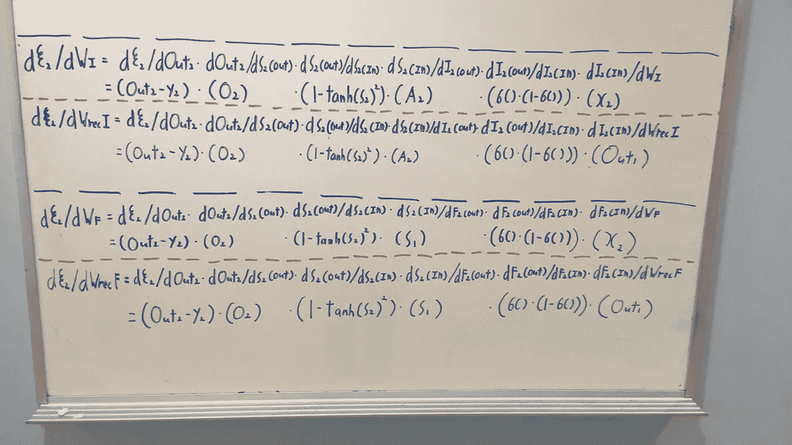
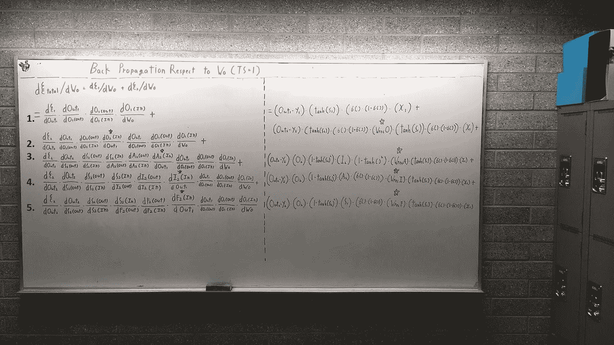
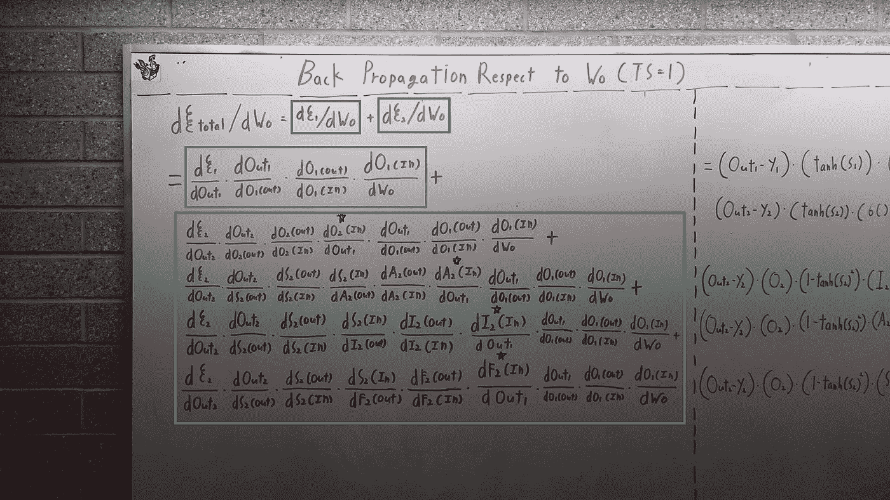
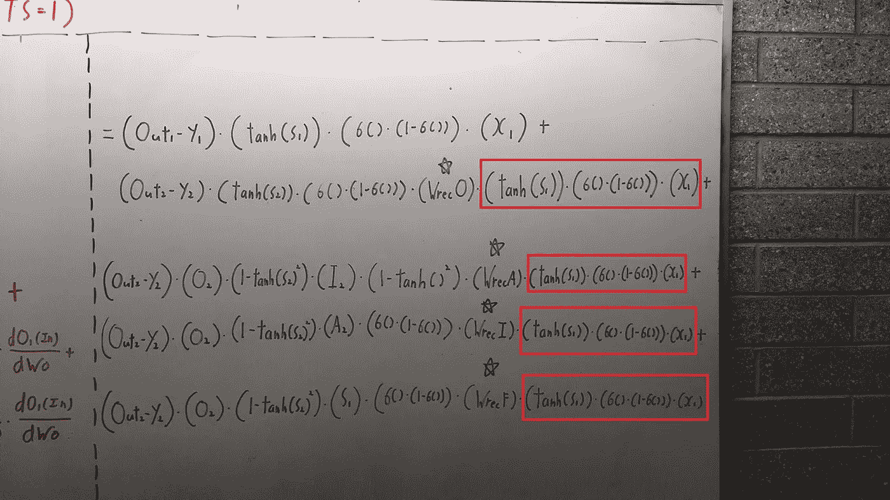

# 只有数字:长期短期记忆中的前向反馈和反向传播(LSTM)第 1 部分

> 原文：<https://towardsdatascience.com/only-numpy-deriving-forward-feed-and-back-propagation-in-long-short-term-memory-lstm-part-1-4ee82c14a652?source=collection_archive---------4----------------------->

所以我从我的韩国寒假旅行回来了。(南方)。实际上，我想在去度假之前做这件事，但不管怎样，还是这样吧。此外，我将把本教程分为两部分，因为反向传播变得相当长。我将使用数学符号

今天我们将对 LSTM(长短期记忆)网络进行前馈操作和反向传播，所以让我们先看看网络架构。

# 网络体系结构

Network Architecture

如上所述，我需要解释的符号很少。
F(k) - >时间戳处的遗忘门
I(k) - >时间戳处的输入门
A(k)- >时间戳处的激活门
O(k)- >时间戳处的输出门
S(k)- >时间戳处的状态
Out(k) - >时间戳处的输出

另一件要注意的事情是正常体重和经常性体重。输入 X 使用常规权重 W 执行点积，而先前的输出使用递归权重 Wrec 执行点积。所以总共有 8 个权重，特别是在执行反向传播时，注意这一点很重要。

# 热门人工智能文章:

> [1。如何训练一个神经网络自己编码？](https://becominghuman.ai/how-to-train-a-neural-network-to-code-by-itself-a432e8a120df)
> 
> [2。从感知器到深度神经网络](https://becominghuman.ai/from-perceptron-to-deep-neural-nets-504b8ff616e)
> 
> [3。求解微分方程的神经网络](https://becominghuman.ai/neural-networks-for-solving-differential-equations-fa230ac5e04c)

浅绿色框->成本函数，我们正在使用 L2 成本函数
黄色框与下图所示的一个框相同。

Image from [colah’s blog](http://colah.github.io/posts/2015-08-Understanding-LSTMs/)

# 前馈过程

如上所述，LSTM 的前馈过程非常简单，我们唯一要小心的是时间戳。上图显示了 TS 为 1 和 TS 为 2 时，两个时间戳的前馈过程。

另一件要注意的事情是每个时间戳的成本函数，我们可以看到我们得到了每个时间戳的错误率。
1/2 *(Out(1)-Y(1))→TS = 1
1/2 *(Out(2)-Y(2))→TS = 2

# 时间戳为 2 时所有权重的反向传播

记得我告诉过你我们总共有 8 个砝码吗？(包括常规的和循环的)现在我们需要对它们中的每一个进行反向传播，这就是为什么我们在板上有 8 个方程。

等式 1 →关于 Wo(输出门)的权重更新
等式 2→关于 Wreco(循环输出门)的权重更新
等式 3→关于 Wa(激活门)的权重更新
等式 4→关于 Wreca(循环激活门)的权重更新
等式 5→关于 Wi(输入门)的权重更新
等式 6→关于 Wreci(循环输入门)的权重更新
等式 7→关于 Wf(遗忘门)的权重更新
等式 8→关于 Wrecf(循环遗忘门)的权重更新

Closer Look for Wo, Wreco, Wa and Wreca

如上所示，数学术语写在上面，实际的反向传播写在底部。(关于每个术语)。

Closer Look for Wi, Wreci, Wf and Wrecf

# 时间戳为 1 时相对于 Wo(输出门)的反向传播

正如你已经注意到的，由于链式法则，当时间戳为 1 时，反向传播变得非常复杂。你在上面看到的这五个方程，只是为了得到相对于 Wo 的**误差率。**

当时间戳为 1 时，关于执行反向传播的一个有趣事实是总错误率。我们不仅需要考虑时间戳为 1 时代价函数的错误率，还需要考虑时间戳为 2 时代价函数的错误率。所以…
蓝框→时间戳为 1 时成本函数的错误率
绿框→时间戳为 2 时成本函数的错误率

上面是执行反向传播所需的实际数学方程的屏幕截图。我想指出两件事。

1.  我们正在乘以递归权重以执行反向传播的黑星→这就是为什么 LSTM 如此难以训练的原因，它们非常容易受到梯度爆炸和消失梯度的影响。
2.  如上图所示，红框内的数学符号是重复的术语。在未来，我将通过首先计算重复项来简化反向传播。

## 最后的话

这是第一部分，我会很快给你们第二部分和第三部分的更新…(我希望如此)。

同时，在我的 twitter [这里](https://twitter.com/JaeDukSeo)关注我，并访问[我的网站](https://jaedukseo.me/)，或我的 [Youtube 频道](https://www.youtube.com/c/JaeDukSeo)了解更多内容。如果你感兴趣的话，我还在简单的 RNN [上做了反向传播。](https://medium.com/@SeoJaeDuk/only-numpy-vanilla-recurrent-neural-network-with-activation-deriving-back-propagation-through-time-4110964a9316)

