# Only Numpy:通过“使用空间 LSTMs 的生成图像建模”导出多维递归神经网络(空间 LSTM)的前馈

> 原文：<https://towardsdatascience.com/only-numpy-deriving-forward-feed-on-multi-dimensional-recurrent-neural-networks-spatial-lstm-by-35d111906258?source=collection_archive---------6----------------------->

多维递归神经网络，我一听到它的名字就对它产生了兴趣。所以今天，我将尝试针对空间 LSTM 的网络结构介绍[。](https://arxiv.org/pdf/1506.03478.pdf)“使用空间 LSTMs 的生成式图像建模”Lucas Theis。同样在今天的博客中，我们将对 2D·LSTM 进行**前馈。**

我还买了一个新的马克笔——橙色和绿色的 XD

**从 1D LSTM 转换到 2D LSTM**

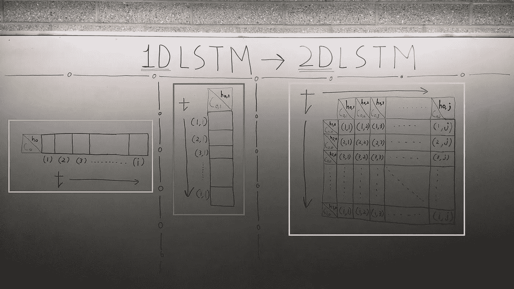

上面的图片展示了我们如何把 1D·LSTM 的想法带到 2D·LSTM。将它们应用到图像上。从上面的照片中需要注意的非常重要的一点是单元格状态和隐藏状态。

黄色方框→ 1D LSTM
绿色方框→转置的 1D LSTM
(把它想象成矩阵中的一列)
粉色方框→ 2D LSTM

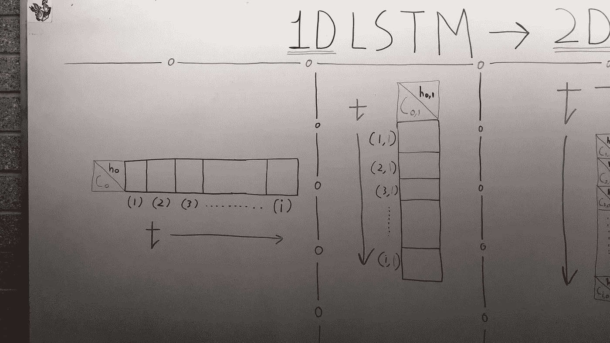

1D LSTM that depends on Time

如上所述，对于 1D·LSTM，我们在开始训练网络之前初始化 C(0)和 h(0)。有多种方法来初始化这些值，例如在论文“ [*Show，Attend and Tell:Neural Image Caption Generation with Visual Attention*](https://arxiv.org/pdf/1502.03044.pdf)”中，作者通过称为 MLP 的东西来初始化第一个值——我只能假设它是多层感知器。

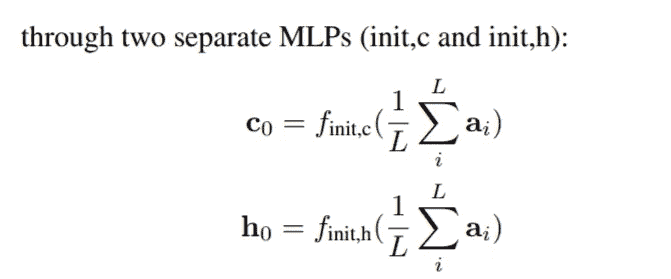

Image from original Paper [Show, Attend and Tell: Neural Image Caption Generation with Visual Attention](https://arxiv.org/pdf/1502.03044.pdf)

但是在 2D LSTM，我们必须初始化更多的单元格和隐藏状态值。

2D LSTM respect to time

如上所示，我们不仅需要从 C(0，1)初始化到 C(0，j)，还需要从 C(1，0)初始化到 C(i，0)。所有隐藏状态都是如此。现在我们可以做一些有趣的事情，因为我们知道了 1D·LSTM 和 2D·LSTM 的结构，让我们想象一下 3D LSTM。

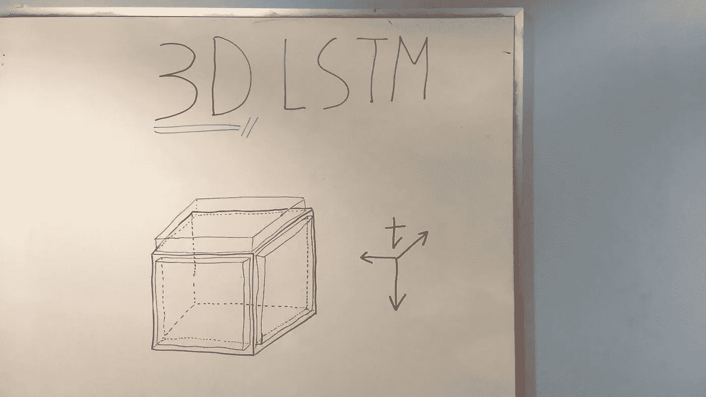

3D LSTM

她真是个美人，不是吗？:D
同样，橙色方框是第一个单元格和隐藏状态的位置。这个网络的应用不仅仅局限于视频数据，还有更多。现在我们知道了一般的结构，让我们回到论文“[使用空间 LSTMs 生成图像建模](https://arxiv.org/pdf/1506.03478.pdf)

**空间长短期记忆**

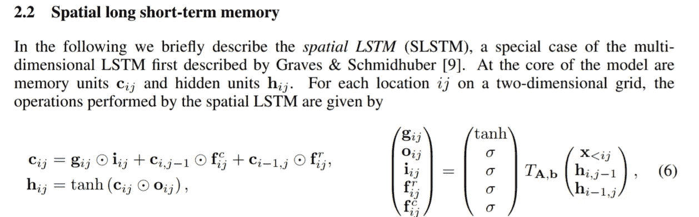

Image from original [paper](https://arxiv.org/pdf/1506.03478.pdf)

所以正如作者所说，最初的 SLSTM 是由两位作者 Graves & Schmidhuber 提出的。要查看这两位作者的论文，请单击“*”使用多维递归神经网络进行脱机手写识别。在那篇论文中，作者对什么是 2D·LSTM 有一个很好的设想，如下所示。然而，我正在研究的论文有更清晰的数学方程来描述 SLSTM。(如上所示)*

*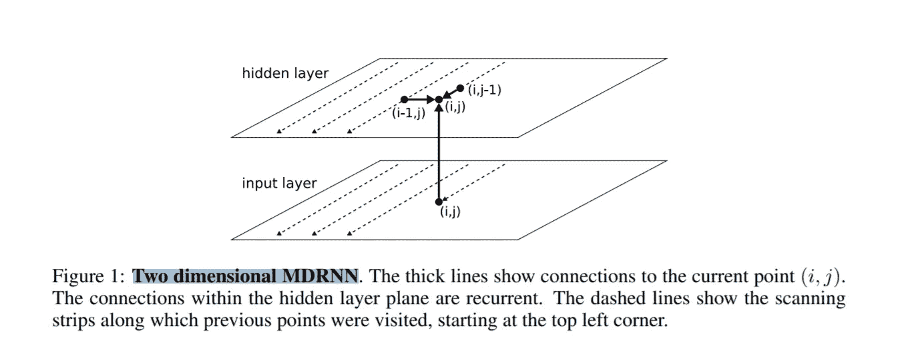*

*Image from paper [Offline Handwriting Recognition with Multidimensional Recurrent Neural Networks](http://people.idsia.ch/~juergen/nips2009.pdf)*

***样本训练数据***

*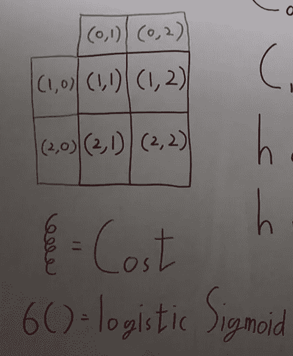*

*因此，我们将对一个非常简单的训练数据进行前馈传递，这是一个尺寸为 2*2(总共 4 个像素)的图像，如上面的黑框所示。*

***网络架构***

*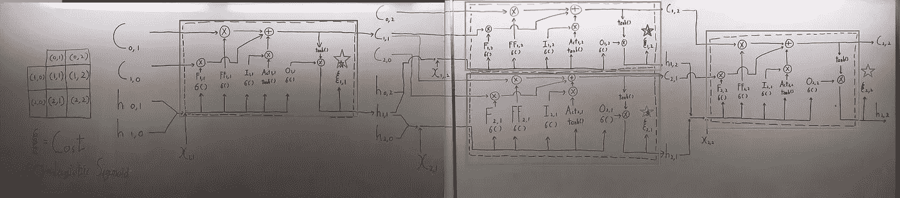*

*现在我知道它看起来不好，但我不得不使用整个白板来制作图表 LOL 所以在这里和我一起工作。让我们从头开始。*

*首先每个盒子代表一个 LSTM 盒子，建筑是从著名的 [Colah 博客](http://colah.github.io/posts/2015-08-Understanding-LSTMs/)衍生而来。*

*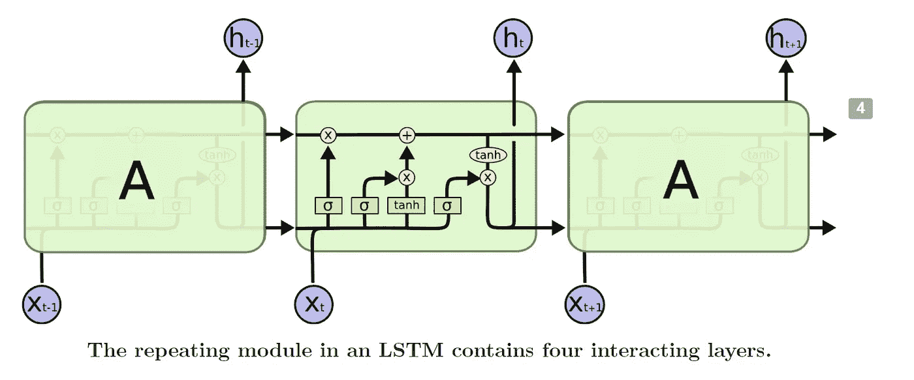*

*Image from [Colah Blog](http://colah.github.io/posts/2015-08-Understanding-LSTMs/)*

*其次，下面是时间戳信息。*

*红框→时间戳为(1，1)时进给
绿框→时间戳为(2，1)时进给
橙框→时间戳为(1，2)时进给
紫框→时间戳为(2，2)时进给*

*第三，每个蓝星代表我们在每个时间戳可以计算的成本函数。*

***向前进给***

*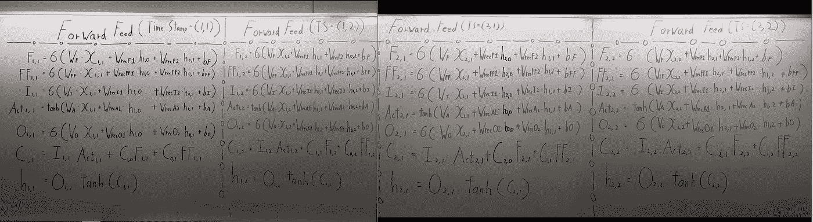*

*再说一次，我知道这看起来很糟糕，但是对于 LSTM 方程来说，它总是很混乱。*

*需要注意的是，所有用蓝色标记**写的变量都是已经初始化的值。所以不要担心它们是从哪里冒出来的，它们是事先被初始化的。***

*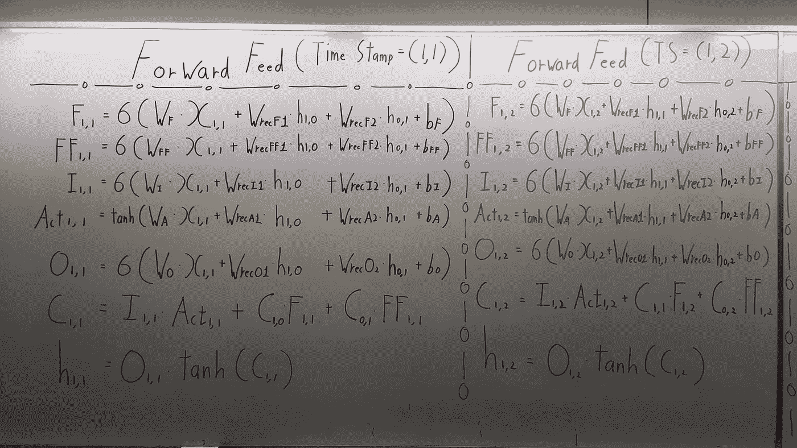*

*Detailed Look at Forward Feed at Time Stamp (1,1) and (1,2)*

*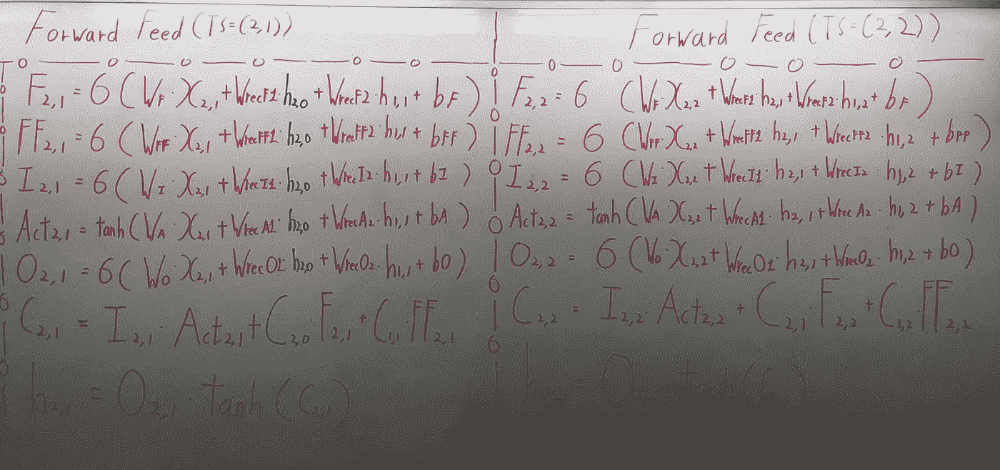*

*Detailed Look at Forward Feed at Time Stamp (2,1) and (2,2)*

## *最后的话*

*我无法想象这个网络的反向传播过程，用手来推导它们会很有趣。我希望有一天会这样做。*

*如果发现任何错误，请发电子邮件到 jae.duk.seo@gmail.com 找我。*

*同时，在我的 twitter [这里](https://twitter.com/JaeDukSeo)关注我，并访问[我的网站](https://jaedukseo.me/)，或我的 [Youtube 频道](https://www.youtube.com/c/JaeDukSeo)了解更多内容。如果你感兴趣的话，我还在简单的 RNN [上做了反向传播。](https://medium.com/@SeoJaeDuk/only-numpy-vanilla-recurrent-neural-network-with-activation-deriving-back-propagation-through-time-4110964a9316)*

***参考文献***

1.  *Theis，l .，& Bethge，M. (2015 年)。使用空间 LSTMs 的生成式图像建模。在*神经信息处理系统的进展*(1927-1935 页)。*
2.  *更正，abs/1502.03044，。许凯文和(2015)。展示、参与和讲述:视觉神经图像字幕生成。*
3.  *更正，abs/0705.2011，。亚历克斯·格雷夫斯和(2007)。多维递归神经网络。*
4.  *了解 LSTM 网络。(未注明)。检索于 2018 年 1 月 19 日，来自[http://colah.github.io/posts/2015-08-Understanding-LSTMs/](http://colah.github.io/posts/2015-08-Understanding-LSTMs/)*
5.  *Graves，a .，& Schmidhuber，J. (2009)。基于多维递归神经网络的脱机手写识别。在*神经信息处理系统的进展*(第 545–552 页)。*