# [仅适用于 Numpy ]在 Numpy 中使用交互式代码体验特征值/向量的乐趣

> 原文：<https://towardsdatascience.com/only-numpy-having-fun-with-eigen-value-s-vectors-with-interactive-code-in-numpy-80d3443dfd22?source=collection_archive---------6----------------------->

GIF from this [website](https://giphy.com/gifs/3oEjI4T1VNTKgri4fK)

主成分分析、奇异值分解和独立成分分析都是降维技术。它们都依赖于特征值和向量。今天，我想超越高级 API，进入细节。

> 请注意，这篇文章纯粹是我自己在解释这些概念，所以这篇文章可能会有点不同。

**为什么我们甚至需要特征向量/值？(这部分是垃圾)**

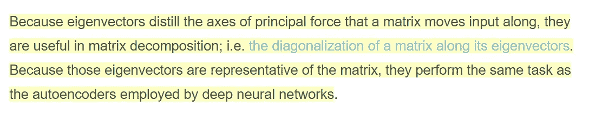

Image from this [website](https://skymind.ai/wiki/eigenvector)

我们实际上可以把每一个矩阵，甚至病历 csv 看作一个转换矩阵。我思考这个问题的方式有点奇怪，例如，我们可以有如下所示的一些数据。

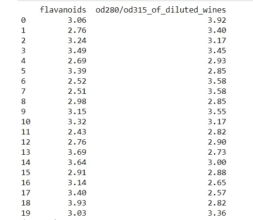

Data from [Sklearn Wine](http://scikit-learn.org/stable/modules/generated/sklearn.datasets.load_wine.html)

数据集用于分类任务，因此有一个目标值未显示在上面的矩阵中。但是当我们为上述数据绘制 2D 散点图时，我们可以得到如下结果。

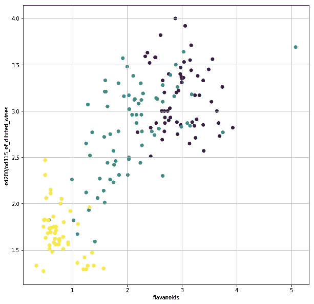

如上所述，我们可以将每个数据点视为基向量的变换。(即稀释葡萄酒的[1，0]o d280/o d315 或黄酮类化合物的[0，1]。).

**协方差矩阵/相关矩阵**

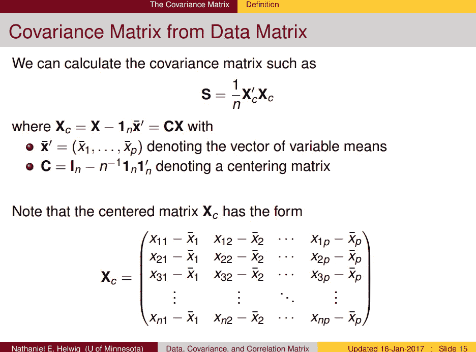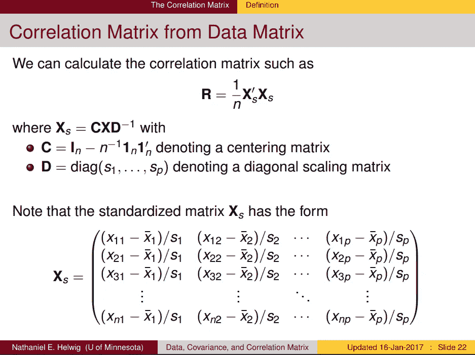

Image from this [website](http://users.stat.umn.edu/~helwig/notes/datamat-Notes.pdf)

在继续之前，理解协方差和相关矩阵的概念是必要的。因此，请花几分钟时间查看这些材料。如果你想看这些东西的数字计算方法，请点击这里。

**改变基本向量/样本数据的示例**

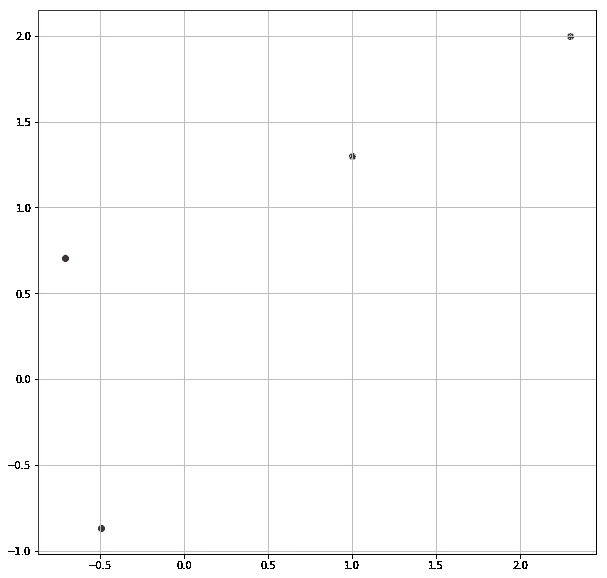

让我们做一些非常简单的事情，红点代表给定的两个蓝色数据点的特征值。让我们将该值设置为新的基本向量，并投影两个蓝色数据点。

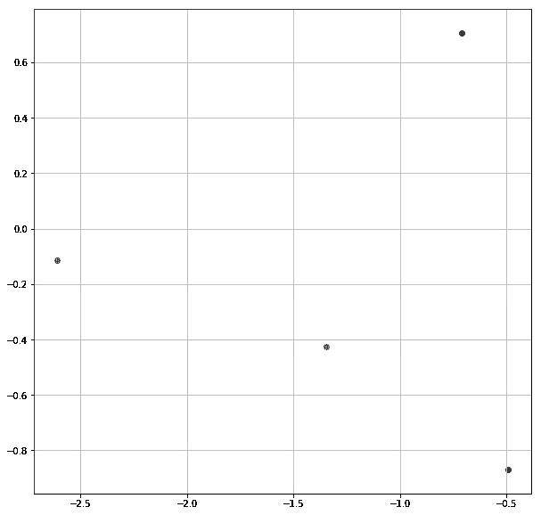

如上所示，我们可以看到，现在我们的数据已经翻转。如果你希望看到如何实现这一点的代码，请见下文。

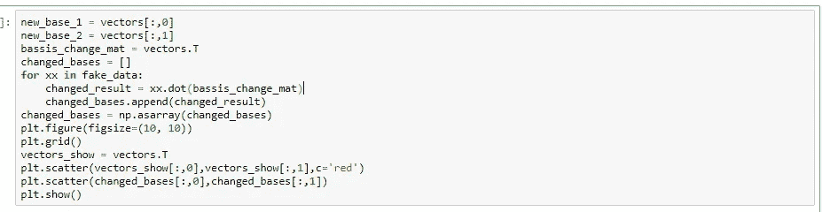

现在，让我们来看看我们将要使用的数据集。

Data from [Sklearn Wine](http://scikit-learn.org/stable/modules/generated/sklearn.datasets.load_wine.html)

您已经看到了上面的图表，因为我们将使用来自 sklearn 的葡萄酒数据集。但是，我们不会使用所有维度，而是只使用两个最相关的属性。

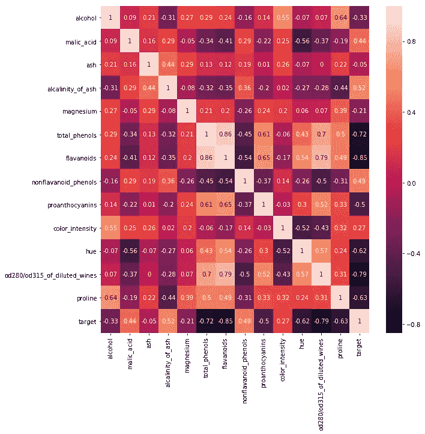

**使用协方差矩阵改变基数**

**左图** →使用 Numpy
计算的协方差矩阵**右图** →使用内置函数计算的协方差矩阵

首先，我们需要计算协方差矩阵，从这里我们可以得到生成的协方差矩阵的特征向量和值。(这是原理变化向量。)

**红点** →协方差矩阵的特征向量

如上所示，在得到每个向量后，我们可以画一个线性图，线的长度并不重要。但是我们可以看到，最大差异存在的区域是数据点的对角线。

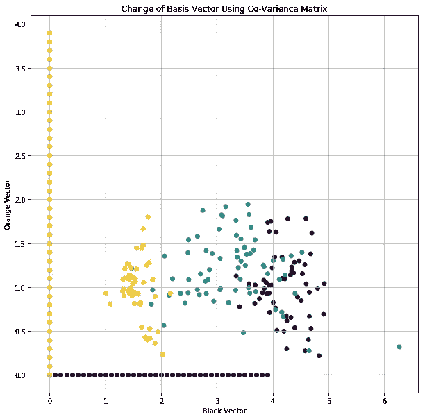

最后，我们可以将所有的数据点投影到这个基向量中。不幸的是，我们丢失了属性信息。然而，我们能够看到更清晰的数据版本。

**使用相关矩阵改变基础**

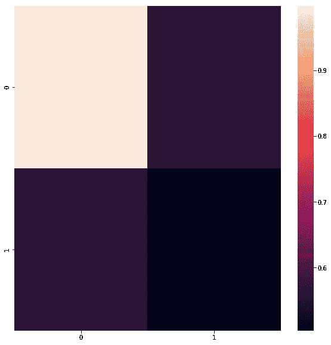

**左图** →使用 Numpy
计算相关矩阵**右图** →使用内置函数计算相关矩阵

现在我知道颜色是关闭的，但值是一样的，如下所示。

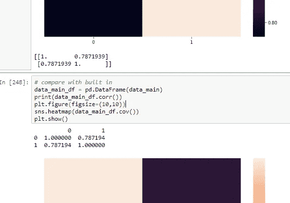

和上次一样，让我们找出这个矩阵的特征向量。

得到的向量彼此对称，相关矩阵本身也是对称的。

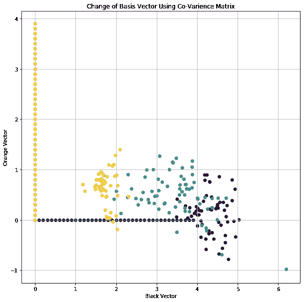

然而，以上是当我们使用从相关矩阵生成的特征向量时得到的投影。

**奇异值分解(2D)**

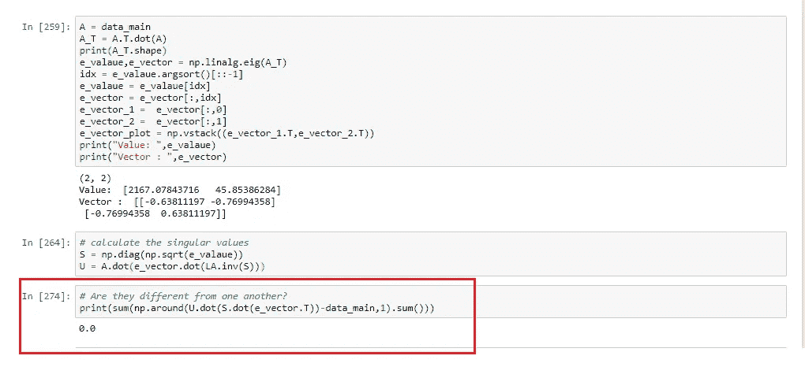

既然我们已经走了这么远，让我们走得更远。我们可以很容易地执行奇异值分解。如上所述，在首先计算转置(A)点积(A)之后。我们可以找到那个矩阵的特征向量。从那里我们可以得到我们的 u，最后，如上面红框所示，我们可以观察到，原始矩阵和重构矩阵之间没有区别。(如果你不明白这个[方法请点击这里。](https://blog.statsbot.co/singular-value-decomposition-tutorial-52c695315254))

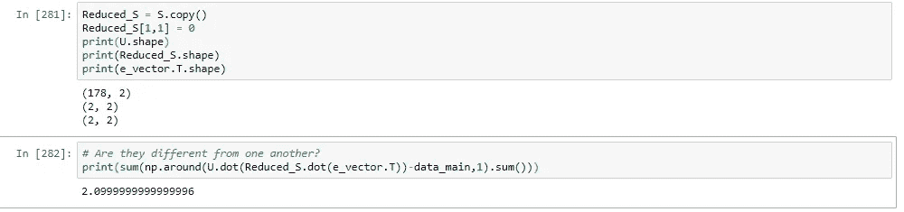

现在让我们去掉最不重要的奇异值，进行降维。正如上面所看到的，我们可以清楚地看到，重建的矩阵与原始矩阵并不相同。

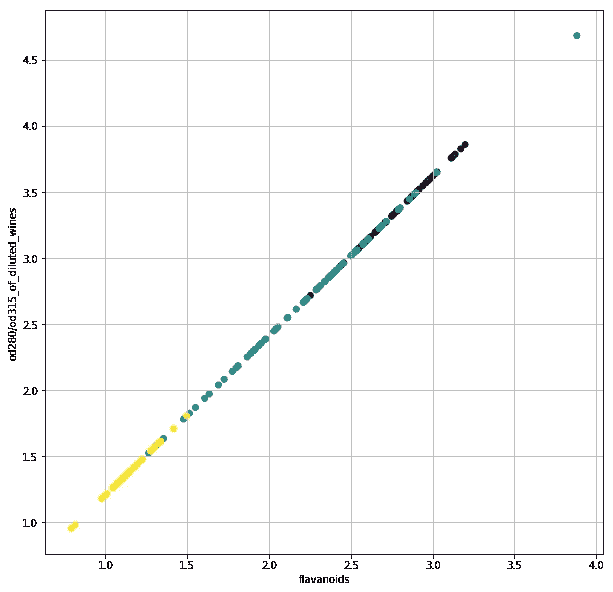

当我们将数据投影到 2D 平面时，我们可以观察到，在 SVD 之后，对角线上的最大变化被捕获。

**奇异值分解(3D)**

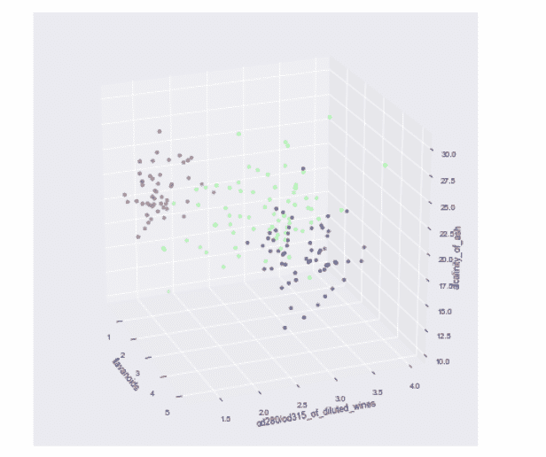

最后，让我们以一些 3D 图来结束，如上所述，我添加了一个额外的属性，“alcalinity_of_ash”。

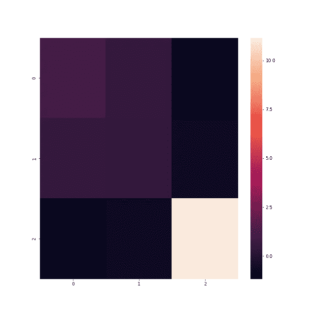

**左图** →使用 Numpy
计算的协方差矩阵**右图** →使用内置函数计算的协方差矩阵

再一次，让我们先看看，仅仅改变基底，我们能做什么。当我们根据协方差绘制生成的特征向量时，我们得到如下结果。

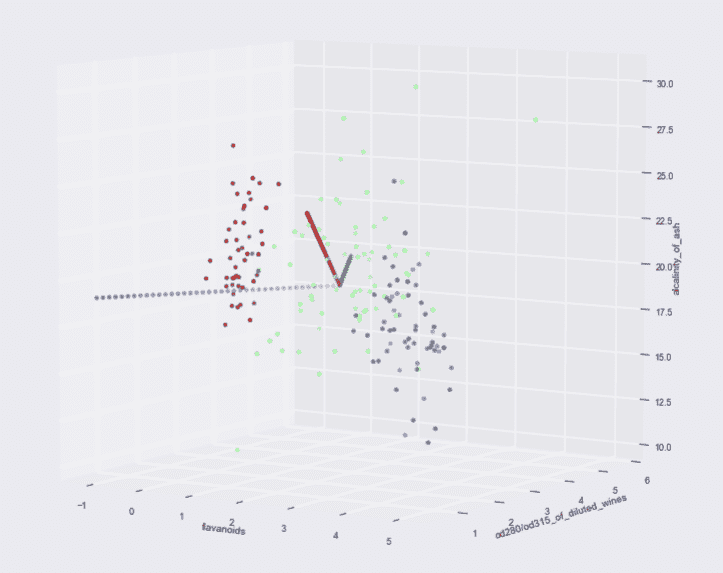

我稍微改变了起点，但故事保持不变。现在让我们执行投影。

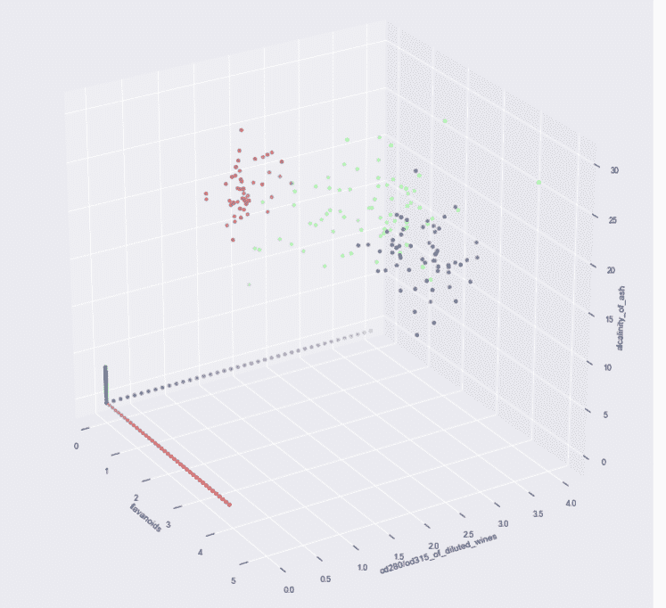

我们可以观察到这样一个事实，现在我们的特征向量已经占据了基向量空间。现在它们都互相垂直。此外，我们还可以对 3D 数据执行 SVD。

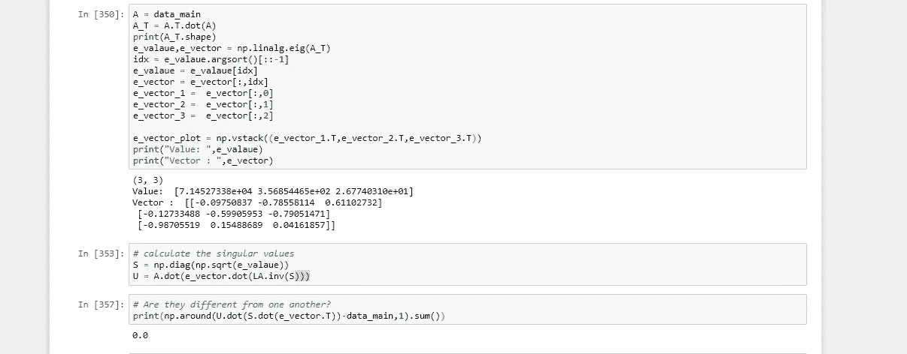

就像前面的例子，我们可以看到，重建的矩阵是相同的原始矩阵。现在来降维。

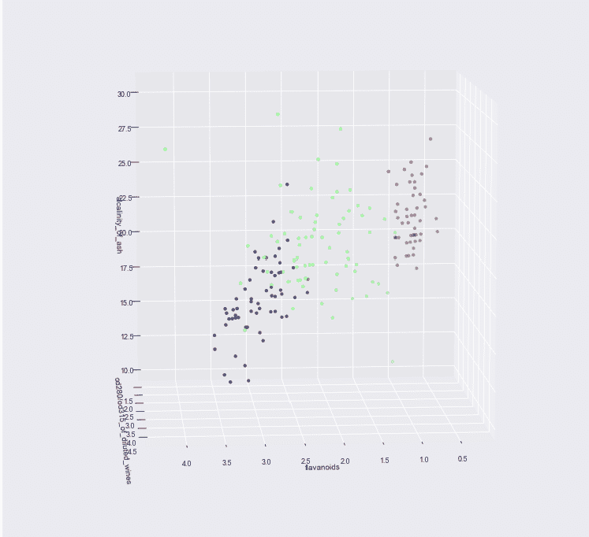

当我们丢弃最不重要的奇异值时，我们的 3D 数据会折叠成一个平面。然而。我们仍然可以观察到这样一个事实，即数据彼此之间仍然是完全可以分离的。

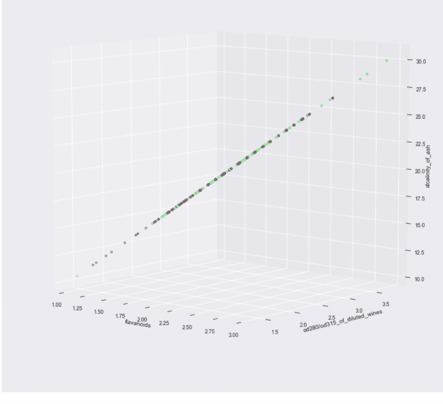

但是，当我们丢弃两个奇异值时，我们可以清楚地看到，我们的数据不再是可分的，因为它折叠成了一条线。

**交互代码**

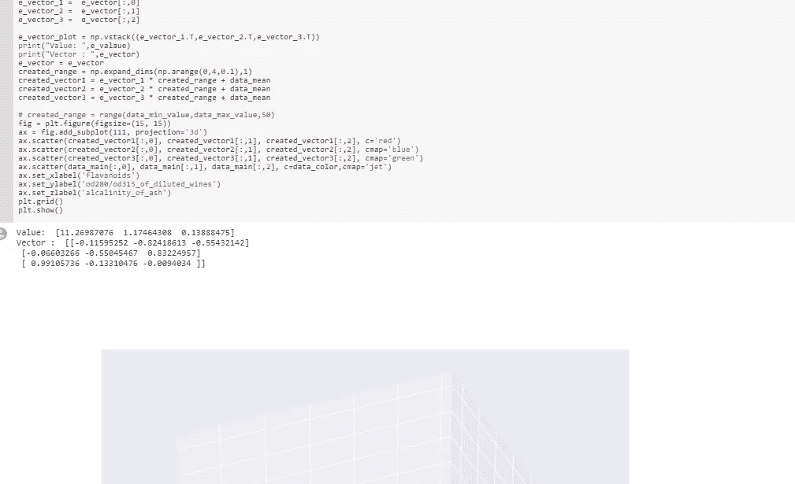

*对于谷歌实验室，你需要一个谷歌帐户来查看代码，你也不能在谷歌实验室运行只读脚本，所以在你的操场上做一个副本。最后，我永远不会请求允许访问你在 Google Drive 上的文件，仅供参考。编码快乐！*

要获取这篇[文章的代码，请点击这里。](https://colab.research.google.com/drive/1XgQCRhhg3mZd__gRRT_WxeSFGEaSkEnr)

**最后的话**

玩特征值/向量真的很有趣。

如果发现任何错误，请发电子邮件到 jae.duk.seo@gmail.com 给我，如果你想看我所有写作的列表，请在这里查看我的网站。

同时，在我的 twitter [这里](https://twitter.com/JaeDukSeo)关注我，并访问[我的网站](https://jaedukseo.me/)，或我的 [Youtube 频道](https://www.youtube.com/c/JaeDukSeo)了解更多内容。我还实现了[广残网，请点击这里查看博文 pos](https://medium.com/@SeoJaeDuk/wide-residual-networks-with-interactive-code-5e190f8f25ec) t。

**参考**

1.  特征值和特征向量在 3 分钟内|用一个有趣的类比解释。(2018).YouTube。检索于 2018 年 7 月 9 日，来自[https://www.youtube.com/watch?v=5UjQVJu89_Q](https://www.youtube.com/watch?v=5UjQVJu89_Q)
2.  sk learn . datasets . load _ wine-sci kit-learn 0 . 19 . 1 文档。(2018).Scikit-learn.org。检索于 2018 年 7 月 9 日，来自[http://sci kit-learn . org/stable/modules/generated/sk learn . datasets . load _ wine . html # sk learn . datasets . load _ wine](http://scikit-learn.org/stable/modules/generated/sklearn.datasets.load_wine.html#sklearn.datasets.load_wine)
3.  numpy.linalg.inv — NumPy v1.14 手册。(2018).Docs.scipy.org。2018 年 7 月 9 日检索，来自[https://docs . scipy . org/doc/numpy-1 . 14 . 0/reference/generated/numpy . Lina LG . inv . html](https://docs.scipy.org/doc/numpy-1.14.0/reference/generated/numpy.linalg.inv.html)
4.  正确，e. (2018)。numpy.linalg.eig 创建的特征向量似乎不正确。堆栈溢出。检索于 2018 年 7 月 9 日，来自[https://stack overflow . com/questions/32926861/特征向量-created-by-numpy-Lina LG-EIG-dont-seem-correct](https://stackoverflow.com/questions/32926861/eigenvectors-created-by-numpy-linalg-eig-dont-seem-correct)
5.  矩阵的逆。(2018).Mathsisfun.com。检索于 2018 年 7 月 9 日，来自 https://www.mathsisfun.com/algebra/matrix-inverse.html
6.  matplotlib？，H. (2018)。如何改变用 matplotlib 绘制的图形的大小？。堆栈溢出。检索于 2018 年 7 月 9 日，来自[https://stack overflow . com/questions/332289/how-do-you-change-the-size-of-figures-drawn-with-matplotlib](https://stackoverflow.com/questions/332289/how-do-you-change-the-size-of-figures-drawn-with-matplotlib)
7.  在 Numpy 中使用矩阵点积/具有交互代码的基的变化的简单分类。(2018).走向数据科学。2018 年 7 月 9 日检索，来自[https://towardsdatascience . com/naive-class ification-using-matrix-dot-product-change-of-basis-with-interactive-code-in-numpy-4808 E5 aa 955 e](/naive-classification-using-matrix-dot-product-change-of-basis-with-interactive-code-in-numpy-4808e5aa955e)
8.  seaborn . heat map-seaborn 0 . 8 . 1 文档。(2018).Seaborn.pydata.org。检索于 2018 年 7 月 9 日，来自[https://seaborn.pydata.org/generated/seaborn.heatmap.html](https://seaborn.pydata.org/generated/seaborn.heatmap.html)
9.  matplotlib，C. (2018 年)。用 matplotlib 改变 y 范围从 0 开始。堆栈溢出。2018 年 7 月 9 日检索，来自[https://stack overflow . com/questions/22642511/change-y-range-to-start-from-0-with-matplotlib](https://stackoverflow.com/questions/22642511/change-y-range-to-start-from-0-with-matplotlib)
10.  价值？，H. (2018)。如何使用十进制范围()步长值？。堆栈溢出。检索于 2018 年 7 月 9 日，来自[https://stack overflow . com/questions/477486/how-to-use-a-decimal-range-step-value](https://stackoverflow.com/questions/477486/how-to-use-a-decimal-range-step-value)
11.  (2018).Users.stat.umn.edu。检索于 2018 年 7 月 9 日，来自[http://users.stat.umn.edu/~helwig/notes/datamat-Notes.pdf](http://users.stat.umn.edu/~helwig/notes/datamat-Notes.pdf)
12.  颜色示例代码:colormaps _ reference . py—Matplotlib 2 . 0 . 2 文档。(2018).Matplotlib.org。检索于 2018 年 7 月 9 日，来自[https://matplotlib . org/examples/color/colormaps _ reference . html](https://matplotlib.org/examples/color/colormaps_reference.html)
13.  使用样式表自定义绘图— Matplotlib 1.5.3 文档。(2018).Matplotlib.org。检索于 2018 年 7 月 9 日，来自 https://matplotlib.org/users/style_sheets.html
14.  奇异值分解教程:应用，例子，练习。(2017).统计和机器人。检索于 2018 年 7 月 10 日，来自[https://blog . statsbot . co/singular-value-decomposition-tutorial-52c 695315254](https://blog.statsbot.co/singular-value-decomposition-tutorial-52c695315254)