# Only Numpy:使用交互式代码实现和比较 Google Brain 的去耦神经接口(合成梯度)和 Google Brain 的梯度噪声的组合

> 原文：<https://towardsdatascience.com/only-numpy-implementing-and-comparing-combination-of-google-brains-decoupled-neural-interfaces-6712e758c1af?source=collection_archive---------5----------------------->

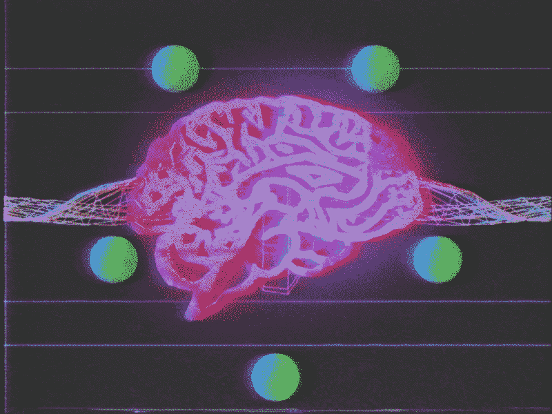

所以我在想，Google Brain 发表了这篇论文“[使用合成梯度去耦合神经接口](https://arxiv.org/pdf/1608.05343.pdf)”，它可以同时训练每一层。当执行反向传播时，网络架构以每层不依赖于下一层梯度的方式构建。(算是吧)。

而且他们还发表了这篇论文“[添加梯度噪声提高了对非常深的网络的学习](https://arxiv.org/abs/1511.06807) s”。几天前我写了一篇博文，关于将[高斯噪声添加到反向传播以使学习更快](https://becominghuman.ai/only-numpy-implementing-adding-gradient-noise-improves-learning-for-very-deep-networks-with-adf23067f9f1)，现在让我们将这两个想法结合起来。

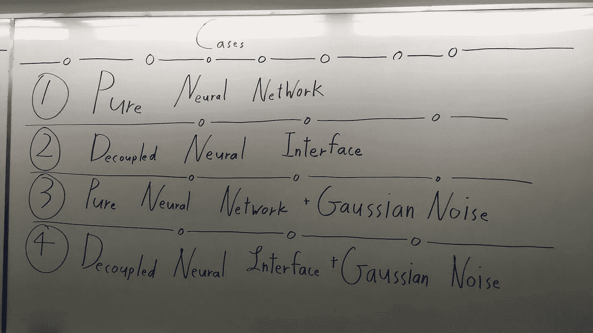

所以我们总共可以检查 4 个案例。

1 →纯神经网络
2 →解耦神经接口
3 →纯神经网络+高斯噪声
4 →解耦神经接口+高斯噪声

# 热门人工智能文章:

> [1。谷歌将凭借卓越的人工智能在自己的游戏中击败苹果](https://becominghuman.ai/google-will-beat-apple-at-its-own-game-with-superior-ai-534ab3ada949)
> 
> [2。人工智能职业战争:第一集](https://becominghuman.ai/the-ai-job-wars-episode-i-c18e932ff225)
> 
> [3。引入露天开采:分散人工智能](https://becominghuman.ai/introducing-open-mined-decentralised-ai-18017f634a3f)

**阅读前**

我假设你们所有人都已经非常熟悉去耦神经接口和高斯噪声。如果没有，请点击下面的链接。

对于解耦的[神经接口，请阅读来自](http://iamtrask.github.io/2017/03/21/synthetic-gradients/) Trask 的这篇惊人的帖子。来自 m e LOL 的这篇并不令人印象深刻的博文。

对于高斯噪声，[请阅读本博客](https://becominghuman.ai/only-numpy-implementing-adding-gradient-noise-improves-learning-for-very-deep-networks-with-adf23067f9f1)。

**免责声明**

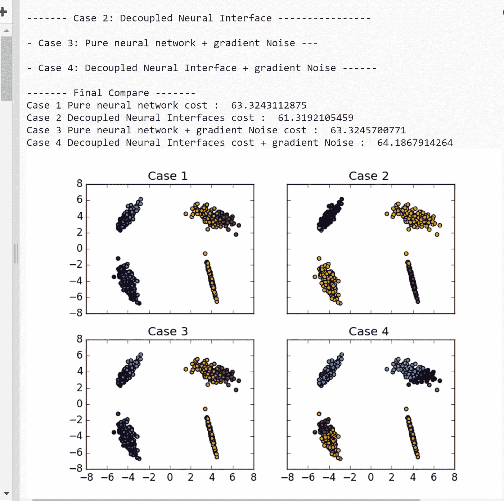

上面是我在 Trinket 上运行代码时得到的结果，下面是我在桌面上运行代码时得到的结果。

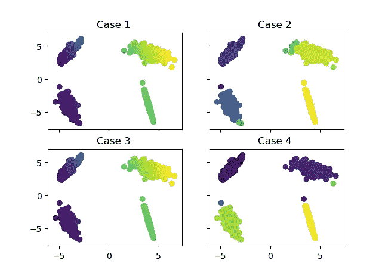

如图所示，分类结果的颜色存在差异。尽管我使用了相同的 np.random.seed()值，但结果还是略有不同。我不知道为什么会这样，但它确实存在，所以如果你知道为什么，请在下面评论。此外，我将使用我的笔记本电脑上的屏幕截图和东西的结果。

**声明超参数和训练数据**

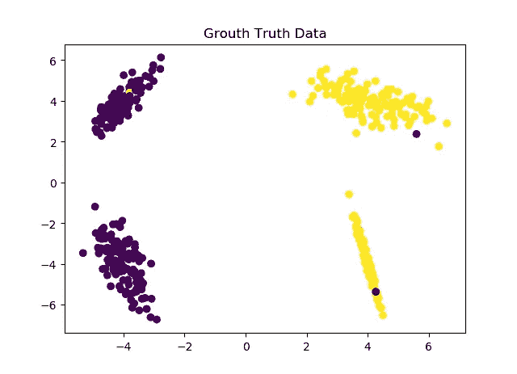

如上所述，这是一个简单的分类任务，到处都有一些噪声。现在让我们创建权重变量并复制它们，以确保我们从相同的权重开始。

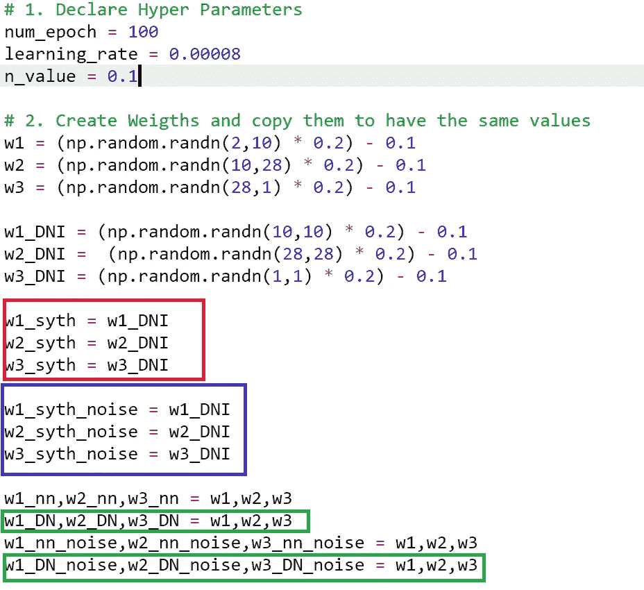

如上所示，总共有 18 个砝码。红框内的权重用于*情况 2:解耦神经接口*，蓝框内的权重用于*情况 4:解耦神经接口+高斯噪声。*

此外，请注意，对于分离的神经接口，我们不仅需要合成梯度的权重，还需要每层的权重，因此我们需要绿色框内的权重。

**DNI 的网络架构**

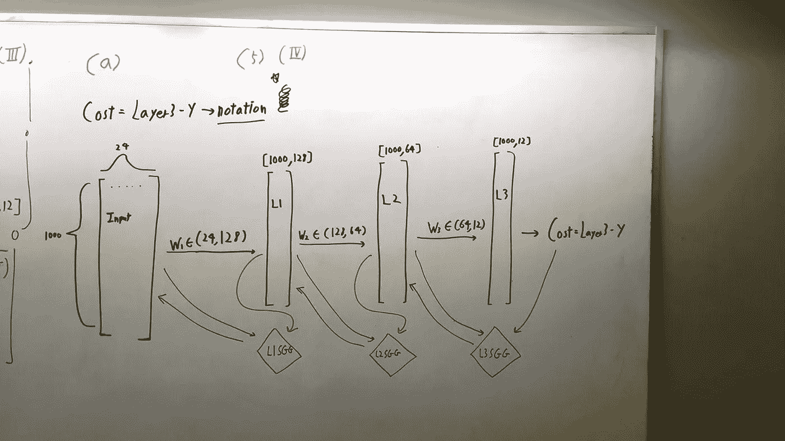

上面是一个可怕的网络架构，来自我的媒体帖子，它并不代表我们将要实现的网络，但它确实得到了解耦神经接口的一般结构。再次为更多的信息，请阅读我已经包括的链接。

**纯神经网络和 DNI 的前馈**

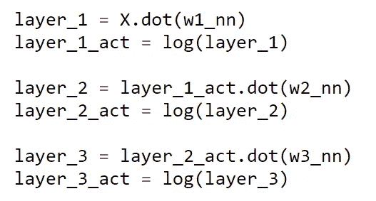

Forward Feed For Pure NN

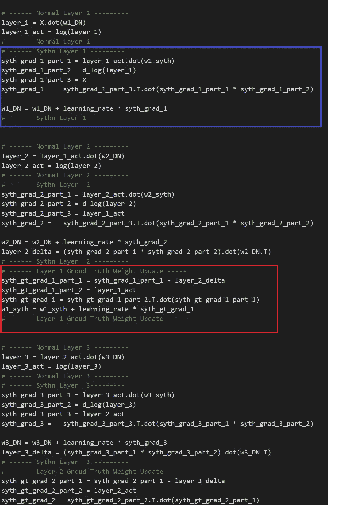

Partial View for Forward Feed for DNI

标准的神经网络前馈过程是容易和简单的，没有更多的添加。但是对于 DNI 来说，这就有点复杂了，因为我们可以在完成前馈过程后立即对重量进行反向传播。

蓝框→更新层 1 的权重(W1_DN)
红框→更新层 1 的合成权重(W1_sythn)

**带有高斯噪声的反向传播**

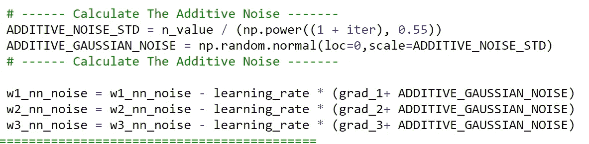

Back Propagation with Gaussian Noise

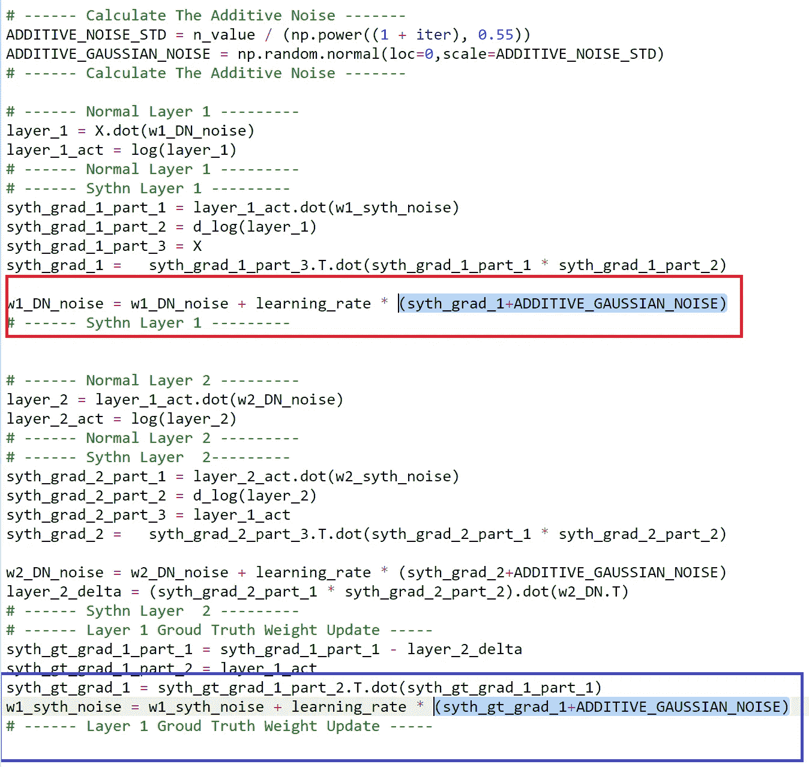

对于纯神经网络，高斯噪声下的标准反向传播也没什么特别的。但是对于 DNI，当更新正常权重(红框)和合成权重(蓝框)时，我添加了高斯噪声。

**结果**

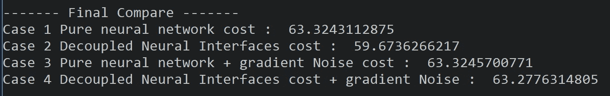

因此，无噪声解耦神经接口的最终成本最小。至少在这个场景中。当我玩 hyper parameters 的时候，我意识到 DNI 对学习速率非常敏感，你自己试试看，如果学习速率太大，我们会有梯度爆炸。

此外，这有点令人困惑，因为我期望看到案例 3 和案例 4 的损失成本最小。不知道为什么会这样…(也许我会在未来的帖子中详细探讨这个想法。)

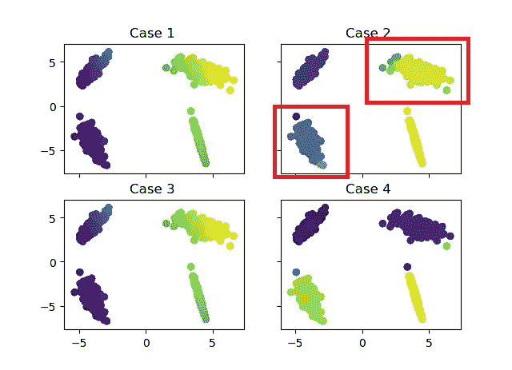

但是，当直接与基本事实和最终的分类进行比较时，我们可以看到，仅从颜色上看，情况 2 最接近基本事实。除了红色方框区域。

**交互代码**

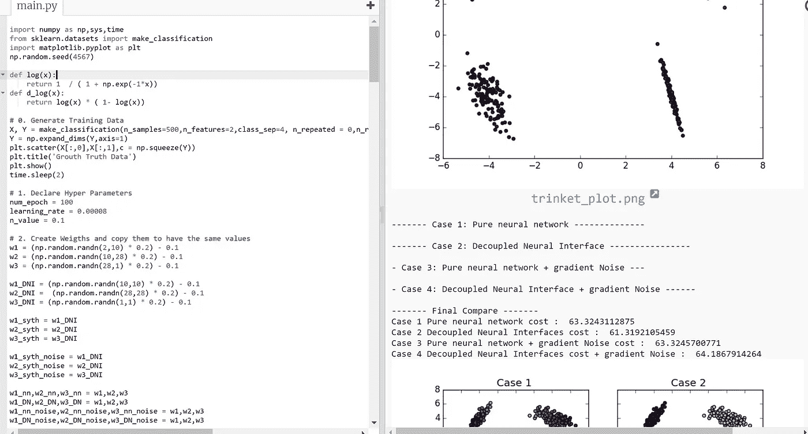

*更新:我搬到谷歌 Colab 的交互代码！所以你需要一个谷歌帐户来查看代码，你也不能在谷歌实验室运行只读脚本，所以在你的操场上做一个副本。最后，我永远不会请求允许访问你在 Google Drive 上的文件，仅供参考。编码快乐！*

要访问[互动代码，请点击这里。](https://colab.research.google.com/notebook#fileId=1Wxx9Zu6IW-Z7mwktjwz00g0H3MPJPtuY)

## 最后的话

我仍然很困惑为什么结果会是这样，我认为找出为什么会这样是个好主意…

此外，我看到了我在 DNI 上的旧帖子，并意识到这是多么可怕，我将很快重新访问解耦神经接口。

如果发现任何错误，请发电子邮件到 jae.duk.seo@gmail.com 找我。

同时，在我的推特[这里](https://twitter.com/JaeDukSeo)关注我，并访问[我的网站](https://jaedukseo.me/)，或我的 [Youtube 频道](https://www.youtube.com/c/JaeDukSeo)了解更多内容。如果你感兴趣，我还在简单的 RNN [上做了反向传播。](https://medium.com/@SeoJaeDuk/only-numpy-vanilla-recurrent-neural-network-with-activation-deriving-back-propagation-through-time-4110964a9316)

**参考文献**

1.  Seo，J. D. (2017 年 12 月 24 日)。Only Numpy:推导合成梯度中的前馈和反向传播(解耦神经…2018 年 1 月 22 日检索，来自[https://medium . com/@ SeoJaeDuk/only-Numpy-derivating-Forward-feed-and-Back-Propagation-in-Synthetic-Gradient-Decoupled-Neural-ca4c 99666 bbf](https://medium.com/@SeoJaeDuk/only-numpy-deriving-forward-feed-and-back-propagation-in-synthetic-gradient-decoupled-neural-ca4c99666bbf)
2.  Seo，J. D. (2018 年 1 月 18 日)。only Numpy:Implementing " ADDING GRADIENT NOISE IMPROVES-LEARNING FOR-VERY-DEEP-NETWORKS-with-ADF 23067 F9 f1 2018 年 1 月 22 日检索自[https://becoming human . ai/only-Numpy-Implementing-ADDING-GRADIENT-NOISE-IMPROVES-LEARNING-FOR-VERY-DEEP-NETWORKS-with-ADF 23067 F9 f1](https://becominghuman.ai/only-numpy-implementing-adding-gradient-noise-improves-learning-for-very-deep-networks-with-adf23067f9f1)
3.  没有反向传播的深度学习。(未注明)。检索于 2018 年 1 月 22 日，来自[https://iamtrask.github.io/2017/03/21/synthetic-gradients/](https://iamtrask.github.io/2017/03/21/synthetic-gradients/)
4.  贾德伯格，m .，Czarnecki，W. M .，奥辛德罗，s .，维尼亚尔斯，o .，格雷夫斯，a .，& Kavukcuoglu，K. (2016)。使用合成梯度的去耦神经接口。 *arXiv 预印本 arXiv:1608.05343* 。
5.  Neelakantan，a .，Vilnis，l .，Le，Q. V .，Sutskever，I .，Kaiser，l .，Kurach，k .，和 Martens，J. (2015 年)。添加梯度噪声改善了对非常深的网络的学习。 *arXiv 预印本 arXiv:1511.06807* 。

