# Only Numpy:实现和比较梯度下降优化算法+ Google Brain 的用交互式代码添加梯度噪声

> 原文：<https://towardsdatascience.com/only-numpy-implementing-and-comparing-gradient-descent-optimization-algorithms-google-brains-8870b133102b?source=collection_archive---------11----------------------->

自从我看到 Sebastian Ruder 的梯度下降算法的视图后。我想写这个帖子已经很久了，因为我不仅想实现不同种类的优化算法，还想将它们相互比较。如果只比较“传统”优化会有点无聊，所以我会增加三种，所有优化方法的列表如下所示。

**要比较的优化算法列表**

*[*随机梯度下降(一线)*](http://www.incompleteideas.net/papers/sutton-86.pdf) *b .*[*气势*](https://www.sciencedirect.com/science/article/pii/S0893608098001166?via%3Dihub) *c .*[*内斯特罗夫加速渐变*](https://arxiv.org/pdf/1510.08740.pdf) *d .*[*阿达格拉德*](http://jmlr.org/papers/v12/duchi11a.html) *e .*[*阿达德尔塔*](https://arxiv.org/abs/1212.5701) *f.*
j. [*噪声训练*](https://medium.com/@SeoJaeDuk/only-numpy-noise-training-training-a-neural-network-without-back-propagation-with-interactive-ad775f04cad6) *k .*[*噪声训练*](https://medium.com/@SeoJaeDuk/only-numpy-noise-training-training-a-neural-network-without-back-propagation-with-interactive-ad775f04cad6) *+高斯加性噪声
l .亚当噪声训练**

*最后三种方法是我到处玩，简单的噪音训练加上 [Gumbel 噪音](https://en.wikipedia.org/wiki/Gumbel_distribution)而不是梯度下降。此外，请注意，我不会提供每个优化算法的反向传播过程的屏幕截图(因为有相当多的)，而是我会涵盖几个彼此有点不同的。*

***训练数据/申报超参数***

*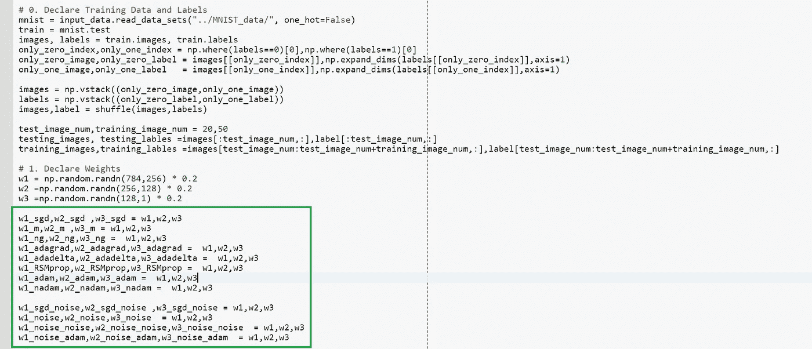*

*像往常一样，我们将使用 MNIST 数据集来分类图像 0 和 1。另外请注意绿框区域，我们在这里声明每个测试案例的权重，为了公平审判，我们将它们初始化为相同的权重。*

***网络架构***

*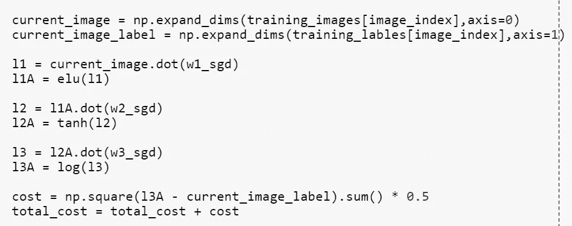*

*现在所有的网络共享相同的架构，它们有三层，每层都有激活函数 elu()、tanh()和 log()。这是逻辑 sigmoid 函数。*

***反向传播——内斯特罗夫加速梯度***

*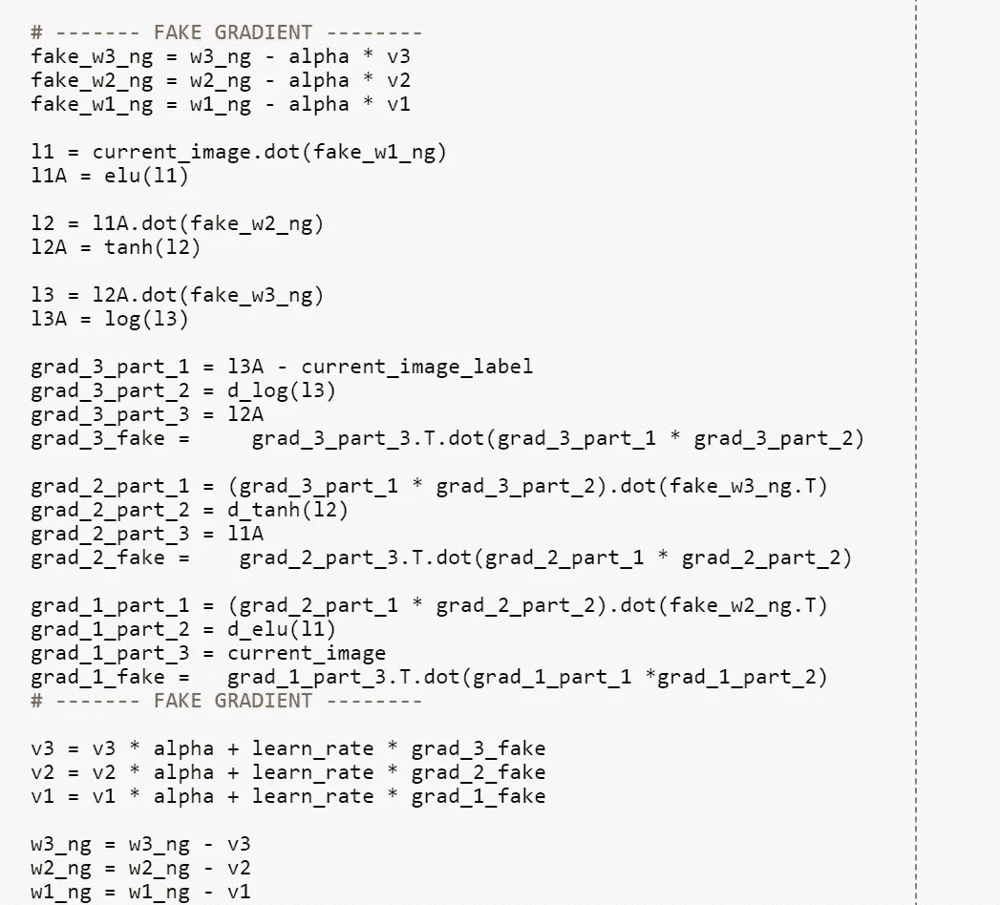*

*内斯特罗夫加速梯度上的反向传播是我见过的最奇怪的反向传播之一。但这个想法非常有意义，让我们更进一步看到未来，并相应地改变方向。*

***反向传播— RMSProp***

*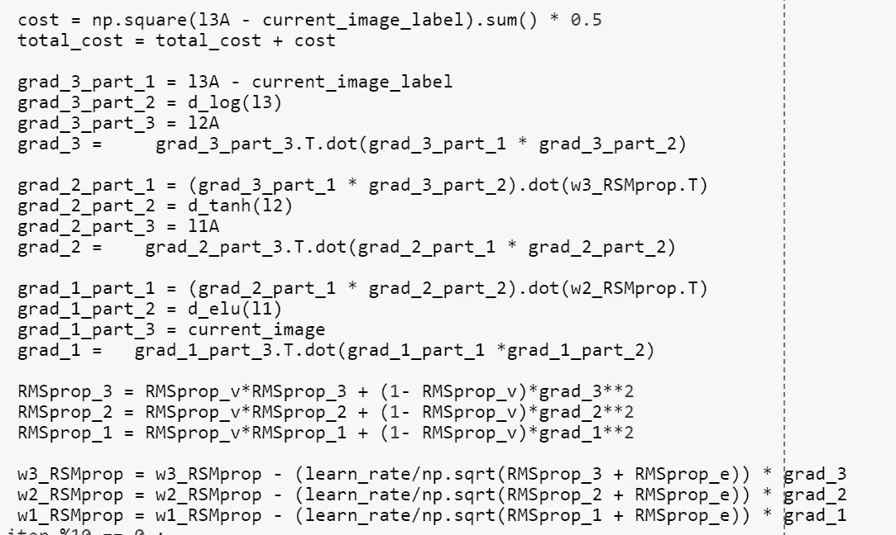*

*RMSProp 是一种非常有趣的优化方法，因为它不是独立于 Adadelta 发布和制作的。感觉就像一个经验法则，当训练神经网络时，学习速率和速度(动量)一样衰减是一个好主意。*

***反向传播—那达慕***

*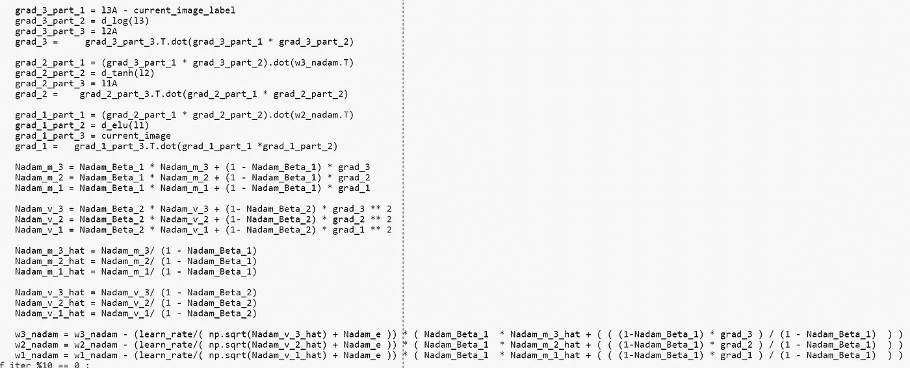*

*这是我见过的最酷、最复杂的解决方案之一。结合内斯特罗夫加速梯度和亚当的想法很酷。再次表扬蒂莫西·多扎的想法。*

***反向传播——谷歌大脑的高斯加性噪声***

*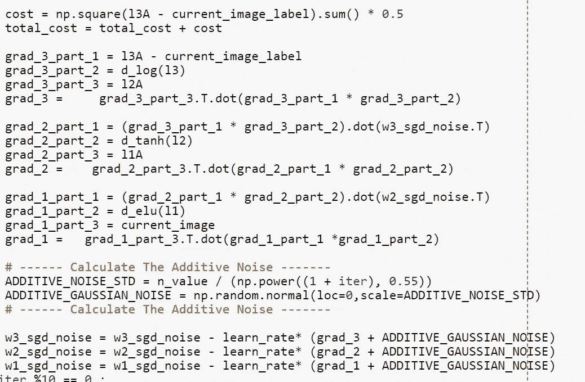*

*这里，我们有一个非常简单而强大的解决方案，只是添加高斯噪声到梯度。我仍然对这个简单的方法如何提高整体准确性感到惊叹。*

***反向传播—噪声亚当***

*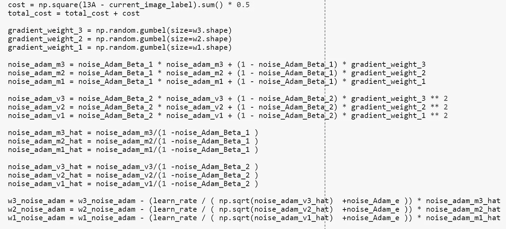*

*建立噪音训练的想法，我结合了衰减先前梯度以及动量的想法。另外，请注意，对于噪声训练方法，我将学习率设置为 0.00001。*

***训练和结果——谷歌 Colab***

*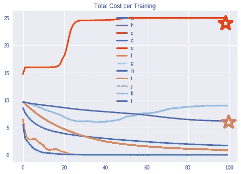**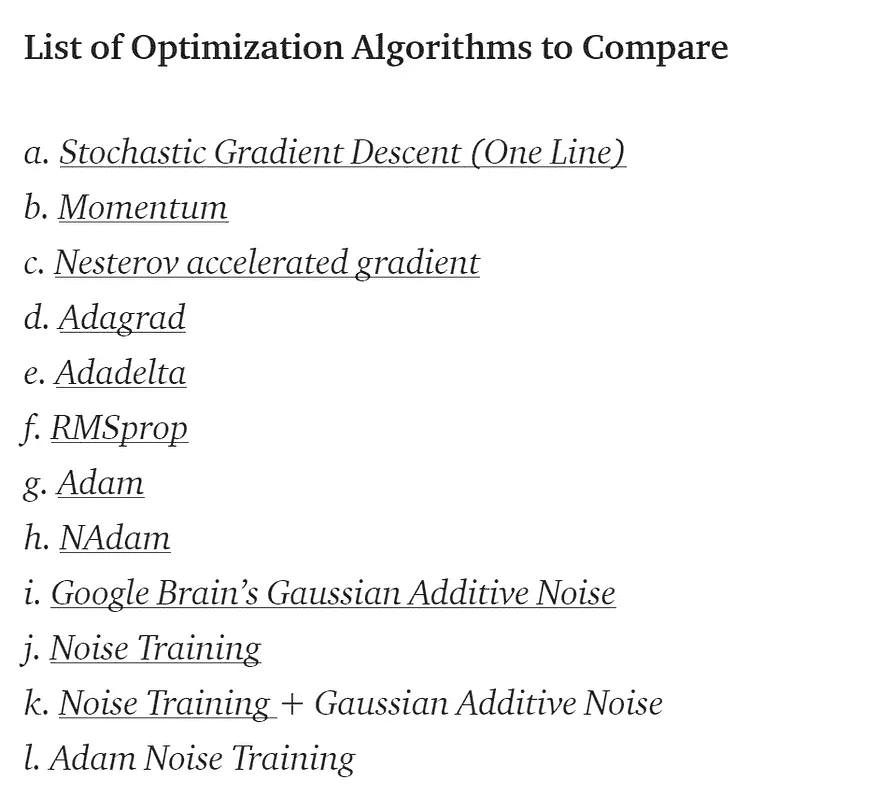*

*上面的图片是在 Google Colab(人类最伟大的发明)上运行代码的训练结果。).我最惊讶的是两件事。红星 Adadelta 的成本已经开始变得疯狂，走向了不归路。
布朗星→亚当噪音优化法实际上开始出现收敛的迹象。看到这一切是如何成为可能的，真是令人惊讶。*

*另外，请注意您看不到噪声训练结果(j)的原因是因为噪声训练和高斯加性噪声几乎具有相同的成本值，因此一个被另一个覆盖。*

*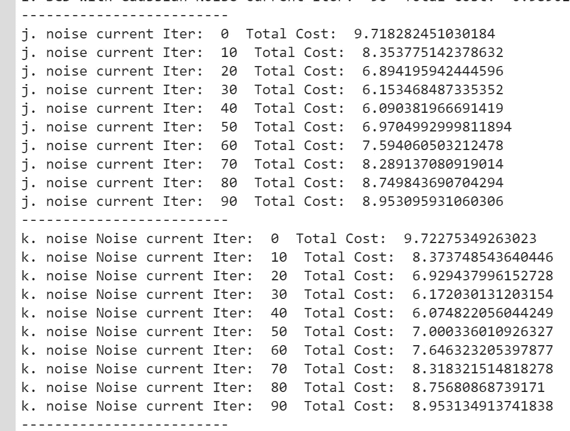*

*从上面可以看出，两种优化方法的成本值非常接近。*

***交互代码***

*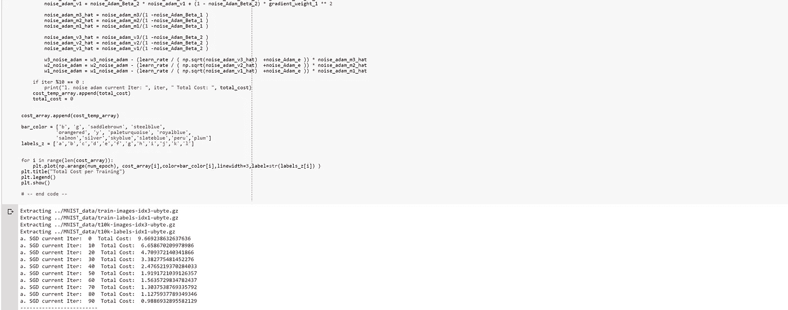*

**我搬到了谷歌 Colab 寻找交互代码！所以你需要一个谷歌帐户来查看代码，你也不能在谷歌实验室运行只读脚本，所以在你的操场上做一个副本。最后，我永远不会请求允许访问你在 Google Drive 上的文件，仅供参考。编码快乐！**

*要访问[的互动代码，请点击这里。](https://colab.research.google.com/notebook#fileId=1Xsv6KtSwG5wD9oErEZerd2DZao8wiC6h)*

***最后的话***

*我想发这个帖子已经很久了，终于停止拖延的感觉真好。亚当和噪声亚当优化方法也值得称赞。*

*如果发现任何错误，请发电子邮件到 jae.duk.seo@gmail.com 找我。*

*同时，在我的 twitter [这里](https://twitter.com/JaeDukSeo)关注我，并访问[我的网站](https://jaedukseo.me/)，或我的 [Youtube 频道](https://www.youtube.com/c/JaeDukSeo)了解更多内容。如果你感兴趣的话，我还做了解耦神经网络的比较。*

***参考文献***

1.  *萨顿，R. S. (1986)。网络的反向传播和其他最速下降学习程序的两个问题。在 1986 年认知科学学会第八届年会的会议记录中。*
2.  *钱嫩(1999)。梯度下降学习算法中的动量项。*神经网络*， *12* (1)，145–151。*
3.  *Attouch 和 j . Peypouquet(2016 年)。内斯特罗夫加速向前向后法的收敛速度其实比 1/k 还要快*暹罗最优化杂志*， *26* (3)，1824–1834。*
4.  *j .杜奇、e .哈赞和 y .辛格(2011 年)。在线学习和随机优化的自适应次梯度方法。*机器学习研究杂志*，*12*(7 月)，2121–2159。*
5.  *医学博士泽勒(2012 年)。ADADELTA:一种自适应学习速率方法。 *arXiv 预印本 arXiv:1212.5701* 。*
6.  *Ruder，S. (2018 年 1 月 19 日)。梯度下降优化算法综述。检索 2018 . 02 . 04，来自[http://ruder . io/optimizing-gradient-descent/index . html # fn:24](http://ruder.io/optimizing-gradient-descent/index.html#fn:24)*
7.  *[http://www . cs . Toronto . edu/~ tij men/CSC 321/slides/lecture _ slides _ le C6 . pdf](http://www.cs.toronto.edu/~tijmen/csc321/slides/lecture_slides_lec6.pdf)*
8.  *Neelakantan，a .，Vilnis，l .，Le，Q. V .，Sutskever，I .，Kaiser，l .，Kurach，k .，和 Martens，J. (2015 年)。添加梯度噪声改善了对非常深的网络的学习。 *arXiv 预印本 arXiv:1511.06807* 。*
9.  *Seo，J. D. (2018 年 02 月 01 日)。only Numpy:Noise Training—Training a Neural-Network-with Back Propagation with Interactive…2018 年 2 月 04 日检索自[https://medium . com/@ SeoJaeDuk/only-Numpy-Noise-Training-Training-a-Neural-Network-with-Interactive-ad 775 f 04 cad6](https://medium.com/@SeoJaeDuk/only-numpy-noise-training-training-a-neural-network-without-back-propagation-with-interactive-ad775f04cad6)*
10.  *t .多扎特(2016 年)。将内斯特洛夫动量引入亚当。*
11.  *金马博士和巴律师(2014 年)。亚当:一种随机优化方法。 *arXiv 预印本 arXiv:1412.6980* 。*