# Only Numpy:使用交互式代码对深度神经网络(回归)实施 L1 /L2 范数/正则化的不同组合

> 原文：<https://towardsdatascience.com/only-numpy-implementing-different-combination-of-l1-norm-l2-norm-l1-regularization-and-14b01a9773b?source=collection_archive---------1----------------------->

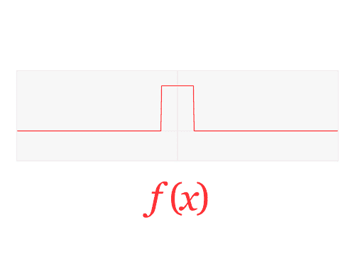

Gif from [here](https://giphy.com/gifs/animation-transform-functions-B95LXCXM5LLfa/download)

我一直对不同类型的成本函数和正则化技术感兴趣，所以今天，我将实现损失函数和正则化的不同组合，以查看哪种性能最好。我们还将看看每个模型的重量的绝对总和，看看重量变得有多小。

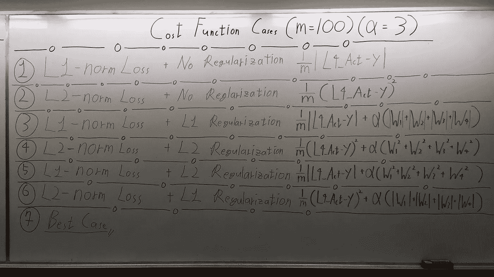

Ignore the 7 case — we are going to compare 6 cases

**L1-范数损失函数和 L2-范数损失函数**

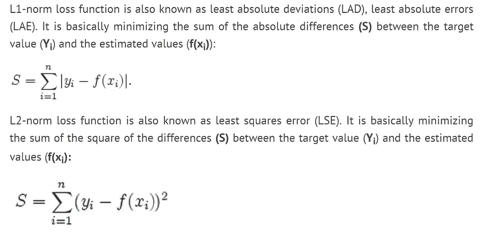

Image from [Chioka’s blog](http://www.chioka.in/differences-between-l1-and-l2-as-loss-function-and-regularization/)

我认为上述解释是对两种成本函数最简单而有效的解释。所以我就不多说了，让我们看看规则。

# 热门人工智能文章:

> [1。制作一个简单的神经网络](https://becominghuman.ai/making-a-simple-neural-network-2ea1de81ec20)
> 
> [2。Keras 备忘单:Python 中的神经网络](https://becominghuman.ai/keras-cheat-sheet-neural-networks-in-python-738c0d170c2e)
> 
> [3。使用 Tensorflow 实现 RNN-LSTM 的 noob 指南](https://becominghuman.ai/a-noobs-guide-to-implementing-rnn-lstm-using-tensorflow-1907a5bbb1fa)

**L1 正则化和 L2 正则化**


Image from [Chioka’s blog](http://www.chioka.in/differences-between-l1-and-l2-as-loss-function-and-regularization/)

同样，从上到下的红框代表 L1 正则化和 L2 正则化。我没有什么要补充的了。然而，由于我必须驱动导数(反向传播)，我将触及一些东西。

**绝对函数的导数**

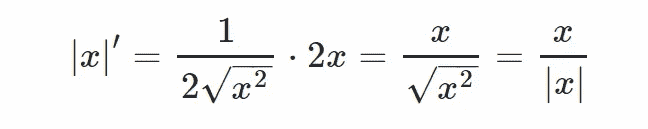

Image from [stack overflow here](https://math.stackexchange.com/questions/83861/finding-the-derivative-of-x-using-the-limit-definition)

如上所述，绝对函数的导数有三种不同的情况，当 X > 1 时，X < 1 and X = 0.

Option 1 → When X > 1，导数= 1
选项 2 →当 X = 0 时，导数=未定义
选项 3 →当 X < 1 时，导数= -1

因为我们不能让梯度“不确定”,所以我打破了这个规则。

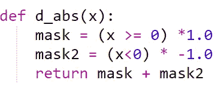

My broken rule of derivative

上面的，是我将用来计算 x 值的导数的函数，如上所述，我没有第二个选项，我们把它合并到第一个选项中。

**初始化超参数和权重**

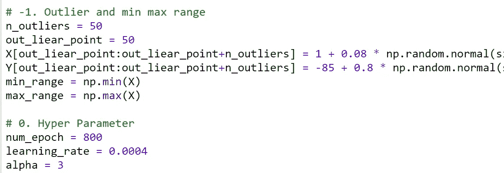

上面是创建训练数据和声明一些噪声以及学习率和阿尔法值(这些是正则化)。

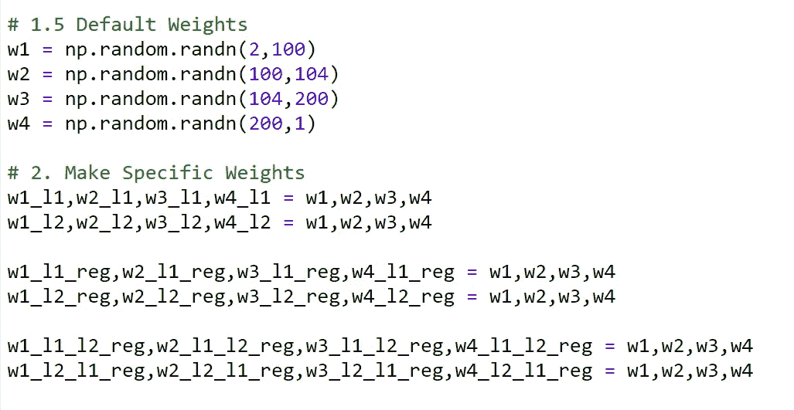

初始化权重并将其复制到每个案例中。

**网络架构+前馈**

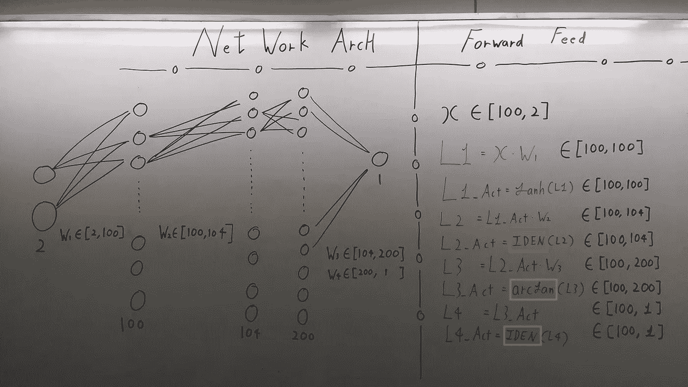

网拱没什么特别的，简单来说。

由每层下面的红色标记表示。
第 1 层→ 100 个神经元
第 2 层→ 104 个神经元
第 3 层→ 200 个神经元
第 4 层→ 1 个神经元

并且权重具有适当的维度来执行层之间的变换。然而，有两个盒子我想谈一下。

**红框→身份激活功能**

```
def IDEN(x):
    return x
def d_IDEN(x):
    return 1
```

如果用 python 实现，它看起来会像上面一样，非常简单的线性函数。我们需要这个，因为我们要对连续值进行回归。如果你想知道为什么我们需要激活函数，请阅读我的另一篇博文“ [Only Numpy:为什么我们需要激活函数(非线性)，在深度神经网络中——带有交互代码](https://medium.com/@SeoJaeDuk/only-numpy-why-we-need-activation-function-non-linearity-in-deep-neural-network-with-529e928820bc)”

**蓝盒子→反正切 Sigmoid 函数**

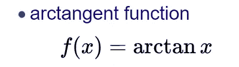

Image from [wiki](https://en.wikipedia.org/wiki/Sigmoid_function)

可以把这个函数想象成 tanh()函数，但是范围更广。我个人认为，我们不必拘泥于逻辑的乙状结肠或 tanh。 ***我认为我们需要探索的激活功能种类繁多*** 。无论如何，如果你想要可视化的 archtan()，请看下图。

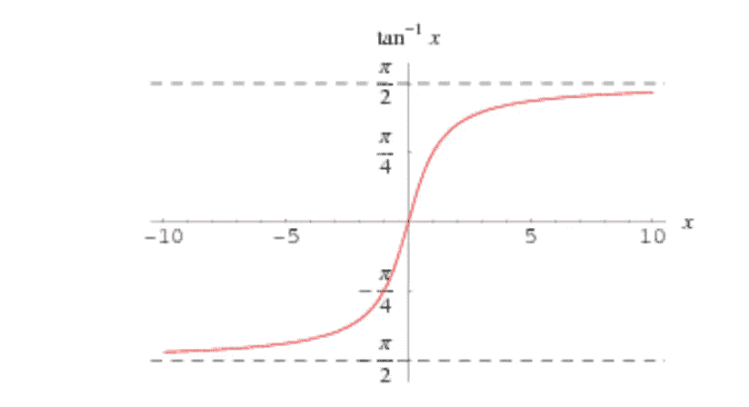

Image from [wolfam Alpha](http://mathworld.wolfram.com/InverseTangent.html)

**成本函数和正则化案例**


如上所示，我们总共可以处理 6 个(忽略 7 个)案例。

情况 1 → L1 范数损失
情况 2 → L2 范数损失
情况 3 → L1 范数损失+ L1 正则化
情况 4 → L2 范数损失+ L2 正则化
情况 5 → L1 范数损失+ L2 正则化
情况 6 → L2 范数损失+ L1 正则化

我们将看到每个 case 函数是如何相互区别的！

**反向传播(在情况 1、3 和 4 下)**

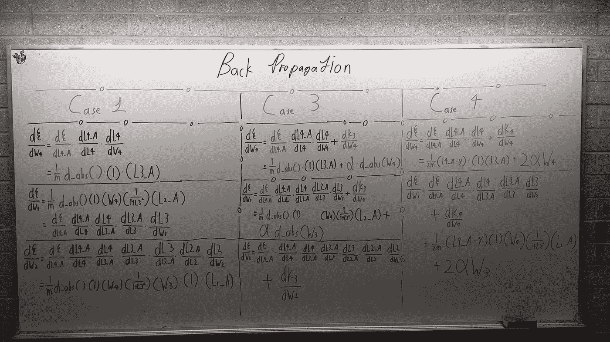

由于每隔一个案例都可以从这三个案例中派生出来，所以我不会做每一个反向传播过程。不过，有一件事我想让你知道。用红色马克笔写的部分是我们违反对绝对函数求导规则的地方！(注意这个！！)

**常规结果**

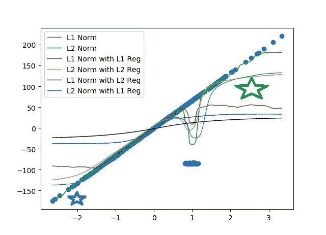

正如预期的那样，正则化的网络对噪声最鲁棒。然而具有纯 L1 范数函数的模型变化最小，但是有一个问题！如果你看到绿色星星的位置，我们可以看到红色回归线的精确度急剧下降。

还有，需要注意的一点是蓝星的位置，大多数模型都无法预测 X 开始时 Y 的正确值，这让我很感兴趣。我们来看看权重的绝对和。

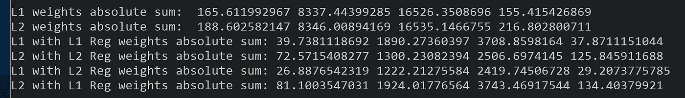

总的来说，非常清楚的是，具有正则化的模型具有小得多的权重。其中 L2 正则化的 L1 代价函数具有最小的权值。

**常规之外的思考:结果**

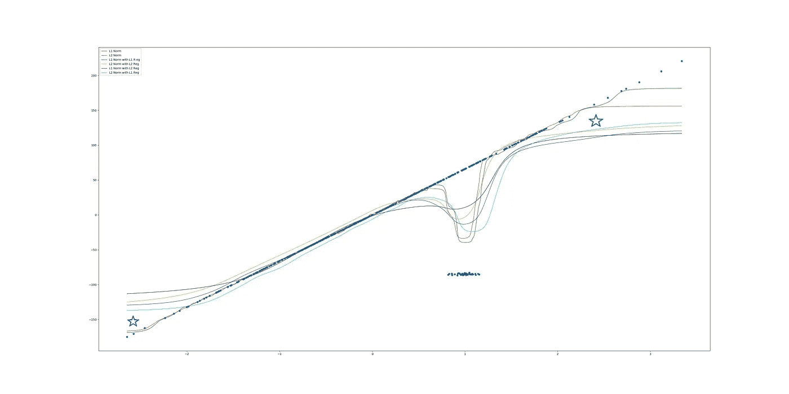

我是从哪里以及如何得到上述结果的？很简单，我没有遵循绝对函数的严格导数，而是稍微放宽了导数。具体区别见下文。

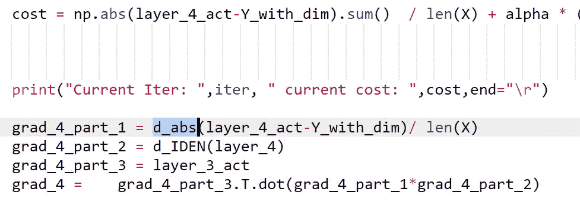

Regular Back Propagation on Case 5

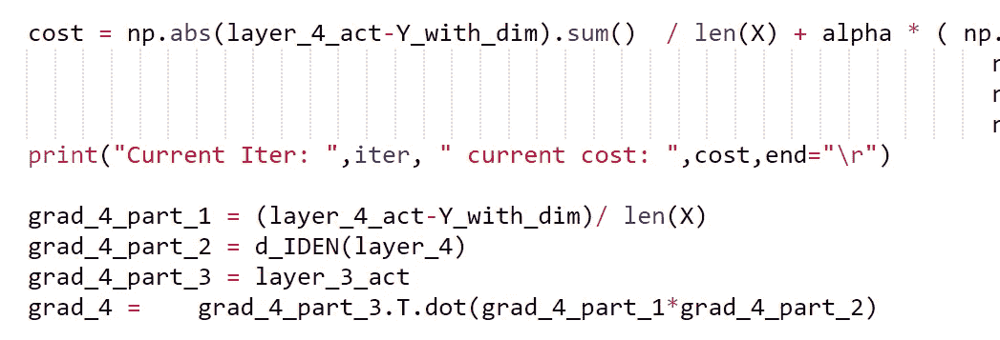

Special case for loosening up the derivative on Case 5

如上所示，我没有遵循严格的推导规则，而是将成本函数调整为(Layer_4_act — Y)/m。

我认为当谈到深度学习时，有时创造力会产生更好的结果，我不确定，但辛顿博士在反向传播中随机降低权重，仍然取得了良好的结果。无论如何，让我们来看看权重的绝对值总和。

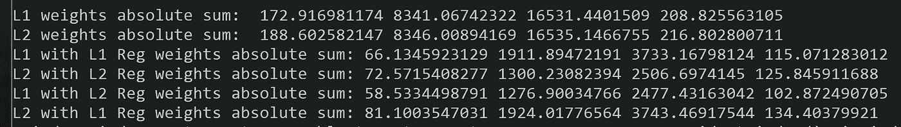

**互动代码—常规结果**

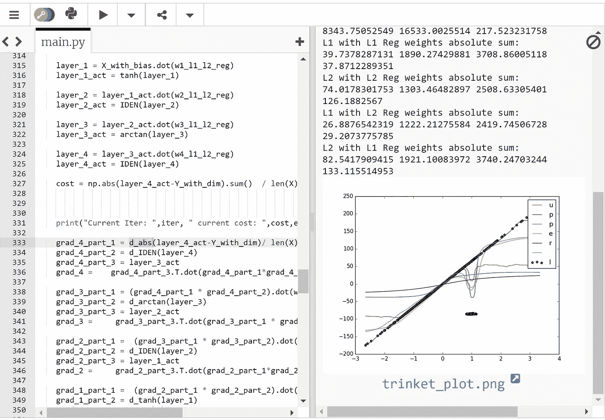

请点击这个[链接查看结果和代码。](https://trinket.io/python3/a1c7b627de)

**互动代码——公约之外的思考:结果**

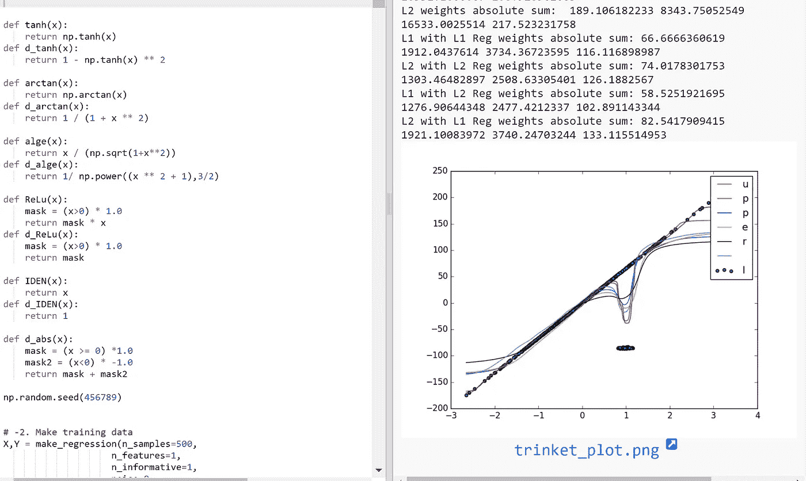

请点击此[链接查看结果和代码。](https://trinket.io/python3/46f661f6b7)

## 最后的话

我从另一篇文章中看到总共有 7 种正则化技术，所以我只是触及了表面。迫不及待想知道更多。

如果发现任何错误，请发电子邮件到 jae.duk.seo@gmail.com 找我。

同时，在我的 twitter [这里](https://twitter.com/JaeDukSeo)关注我，并访问[我的网站](https://jaedukseo.me/)，或我的 [Youtube 频道](https://www.youtube.com/c/JaeDukSeo)了解更多内容。如果你感兴趣的话，我还在简单的 RNN [上做了反向传播。](https://medium.com/@SeoJaeDuk/only-numpy-vanilla-recurrent-neural-network-with-activation-deriving-back-propagation-through-time-4110964a9316)

**参考文献**

1.  Seo，J. D. (2018 年 1 月 16 日)。Only Numpy:为什么我们需要激活函数(非线性)，在深度神经网络中—用…2018 年 1 月 20 日检索自[https://medium . com/@ SeoJaeDuk/only-Numpy-Why-we-needle-Activation-Function-Non-Linearity-in-Deep-Neural-Network-With-529 e 928820 BC](https://medium.com/@SeoJaeDuk/only-numpy-why-we-need-activation-function-non-linearity-in-deep-neural-network-with-529e928820bc)
2.  反正切。(未注明)。检索于 2018 年 1 月 20 日，来自[http://mathworld.wolfram.com/InverseTangent.html](http://mathworld.wolfram.com/InverseTangent.html)
3.  乙状结肠函数。(2018 年 1 月 18 日)。检索于 2018 年 1 月 20 日，来自[https://en.wikipedia.org/wiki/Sigmoid_function](https://en.wikipedia.org/wiki/Sigmoid_function)
4.  (未注明)。检索于 2018 年 1 月 20 日，来自[http://www . chioka . in/differences-between-L1-and-L2-as-loss-function-and-regulation/](http://www.chioka.in/differences-between-l1-and-l2-as-loss-function-and-regularization/)
5.  用极限定义求|x|的导数。(未注明)。检索于 2018 年 1 月 20 日，来自[https://math . stack exchange . com/questions/83861/finding-the-derivative-of-x-using-the-limit-definition](https://math.stackexchange.com/questions/83861/finding-the-derivative-of-x-using-the-limit-definition)
6.  基于 RANSAC 的稳健线性模型估计。(未注明)。2018 年 1 月 20 日检索，来自[http://sci kit-learn . org/stable/auto _ examples/linear _ model/plot _ ran sac . html # sphx-glr-auto-examples-linear-model-plot-ran sac-py](http://scikit-learn.org/stable/auto_examples/linear_model/plot_ransac.html#sphx-glr-auto-examples-linear-model-plot-ransac-py)
7.  Jain，a .，Shaikh，f .，Choudhary，a .，Singh，g .，& Kaur，P. (2016 年 2 月 07 日)。Python 中脊和套索回归的完整教程。检索于 2018 年 1 月 20 日，来自[https://www . analyticsvidhya . com/blog/2016/01/complete-tutorial-ridge-lasso-regression-python/](https://www.analyticsvidhya.com/blog/2016/01/complete-tutorial-ridge-lasso-regression-python/)
8.  杰基奇，M. (2017 年 10 月 30 日)。建立一个多层神经网络与 L2 正则化使用张量流。检索于 2018 年 1 月 20 日，来自[https://markojerkic . com/build-a-multi-layer-neural-network-with-L2-regulation-with-tensor flow/](https://markojerkic.com/build-a-multi-layer-neural-network-with-l2-regularization-with-tensorflow/)

[](https://becominghuman.ai/artificial-intelligence-communities-c305f28e674c)[](https://upscri.be/8f5f8b)[](https://becominghuman.ai/write-for-us-48270209de63)