# Only Numpy:用交互式代码实现谷歌大脑的+RNN-交集 RNN(递归神经网络中的容量和可训练性)。

> 原文：<https://towardsdatascience.com/only-numpy-implementing-google-brains-rnn-intersection-rnn-capacity-and-trainability-in-7dd7902b65a5?source=collection_archive---------5----------------------->

image from [pixel bay](https://pixabay.com/en/lens-obsolete-shutter-classic-3114729/)

所以今天，让我们从这篇论文“ [*递归神经网络*](https://arxiv.org/abs/1611.09913) 中的容量和可训练性”来完成实现新颖的 RNN 架构。因为我们已经在我的上一篇博文中实现了更新门 RNN。
[*Only Numpy:实现和比较 Google Brain 的 Update Gate(递归神经网络中的容量和可训练性)RNN，Hinton 博士的 Initialize RNN，以及带有交互代码的 Vanilla RNN。*](https://becominghuman.ai/only-numpy-implementing-and-comparing-google-brains-update-gate-capacity-and-trainability-in-940f0ad80649) ”

让我们完成这项工作。

**网络架构:数学形式**

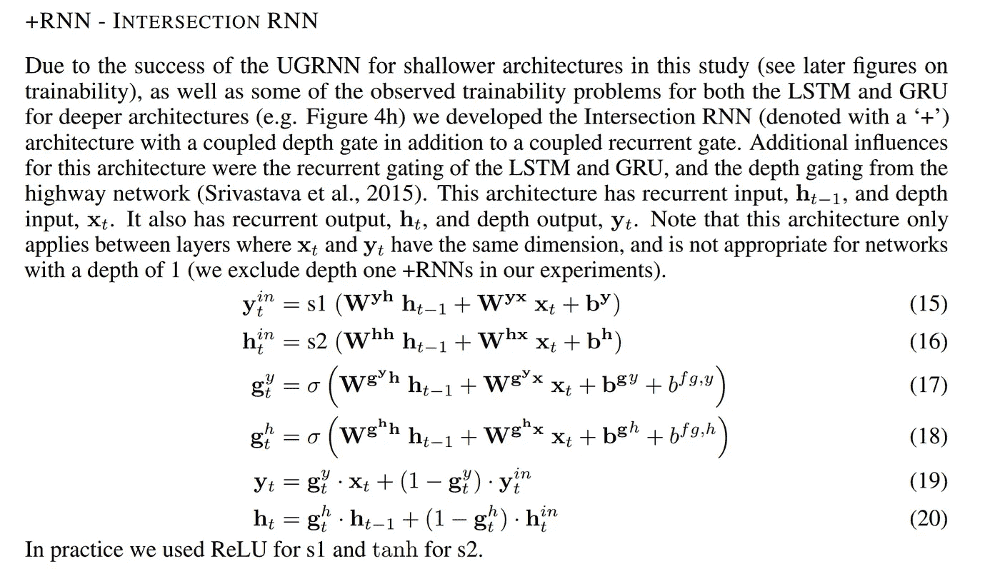

这个网络非常不同，不仅有循环部分，还有深度输出(记为 Y 线 19)。现在让我们来看看网络的图形表示。

**网络架构**

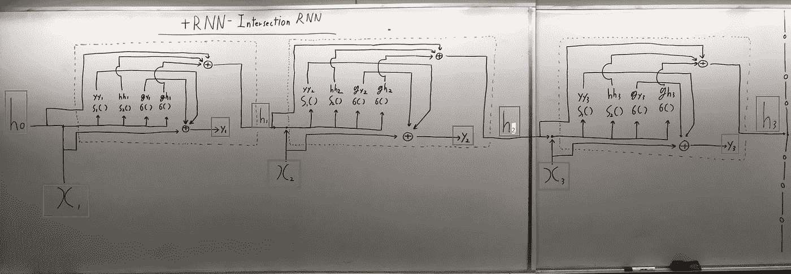

蓝框→递归隐藏状态
红框→新深度输出
绿框→每个时间戳输入

同样，非常直接，只是为了增加一些注释。

σ() → Logistic Sigmoid 激活函数
S1() → ReLU()激活函数
S2() → tanh()激活函数

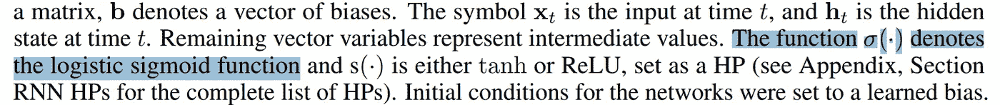

**正向进给操作(针对每个时间戳)**

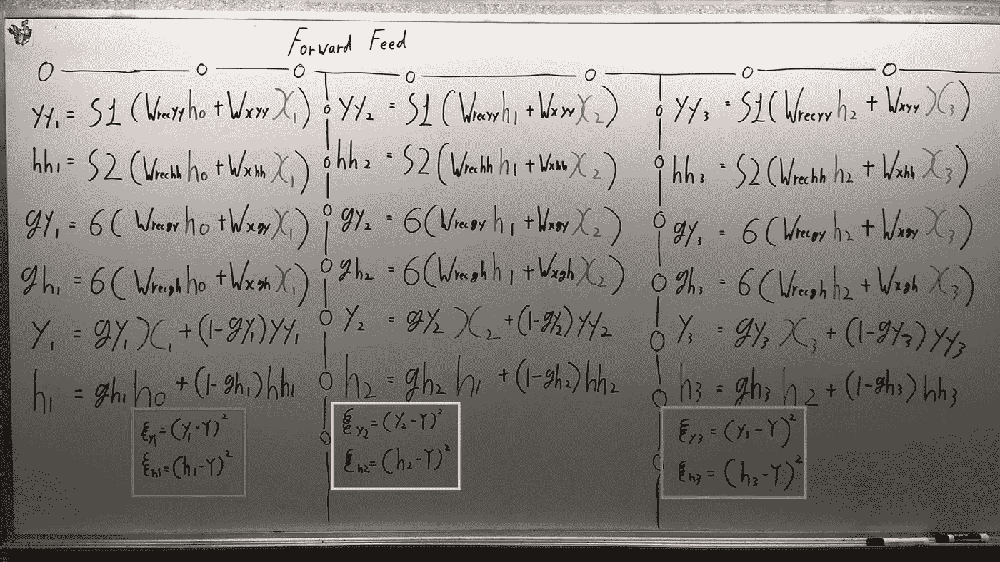

绿色方框→时间戳 1 的输出成本
粉色方框→时间戳 2 的输出成本
紫色方框→时间戳 3 的输出成本

同样，没有什么特别的只是标准的 RNN 前馈。

**关于 YY3、HH3、GY3、GH3 的反向传播(时间戳= 3)**

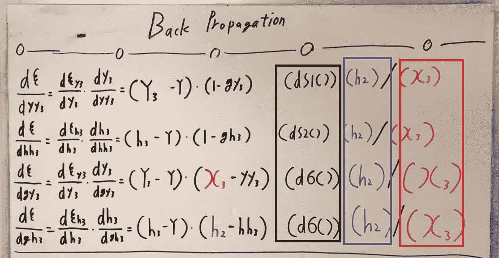

这里要注意一点，我不会对重量求导，而是对 YY，HH，GY 和 GH 求导。

为什么？请看看黑盒，我们正在对激活函数的输入进行反向传播。之后我们可以

乘以 h2，如果我们要对 Wrecyy、Wrechh、Wrecgy 或 Wrecgh 执行反向传播，或者

如果我们要对 Wxyy、Wxhh、Wxgy 或 Wxgh 执行反向传播，请乘以 x3。

下面是为时间戳 3 实现的反向传播代码。

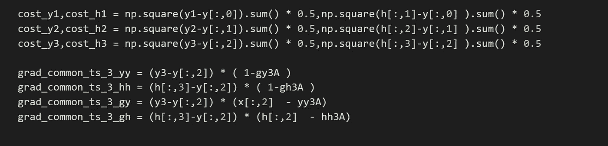

**关于 YY2、HH2(时间戳= 2)的反向传播**

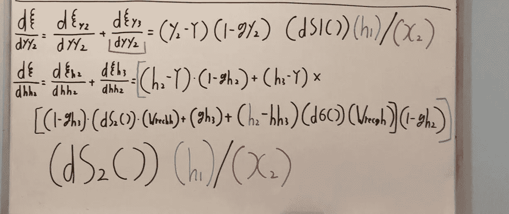

再次，对 YY2 求导，而不是对 Wrecyy 或 Wxyy 求导。另外，请注意红线下的项，该项为零，因为没有变量将 YY2 与时间戳 3 的成本联系起来。(这让我们的生活变得轻松了一些。)

下面是为时间戳 2 实现的反向传播的代码。

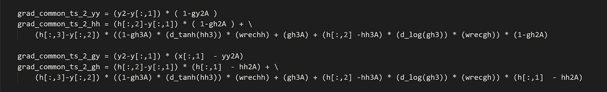

**关于 YY1 的反向传播，HH1(时间戳= 1)**

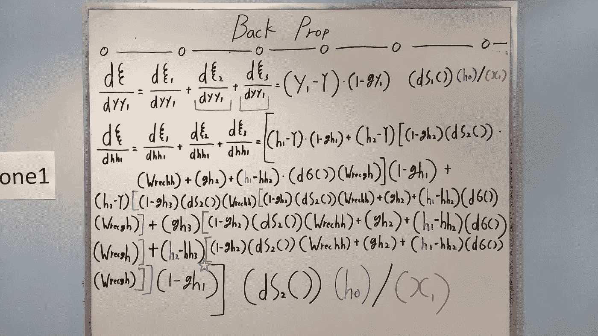

**请注意我把紫色星星放在哪里了，我忘记了那里的一些术语，它应该是(h2 — hh3) * (d_σ()) * (Wrecgh)而不仅仅是(h2 — hh3)。**

同样，对于红色下划线的变量是零，因为没有可以执行链式法则的变量。和前面的实现一样，我们对 YY1 和 HH1 求导。

下面是为时间戳 1 实现的反向传播代码。

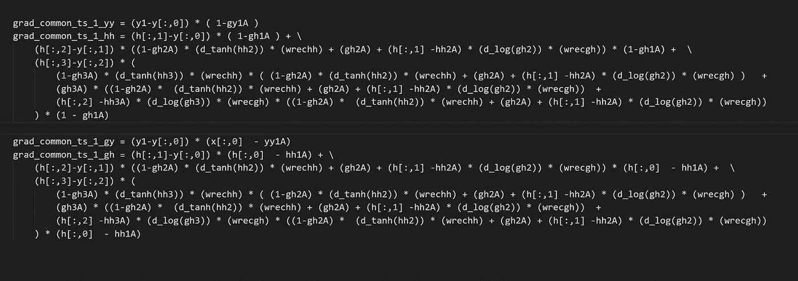

**训练及结果**

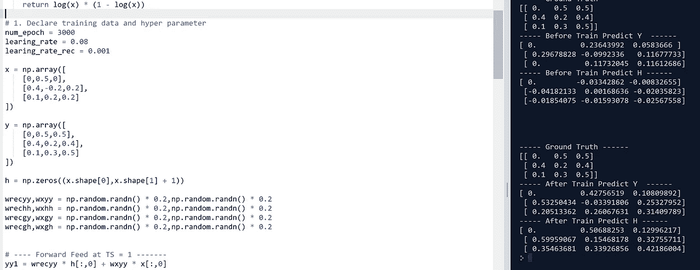

假的训练数据，左边看到的只是把每个时间戳中的数字相加。所以在 x 的第一行，我们可以看到它从 0，0.5，0。所以尊重的基础真值是 0，0.5 和 0.5。(y 的第一行。)

如右图所示，训练后，我们可以观察到输出值非常接近地面真实值。

**互动码**

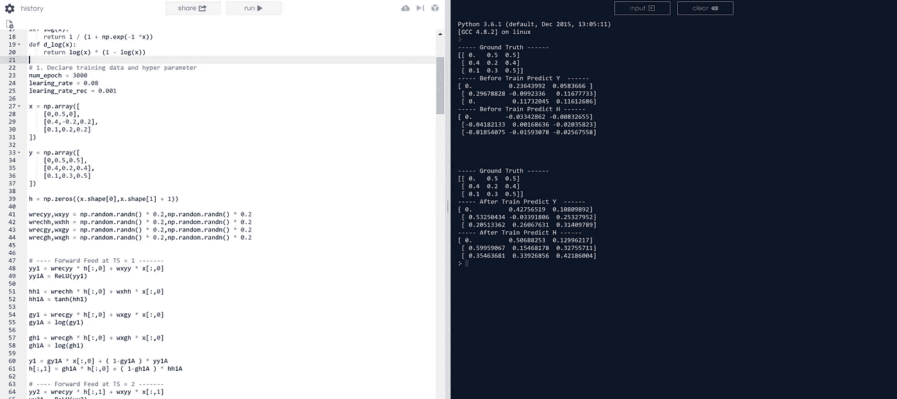

*我转到 Google Colab 获取交互代码！所以你需要一个谷歌帐户来查看代码，你也不能在谷歌实验室运行只读脚本，所以在你的操场上做一个副本。最后，我永远不会请求允许访问你在 Google Drive 上的文件，仅供参考。编码快乐！*

请点击此处[访问互动代码。(谷歌 Colab 版)](https://colab.research.google.com/drive/1Ew8AiSitT50M6JfyRycm_FaH73s94Bgu)

请[点击此处访问交互代码](https://repl.it/@Jae_DukDuk/Google-Brain-Intersection-RNN)(复制版本)

## 最后的话

谷歌大脑，总是有最有趣的网络架构选择。

如果发现任何错误，请发电子邮件到 jae.duk.seo@gmail.com 给我，如果你想看我所有写作的列表，请[在这里查看我的网站](https://jaedukseo.me/)。

与此同时，请在我的 twitter [这里](https://twitter.com/JaeDukSeo)关注我，并访问[我的网站](https://jaedukseo.me/)，或我的 [Youtube 频道](https://www.youtube.com/c/JaeDukSeo)了解更多内容。如果你感兴趣，我也在这里做了解耦神经网络[的比较。](https://becominghuman.ai/only-numpy-implementing-and-comparing-combination-of-google-brains-decoupled-neural-interfaces-6712e758c1af)

参考

1.  Collins，j .，Sohl-Dickstein，j .，和 Sussillo，D. (2016 年)。递归神经网络的容量和可训练性。 *arXiv 预印本 arXiv:1611.09913* 。
2.  Seo，J. D. (2018 年 1 月 24 日)。Only Numpy:实现和比较 Google Brain 的更新门(容量和可训练性 in…检索于 2018 年 1 月 29 日，来自[https://becoming human . ai/only-Numpy-Implementing-and-comparison-Google-brains-Update-Gate-Capacity-and-training ability-in-940 f0ad 80649](https://becominghuman.ai/only-numpy-implementing-and-comparing-google-brains-update-gate-capacity-and-trainability-in-940f0ad80649)