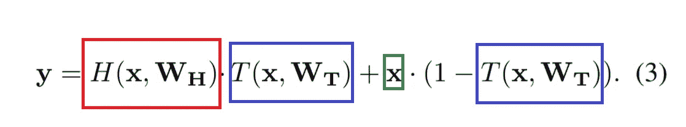
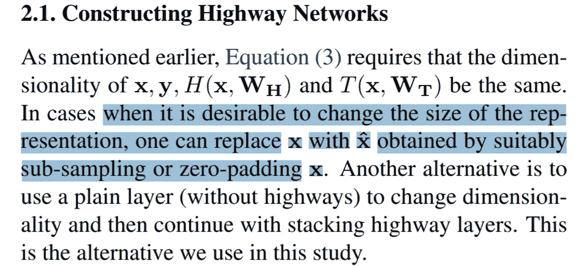
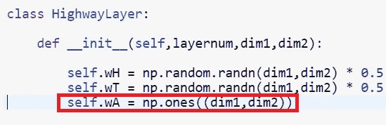
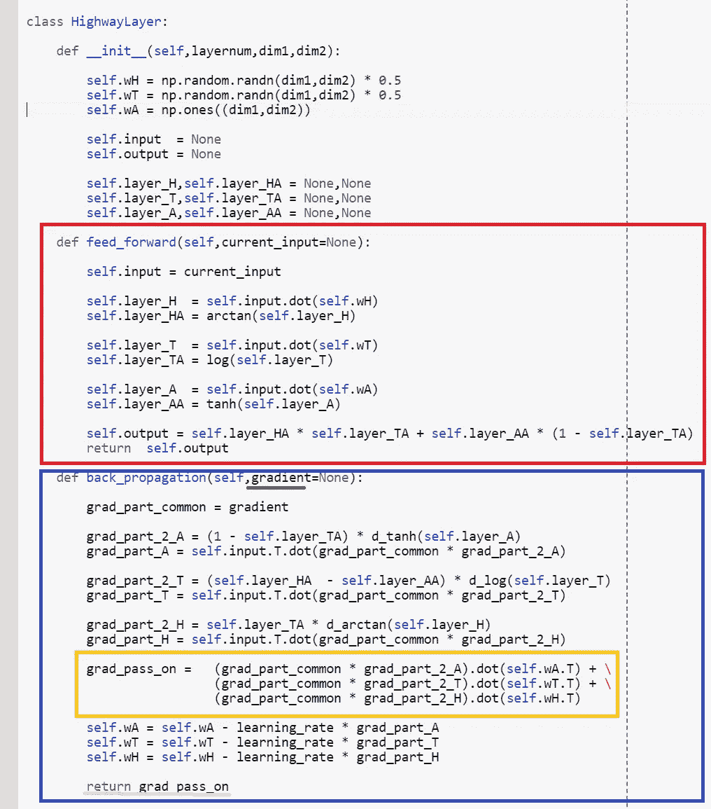
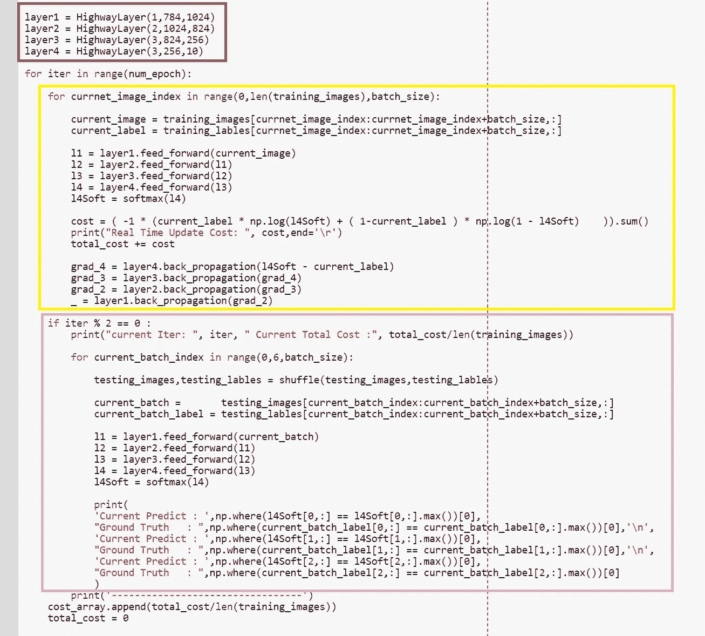
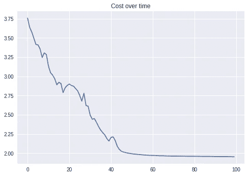
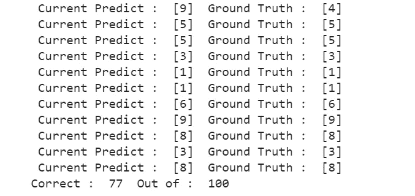
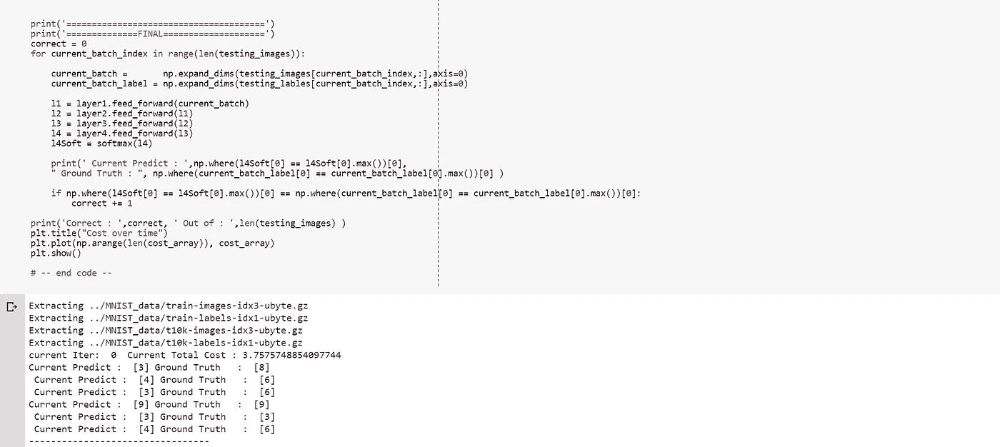

# Only Numpy:实现高速公路网络，使用带有交互代码的小批量 OOP 方法

> 原文：<https://towardsdatascience.com/only-numpy-implementing-highway-network-oop-approach-with-mini-batch-with-interactive-code-b5c2de2df842?source=collection_archive---------8----------------------->

Photo of Han River in [Seoul, from Pixel Bay](https://pixabay.com/en/seoul-south-korea-lotte-tower-2968290/)

我今天感觉有点懒，但是我仍然想练习我的反向传播技能以及实现神经网络的 OOP 方法。因此，实施网络的明显选择是[高速公路网](https://arxiv.org/pdf/1505.00387.pdf)。(我想实现这个网络已经有一段时间了。)

**网络架构(数学形式)/修改**

Screen Shot from [Original Paper](https://arxiv.org/pdf/1505.00387.pdf)

**红框→** 仿射变换+非线性激活，我们可以认为这是标准全连接网络中的“正常”层

**蓝框** →变换门，我们也可以认为是仿射变换+非线性激活(但激活函数不同)

**绿框** →我们将在原始文件的基础上增加我们的修改。在论文中，我们应该直接传递输入，然而为了匹配维度，我将在这里添加仿射变换以及非线性激活函数。(另外，请注意，我将把它们称为“A ”,作为“Added”的缩写形式。)

以防万一，如果有人想知道，原始论文的作者实际上说，如果需要改变维度。然而，为了尽可能保持输入“不变”,我将为添加的部分初始化权重，如下所示。

当公路图层对象初始化时，添加部分的权重都被初始化为 1，而不是高斯分布。

**网络架构(面向对象形式)**

**红框** →每层进给部分

**蓝框** →每层反向传播

**绿色下划线** →来自下一层的梯度，需要计算当前层的梯度

**黄框** →在更新权重之前，计算传递到前一层*的梯度(为了保持链式法则。)*

**粉色下划线** →将渐变传递给上一层，计算其渐变。

我真的很喜欢这种面向对象的方法，我想我会以这种方式实现我的大部分神经网络。

**前馈/反向传播**

**红框** →用合适的维度初始化各层

**黄框** →前馈操作以及重量更新的反向传播。最小批量为 3。

**粉色方框** →每 2 次迭代，看网络做的怎么样。

**训练和结果**

首先，成本从 3.75 英镑开始，然后下降到 1.9 英镑，所以网络似乎在学习。然而准确性是可笑的 LOL。

四层高速公路网 77%的准确率，我不知道这是好是坏。如果你能提高网络准确度，请分享你的森派诀窍！

**交互代码**

*我搬到了谷歌 Colab 寻找交互代码！所以你需要一个谷歌帐户来查看代码，你也不能在谷歌实验室运行只读脚本，所以在你的操场上做一个副本。最后，我永远不会请求允许访问你在 Google Drive 上的文件，仅供参考。编码快乐！*

要访问互动 [e 代码，请点击此处](https://colab.research.google.com/drive/1-xrEyQmJKcBqqRNLRqhil6kxd8n-xEQw)。

**最后的话**

我知道我应该努力提高模型的准确性，但今晚我只是觉得很懒，对不起，哈哈。

如果发现任何错误，请发电子邮件到 jae.duk.seo@gmail.com 找我。

同时，在我的 twitter [这里](https://twitter.com/JaeDukSeo)关注我，并访问[我的网站](https://jaedukseo.me/)，或我的 [Youtube 频道](https://www.youtube.com/c/JaeDukSeo)了解更多内容。如果你感兴趣的话，我还做了解耦神经网络的比较。

**参考**

1.  Srivastava，R. K .，Greff，k .，& Schmidhuber，J. (2015 年)。高速公路网。 *arXiv 预印本 arXiv:1505.00387* 。
2.  Romero，a .，Ballas，n .，Kahou，S. E .，Chassang，a .，Gatta，c .，& Bengio，Y. (2014 年)。Fitnets:薄深网的提示。arXiv 预印本 arXiv:1412.6550 。