# 仅 Numpy:使用交互式代码实现迷你 VGG (VGG 7)和 SoftMax 层

> 原文：<https://towardsdatascience.com/only-numpy-implementing-mini-vgg-vgg-7-and-softmax-layer-with-interactive-code-8994719bcca8?source=collection_archive---------4----------------------->

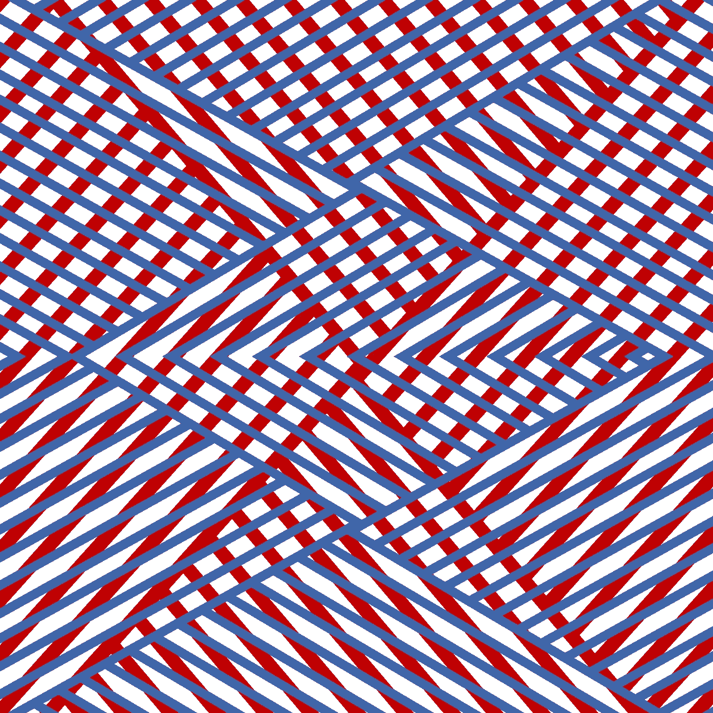

Picture from Pixel Bay

我想在卷积神经网络上练习我的反向传播技能。现在我想实现我自己的 VGG 网(来自原始论文“[用于大规模图像识别的非常深的卷积网络](https://arxiv.org/abs/1409.1556)”)，所以今天我决定结合这两个需求。

如果你不了解卷积神经网络的反向传播过程，请查看我的卷积神经网络反向传播教程，这里[这里](https://becominghuman.ai/only-numpy-implementing-convolutional-neural-network-using-numpy-deriving-forward-feed-and-back-458a5250d6e4)或者[这里](https://medium.com/@SeoJaeDuk/only-numpy-understanding-back-propagation-for-transpose-convolution-in-multi-layer-cnn-with-c0a07d191981)。

**Softmax 层及其衍生物**

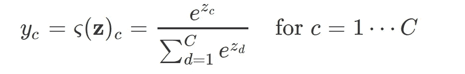

Softmax Function [photo from Peter](http://peterroelants.github.io/posts/neural_network_implementation_intermezzo02/)

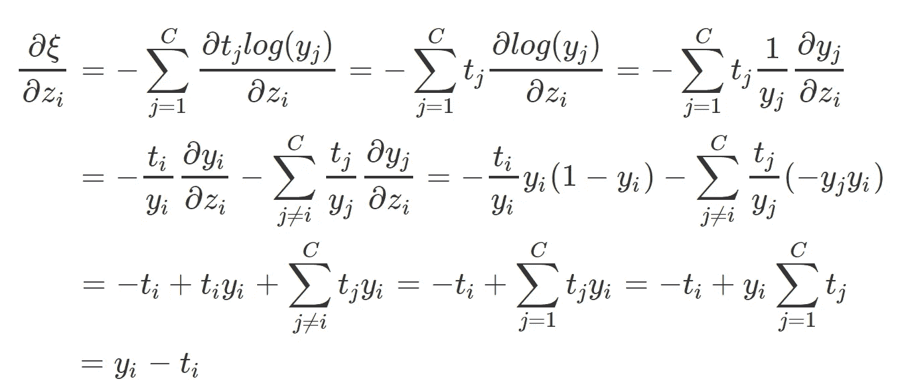

Derivative of Softmax [photo from Peter](http://peterroelants.github.io/posts/neural_network_implementation_intermezzo02/)

现在有很多关于 softmax 函数及其导数的好文章。所以这里就不深入了。不过我这里链接几个[，这里](http://photo from Peter)[这里](https://stats.stackexchange.com/questions/79454/softmax-layer-in-a-neural-network)，这里[这里](https://github.com/rasbt/python-machine-learning-book/blob/master/faq/softmax_regression.md)，这里[这里](https://sefiks.com/2017/12/17/a-gentle-introduction-to-cross-entropy-loss-function/comment-page-1/#comment-600)。

**网络架构(示意图)**

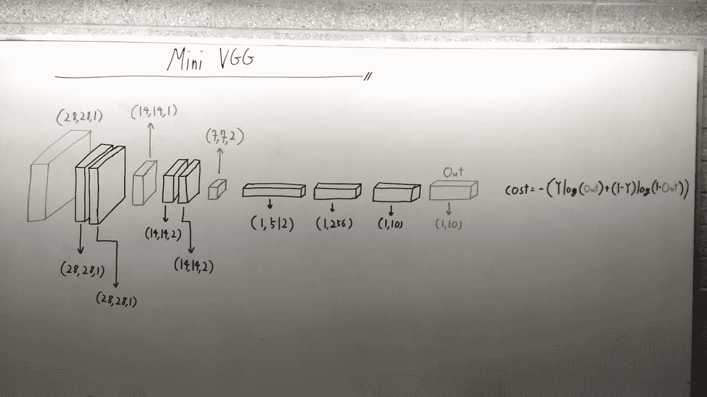

所以我们只有 7 层，因此名字是 VGG 7，而不是 VGG 16 或 19。原始实现之间也有两个主要区别。

1.我们将使用平均池而不是最大池。如果你想知道为什么，[请查看此链接](https://www.quora.com/What-is-the-benefit-of-using-average-pooling-rather-than-max-pooling)。
2。我们网络中的信道数量将比原来的网络少得多。为了便于比较，请参见下面的原始网络架构或这里的。

[Image from heuritech](https://blog.heuritech.com/2016/02/29/a-brief-report-of-the-heuritech-deep-learning-meetup-5/vgg16/)

**数据准备和超参数声明**

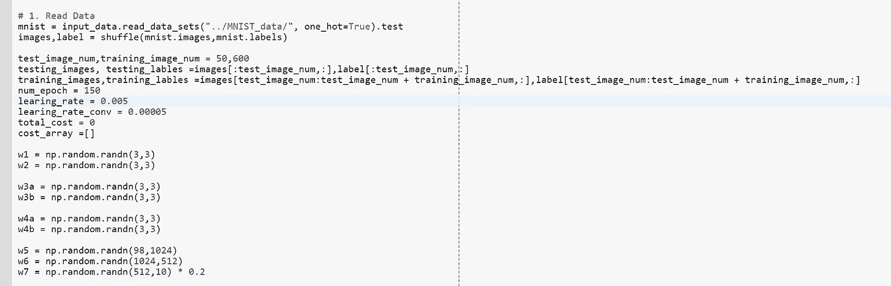

如上所述，我们现在不必过滤掉只包含 0 或 1 的图像。由于 SoftMax 图层，我们能够对 0 到 9 的每张图像进行分类。

**正向进给操作**

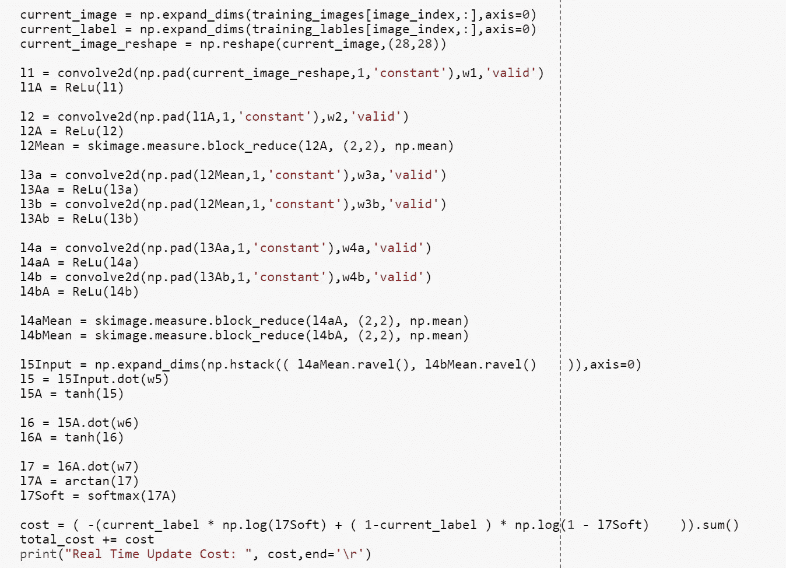

这是一个标准的前馈操作，激活函数 ReLU()用于卷积层，tanh()和 arctan()用于完全连接的层。

**反向传播**

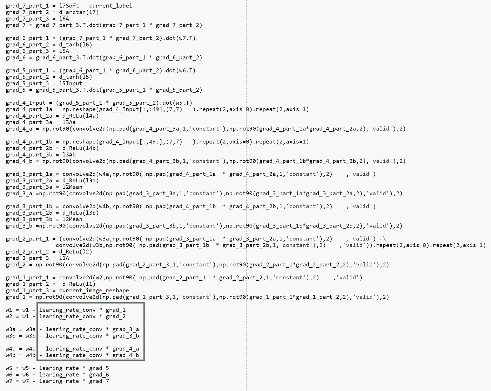

由于我们使用的是平均池而不是最大池，反向传播非常容易和简单。需要注意的一点是，我对卷积层和全连通层设置了不同的学习速率。(绿色方框区域)。

*更新:请注意在代码中有一个错别字，我将调用以上反向传播作为断开的反向传播，因为我们正在用 w1 而不是 w2 更新 w2。*

**训练和结果(正确的反向传播)**

简·扎瓦日基指出了我的错别字，所以我修改了它，并重新培训了网络。如右图所示，是一段时间内的成本值。

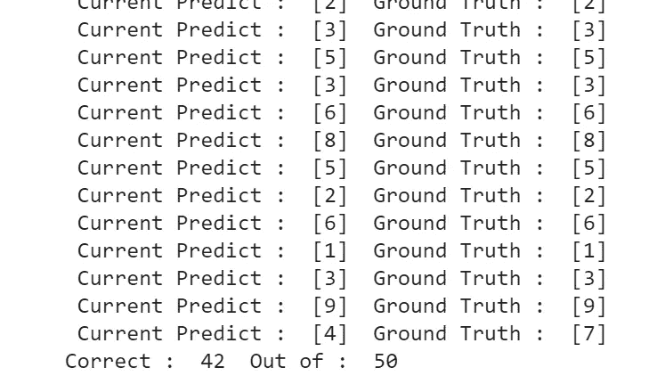

该网络在测试集图像上也做得更好，准确率为 84%。

**训练和结果(反向传播中断)**

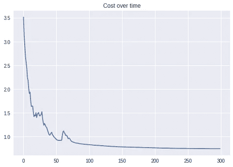

因此，随着时间的推移，成本也稳定下降，但是该模型在测试集图像上表现不佳。

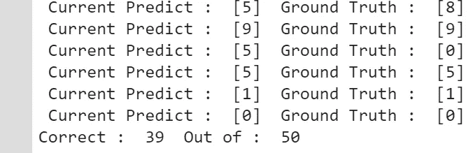

在 50 个数字中，只能正确分类 39 个，准确率约为 78%。

**交互代码**

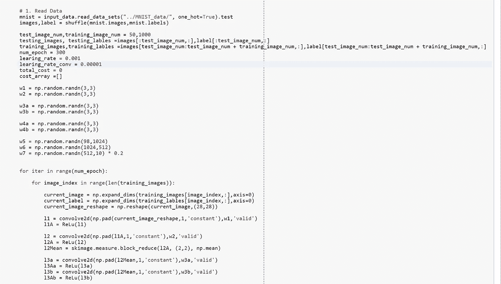

*为了交互代码，我搬到了 Google Colab！所以你需要一个谷歌帐户来查看代码，你也不能在谷歌实验室运行只读脚本，所以在你的操场上做一个副本。最后，我永远不会请求允许访问你在 Google Drive 上的文件，仅供参考。编码快乐！*

要访问[交互代码，请点击此链接。](https://colab.research.google.com/drive/10zTS8F31ZW6NJAmgFAJMup8xHYZF489E)

**遗言**

VGG 网络是实践前馈操作和反向传播的非常好的网络，因为它们都是直接的。

如果发现任何错误，请发电子邮件到 jae.duk.seo@gmail.com 找我。

同时，在我的推特[这里](https://twitter.com/JaeDukSeo)关注我，并访问[我的网站](https://jaedukseo.me/)，或我的 [Youtube 频道](https://www.youtube.com/c/JaeDukSeo)了解更多内容。如果你感兴趣的话，我还做了解耦神经网络[的比较。](https://becominghuman.ai/only-numpy-implementing-and-comparing-combination-of-google-brains-decoupled-neural-interfaces-6712e758c1af)

**参考**

1.  Simonyan 和 a . zisser man(2014 年)。用于大规模图像识别的非常深的卷积网络。 *arXiv 预印本 arXiv:1409.1556* 。
2.  罗兰茨，p .(未注明)。如何实现一个神经网络间奏曲 2？检索 2018 . 02 . 07，来自[http://peterroelants . github . io/posts/neural _ network _ implementation _ intermezzo 02/](http://peterroelants.github.io/posts/neural_network_implementation_intermezzo02/)
3.  R.(未注明)。rasbt/python-机器学习-图书。2018 . 02 . 07 检索，来自[https://github . com/rasbt/python-machine-learning-book/blob/master/FAQ/soft max _ regression . MD](https://github.com/rasbt/python-machine-learning-book/blob/master/faq/softmax_regression.md)
4.  交叉熵损失函数简介。(2018 年 01 月 07 日)。检索 2018 . 02 . 07，来自[https://sefiks . com/2017/12/17/a-gentle-introduction-to-cross-entropy-loss-function/comment-page-1/# comment-600](https://sefiks.com/2017/12/17/a-gentle-introduction-to-cross-entropy-loss-function/comment-page-1/#comment-600)
5.  Vgg16。(2016 年 2 月 26 日)。检索于 2018 年 2 月 7 日，来自[https://blog . heuritech . com/2016/02/29/a-brief-report-of-the-heuritech-deep-learning-meetup-5/vgg 16/](https://blog.heuritech.com/2016/02/29/a-brief-report-of-the-heuritech-deep-learning-meetup-5/vgg16/)
6.  2018.【在线】。可用:[https://www . quora . com/What-the-benefit-of-use-average-pooling-than-max-pooling](https://www.quora.com/What-is-the-benefit-of-using-average-pooling-rather-than-max-pooling.)【访问时间:2018 年 2 月 7 日】。