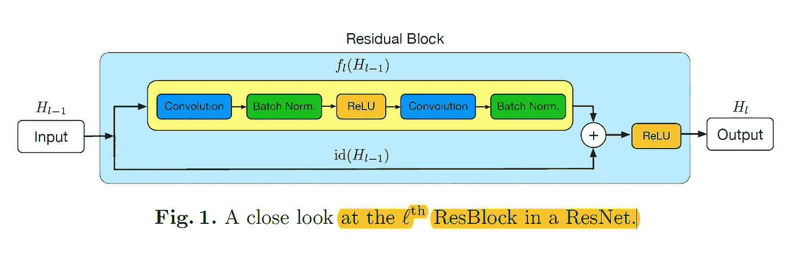
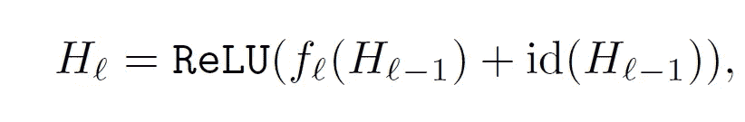
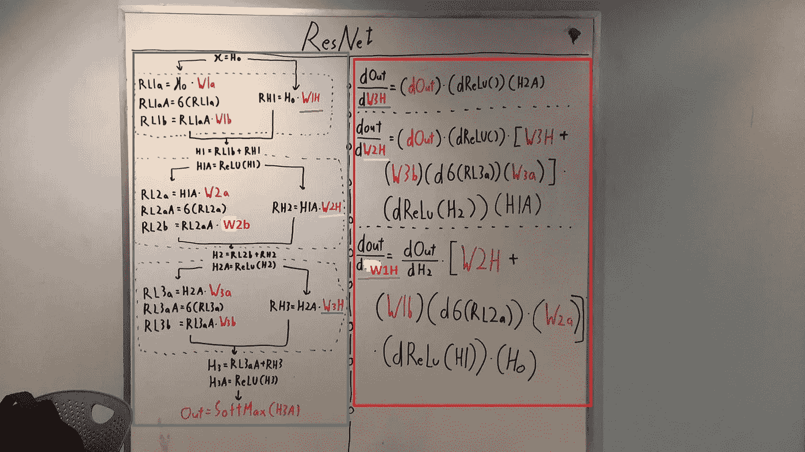
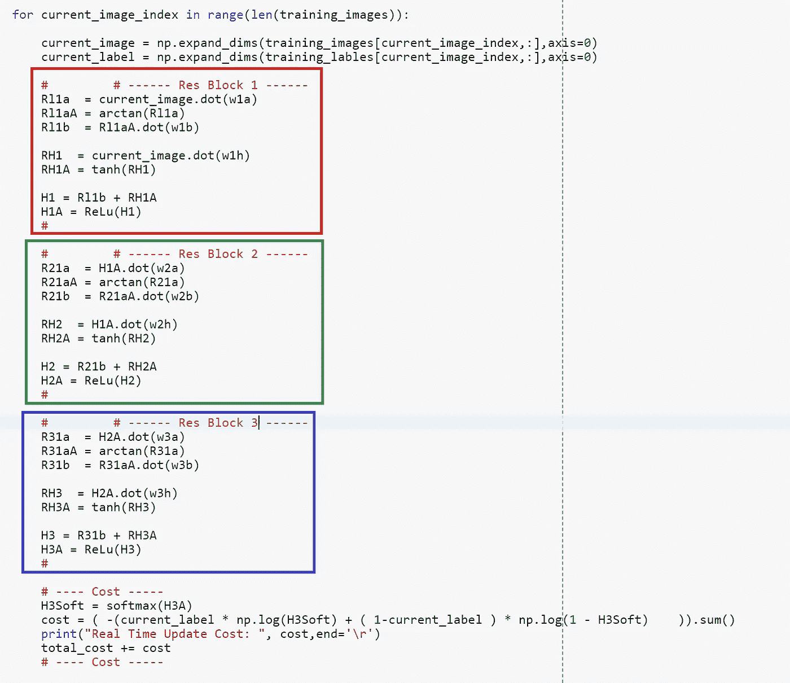
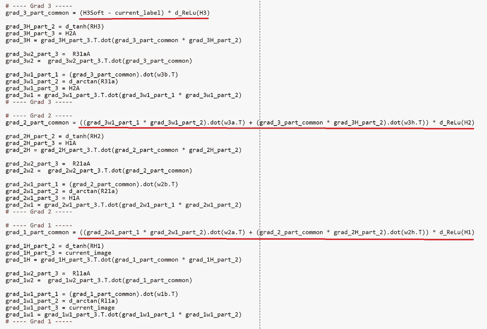
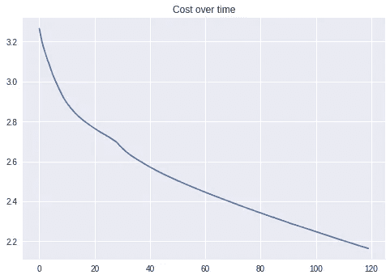
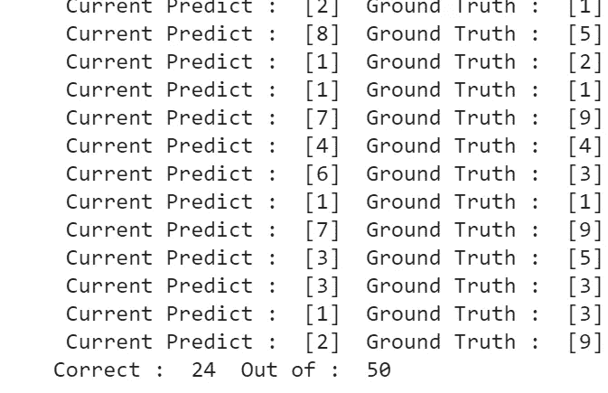
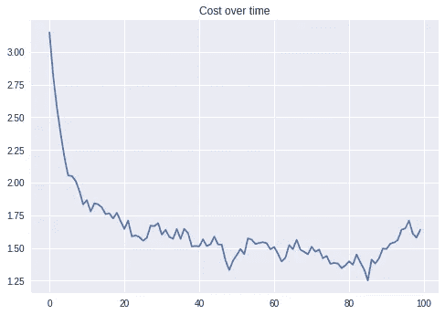
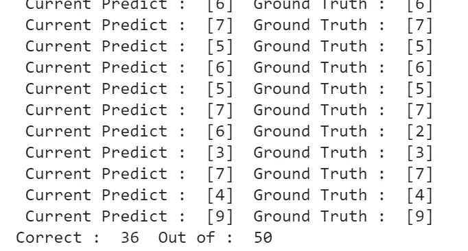
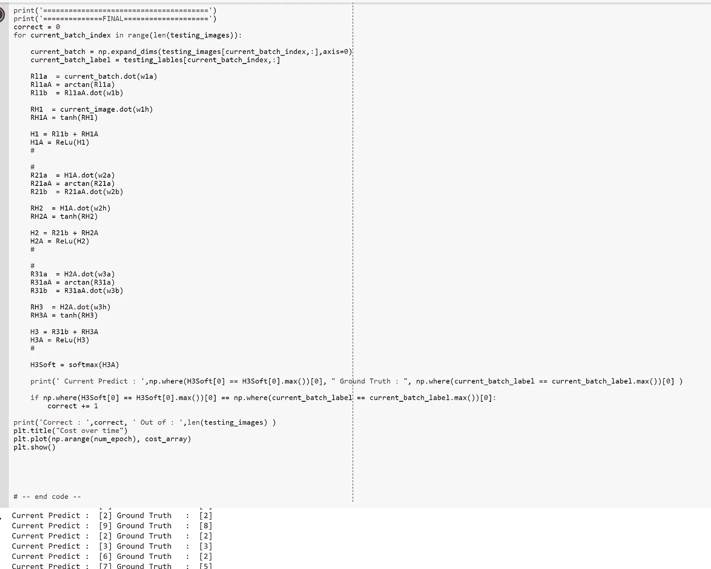

# Only Numpy:使用交互式代码为 MNIST 分类实现简单的 ResNet(具有随机深度的深度网络)

> 原文：<https://towardsdatascience.com/only-numpy-implementing-simple-resnet-for-mnist-classification-with-interactive-code-d58c77064304?source=collection_archive---------8----------------------->

Image [from Pixel Bay](https://pixabay.com/en/road-highway-asphalt-desert-travel-3114475/)

所以我在读这篇文章“[随机深度网络将成为新的范式](http://deliprao.com/archives/134) l”，在那里我看到了论文“[具有随机深度的深度网络](https://arxiv.org/pdf/1603.09382.pdf)”。在阅读这篇论文时，我看到了下面的图表。

ResNet Image from [Original Paper](https://arxiv.org/abs/1603.09382)

我立刻受到启发，建立了自己的 Res Net。然而，由于批处理规范化对于反向传播来说实现起来有点复杂，所以在今天的实现中我就不把它们算进去了。但是我保证，我会很快实施的！

**网络架构(数学形式)**

如上所述，网络架构非常容易理解，我们有某种函数 f()来转换输入数据。我们还有一个额外的函数 id()，即 Identity 函数，它允许从上一层直接连接到当前层。

**前馈操作/部分反向传播
(数学方程)**

绿框→3 个剩余块的前馈操作
红框→隐藏权重的部分反向传播。

蓝色下划线→相对于 W3H 的反向传播
粉色下划线→相对于 W2H 的反向传播
紫色下划线→相对于 W1H 的反向传播

现在，我不会对每个权重执行反向传播，但是对 W3b、W3a、W2b、W2a、W1b 和 W1a 的反向传播也很容易。

**前馈操作(代码)**

红色方框→ Res 模块 1
绿色方框→ Res 模块 2
蓝色方框→ Res 模块 3

对静止块前馈操作非常简单而有效。然而反向传播过程有点复杂。

**反向传播(代码)**

Res Net 中反向传播有点复杂的主要原因是因为在残差块的末尾发生了加法。在执行反向传播时，我们需要确保我们将所有梯度相对于该权重相加。代码中带红色下划线的部分执行加法。

**培训和结果(相同的学习率)**

现在，首先我为隐藏权重和其他权重设置了完全相同的学习速率。无论我如何努力，我都无法在这种环境下得到好的结果。所以我决定简单地为不同“类型”的重量设定不同的学习率。

**培训和结果(不同的学习率)**

对于一个 10 类图像的简单分类任务来说，72 %的准确率并不令人印象深刻。我会回来，希望增加这个模型的准确性。但是看起来，为不同“类型”的权重设置不同的学习率会有更好的结果。

**交互代码**

*我搬到了谷歌 Colab 寻找交互代码！所以你需要一个谷歌帐户来查看代码，你也不能在谷歌实验室运行只读脚本，所以在你的操场上做一个副本。最后，我永远不会请求允许访问你在 Google Drive 上的文件，仅供参考。编码快乐！*

要访问[的互动代码，请点击此链接。](https://colab.research.google.com/drive/190cpdEXrcWIDe-0qmh2tkDnQ8RfyEV72)

**最后的话**

在论文“具有随机深度的深度网络”中提出的主要网络不是简单的 Res 网，而是它们引入了具有随机深度的网络。我将很快尝试实现批量标准化网络。

如果发现任何错误，请发电子邮件到 jae.duk.seo@gmail.com 找我。

同时，在我的 twitter [这里](https://twitter.com/JaeDukSeo)关注我，并访问[我的网站](https://jaedukseo.me/)，或我的 [Youtube 频道](https://www.youtube.com/c/JaeDukSeo)了解更多内容。如果你感兴趣的话，我还做了解耦神经网络的比较。

**参考**

1.  黄，孙，杨，刘，陈，丁，温伯格(2016 年 10 月)。具有随机深度的深度网络。在*欧洲计算机视觉会议*(第 646–661 页)。斯普林格，查姆。
2.  D.(2016 年 06 月 05 日)。随机深度网络将成为新常态。检索于 2018 年 2 月 8 日，来自[http://deliprao.com/archives/134](http://deliprao.com/archives/134)