# Only Numpy Medical:使用交互式代码的神经网络对肺部 CT 扫描去噪—第 1 部分，普通自动编码器模型

> 原文：<https://towardsdatascience.com/only-numpy-medical-denosing-lung-ct-scans-using-auto-encoders-with-interactive-code-part-1-a6c3f9400246?source=collection_archive---------5----------------------->

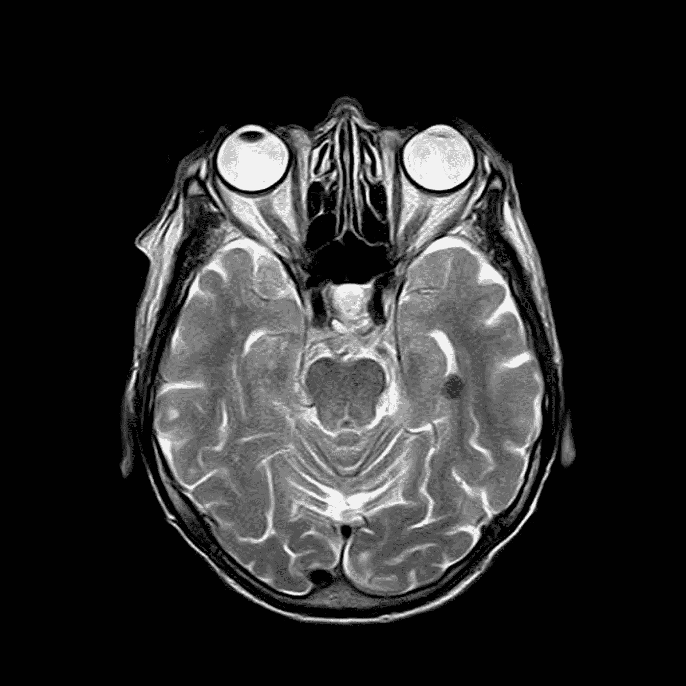

Image [from Pixel Bay](https://pixabay.com/en/mri-magnetic-x-ray-skull-head-782457/)

我的激情在于人工智能，我希望我的遗产是在医疗保健领域，使用人工智能。因此，为了实现我的梦想，也为了实践实现神经网络的 OOP 方法，我将开始一系列肺部 CT 扫描的第一部分。我将用 Adam Optimizer 实现普通的自动编码器来开始这个系列。

***注:所有的 DICOM 图像均来自*** [***癌症影像存档网***](http://www.cancerimagingarchive.net/) ***，如果您打算使用这些数据，请查阅他们的数据使用年龄政策。具体来说，我将使用来自*** [***仿真模型 FDA***](http://dx.doi.org/10.7937/K9/TCIA.2015.ORBJKMUX) ***数据集的 DICOM 图像。***

**训练数据和生成的噪声数据**

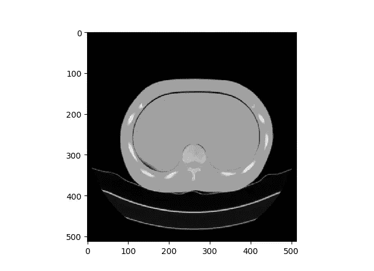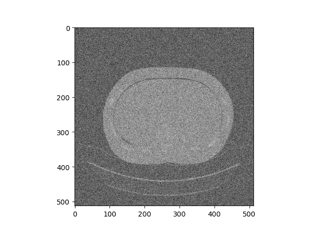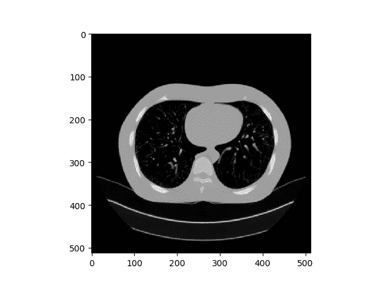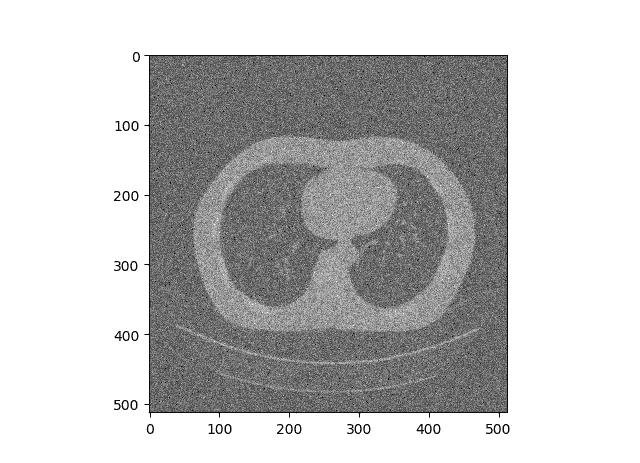

这个想法很简单，我们有原始的 DICOM 图像，如左图所示，我们将添加一些随机噪声，使图像看起来像右图。

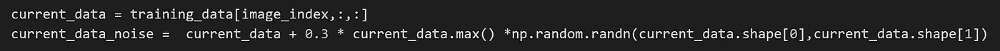

我们可以通过添加随机高斯分布噪声并乘以某个常数值来实现这一点。

**网络架构(图形形式)**

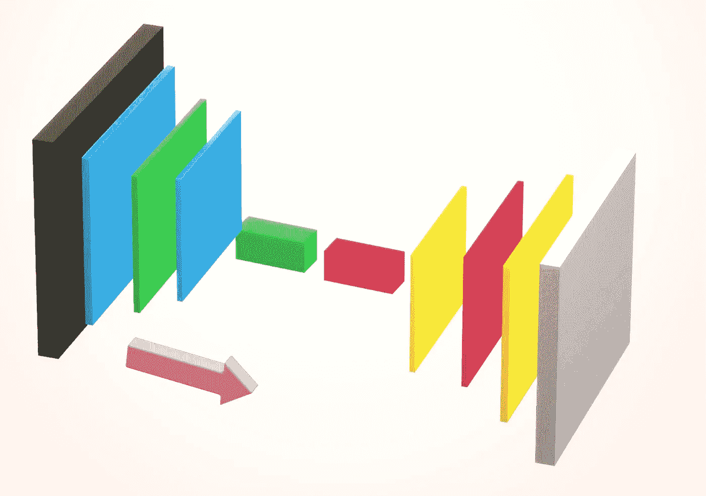

**黑盒** →输入 512*512 尺寸的 DICOM 图像

**蓝/绿方块** →编码器部分，3 卷积运算，在最后一层我们对图像进行矢量化(展平)

**红/黄色方块** →解码器部分，输入编码矢量，并对其进行整形，以执行 3 层卷积运算。

如上所述，组成自动编码器的组件非常简单明了。

**网络架构(面向对象形式)**

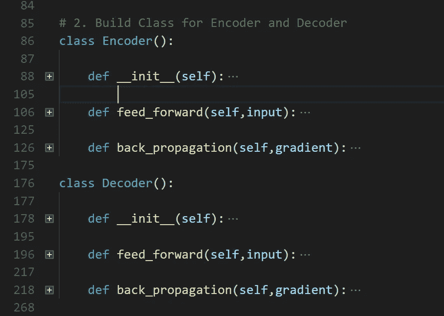

如上所述，每个模型都有三种不同的功能。
**a .初始化** →初始化模型中的所有权重

**b .前馈** →根据型号是编码器还是解码器，要么以图像为输入，要么以编码矢量为输入，执行标准前馈操作。

**c .反向传播** →这是模型的关键功能，我们在这里计算每一层的错误率，并调整模型的权重，以学习最佳权重。

**前馈操作(编码器/解码器)**

**红框** →编码器卷积运算部分
**蓝框** →编码器全连接层运算部分

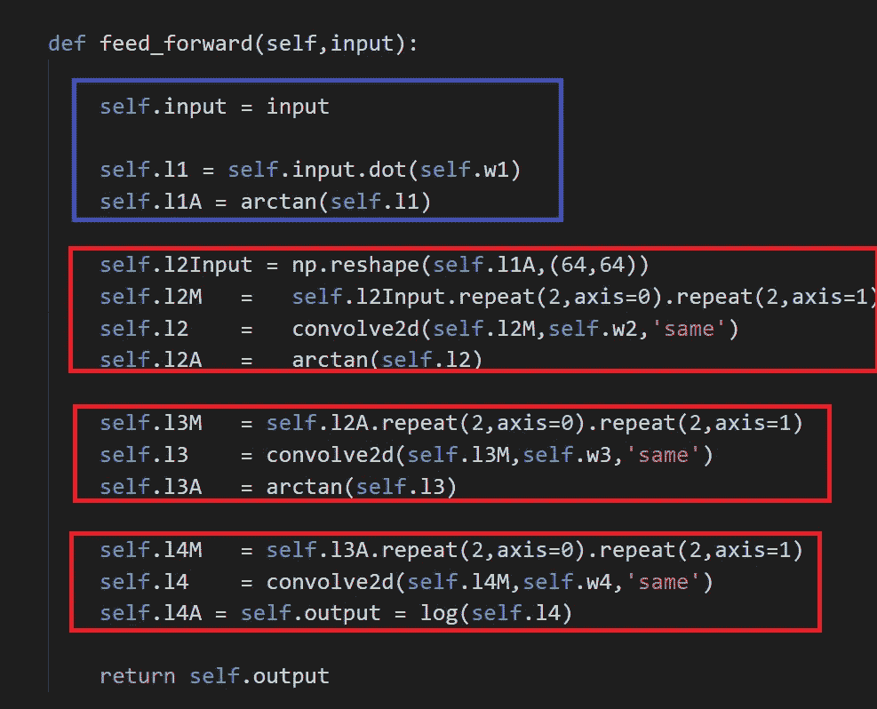

**蓝框** →解码器全连接层运算
**红框** →解码器卷积运算

我想指出两件事。
1。从编码器到解码器的操作顺序是相反的。(或者换句话说，镜像。)
2。为了执行降维，我们将在编码器中使用均值池。为了对图像进行上采样，我们只需在解码器中重复矩阵中的每个元素。

**反向传播(编码器/解码器)**

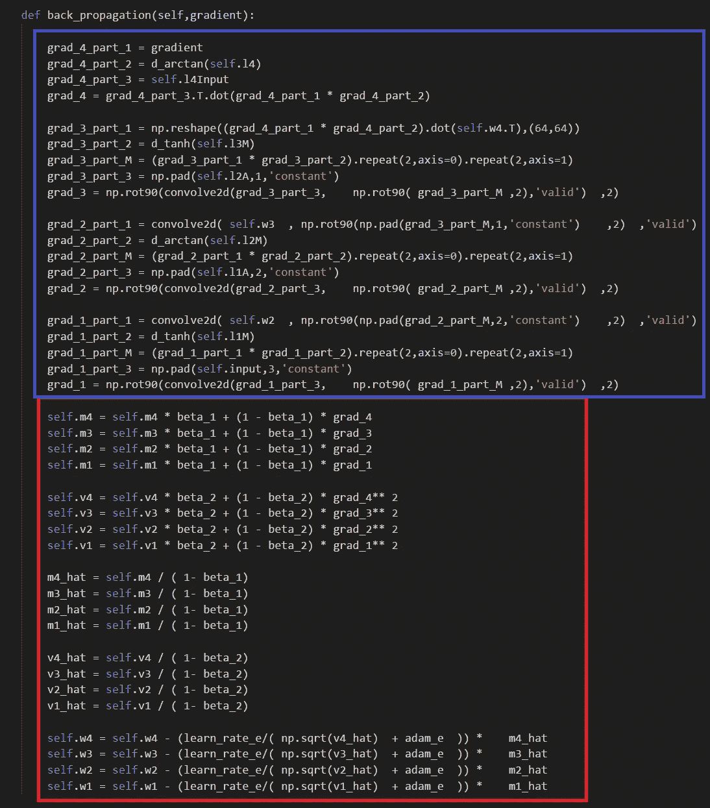

**红框→** 编码器的 Adam 优化器更新
**蓝框** →执行编码器的反向传播

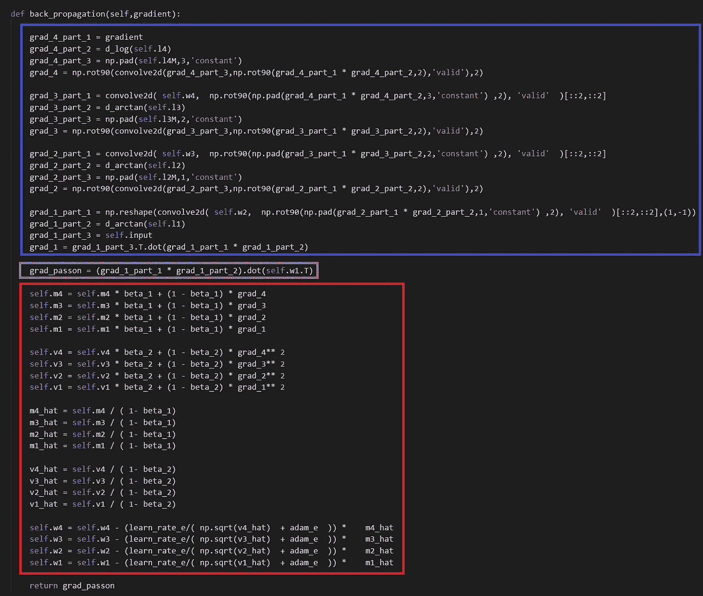

**蓝框** →为解码器执行反向传播
**紫框** →将梯度传递给编码器，在更新权重
**红框** → Adam 优化器为解码器更新之前计算梯度。

**朴素成本函数**

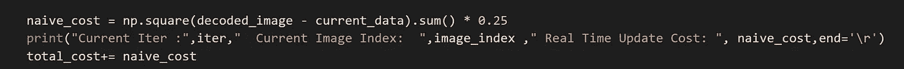

对于这个普通的自动编码器，我将使用简单的成本函数，这是 L2 平方成本函数，但分母是 1/4，而不是 1/2。我意识到，我们可以在这里使用许多其他成本函数，例如 SSIM，或者我们甚至可以使用 VGG 16 作为成本函数，如论文“[深度特征作为感知度量的不合理有效性](https://arxiv.org/abs/1801.03924)”中所示。但是现在让我们继续关注 L2。

**训练和结果——普通随机梯度下降**

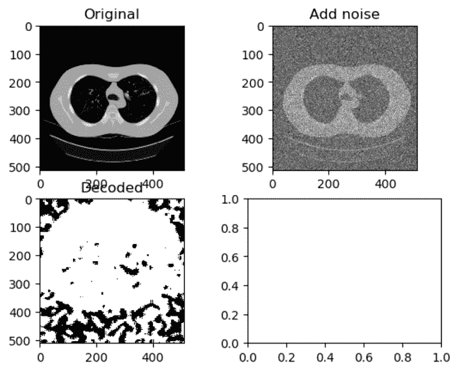

实际上，我对结果感到惊讶。我原以为解码后的图像会是一片漆黑或者全是灰度图像，然而令我惊讶的是，在解码后的图像中间几乎看不到黑点。

**培训和结果— Adam Optimizer(高学习率)**

编码器的学习率→ 0.0005
解码器的学习率→ 0.001

如上所述，当学习率被设置为高值时，解码图像看起来就像一个带有黑色随机噪声的白色圆圈。

**训练和结果— ReLU 激活功能(高学习率)**

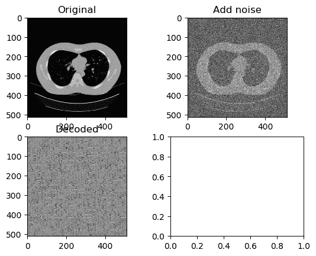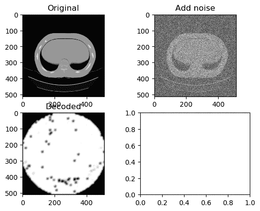

编码器学习率→ 0.000006
解码器学习率→ 0.0000006

左边的 GIF 是第一个 50 纪元，右边的 GIF 是最后的 50 纪元，所以总共 100 纪元。我们可以再次看到在解码图像的中心形成“白圈”的相同趋势。

**训练和结果— ReLu 激活功能(低学习率)**

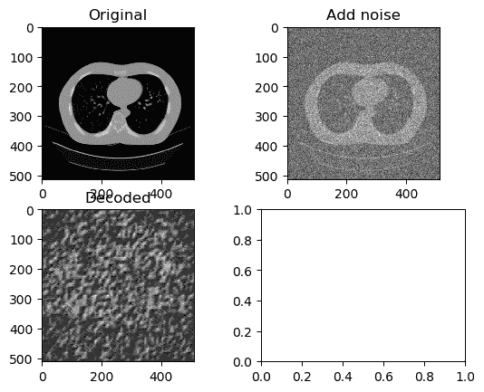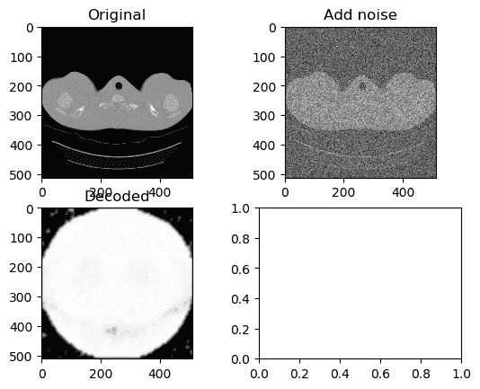

编码器的学习率→ 0.0000001
解码器的学习率→ 0.0000001

左边的 GIF 是第一个 50 纪元，右边的 GIF 是最后的 50 纪元，所以总共 100 纪元。在低学习率下，我们可以看到图像的肺部部分(左图)，但是随着学习的进行，白色圆圈再次出现。

**训练和结果——双曲正切/反正切激活函数(高 LR)**

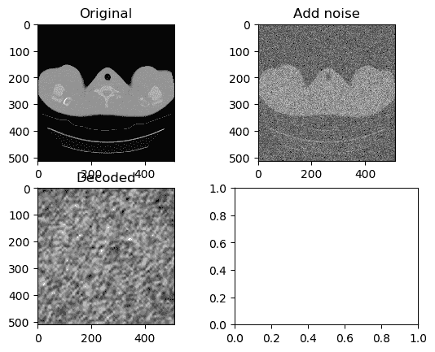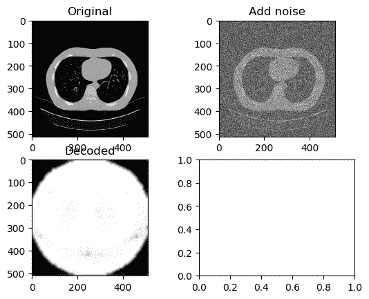

编码器的学习率→ 0.000006
解码器的学习率→ 0.0000006

左边的 GIF 是第一个 50 纪元，右边的 GIF 是最后的 50 纪元，所以总共 100 纪元。与具有高学习率的 ReLU 激活模型非常相似，但同样以白色圆圈结束。

**训练和结果——双曲正切/反正切激活功能(低 LR)**

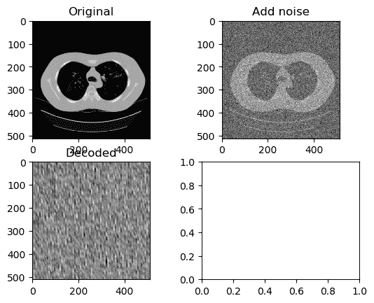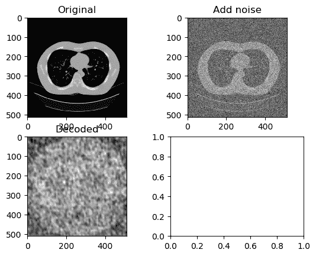

编码器学习率→ 0.0000007
解码器学习率→ 0.0000001

左边的 GIF 是第一个 50 纪元，右边的 GIF 是最后的 50 纪元，所以总共 100 纪元。因此，将学习率调整到较低是一个简单的解决方案，但是我们还不能说图像已经被成功去噪。

**一段时间内的成本**

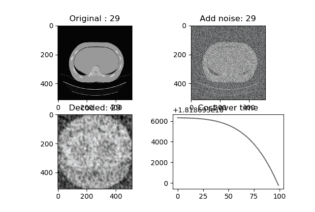

无论我选择使用 ReLU、Tanh 还是 Arctan 激活函数，成本似乎都随着时间的推移而降低，但是如果你看一下 Y 轴，它不在 0 附近，也不在产生可接受的去噪图像的范围内。

**交互代码**

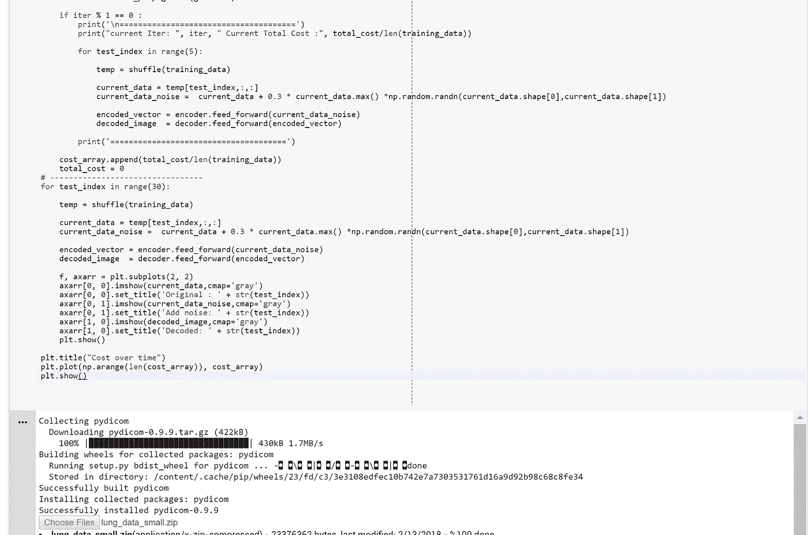

*为了交互代码，我搬到了 Google Colab！所以你需要一个谷歌帐户来查看代码，你也不能在谷歌实验室运行只读脚本，所以在你的操场上做一个副本。最后，我永远不会请求允许访问你在 Google Drive 上的文件，仅供参考。编码快乐！*

现在运行这段代码有点复杂，因为我使用了自己的数据集。不过，不要担心，我已经将我使用的所有 DICOMs 上传到我的公共 Gitlab，要访问它[请点击此链接](https://gitlab.com/jae.duk.seo/Only_Numpy/tree/master/a_CT_Lung_Auto_Encode_Series)。要访问[存储库的主页，请点击此处](https://gitlab.com/jae.duk.seo/Only_Numpy/tree/master)。现在请按照一步一步的教程。

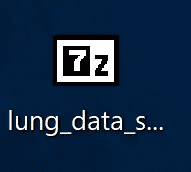

1.  从上面的链接下载“lung_data_small.zip”文件。

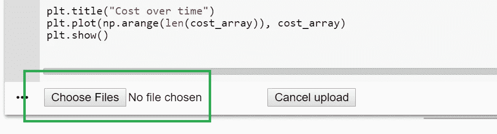

2.将 Google Colab 中的代码复制到您自己的游戏中。运行代码时，会弹出一个小按钮，如上所示。(绿色方框)。单击选择文件并选择最近下载的“lung_data_small.zip”文件。

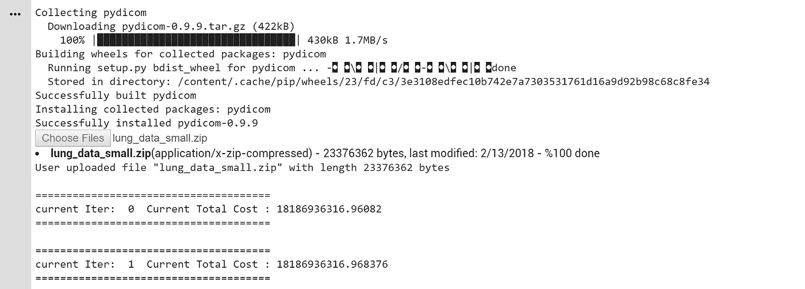

3.该计划将完成上传数据到谷歌 Colab，它将继续运行。

所以记住上面的简短教程，[请点击这里访问交互代码。](https://colab.research.google.com/drive/1mnyokgWz78hb3wjsq5GlySTNRABAjI_k)

**遗言**

我很抱歉对我自己的模特这么说。但我对这款香草款没抱太大期望。然而，我相信自动编码器是迷人的算法，我认为自动编码器有巨大的潜力。

如果发现任何错误，请发电子邮件到 jae.duk.seo@gmail.com 找我。

同时，在我的 twitter 上关注我[这里](https://twitter.com/JaeDukSeo)，访问[我的网站](https://jaedukseo.me/)，或者我的 [Youtube 频道](https://www.youtube.com/c/JaeDukSeo)了解更多内容。如果你感兴趣的话，我还做了解耦神经网络[的比较。](https://becominghuman.ai/only-numpy-implementing-and-comparing-combination-of-google-brains-decoupled-neural-interfaces-6712e758c1af)

**参考**

1.  越来越多的癌症医学图像档案。(未注明)。检索于 2018 年 2 月 12 日，来自[http://www.cancerimagingarchive.net/](http://www.cancerimagingarchive.net/)
2.  Gavrielides，Marios A，Kinnard，Lisa M，Myers，Kyle J，Peregoy，，Pritchard，William F，曾，荣平，… Petrick，Nicholas。(2015).数据来自 Phantom_FDA。癌症影像档案。[http://doi.org/10.7937/K9/TCIA.2015.ORBJKMUX](http://doi.org/10.7937/K9/TCIA.2015.ORBJKMUX)
3.  癌症影像档案维基。(未注明)。检索于 2018 年 2 月 12 日，来自[https://wiki . cancerimagingarchive . net/display/Public/Phantom](https://wiki.cancerimagingarchive.net/display/Public/Phantom)FDA # 9d 6953 e 17646457293 a 77021 aa4 CDB 37
4.  Python 中的 DICOM:用 PyDICOM 和 VTK 将医学图像数据导入 NumPy。(2014 年 10 月 25 日)。检索于 2018 年 2 月 12 日，来自[https://py science . WordPress . com/2014/09/08/DICOM-in-python-importing-medical-image-data-into-numpy-with-pydicom-and-VTK/](https://pyscience.wordpress.com/2014/09/08/dicom-in-python-importing-medical-image-data-into-numpy-with-pydicom-and-vtk/)
5.  1.(2017 年 08 月 04 日)。自动编码器——比特和字节的深度学习——走向数据科学。检索于 2018 年 2 月 12 日，来自[https://towardsdatascience . com/auto encoders-bits-and-bytes-of-deep-learning-eaba 376 f 23 ad](/autoencoders-bits-and-bytes-of-deep-learning-eaba376f23ad)
6.  如何使用 Python 并排绘制两个图？(未注明)。检索于 2018 年 2 月 12 日，来自[https://stack overflow . com/questions/42818361/how-to-make-two-plots-side-by-side-using-python](https://stackoverflow.com/questions/42818361/how-to-make-two-plots-side-by-side-using-python)
7.  numpy.repeat 的反义词是什么？(未注明)。检索于 2018 年 2 月 12 日，来自[https://stack overflow . com/questions/40617710/what-the-opposite-of-numpy-repeat](https://stackoverflow.com/questions/40617710/what-is-the-opposite-of-numpy-repeat)
8.  J.(2017 年 2 月 27 日)。JaeDukSeo/Python _ Basic _ Image _ Processing。检索于 2018 年 2 月 12 日，发自 https://github.com/JaeDukSeo/Python_Basic_Image_Processing
9.  Ruder，S. (2018 年 2 月 10 日)。梯度下降优化算法综述。检索于 2018 年 2 月 12 日，发自 http://ruder.io/optimizing-gradient-descent/index.html#adam
10.  1.(2017 年 7 月 26 日)。自动编码器在面向数据科学的深度神经网络中至关重要。2018 年 2 月 12 日检索，来自[https://towardsdatascience . com/auto encoders-is-essential-in-deep-neural-nets-f 0365 b 2 D1 d 7 c](/autoencoders-are-essential-in-deep-neural-nets-f0365b2d1d7c)
11.  张，r .，伊索拉，p .，埃夫罗斯，A. A .，谢赫曼，e .，，王，O. (2018)。深度特征作为感知度量的不合理有效性。 *arXiv 预印本 arXiv:1801.03924* 。