# Only Numpy: NIPS 2017 -用交互式代码实现扩张型递归神经网络。

> 原文：<https://towardsdatascience.com/only-numpy-nips-2017-implementing-dilated-recurrent-neural-networks-with-interactive-code-e83abe8c9b27?source=collection_archive---------4----------------------->

Image [from Pixel Bay](https://pixabay.com/en/kitty-cat-kitten-pet-animal-cute-551554/)

所以我在浏览 2017 年的 [NIPS，出版页面时发现了这篇论文，](https://papers.nips.cc/book/advances-in-neural-information-processing-systems-30-2017?utm_campaign=Revue%20newsletter&utm_medium=Newsletter&utm_source=Deep%20Learning%20Weekly) [IBM 沃森研究中心](http://www.research.ibm.com/labs/watson/index.shtml)的[扩张的递归神经网络](https://papers.nips.cc/paper/6613-dilated-recurrent-neural-networks)。所以试图实现它，并用它来对 MNIST 数字进行分类。

**网络架构(数学方程式形式/图形形式 2D)**

Image from [Original Paper](https://arxiv.org/abs/1710.02224)

现在这个方程在数学方程的形式上有点复杂，难以理解。所以论文的作者给我们提供了一些图表。

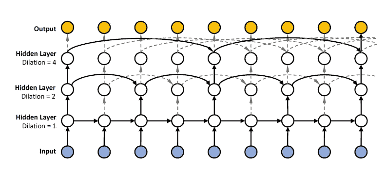

如上所述，这是典型的 RNN，但有多个层以及跳过连接。

**网络架构(图形形式 3D / OOP 形式)**

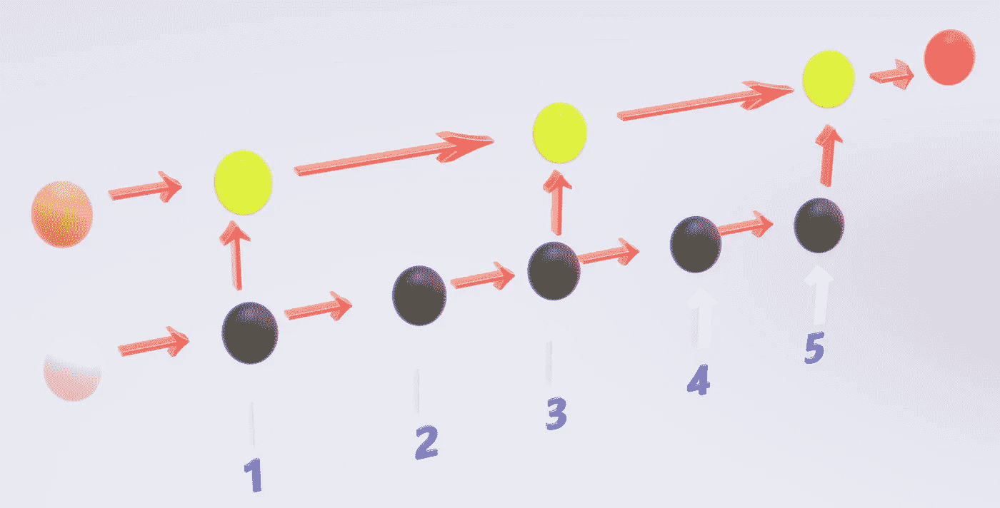

Side view

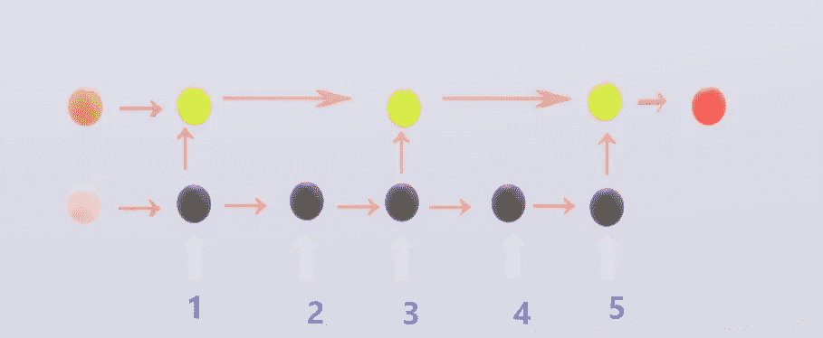

Front View

**红圈** →网络的最终输出，预测数的一个热编码的(1*10)向量

**棕色圆圈** →第 2 层隐藏状态 0
**石灰圆圈** →第 2 层隐藏状态

**粉色圆圈**→1 层隐藏状态 0
**黑色圆圈**→1 层隐藏状态

**蓝色数字 1、2、3、4、5** →每个时间戳的输入(请*记下这一点*，因为我将使用这些知识来解释训练/测试数据)

以上是我们要建立的网络，第一层是标准的 RNN，没什么特别的，然而第二层有点不同，它有间隔为 2 的跳跃连接。

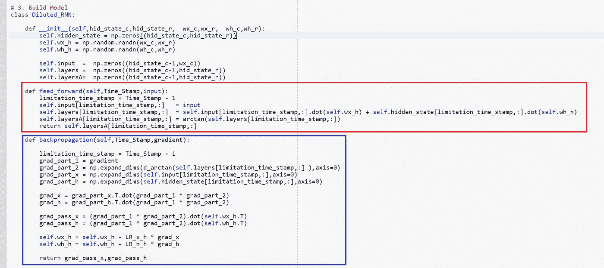

以上是面向对象的网络形式，正如我们所看到的，我们只有一个简单的前馈函数和一个标准的反向传播函数。

**训练数据/测试数据**

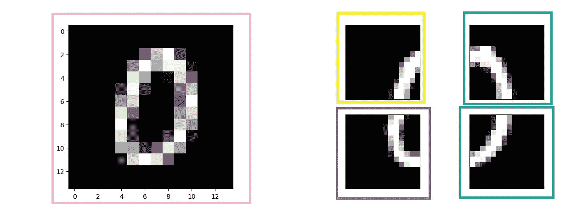

**粉色框** →时间戳 1 处输入(矢量化 14*14 像素图像)
**黄色框** →时间戳 2 处输入(矢量化 14*14 像素图像)
**蓝色框** →时间戳 3 处输入(矢量化 14*14 像素图像)
**紫色框** →时间戳 4 处输入(矢量化 14*14 像素图像)
**绿色框**

这就是我所做的，我取原始图像(28*28)，用(2*2)矩阵进行均值合并，得到(14*14)的图像。我们将用它作为时间戳 1 的输入。对于其他时间戳的输入，我们将把原始(28*28)图像切割成 4 个部分，并将其提供给网络。下面是实现这一点的代码。

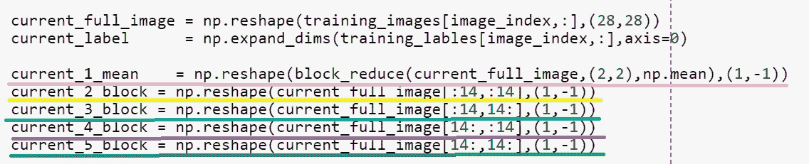

记住这一点，让我们看看其他的训练数据。最后，我这样做的原因，简单来说，我想 LOL。

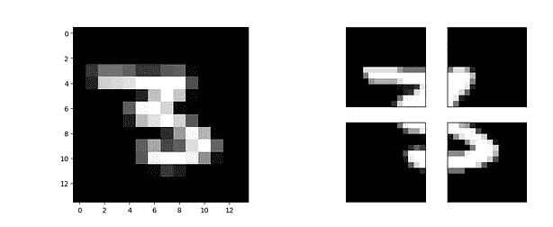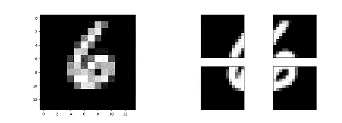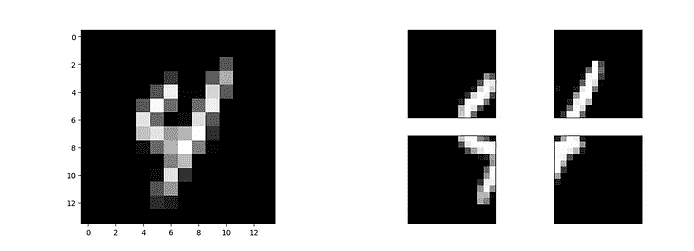

Image of 3 6 4 in the respective order

**训练和结果**

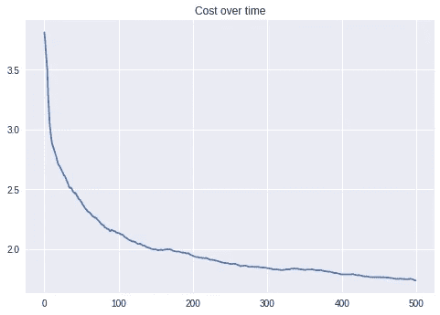

看一下成本随时间变化的图表，我们可以看到，网络从 4.0 区域开始，并且能够将成本降低到 1.7。

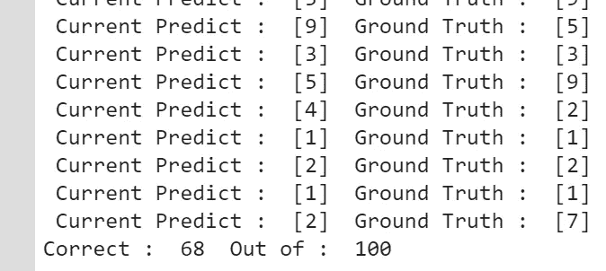

然而，准确预测的数量只有 68/100，给了我们 68%的准确率。我认为把图片分成 4 部分是个坏主意，哈哈。

**互动码**

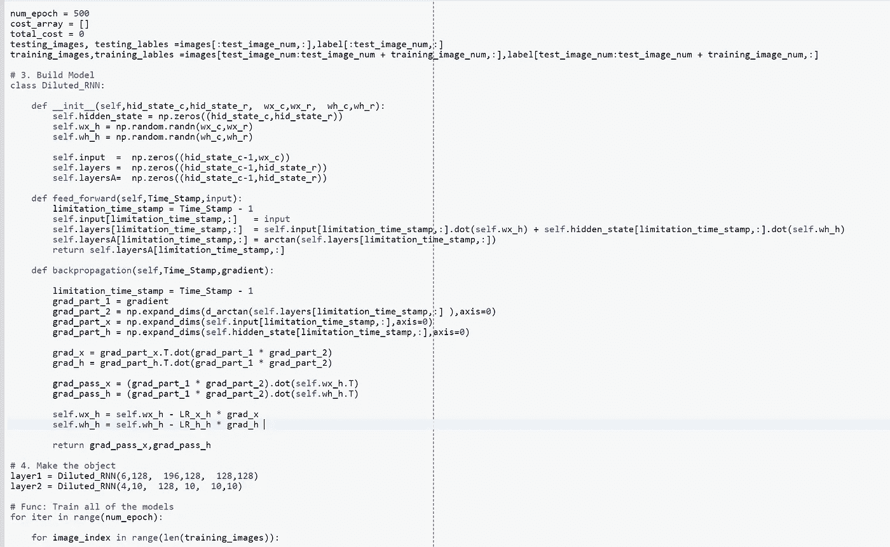

*我搬到了谷歌 Colab 寻找交互代码！所以你需要一个谷歌帐户来查看代码，你也不能在谷歌实验室运行只读脚本，所以在你的操场上做一个副本。最后，我永远不会请求允许访问你在 Google Drive 上的文件，仅供参考。编码快乐！*

请点击此处[访问互动代码。](https://colab.research.google.com/drive/1idn_OTUl45TZ1gaxn0ZcRoET_v3dmP1e)

**遗言**

我实际上有更多的计划在不同的实验中使用这个网络架构，所以如果你想得到:D 的通知，请确保在推特上关注我

如果发现任何错误，请发电子邮件到 jae.duk.seo@gmail.com 给我，如果你想看我所有写作的列表，请[在这里查看我的网站](https://jaedukseo.me/)。

与此同时，请在我的 twitter [这里](https://twitter.com/JaeDukSeo)关注我，并访问[我的网站](https://jaedukseo.me/)，或我的 [Youtube 频道](https://www.youtube.com/c/JaeDukSeo)了解更多内容。如果你感兴趣，我也在这里做了解耦神经网络[的比较。](https://becominghuman.ai/only-numpy-implementing-and-comparing-combination-of-google-brains-decoupled-neural-interfaces-6712e758c1af)

**参考文献**

1.  常，张，杨，韩，魏，余，米，郭，陈，谭，黄，黄铁生(2017)。扩张的循环神经网络。神经信息处理系统的进展。
2.  [1]2018.【在线】。可用:[https://www . quora . com/What-the-benefit-of-use-average-pooling-而非-max-pooling。](https://www.quora.com/What-is-the-benefit-of-using-average-pooling-rather-than-max-pooling.)【访问时间:2018 年 2 月 7 日】。
3.  [3]S. Chang，Y. Zhang，W. Han，M. Yu，X. Guo，W. Tan，X. Cui，M. Witbrock，M. Hasegawa-Johnson 和 T. Huang，“扩张型递归神经网络”， *Papers.nips.cc* ，2018 .【在线】。可用:[https://papers . nips . cc/paper/6613-expanded-recurrent-neural-networks。](https://papers.nips.cc/paper/6613-dilated-recurrent-neural-networks.)【访问时间:2018 年 2 月 14 日】。
4.  IBM 托马斯·J·沃森研究中心。(未注明)。检索于 2018 年 2 月 14 日，来自[http://www.research.ibm.com/labs/watson/index.shtml](http://www.research.ibm.com/labs/watson/index.shtml)