# 只有 Numpy:理解反向传播的转置卷积多层 CNN 的例子和互动代码。

> 原文：<https://towardsdatascience.com/only-numpy-understanding-back-propagation-for-transpose-convolution-in-multi-layer-cnn-with-c0a07d191981?source=collection_archive---------1----------------------->

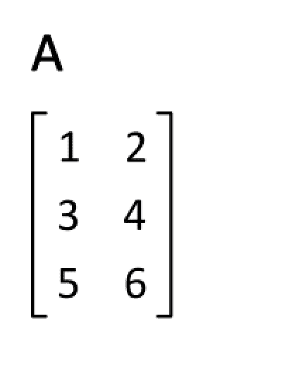

Gif from this [website](https://giphy.com/gifs/math-35v2AuS45pUre/download)

所以在过去的两天里，我很难理解转置卷积运算。但我终于明白了，今天，我们将训练一个简单的 CNN，它有两个卷积层，如下所示。

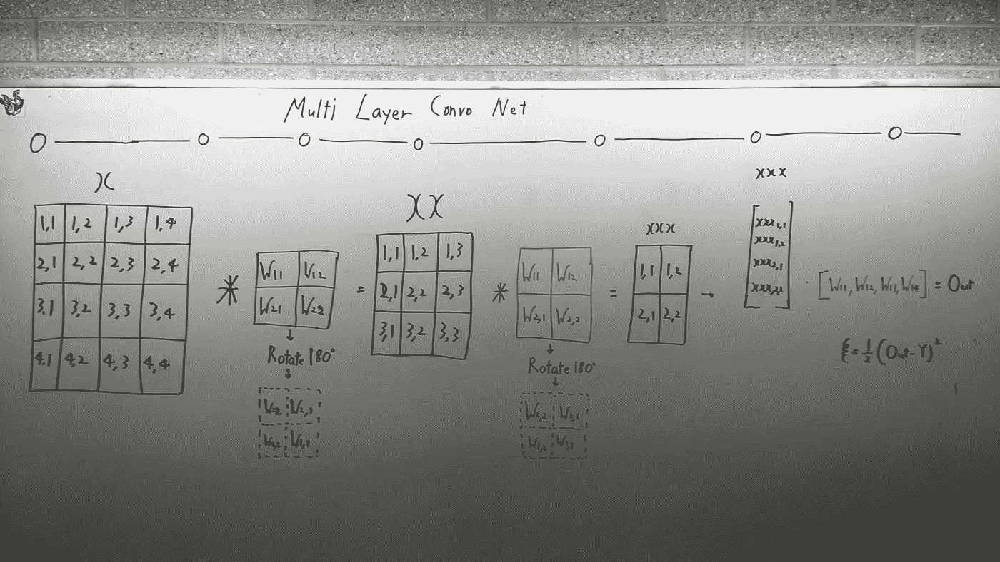

Very Simple CNN Arch.

**我从哪里得到答案的有趣故事。**

昨天，我被邀请参加一个聚会的晚宴。原因是一个非常博学的硕士生成功地完成了她的答辩，所以我们在庆祝。然而，在过去的两天里，我无法完全理解 CNN 的整个反向传播过程。
当我试图在卷积层的最外层执行反向传播时，我碰了壁。

但在那次晚宴上，我终于明白了。

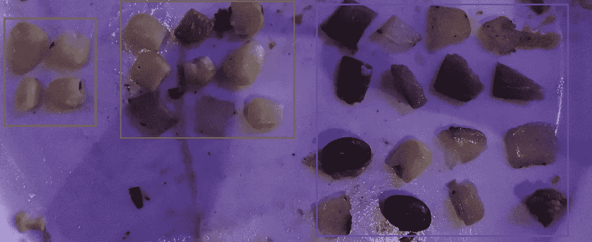

看着我盘子里的鸡眼，我意识到，一直以来，我都在试图将 CNN 中的反向传播过程理解为反卷积。这是我最初的想法。

设红框为 2*2 输出图像
设绿框为 3*3 内核
设蓝框为 4*4 输入图像

由于我们在对 4×4 图像执行卷积之后获得 2×2 输出图像，因此，在执行反向传播时，我们**需要对 2×2 输出图像执行一些操作，以获得具有 4×4 维度的一些图像。**”

但是鸡眼(LOL)让我意识到我们的目标不是恢复原来的形象。相反，我们试图得到网络中每个权重的错误率。在多层 CNN 的情况下，我们需要反向传播该误差。所以哈哈，这就是我的解决方案，让我用一个具体的例子和代码来解释我的意思。

**网络架构**

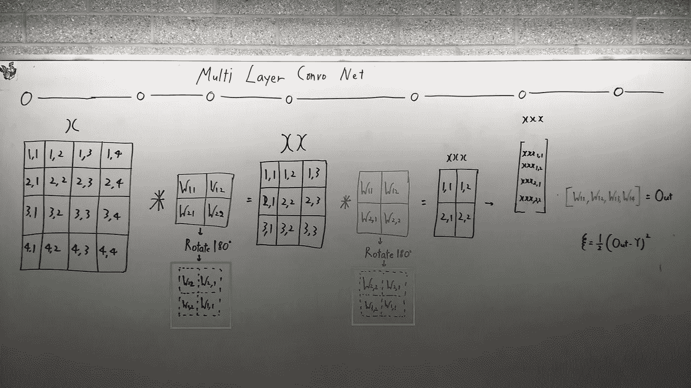

如上所见，网络拱非常简单，只是两层卷积和一层全连通层。请注意，在执行卷积时，我们需要将内核转置(旋转)180 度，所以请注意上面照片中的绿色方框。

***还有，请注意，为了简单起见，我没有画激活层。但是在交互代码中，我用的不是 tanh()就是 archtan()*** 。

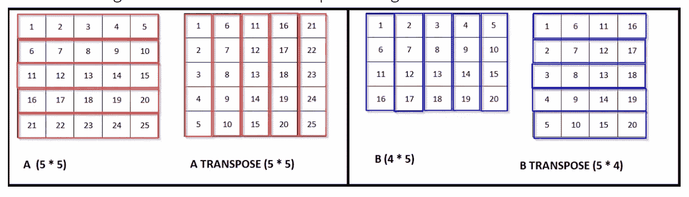

image [from techieme](http://techieme.in/matrix-rotation/)

如果你不确定矩阵旋转，[请阅读本文](http://techieme.in/matrix-rotation/)。

**正向进给**操作**操作**

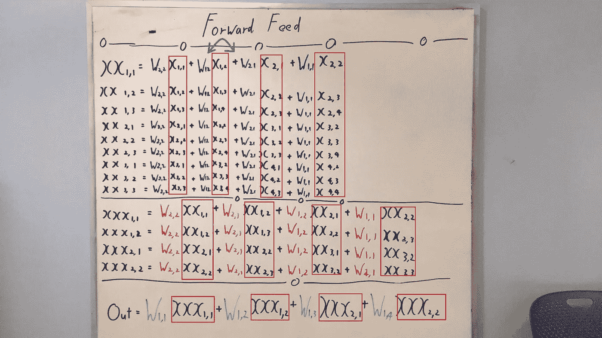

> **更新**我在列上犯了一个错误，绿色箭头所指的两列必须对调。谢谢亚伯拉罕·坎指出。

所以如上所见，卷积运算可以写成一行。出于我稍后将解释的原因，请仔细记下红框变量，它们基本上是下一层的输入。但是在执行反向传播时，这些信息变得至关重要。

**相对于绿色权重的反向传播**

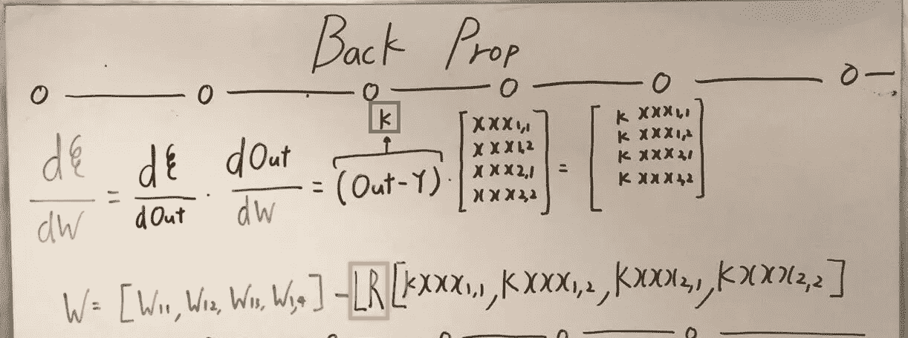

黄色方框表示学习率，同样，整个反向传播是一个标准过程。我也写下了梯度更新方程。最后，请注意红色方框中的符号“k ”,我会反复使用这个符号来表示(Out — Y)。

**相对于红色权重的反向传播**

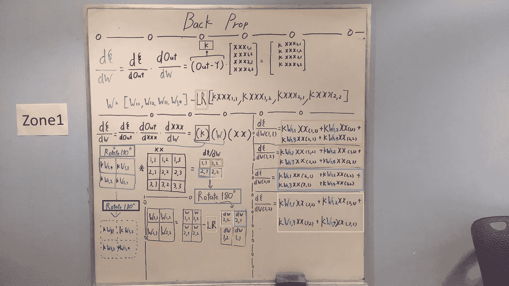

红框→ (Out — Y)
黄框→学习率
黑框→卷积运算前旋转核 180 度(或转置)——*还记得在卷积运算中我们旋转核吗？*

一切都非常简单明了，除了紫色的盒子，那是什么？

**紫色框→旋转矩阵以拟合计算每个权重的导数。**

现在的问题是，为什么？我们为什么要这样做？

记得我告诉过你们要注意每一层的输入吗？让我们再来一次。

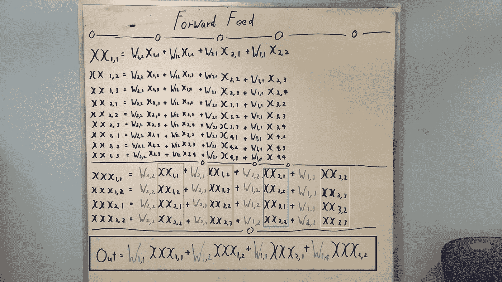

请仔细看看这些彩色的盒子。

**橙色框** →正在乘以红色 W(2，2)的输入
**浅绿色框** →正在乘以红色 W(2，1)的输入
**蓝色框** →正在乘以红色 W(1，2)的输入
**粉色框** →正在乘以红色 W(1，1)的输入

很好，这很简单，但是这和转置内核有什么关系呢？好吧，让我们这样做，因为(请看黑框等式)Out 可以写成一行，让我们对红色权重求导，如下所示。

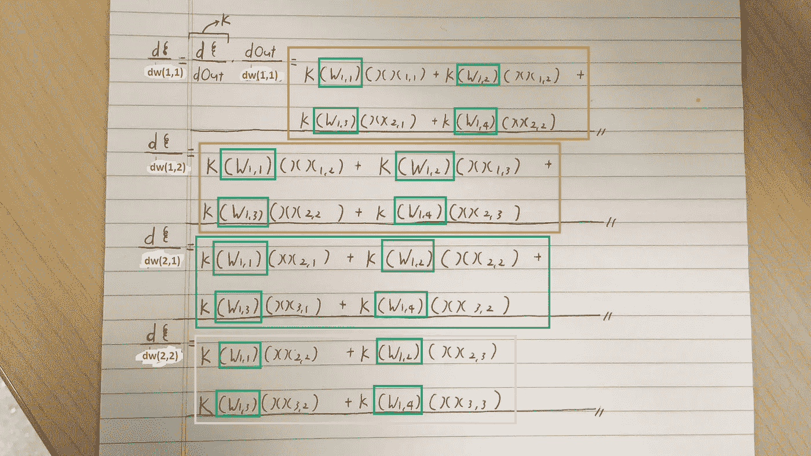

> **更新* * 4 月 8 日—感谢[大宇](https://medium.com/@ak16?source=responses---------1----------------)和亚伯拉罕·康指出错误，坐标上有个小错误。

深绿色方框数字→对不起，我没有绿色的笔，但它们代表绿色的砝码**。**

如图所示，当对每个红色权重进行求导时，我们可以看到 XX 坐标因输入而异。我们需要根据每个权重来匹配这些坐标，这就是我们将矩阵旋转(转置)180 度的原因。

**关于蓝色重量部分 1 的反向传播**

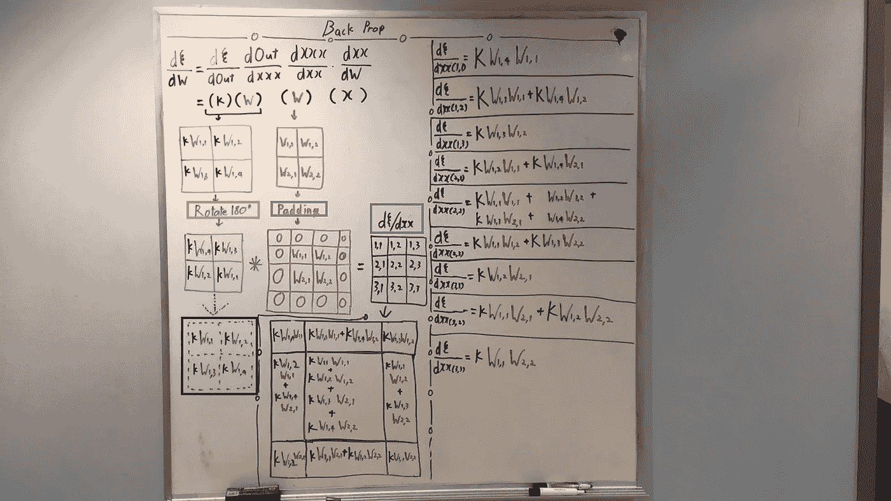

**蓝框** →计算(K *绿色权重)和(填充的红色权重)之间的卷积
**橙色框** →再次旋转矩阵以获得每个权重的导数。
**黑盒** →同样的故事，卷积运算前旋转内核。

现在，问题来了，为什么要填充(紫色方框)？为什么我们需要垫红色的砝码？

好问题，我一会儿会解释，但是现在请继续读下去。

**关于蓝色重量部分 2 的反向传播**

**蓝框** →第 1 部分的计算矩阵。
**黑盒** →卷积运算前转置内核。
**橙色、浅绿色、蓝色、粉色方框** →计算每个蓝色权重的每个导数。

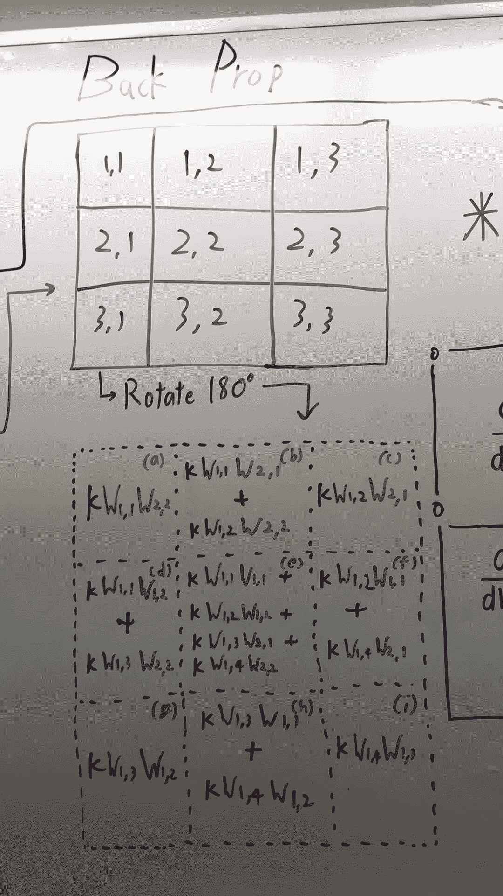

Close look of the Rotated Kernel

上图是在执行卷积运算时，对旋转后的内核的近距离观察。但是现在让我们再看一下输入。

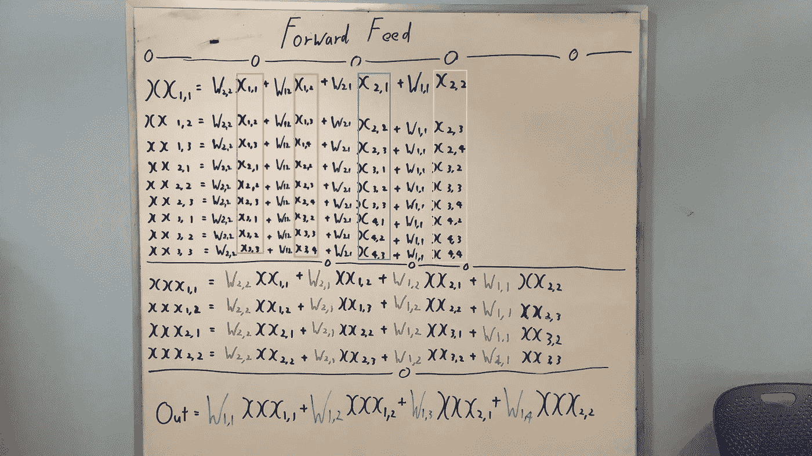

再说一次，因为 Out 可以写成一行，让我们对蓝色权重求导，如下所示。

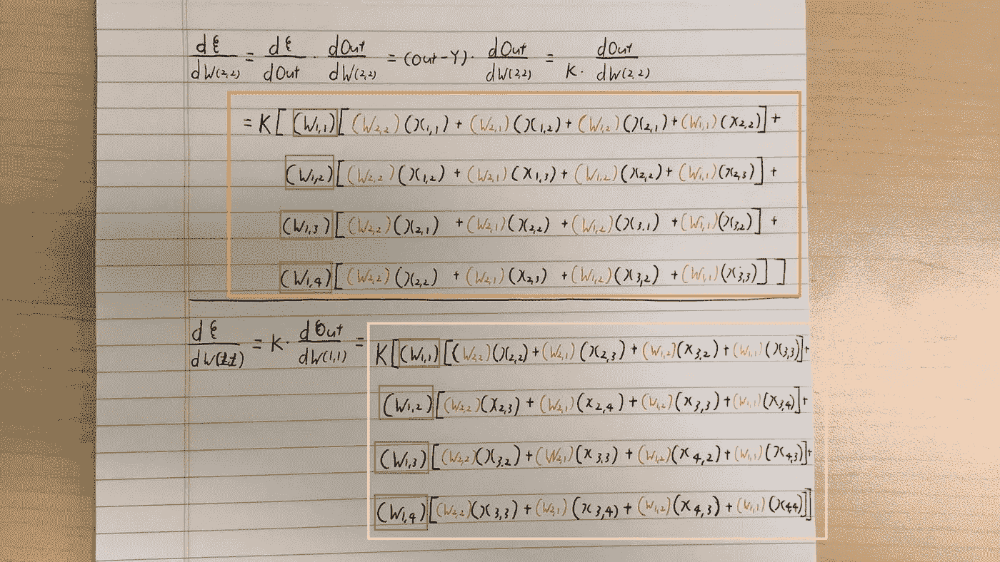

**绿色框号** →再次抱歉没有绿色笔
**橙色框** →相对于蓝色权重(2，2)计算的渐变
**粉色框** →相对于蓝色权重(1，1)计算的渐变

因此，我们再次旋转(或转置)矩阵，以匹配每个权重的梯度。

另外，现在我们填充红色重量的原因很清楚了，这是为了得到每个重量的梯度，我将再次向你们展示我所说的填充红色重量的意思。(请看紫色的星星)

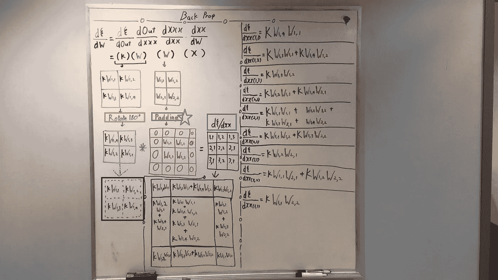

**交互式代码激活功能**

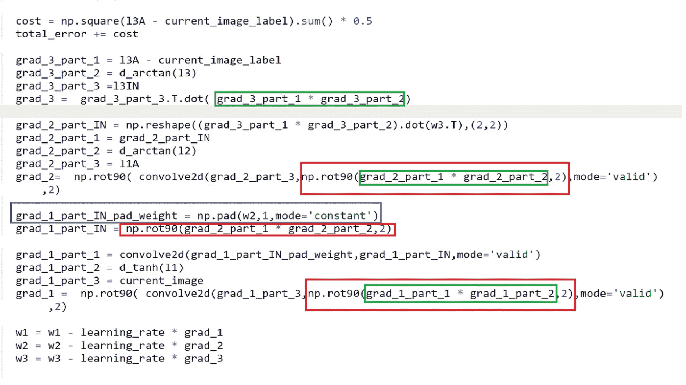

**绿框** →激活函数的导数，因为它们具有相同的维数，我们可以只执行元素乘法

**红框** →旋转内核匹配渐变

**蓝色方框** →用零填充红色砝码(名为 W2)

**交互代码**

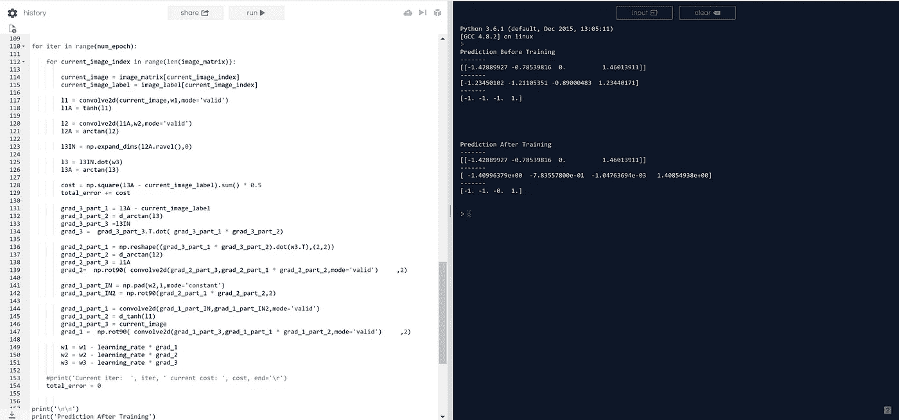

请[点击此处访问互动代码。](https://repl.it/@Jae_DukDuk/transpose-conv)

## 最后的话

在 CNN 中理解反向传播是非常令人满意的，我两天来一直在努力理解这个概念。如果没有被邀请参加毕业晚宴，我是不可能做到这一点的，谢谢你，莎拉！

如果发现任何错误，请发电子邮件到 jae.duk.seo@gmail.com 找我。

同时，在我的 twitter [这里](https://twitter.com/JaeDukSeo)关注我，并访问[我的网站](https://jaedukseo.me/)，或我的 [Youtube 频道](https://www.youtube.com/c/JaeDukSeo)了解更多内容。如果你感兴趣，我还在这里做了解耦神经网络[的比较。](https://becominghuman.ai/only-numpy-implementing-and-comparing-combination-of-google-brains-decoupled-neural-interfaces-6712e758c1af)

**参考**

1.  D.(2015 年 10 月 25 日)。矩阵旋转和矩阵转置。检索于 2018 年 1 月 28 日，发自[http://techieme.in/matrix-rotation/](http://techieme.in/matrix-rotation/)
2.  什么是反进化层？(未注明)。检索于 2018 年 1 月 28 日，来自[https://data science . stack exchange . com/questions/6107/what-is-de convolution-layers](https://datascience.stackexchange.com/questions/6107/what-are-deconvolutional-layers)
3.  [http://courses . cs . tau . AC . il/Caffe _ workshop/boot camp/pdf _ lectures/lectures % 203% 20 CNN % 20-% 20 back propagation . pdf](http://courses.cs.tau.ac.il/Caffe_workshop/Bootcamp/pdf_lectures/Lecture%203%20CNN%20-%20backpropagation.pdf)
4.  Dumoulin 和 f . Visin(2016 年)。深度学习卷积算法指南。 *arXiv 预印本 arXiv:1603.07285* 。
5.  [https://www . cc . gatech . edu/classes/ay 2018/cs 7643 _ fall/slides/L7 _ CNNs _ annotated . pdf](https://www.cc.gatech.edu/classes/AY2018/cs7643_fall/slides/L7_cnns_annotated.pdf)

## 这篇文章发表在 [The Startup](https://medium.com/swlh) 上，这是 Medium 最大的创业刊物，拥有 295，232+人关注。

## 在此订阅接收[我们的头条新闻](http://growthsupply.com/the-startup-newsletter/)。

