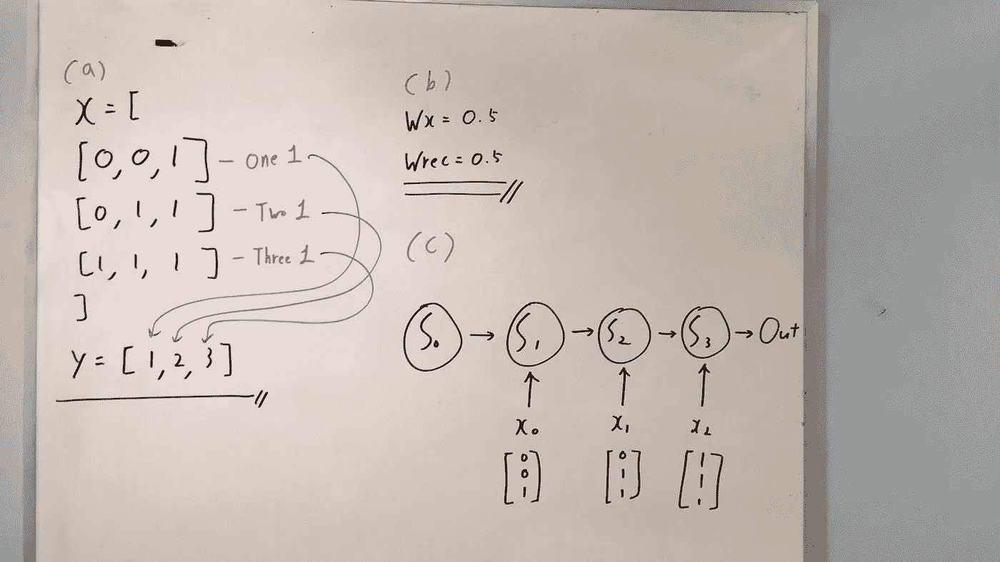
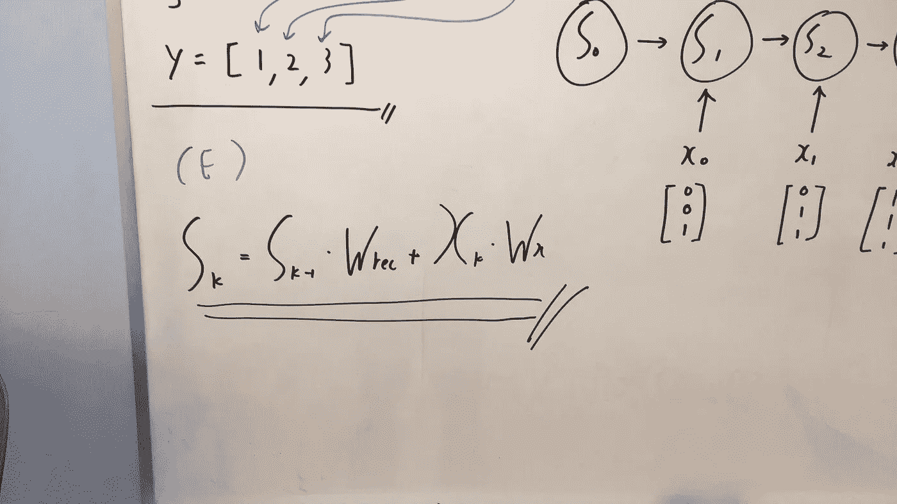
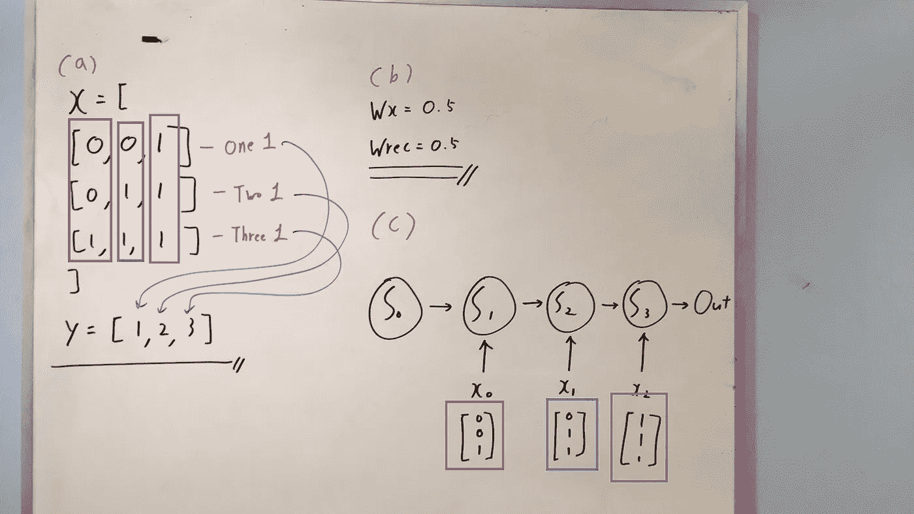
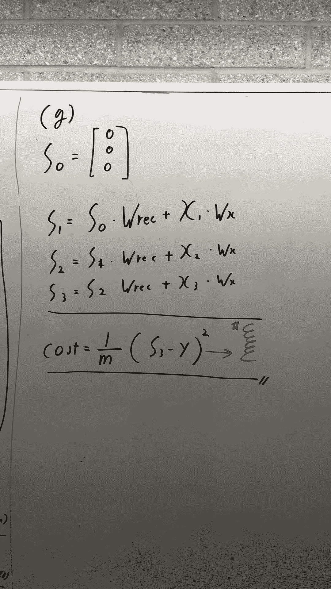
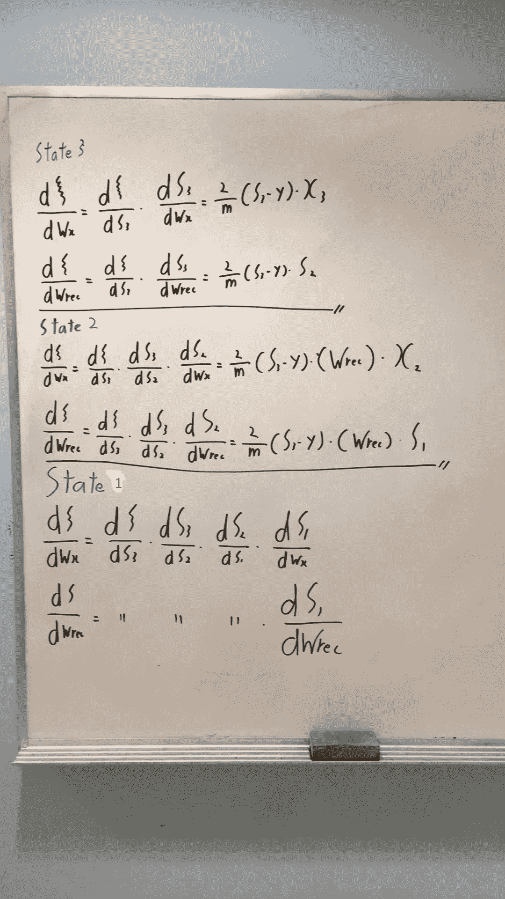
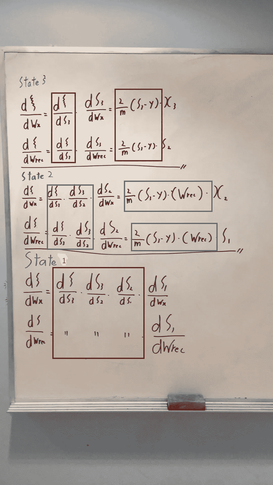
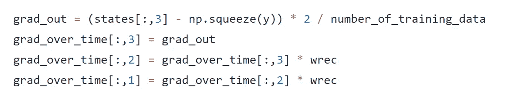

# Only Numpy:通过时间实践推导反向传播的普通递归神经网络—第 1/2 部分

> 原文：<https://towardsdatascience.com/only-numpy-vanilla-recurrent-neural-network-back-propagation-practice-math-956fbea32704?source=collection_archive---------3----------------------->

这是我在 Medium 发表的第一篇正式的教育文章，我不得不说 Medium 是一个非常棒的博客平台。不管怎样，我们开始吧。问题很简单，我们将使用 RNN 来计算给定数据中有多少个 1。如果你只是想要视频教程和代码，请点击下面的链接。

Github 链接:[https://github . com/JaeDukSeo/Only _ Numpy _ Basic/blob/master/rnn/a _ rnn _ simple . py](https://github.com/JaeDukSeo/Only_Numpy_Basic/blob/master/rnn/a_rnn_simple.py)

如上文(a)所示，训练数据是 X，测试数据是 Y(地面实况)。(b)我们将只有两个权重，Wx(其中我们将乘以输入 x)和 Wrec(其中我们将乘以先前的状态)

理解(c)非常重要，因为我们的网络架构是我们网络架构的展开版本。然而，它清楚地显示了状态 0(表示为 S0)与状态 1(表示为 S1)具有某种关系。那关系如下图！

在(E)下，我们可以看到一个等式，它阐明了状态之间的关系。

当前状态 K =先前状态 K * Wrec +当前输入 X * Wx

这条数学线是状态 0 和状态 1 之间的关系。但是每个州下面的数字呢？很简单，这些是每个状态的输入，所以在状态 1，输入 x 是一个向量[0，0，1]。

Same Color Box indicate inputs at each state

你可能会问，**状态 0 呢？**大问题他们**全是零！**

所以让我们用数学来弄脏——前馈。

就是这样！我们完成了前馈传播。另外，还有一点需要注意的是，我们将使用 MSE 作为成本函数，从现在开始，我们将只使用星号旁边的符号来表示成本函数。(抱歉我不是数学专业的，我不知道那个符号叫什么。)

现在让我们通过时间执行反向传播。我们必须对每个状态的 Wx 和 Wrec 求导。而这正是我们下面所做的！

原来如此！训练 RNN 背后的简单数学。但是，尽量自己填状态 1。但是有一个有趣的事实需要注意，当得到 Wx 和 Wrec 的导数时，有很多数学符号会随着时间的推移而重复出现，请看下图。

在矩阵中得到那些重复的值，并在以后通过乘以适当的 X 或 State 来使用它们，这在计算上会更有效。这正是我在视频教程中所做的！

Calculate the repeating terms

另一个需要注意的重要事情是，当我们得到导数时，我们要乘以 Wrec 的倍数，换句话说，变量起着关键作用！(我不打算进一步解释，但这个话题很重要！)

最后，让我们通过随机梯度下降来执行权重更新。

在右上角，我们相应地将各项相加，并执行 SGD。

**更新！下面是第二部分:** [**链接**](http://Only Numpy: Vanilla Recurrent Neural Network Deriving Back propagation Through Time Practice — part 1/2)

最后提醒一下，我用了很多彼得的素材！请点击下面的链接查看这个令人惊奇的教程！这是我的第一篇帖子，我仍在学习如何制作优秀的教程，任何反馈都将是有益的！
【请客气:’(]谢谢！

 [## 彼得的笔记

### 关于人工智能、机器学习、神经网络的笔记和代码样本

peterroelants.github.io](http://peterroelants.github.io/posts/rnn_implementation_part01/#Updating-the-parameters) 

更多教程请查看我的网站和我的 Youtube 频道！

网址:[https://jaedukseo.me/](https://jaedukseo.me/)

YouTube 频道:[https://www.youtube.com/c/JaeDukSeo](https://www.youtube.com/c/JaeDukSeo)

 [## 宰德徐- DJ 徐

### 嗨，我叫 Jae，我爱机器学习，请进来看看吧！数据科学家 Jae 的个人网站…

jaedukseo.me](https://jaedukseo.me/)  [## 宰德徐

### 你好！我叫 Jae，这是我的 youtube 频道。我喜欢狗和人工智能，医疗保健和区块链…

www.youtube.com](https://www.youtube.com/channel/UCf5jue1EwgWrYw9bjTynV4g/featured?view_as=subscriber)