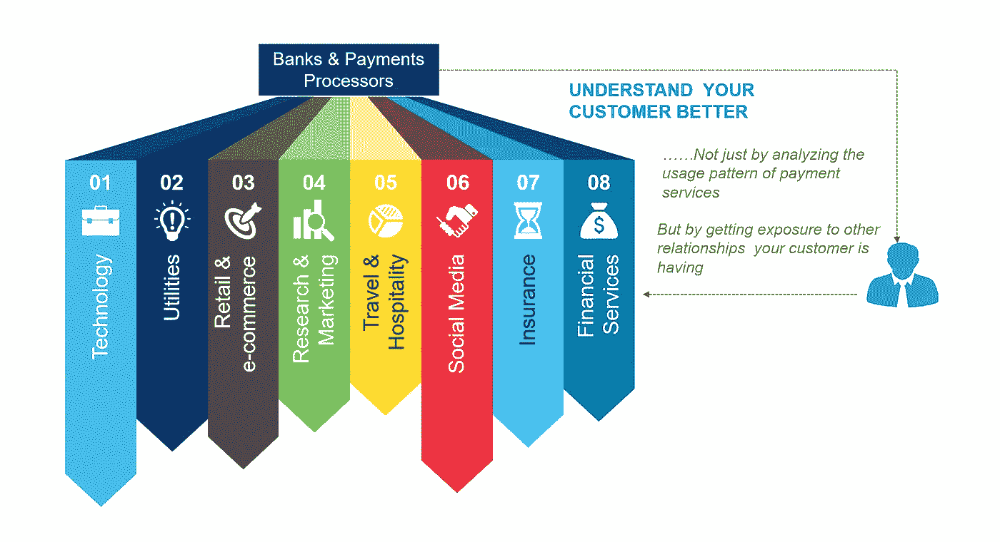
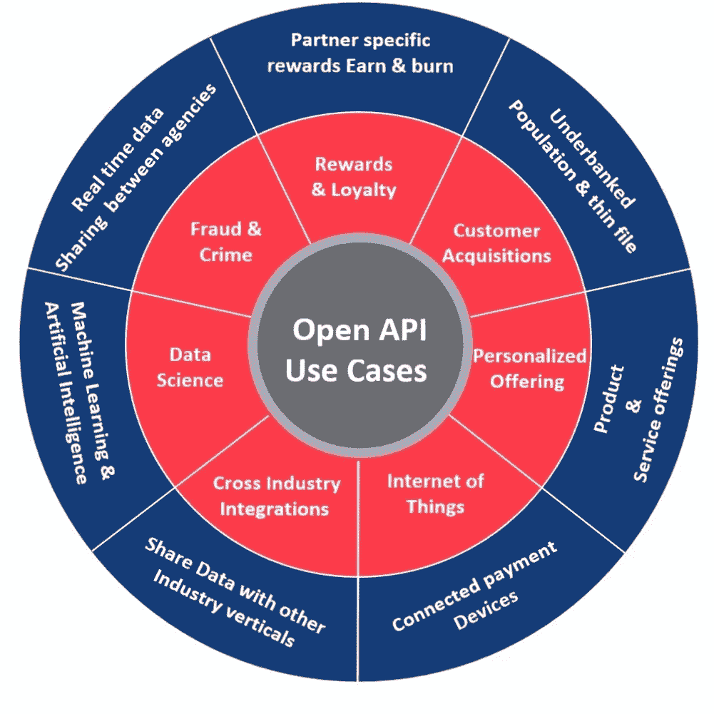
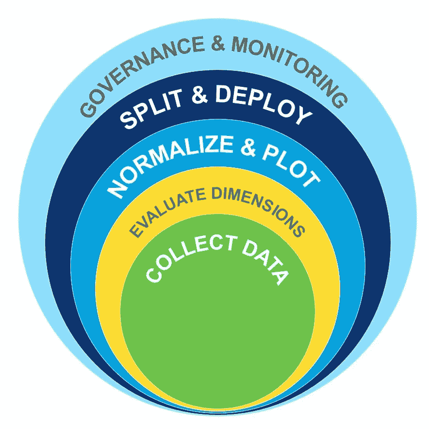
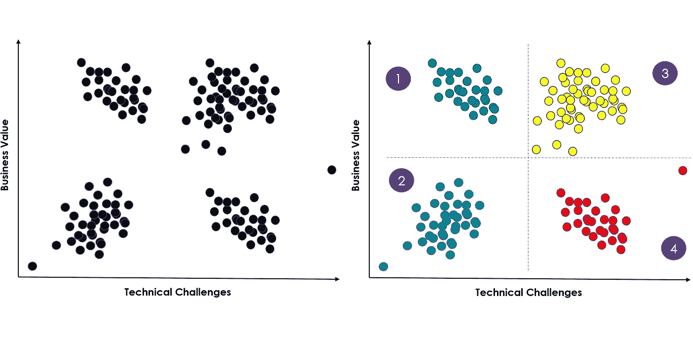

# 开放 API 塑造支付格局，创造大规模互联 API 经济

> 原文：<https://towardsdatascience.com/open-apis-shaping-payments-landscape-and-creating-a-massive-connected-api-economy-dddff1eac732?source=collection_archive---------9----------------------->

Source : Pixabay

应用编程接口或 API 指的是软件应用的各种组件之间或不同软件应用本身之间的一组通信方法。它们在转变组织内各种系统之间、金融行业参与者之间以及金融机构和其他行业(如电信、旅游等)之间的交互方面发挥着重要作用。

传统上，支付行业不仅对产品和服务的端到端交付，而且对用户体验都实施了严格的控制。互联网、智能手机和平板电脑的激增，加上向第三方支付提供商和金融科技公司开放市场以参与支付领域的监管压力，威胁到了传统的银行方法，迫使银行灵活地参与到动态的金融科技生态系统中。这种参与的关键促成因素是“开放 API”。

Image 1 — Banks can leverage multiple human touch-points

开放 API 战略是这种转变的核心，它使银行能够在数字革命中扮演更积极的角色，而不是一个边缘实体。

下图描述了一些用例，这些用例通过采用与传统银行相关的开放 API，帮助下一代支付公司颠覆了支付世界。

Image 2 — Open API Use Cases for Banks and Payment Providers

## **银行面临的挑战&支付提供商**

大多数银行都处于 API 之旅的某个阶段。银行的 API 之旅放缓主要是因为主要业务利益相关者之间缺乏清晰的理解以及一些技术挑战。

银行正在努力确定可以利用开放 API 的正确业务功能和用例。大多数银行业专业人士对安全性都很偏执，而“开放”这个词立刻让银行家们担心 API 不安全，容易被黑客攻击，尽管他们的大多数担心都是毫无根据的。他们对与合作伙伴共享信息和数据以提供更好的客户体验持怀疑态度。消费者-生产者 API 经济中的这种文化不匹配导致缺乏来自各种利益相关者的承诺和支持

大多数核心银行系统都建立在几十年前的遗留基础设施上，这些基础设施在过去运行得非常好，但是它们与下一代技术的集成需要大量的资源带宽。任何实现传统现代化的努力都伴随着战略和技术挑战，这些挑战可能会给银行的运营和品牌声誉带来严重风险。

与部署在云上的 API 相关的安全性和故障转移机制仍然处于发展阶段，尽管它们在过去几年中已经走过了漫长的道路。2017 年 2 月 AWS S3 停机提醒银行，在 API 和云上有太多事情可能会出错，从而严重影响客户体验。

**数据驱动方法&开放 API 采用框架**

我们的观点是，银行和支付服务提供商应该对开放 API 采取“平衡”的采用方式。也不应该是盲目试验各种不相关用例的下意识反应，也不应该是“等待和观察”的选项。我们建议一个系统的数据驱动框架来评估和部署用例，该框架有三个基本支柱——部署框架、API 治理和价值实现&部署后监控。

Image 2 — Deployment Fraemwork

**部署框架**

***收集数据****——*开始识别所有可能成为开放 API 候选者的业务用例。

***评估维度*** *—* 可以在两个维度上进行评估—业务价值和技术挑战

有序数据点可以被分配给三个领域的业务价值

客户体验

收入潜力

费用

同样，有序数据点也可以被分配用于跨领域的技术挑战

整合挑战

部署挑战

技能可用性

***规格化&绘图*** *—* 所有维度的数据都需要规格化，以便于绘制分析。然后可以将标准化数据绘制成二维图。

***分割&部署*** *—* 一旦我们有了绘制的数据，我们就可以开始将该区域分割成 4 个逻辑分区，这将有效地成为开放 API 的不同部署阶段。

Image 4 — Group Use Cases based on defined metrics and framework

**API 治理**

规划一个 API 治理流程，该流程定义了合作伙伴的入门要求、费率，并定义了确定是构建还是集成的标准。

创建一个利益相关者参与的持续反馈循环

创造一种协作文化，让人们讨论和解决集成问题。

**价值实现和监控**

企业必须持续监控已部署的 API 所产生的价值。因为维护这样的 API 的成本和风险超过了它的好处，所以淘汰不创造价值的 API 是合适的。

*感谢阅读——如果你觉得这篇文章有趣并想保持联系，你可以在 Twitter 上找到我* [*这里*](https://twitter.com/awhanmohanty) *或*[*Linkedin*](https://www.linkedin.com/in/awhanmohanty/)

原文来源:[*https://www . wipro . com/banking/open-APIs-shaping-payments-landscape-and-creating-a-massive-connected-API-economy/*](https://www.wipro.com/banking/open-apis-shaping-payments-landscape-and-creating-a-massive-connected-api-economy/)