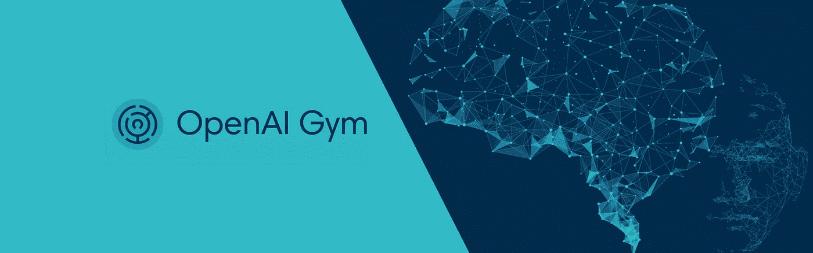
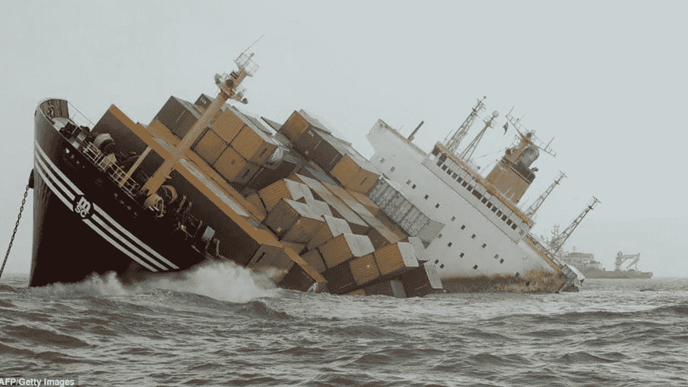
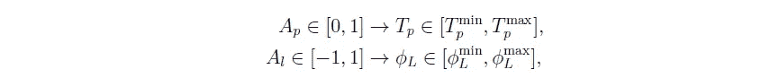
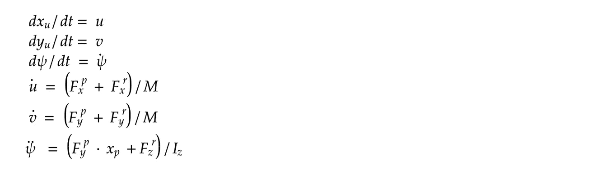
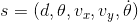
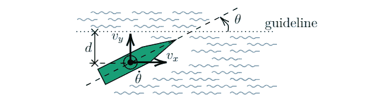
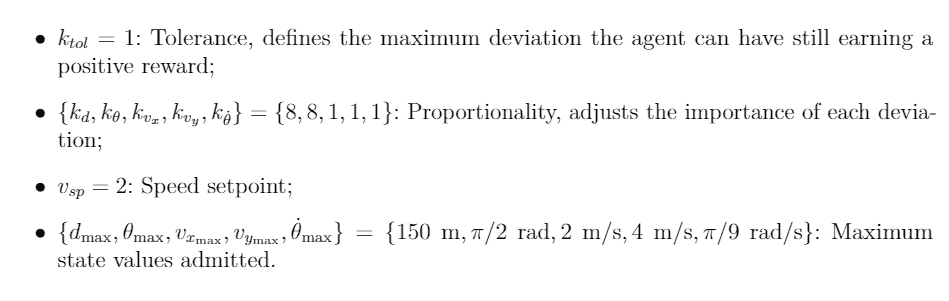
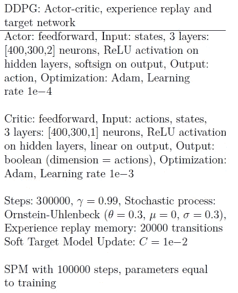

# 从零开始开放健身房

> 原文：<https://towardsdatascience.com/openai-gym-from-scratch-619e39af121f?source=collection_archive---------6----------------------->

## *从环境开发到训练有素的网络。*



有很多工作和教程解释了如何使用 OpenAI Gym toolkit，以及如何使用 Keras 和 TensorFlow 来训练使用一些现有 OpenAI Gym 结构的现有环境。然而在本教程中，我将解释如何从头开始创建一个 OpenAI 环境，并在其上训练一个代理。

我还将解释如何创建一个模拟器来开发环境。该教程分为 4 个部分:问题陈述，模拟器，健身房环境和培训。

# 1 —问题陈述

这里提出的问题是基于我最后的毕业设计。目标是创造一个人工智能代理来控制船只在整个航道的航行。

如今，在受限水域(如航道和港口)中的航行基本上是基于飞行员对环境条件(如给定位置的风和水流)的了解。



Figure1: Ship accident

让我们说，人类仍然在犯错误，有时会花费数十亿美元，人工智能是一种可能的选择，可以应用于导航，以减少事故的数量。

# 2 —模拟器

为了创造一个人工智能代理来控制一艘船，我们需要一个人工智能代理可以执行导航体验的环境，并通过自己的错误来学习如何正确地在整个航道中导航。此外，因为我们不能使用真实的船只来训练 AI 智能体，所以最好的替代方法是使用模拟器来模拟真实世界船只的动力学行为。为此，我们可以使用现有的商业软件(付费选项)，**，但**在本教程中，我们将创建**我们自己的船舶模拟器。**

为了做到这一点，一些假设被采用，如:船舶是一个刚体，唯一的外力驱动船舶是水阻力(没有风，没有水流)，此外，推进和舵控制力被用来控制方向和速度的船舶。控制船舶动力学的完整方程很复杂，可以在参考文献[1]中找到。这里我们将使用一个非常简单的 3DOF 模型，如下所示:


在该图中， **u** 是船相对于固定在船 CG 上的框架的纵向速度， **v** 是吃水速度， **dψ/dt** 是相对于固定参照物的角速度， **ψ** 是相对于固定框架 OXY 测量的船的攻角。速度 **U，V** (固定框架)通过 2x2 旋转矩阵链接 T10**U，v** 。φ是相对于如图所示的移动框架测得的舵角。

阻力和推进力的公式超出了本教程的范围，但是，总而言之，阻力与船的运动方向相反，与船的速度成正比。方向舵和推进力与[1，1]中的参数 **Al 和** [0，1]中的参数 **Ap 成比例。这些参数与舵角和推进力(Tp)成正比。注意，Al 和 Ap 是可控参数，因此:**



现在我们有了模型微分方程，我们可以使用一个积分器来建立我们的模拟器。让我们写下我们的模拟器。

*   **第一步:模拟器方程式**。写出上面的等式，分离出加速度项，我们得到:

```
def simulate_scipy(self, t, global_states):
    local_states = self._global_to_local(global_states)
    return self._local_ds_global_ds(global_states[2], self.simulate(local_states))

        def simulate(self, local_states):
        *"""
        :param local_states: Space state
        :return df_local_states
        """* x1 = local_states[0]  # u
        x2 = local_states[1]  # v
        x3 = local_states[2]  # theta (not used)
        x4 = local_states[3]  # du
        x5 = local_states[4]  # dv
        x6 = local_states[5]  # dtheta

        Frx, Fry, Frz = self.compute_rest_forces(local_states)

        # Propulsion model
        Fpx, Fpy, Fpz = self.compute_prop_forces(local_states)

        # Derivative function

        fx1 = x4
        fx2 = x5
        fx3 = x6

        # main model simple
        fx4 = (Frx + Fpx) / (self.M)
        fx5 = (Fry + Fpy) / (self.M)
        fx6 = (Frz + Fpz) / (self.Iz)

    fx = np.array([fx1, fx2, fx3, fx4, fx5, fx6])
    return fx
```

在前 6 行中，我们只定义了变量名从 **x1** 到 **x6** ， **beta** 和 **alpha** 是用于控制方向舵和推进控制的控制常数，在我们计算阻力并最终分离出导数项 **fx1，fx2 …，fx6** 后，我们得出:



*   **第二步:积分器。**作为模拟的积分器，我们使用 scipy 库的 5 阶龙格-库塔积分器。

```
from scipy.integrate import RK45
```

我们定义一个函数，它使用 scipy RK45 来整合一个函数 **fun** 使用一个起点 **y0** 。从 **t0** 到 **t_bound** 进行积分，相对公差 **rtol** 和绝对公差 **atol** 。

```
def scipy_runge_kutta(self, fun, y0, t0=0, t_bound=10):
    return RK45(fun, t0, y0, t_bound,                rtol=self.time_span/self.number_iterations, atol=1e-4)
```

因为我们使用全局参考(OXY)来定位船只，使用局部参考来积分方程(oxyz)，所以我们定义了一个“掩码”函数用于积分器。该功能主要将函数*模拟*中输出的差分向量转换为全局参考。

```
def simulate_scipy(self, t, global_states):
    local_states = self._global_to_local(global_states)
    return self._local_ds_global_ds(global_states[2], self.simulate(local_states))
```

*   **Step3:步进功能**

每走一步，我们都要经过一个方向舵( **angle_level)** 和一个旋转杠杆( **rot_level** )来控制推进装置传递的推力。

```
def step(self, angle_level, rot_level):
    self.current_action = np.array([angle_level, rot_level])
    while not (self.integrator.status == 'finished'):
        self.integrator.step()
    self.last_global_state = self.integrator.y
    self.last_local_state = self._global_to_local(self.last_global_state)
    self.integrator = self.scipy_runge_kutta(self.simulate_scipy, self.get_state(), t0=self.integrator.t, t_bound=self.integrator.t+self.time_span)
    return self.last_global_state
```

在第一行中，我们存储当前动作向量，在第二行中，我们使用 RK45*self . integrator . step()*进行积分，直到它达到最终时间跨度。最后，我们通过 **self.integrator** 更新 **self.last_global_state、self.last_local_state 和**积分间隔。最后，我们返回全局状态。

*   **第四步:复位功能。**重置功能用于在每次新的迭代中设置模拟的初始条件，如初始位置和速度。它使用一个全局变量并更新 **self.last_global_state，self.last_local_state。**

```
**def reset_start_pos(self, global_vector)**:
    x0, y0, theta0, vx0, vy0, theta_dot0 = global_vector[0], global_vector[1], global_vector[2], global_vector[3], global_vector[4], global_vector[5]
    self.last_global_state = np.array([x0, y0, theta0, vx0, vy0, theta_dot0])
    self.last_local_state = self._global_to_local(self.last_global_state)
    self.current_action = np.zeros(2)
    self.integrator = self.scipy_runge_kutta(self.simulate_scipy, self.get_state(), t_bound=self.time_span)
```

最后的代码可以在这里查看[。](https://github.com/jmpf2018/SimpleShipAI/blob/master/simulator_simple.py)

# 3 —健身房环境

有了模拟器后，我们现在可以创建一个健身房环境来训练代理。

## 3.1 国家

状态是代理可以“看到”世界的环境变量。代理使用这些变量来确定自己在环境中的位置，并决定采取什么行动来完成提议的任务。在我们的问题中，任务被表述为:

> *使用方向舵控制，在给定的恒定推进动作下，沿航道执行规定的线性导航路径。*

为在任务中应用 RL 而选择的状态如下:



式中 **d** 为船舶质心到基准线的距离； **θ** 是船舶纵轴与基准线之间的角度； **vx** 是船在其质心的水平速度(在引导线方向； **vy** 是船在其质心的垂直速度(垂直于引导线)； **dθ/dt** 是船的角速度。



## 3.2 奖励

奖励函数负责惩罚没有遵循指导方针的代理，如果他没有太大的动摇就奖励他。定义的奖励函数是:


其中:



## 3.3 行动

这些动作是控制船舶操纵运动的输入参数。使船可控的力是方向舵和推进力。这些动作具有矢量形式**Av =【Al，Ap】**，其中 **Al** 为无量纲方向舵指令， **Ap** 为无量纲推进指令，因此 **Al 在[-1，1]** 中， **Ap 在[0，1]** 中。

## 3.4 代码

现在我们已经定义了环境的主要方面，我们可以写下代码了。

首先，我们定义我们的船的界限和我们的可观察空间状态(特征)的“盒子”的种类，我们也定义初始条件盒子。

```
**self.observation_space** = spaces.Box(low=np.array([0, -np.pi / 2, 0, -4, -0.2]), high=np.array([150, np.pi / 2, 4.0, 4.0, 0.2]))**self.init_space** = spaces.Box(low=np.array([0, -np.pi / 15, 1.0, 0.2, -0.01]), high=np.array([30, np.pi / 15, 1.5, 0.3, 0.01]))
self.ship_data = None
```

之后，我们定义一个函数将模拟器空间状态转换为环境空间状态。注意，我们镜像了 **vy** 速度 **θ** 角度和距离 **d** 以使 AI 更容易学习(减少空间状态维度)。

```
**def convert_state(self, state):**
    *"""
    This method generated the features used to build the reward    function* ***:param*** *state: Global state of the ship
    """* ship_point = Point((state[0], state[1]))
    side = np.sign(state[1] - self.point_a[1])
    d = ship_point.distance(self.guideline)  # meters
    theta = side*state[2]  # radians
    vx = state[3]  # m/s
    vy = side*state[4]  # m/s
    thetadot = side * state[5]  # graus/min
    obs = np.array([d, theta, vx, vy, thetadot])
    return obs
```

然后我们定义一个函数来计算之前定义的奖励

```
d, theta, vx, vy, thetadot = obs[0], obs[1]*180/np.pi, obs[2], obs[3], obs[4]*180/np.pi
if not self.observation_space.contains(obs):
    return -1000
else:
    return 1-8*np.abs(theta/90)-np.abs(thetadot/20)-5*np.abs(d)/150-     np.abs(vy/4)-np.abs(vx-2)/2
```

我们还必须定义阶跃函数。该功能由代理在导航时使用，在每一步，代理选择一个动作并在 10 秒内运行模拟(在我们的积分器中),并一次又一次地这样做，直到它到达通道的末端或到达通道边缘。

```
def step(self, action):
    side = np.sign(self.last_pos[1])
    angle_action = action[0]*side
    rot_action = 0.2
    state_prime = self.simulator.step(angle_level=angle_action, rot_level=rot_action)
    # convert simulator states into obervable states
    obs = self.convert_state(state_prime)
    # print('Observed state: ', obs)
    dn = self.end(state_prime=state_prime, obs=obs)
    rew = self.calculate_reward(obs=obs)
    self.last_pos = [state_prime[0], state_prime[1], state_prime[2]]
    self.last_action = np.array([angle_action, rot_action])
    info = dict()
    return obs, rew, dn, info
```

因为我们镜像状态，所以我们也必须镜像方向舵的动作，将它乘以**侧。**在本教程中，我们将创建一个网络，仅控制方向舵的动作，并保持旋转角度不变( **rot_action = 0.2** )。

我们还使用库 [turtle](https://docs.python.org/3/library/turtle.html) 创建了一个查看器，你可以在这里查看代码[。它用于显示学习过程或培训后的表现。查看器在函数 **render** 中被调用。](https://github.com/jmpf2018/SimpleShipAI/blob/master/viewer.py)

```
def render(self, mode='human'):
    if self.viewer is None:
        self.viewer = Viewer()
        self.viewer.plot_boundary(self.borders)
        self.viewer.plot_guidance_line(self.point_a, self.point_b) img_x_pos = self.last_pos[0] - self.point_b[0] * (self.last_pos[0] // self.point_b[0])
    if self.last_pos[0]//self.point_b[0] > self.number_loop:
        self.viewer.end_episode()
        self.viewer.plot_position(img_x_pos, self.last_pos[1], self.last_pos[2], 20 * self.last_action[0])
        self.viewer.restart_plot()
        self.number_loop += 1
    else:
        self.viewer.plot_position(img_x_pos, self.last_pos[1], self.last_pos[2], 20 * self.last_action[0])
```

最后，我们定义了设置初始空间状态和重置的函数，它们在每次新的迭代开始时使用。

```
**def set_init_space(self, low, high):**
    self.init_space = spaces.Box(low=np.array(low), high=np.array(high))**def reset(self):**
    init = list(map(float, self.init_space.sample()))
    init_states = np.array([self.start_pos[0], init[0], init[1], init[2] * np.cos(init[1]), init[2] * np.sin(init[1]), 0])
    self.simulator.reset_start_pos(init_states)
    self.last_pos = np.array([self.start_pos[0], init[0],  init[1]])
    print('Reseting position')
    state = self.simulator.get_state()
    if self.viewer is not None:
        self.viewer.end_episode()
    return self.convert_state(state)
```

完整的代码可以在[这里](https://github.com/jmpf2018/SimpleShipAI)找到。

# 4 —培训

为了培训我们的代理人，我们使用了来自 [Keras-rl 项目](https://github.com/keras-rl/keras-rl)的 DDPG 代理人。关于 DDPG 方法的细节可以在[这里](https://pemami4911.github.io/blog/2016/08/21/ddpg-rl.html)找到。

然后我们导入所有使用过的方法来建立我们的神经网络。

```
from keras.models import Sequential, Model
from keras.layers import Dense, Activation, Flatten, Input, Concatenate
from keras.optimizers import Adamfrom rl.agents import DDPGAgent
from rl.memory import SequentialMemory
from rl.random import OrnsteinUhlenbeckProcess
from ship_env import ShipEnv
```

所使用的神经网络具有以下结构(演员-评论家结构):



实现该结构的代码如下:

```
# Next, we build a very simple model.
actor = Sequential()
actor.add(Flatten(input_shape=(1,) + env.observation_space.shape))
actor.add(Dense(400))
actor.add(Activation('relu'))
actor.add(Dense(300))
actor.add(Activation('relu'))
actor.add(Dense(nb_actions))
actor.add(Activation('softsign'))
print(actor.summary()) action_input = Input(shape=(nb_actions,), name='action_input')
observation_input = Input(shape=(1,) + env.observation_space.shape, name='observation_input')
flattened_observation = Flatten()(observation_input)
x = Concatenate()([action_input, flattened_observation])
x = Dense(400)(x)
x = Activation('relu')(x)
x = Dense(300)(x)
x = Activation('relu')(x)
x = Dense(1)(x)
x = Activation('linear')(x)
critic = Model(inputs=[action_input, observation_input], outputs=x)
print(critic.summary()) # Finally, we configure and compile our agent. You can use every built-in Keras optimizer and
# even the metrics!
memory = SequentialMemory(limit=2000, window_length=1)
random_process = OrnsteinUhlenbeckProcess(size=nb_actions, theta=0.6, mu=0, sigma=0.3)
agent = DDPGAgent(nb_actions=nb_actions, actor=actor, critic=critic, critic_action_input=action_input,
                  memory=memory, nb_steps_warmup_critic=2000, nb_steps_warmup_actor=10000,
                  random_process=random_process, gamma=.99, target_model_update=1e-3)
agent.compile(Adam(lr=0.001,  clipnorm=1.), metrics=['mae'])
```

最后，我们使用 300.000 次迭代来训练我们的代理，并且在训练之后，我们保存网络权重和训练历史:

```
hist = agent.fit(env, nb_steps=300000, visualize=False, verbose=2, nb_max_episode_steps=1000) # train our agent and store training in histfilename = '300kit_rn4_maior2_mem20k_target01_theta3_batch32_adam2'# we save the history of learning, it can further be used to plot reward evolutionwith open('_experiments/history_ddpg__redetorcs'+filename+'.pickle', 'wb') as handle:
     pickle.dump(hist.history, handle, protocol=pickle.HIGHEST_PROTOCOL)
#
After training is done, we save the final weights.
agent.save_weights('h5f_files/ddpg_{}_weights.h5f'.format('600kit_rn4_maior2_mem20k_target01_theta3_batch32_adam2_action_lim_1'), overwrite=True)
```

## 最后经过训练我们有了以下结果:

代理人已经学会如何控制船舵以及如何停留在航道中线。

> 如果你已经读到这里，谢谢！如有任何问题，请在下方留言

## 关于这个项目的更多信息:

在我最后一年的项目中，我使用了一个更详细的船模型，还包括由人工智能代理控制的推进动作。项目存储库可以在这里找到[。](https://github.com/jmpf2018/ShipAI)

**参考文献:**

*【1】FOSSEN，Thor I .船舶流体力学与运动控制手册。约翰·威利父子有限公司，2011 年。*