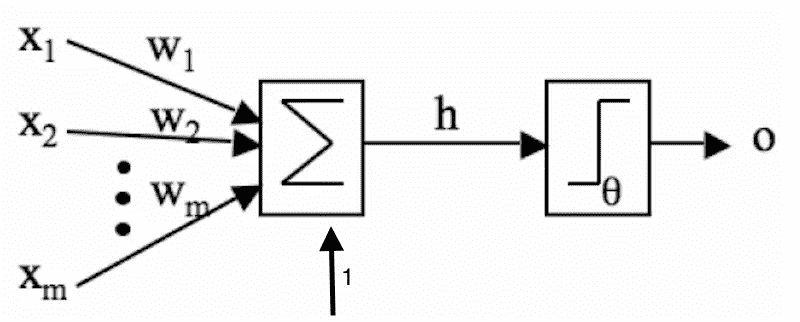
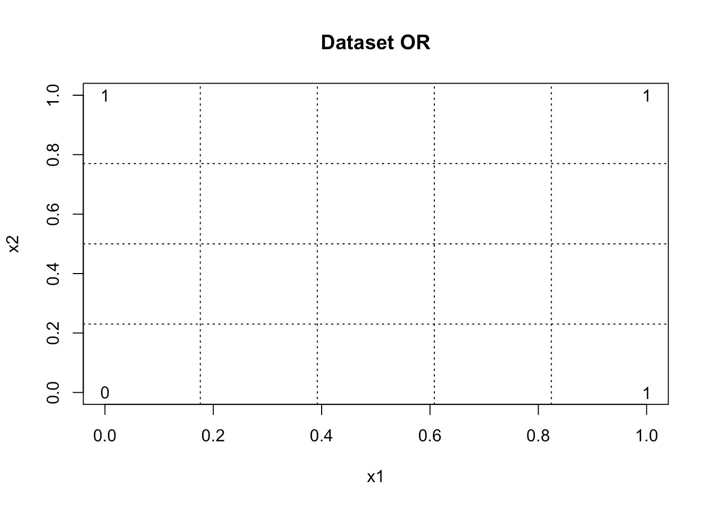
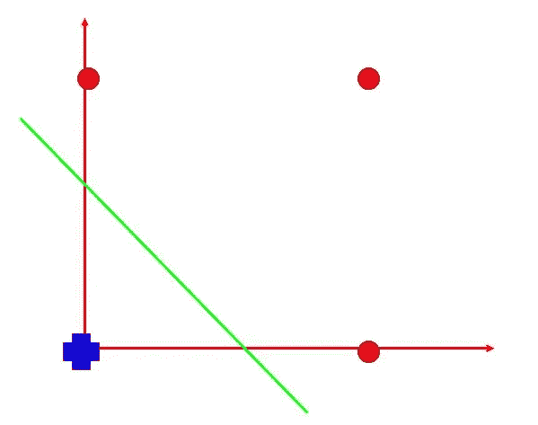
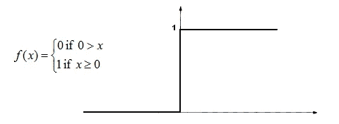
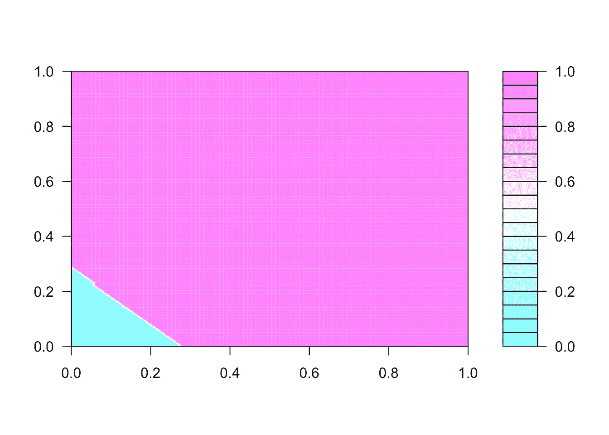

# 打开神经网络黑盒——感知器

> 原文：<https://towardsdatascience.com/opening-the-neural-network-black-box-perceptron-8435ef67721d?source=collection_archive---------0----------------------->

# 用 R 从头开始实现感知器

在大学开始研究机器学习之后，我一直在和人们谈论它，我逐渐意识到，即使有更多的技术背景，人们仍然认为机器学习算法是一个黑盒。因此，我想写这篇文章，展示如何使用 R 编程语言从零开始实现第一个提出的称为感知器的神经网络模型。我将带你们看一下整个过程，看看这个黑匣子里面是什么。

# 感知器神经网络

神经网络是一个受大脑启发的概念，更具体地说，是学习如何执行任务的能力。实际上，这是一种尝试，用代数的形式来模拟学习机制，以利于创建能够学习如何执行简单任务的算法。学习机制是一个很难的课题，多年来一直在研究，但没有完全理解，然而一些概念被假设来解释学习如何在大脑中发生，其中主要的一个是可塑性:改变神经元之间突触连接的强度，并创建新的连接。1949 年，唐纳德·赫布首次假设了这些突触的强度是如何适应的，他说突触连接强度的变化与两个连接神经元放电的相关性成正比。听起来很难做对吗？让我在这里澄清一下。他只是说，如果两个神经元一致地同时放电，那么它们之间的任何连接都会在强度上发生变化，变得更强。例如，你还记得你第一次吃来自一个新地方的比萨饼并且你喜欢它的味道吗？太棒了，对吧？嗯，在那一刻，你大脑中的一组神经元受到了积极的刺激，因为你品尝到了来自新地方的比萨饼的味道，因为这些神经元同时放电，它可能连接在一起或创建了一个新的连接。最终，当你从朋友那里听说那个地方或者看到一则广告时，它将足以让你再次想起比萨饼的美味。

为了模拟这种机制，麦卡洛克和皮茨提出了一个数学模型，该模型只能捕捉和再现其本质和基本属性，该模型被命名为感知器，如下图所示:



*Basic Perceptron Model proposed by McCulloch and Pits.*

感知器的主要特点是只有一个神经元。基本上，该模型由一组输入(x1，x2，…，xm)，权重(w1，w2，..wm)和激活功能。输入代表刺激，权重复制神经元之间的连接强度，激活函数模拟神经元放电的性质。所有这些元件一起模拟一个感知器模型，该模型只不过是一个数学运算器，该运算器对所有乘以输入的权重求和，并且结果是激活函数的输入，只要求和的结果大于阈值，该激活函数就提供一种类型的输出，否则就提供其他类型的输出。

看，这个模型并不复杂。我希望到目前为止你做得很好，你可以意识到神经网络只不过是乘法和求和，其结果应用于一个函数。这就是真实的情况。

现在，我们需要将这些刺激映射到输入中。回想一下在一个新地方吃美味披萨的例子。刺激是比萨饼的味道，标签是比萨饼真的很好，所以你了解到那个新地方的比萨饼味道很好。味道并不是使比萨饼真正好吃的唯一特征，一般来说，比萨饼有更多可观察的特征，如:大小、格式、气味、颜色、重量、稠度、温度等，这些特征组成了“好比萨饼”的概念，这正是我们如何从现实世界中学习的。再想一个例子:你是怎么知道汽车是轿车而不是卡车的？很可能当你还是个孩子的时候，你的父母指着一辆汽车告诉你那是一辆汽车，而在其他情况下，他们指着一辆卡车告诉你那个大物体是一辆卡车。事实上，你所做的是观察到一些使这两个物体彼此不同的特征，并将这些观察结果与你父母告诉你的联系起来，例如，卡车比汽车大，可能有许多轮子，汽车没有巨大的后备箱，可以容纳五个人，等等。这正是机器学习试图做的事情:教导算法如何对对象进行分类，为数据集提供可观察特征的示例，其中每个观察都有一个标签或类别。

# 简单数据集

好了，现在你知道了感知器算法的模型和数据集应该是怎样的，是时候编码了。在我们动手之前，让我们先来定义我们要使用的数据集和激活函数。我们关注的是算法本身，所以为了使其他变量尽可能简单，我们将采用一个源于众所周知的 OR 逻辑函数的简单数据集。

从代码开始，让我们以 R 数据帧格式存储数据，如下所示:

```
data = data.frame( x1 = c( 0, 0, 1, 1 ),
                   x2 = c( 0, 1, 0, 1 ),
                   y =  c( 0, 1, 1, 1 ) )print( data )##   x1 x2 y
## 1  0  0 0
## 2  0  1 1
## 3  1  0 1
## 4  1  1 1
```

数据集只有四个观察值，其中两个属于类 0，其他属于类 1。

```
plot( data$x1, data$x2, type = 'n', main = 'Dataset OR', xlab = "x1", ylab = "x2" )
text( data$x1, data$x2, labels = data$y )
grid( nx = length( data$x1 ) + 1, ny = length( data$x1 ), col = 'black' )
```



这里的任务是训练一个感知器来执行分类。

# 让我们做些训练吧

首先，什么是培训？训练只有一个目标:找到当算法执行分类任务时产生最小误差的权重的最佳值。因此，分类就是简单地说明一个确定的输入属于 0 类还是 1 类。为了做到这一点，该算法找到一个超平面，该超平面将这些观察结果分成两边，一边应该只有来自类 0 的观察结果，而另一边只有来自类 1 的例子。事情会在下图中变得清晰:



Figure 02\. OR classification

定义超平面的参数由权重值给出。然而，它有无限的组合，每一个都定义了超平面的不同位置，某些位置会引起错误分类。当已知类别的输入被算法分类为属于不同类别时，会出现此错误。因此，我们需要选择最佳位置，以避免错误分类。回到代码，让我们在一个短的值范围内随机初始化权重值，如下所示:

```
weights = rnorm( mean = 0, sd = 0.1, n = ncol( data ) )print( weights )## [1]  0.07189541 -0.08588955 -0.12175474
```

我从均值等于零、标准差等于 0.1 的正态分布中随机抽取数字。等等，到目前为止，我们已经看到了两个权重，每个输入一个，但是上面的代码显示了三个权重。第三个权重用于偏置输入。Bias 是一个固定输入，通常为-1 或 1，即使电流输入都为零，它也负责激活神经元。缺少的最后一个定义是激活函数。这将是如下所示的 Heaviside 阶跃函数:



Figure 03: Heaviside step function

Heaviside 阶跃函数的特性是当输入低于某个阈值时输出等于 0，否则输出为 1。您可能已经感觉到，激活函数的输出将是算法对输入属于哪一类的猜测。在这种情况下，Heaviside 阶跃函数是有意义的，因为它允许我们计算误差，以便评估分类器的性能。考虑到阈值等于 0.5，激活函数可以写成如下:

```
activation_function = function( net ){
                        if( net > 0.5 )
                            return( 1 )
                        return( 0 )
                    }
```

现在，我们终于可以写下感知器的代码了。让我们进行第一次观察，添加偏差值并乘以初始权重，结果将放入激活函数。在此之后，计算误差值并更新权重以提高自信度。为了计算误差和更新权重，我们将使用下面的表达式，其中参数 eta 是学习率，该值定义了遍历误差函数的步骤。

```
data = as.matrix( data )
net = c( data[1, 1:2 ], 1 ) %*% weightsy_hat = activation_function( net )error = y_hat - data[1,3]eta =  0.1weights = weights - eta * ( error ) * c( data[ 1, 1:2 ], 1 )print( weights )##          x1          x2
                    ##  0.07189541 -0.08588955 -0.12175474
```

这是只有第一次观察的学习过程，现在我们需要对数据集上所有可用的例子重复这个过程。然而，这个循环需要有一个停止标准，它将定义学习过程何时应该停止。为了测量算法在分类任务中的性能，我们观察误差的值，因此使用它作为停止标准听起来是合理的，更准确地说，我们将使用均方误差(mse)值。当算法达到一个较低的 mse 值时，我们会对它的性能感到满意。执行整个工作流培训的代码如下所示:

```
perceptron = function( dataset, eta = 0.1, threshold = 1e-5 ){
                        data = as.matrix( dataset )
                        num.features = ncol( data ) - 1
                        target = ncol( data ) # Initial random  weights
                        weights = rnorm( mean = 0, sd = 0.1, n = ncol( data ) ) mse = threshold * 2
                        while( mse > threshold ){
                            mse = 0
                            for( i in 1:nrow( data ) ){
                                # Add bias and compute multiplications
                                net = c( data[ i, 1:num.features ], 1 ) %*% weights # Activation function
                                y_hat = activation_function( net ) # Compute mse
                                error = ( y_hat - data[ i, target ] )
                                mse = mse + error^2
                                cat( paste( "Mean square error = ", mse, "\n" ) ) # Update weights
                                weights = weights - eta * error * c( data[i, 1:num.features ], 1 )
                            }
                        }
                        return( weights )
                    }
```

这个函数找到感知器模型的最佳权重。

# 看那个超平面！！

好了，伙计们，我们到了这篇文章的最后部分。在我们找到感知器模型的最优权重之后，让我们来看看超平面。下面的函数绘制了输入空间上的超平面。

```
shattering.plane = function( weights ){
                        X = seq( 0, 1, length = 100 )
                        data = outer( X, X, function( X, Y ){ cbind( X, Y, 1 ) %*% weights } )
                        id = which( data > 0.5 )
                        data[ id ] = 1
                        data[ -id ]= 0
                        filled.contour( data )
                    }
```

…运行功能…

```
weights = perceptron( data, eta=0.1, threshold=1e-5 )## Mean square error =  0
                    ## Mean square error =  1
                    ## Mean square error =  2
                    ## Mean square error =  3
                    ## Mean square error =  0
                    ## Mean square error =  1
                    ## Mean square error =  2
                    ## Mean square error =  2
                    ## Mean square error =  0
                    ## Mean square error =  0
                    ## Mean square error =  0
                    ## Mean square error =  0shattering.plane( weights )
```



如您所见，超平面将输入空间分为两个区域(蓝色和粉色)，每个区域代表输入被分类为属于类 0 和类 1 的空间。同样，你可以观察到，每次你运行代码，你会得到一个不同的权重值，从而改变超平面的位置。对于那些还不熟悉 R 语言的人，完整的感知器代码存储在我的 github 库中，只需在 R 控制台中复制并粘贴即可。

# 机器学习的好结论和未来

感知器是第一个提出的神经网络模型，它在线性可分的数据集上工作良好，对于其他类型的数据集，感知器存在许多限制，使得它不可能以良好的结果(低误差值)执行分类任务。例如，感知器不会对源自逻辑函数 XOR 的数据集执行分类任务。如果你是一个好奇的人，你可以在一个 XOR 数据集上运行这个代码，看到感知器不能区分类 0 和类 1，它永远不会达到低于给定阈值的均方误差。此外，尝试使用超平面对 XOR 数据集进行可视化分类。你能画出一个超平面来分隔类 0 和类 1 的输入吗？很可能不会，你会失败得很惨。我知道在所有这些研究之后，发现一个非常有限的分类器是令人沮丧的。不要悲伤或绝望，这不是机器学习的结束，恰恰相反，这只是开始。科学家们找到了一种超越这些限制的方法，将感知器算法进化成了一种叫做多层感知器(MLP)的算法。与感知器不同，MLP 能够解决复杂的问题，从简单的逻辑功能，如异或，直到人脸识别。在接下来的帖子中，我将打开 MLP 黑盒，从头开始实现它，并在一个真实的数据集上运行它来展示它的威力。感谢您的时间，您可以在 github 资源库中查看完整的代码。随时欢迎反馈。一会儿见。