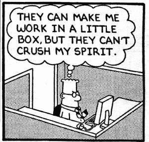

# 实际管理数据科学团队

> 原文：<https://towardsdatascience.com/operating-a-data-science-team-is-not-something-that-can-just-be-learned-by-watching-lectures-and-fef6ed0f714a?source=collection_archive---------8----------------------->

运营一个数据科学团队不是光看 [Coursera 和 Udemy](http://www.learndatasci.com/best-data-science-online-courses/) 上的讲座和视频就能学会的。不要误解我们，他们是学习数据科学和机器学习理论与实践问题的好地方。

然而，他们没有教授良好的业务实践，以及如何在业务环境中运营数据团队。知道算法，以及如何使用 Hadoop 还不足以拥有一个[有效的数据团队](https://www.theseattledataguy.com/top-30-tips-data-science-team-succeeds/)。

# 给数据科学团队的建议

团队要和其他部门合作，要维护软件，要向高管汇报，当然还要回报商业价值！数据科学，如分析和商业智能，只是帮助企业更有效地赚钱的工具。

大多数数据科学课程都不会讨论这些内容。这就是为什么我们的重点之一不仅仅是定制数据科学算法和模型，还有数据科学团队发展。

我们想提供一些[伟大的提示，帮助您的数据科学团队](https://medium.com/towards-data-science/how-to-survive-corporate-politics-as-a-data-scientist-ba914fac2471)更加成功。这与算法和模型无关，而是与数据专家在业务中需要如何运营有关:

# ROI 与算法和技术

程序员、数据科学家和工程师。我们大多数人通常更喜欢关注我们正在开发的数据项目或软件的技术方面。我们开发产品的原因不仅仅是为了钱，而是为了证明我们可以做一些事情。这是一个挑战！我们是问题解决者。

也许我们想证明我们可以开发一种算法，可以预测一个产品是不是热狗。只是为了好玩！

然而，归根结底，美国的数据科学家、数据顾问和软件工程师是被企业雇佣的。最终，这些企业希望看到财务结果。无论您使用的是[神经网络还是基于支持向量机的算法，](http://www.svms.org/anns.html)哪个结果可以节省最多的资金，或者带来最多的收入，都没有关系。

记住这一点很重要，因为数据科学家或大数据分析师越早发现这一点。他们的作用就越有效。作为一名数据科学家，有一点点企业家精神是必要的。

数据专家寻找机会为公司省钱，或者发现新的价值流。我们也经常是对的，因为我们不仅了解业务，而且我们有数据来支持我们的见解。

这是拥有一个与您的业务非常协调的数据团队的价值之一。他们有数据来驱动他们的决策。

# 数据工程

一个可以偶尔赶工的领域是[数据工程](http://www.acheronanalytics.com/acheron-blog/how-to-engineer-your-data-for-data-science)。它可能看起来不重要，可能看起来很容易改变。然而，如果数据不是以一种易于操作和开发的方法设计的。数据科学家将有一段地狱般的时间试图设计他们的算法和下游工作流程。

在 indeed.com的职位中，数据工程师的比例仍然高于数据科学家，这是有原因的。

数据的结构在分析中起着很大的作用。我们的团队有几个成员原本是数据工程师，这就是他们如此有价值的原因。他们不仅能创建漂亮的算法，还能创建从 A 点到 b 点、从数据仓库到算法的自然流动的数据管道。

设计良好的数据易于修改，易于允许新的模块和报告指标等。这可能看起来很奇怪，但是有了好的数据工程，这一切都是可能的！

# 系统设计也适用于数据科学家

当[设计算法](http://www.tutorialspoint.com/design_and_analysis_of_algorithms/)时，很容易忘记结果需要实际应用到生产中。

数据科学家不只是设计一个算法，然后就此结束。相反，通常需要某种形式的数据仓库或数据存储中心作为一个系统，从开发的模型中获取并记录数据。该算法不是一个孤岛，它自己创造美元。

通常还会有某种形式的用户可以与之交互的界面。

例如，这可能是一个网站或一个仪表板。目的是让最终用户直接获得可操作和可理解的见解。而不是他们必须翻译随机数字和模型输出。

当在课堂上简单地做一个卡格尔问题或创建一个项目时，这可能会被忽略。这就是为什么像“激励”这样的项目让他们的学生与实际的企业合作，因为将算法投入生产需要的不仅仅是开发它。

有旧系统要处理，API 文档要筛选，有 bug，有变通办法，当然还有公司政治。

# 公司政治，是的，你会参与其中

商业总是有政治。没有办法绕过去。数据科学高管和项目负责人需要能够与其他团队合作，并像其他部门一样获得资金。

这需要[了解其他高管想要什么和需要什么，并确保他们支持你的项目。如果他们不支持你的项目，如果他们等着在背后捅你一刀(这种情况确实会发生)，你的项目就会失败。](https://medium.com/towards-data-science/how-to-survive-corporate-politics-as-a-data-scientist-ba914fac2471)

不要操纵，而是引导其他团队领导接受你的观点，或者交换，或者妥协。只要确保你不会开始踩着每个人的脚趾…至少，直到你的数据团队已经证明了自己几次。即使这样，也不要变得难以共事。

否则，没有人会给你的业务团队提供资源。

# 文档是数据团队的朋友

好吧，85%的程序员需要承认一些事情。他们讨厌文档。没关系，这并不是最有趣的事情。然而，不断地记录是很重要的！

[不要等到项目结束才记录文档！！！](https://www.kaggle.com/general/12689)

数据科学算法、数据结构和软件需要不断地被记录。

没人要求你的数据团队写出下一个汤姆·斯威尔。只要保持清晰易懂的笔记，任何其他程序员都可以拿起。

你永远不知道团队成员什么时候会离开，因此，留下一堆没有文档的半成品项目。

因此，为了便于维护，让您的数据团队记录他们的项目。这将为您的团队节省数百小时的技术债务，并确保您的产品继续运行。

# 数据科学项目需要软件 QA 和生命周期

数据科学是软件开发的一个分支。这意味着它需要一个过程来确保开发的代码是健壮的和可维护的。

你怎么问？

通过对代码和数据都有一个很好的质量保证过程，并确保代码从开发到生产有一个标准化的过程。

不，你不应该在产品上测试代码！

事情就是这样出问题的！！！

不要误解我们，您需要推出代码，但不能以您的代码会破坏构建为代价。

同行评审、QA 和单元测试可以为您的数据团队省去很多麻烦。确保没有持续的障碍，就像一个工程师永远都要对别人的代码进行同行评审。

**同时，确保你没有直接开发产品！！**

# 数据科学不仅仅是关于算法

数据科学和分析的真相是，它不是一颗神奇的子弹。它实际上只是企业用来增加利润和降低成本的另一个工具。如果操作得当，它会创造巨大的竞争优势。当数据设计得很好，团队与业务的其他部分运作良好时。

我们的数据顾问专门确保您的团队满负荷运转。当然，我们喜欢解决数据科学和机器学习问题。

然而，我们也提供令人敬畏的指导和研讨会，以帮助发展您的团队成员！我们拥有数据科学和业务专业人员，他们知道如何确保您的团队与业务保持一致。通过这种方式，您可以充分利用数据来推动价值流！无论是大数据，小数据，让我们知道今天我们如何为您服务！

阅读下面关于数据科学的更多信息！

[亚马逊正在用数据驱动战略抢走你的午餐](https://www.theseattledataguy.com/amazon-taking-lunch-data-driven-strategies/)

[如何面试数据科学家](https://www.theseattledataguy.com/hiring-data-scientist-interviews/)

[数据科学项目失败的 32 个原因](http://www.acheronanalytics.com/acheron-blog/top-32-reasons-data-science-projects-fail)

[26 个启动失败的原因](https://princelemuel.com/2017/07/19/reasons-start-ups-fail/)