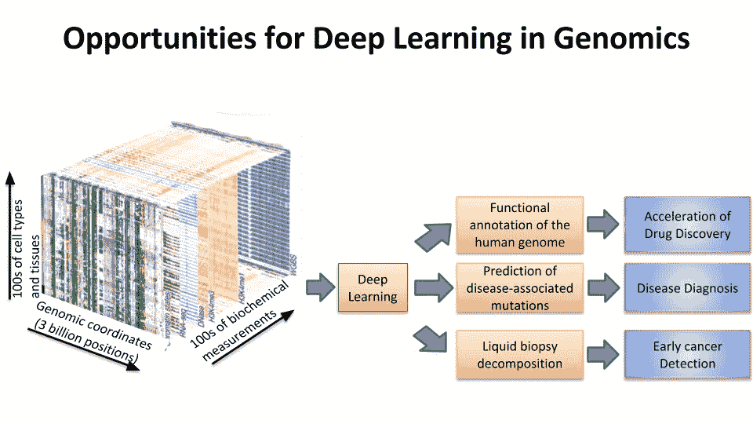
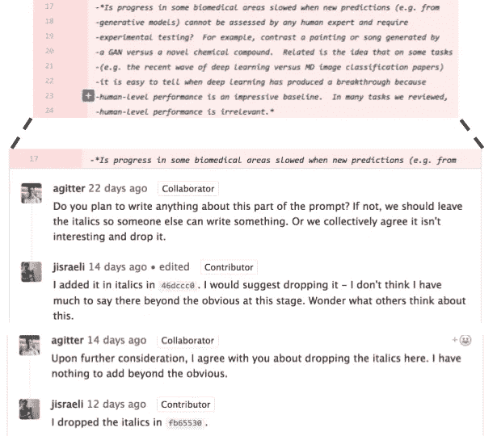

# 生物学和医学中深度学习的机遇和障碍

> 原文：<https://towardsdatascience.com/opportunities-and-obstacles-for-deep-learning-in-biology-and-medicine-6ec914fe18c2?source=collection_archive---------3----------------------->

**目标受众:**一般。

*27 名科学家合作审查生物学和医学领域深度学习的机遇和障碍。也许比他们的结论更重要的是导致这些结论的写作过程——在 Github 上，在开放的环境中，以类似于开源软件开发的方式。*

**概要:**

*   生物学和医学正变得数据丰富，但数据复杂且往往难以理解，这使得这些领域可能非常适合深度学习。
*   最近的几份出版物综述了深度学习在生物学和医学中的应用。
*   这篇综述与众不同，因为 27 位科学家[在 Github](https://github.com/greenelab/deep-review) 上公开合作撰写了这篇综述:它代表了不同专家的共识，导致最新版本的综述的讨论对公众开放。
*   回顾的主题包括深度学习在疾病和患者分类、基础生物学研究和患者治疗中的应用。
*   对模型评估和解释的批判性讨论强调了常见的陷阱和最佳实践的指导原则。
*   尽管在大多数审查的应用中，深度学习优于竞争机器学习方法，但深度学习尚未实现其潜力或最终解决这些问题。
*   数据、代码和模型共享的文化将加速这一领域的进步；像 [DragoNN](http://kundajelab.github.io/dragonn/) 这样的教学资源会扩展它。
*   总之，我们对深度学习在生物学和医学领域的未来持乐观态度。

在 Github 上公开写评论可以减少偏见，利用大众的智慧。右边是我和其中一位作者交流的快照，我们决定不对我们之前考虑过的某些问题发表评论。我们不会在评论中讨论这些问题，但是这种交流澄清了我们对这些问题的看法，这就是开放式写作过程的附加价值。

该综述可在 bioRxiv 上获得[预印本，最新版本可在 Github](http://biorxiv.org/content/early/2017/05/28/142760) 上获得[。接下来，它将接受同行评审，以便在《皇家学会杂志》上发表。我们的结论，如果经得起时间的考验，将会把这个领域向前推进一步；我们采用的开放式写作过程，如果经得起时间的考验，将会改变它。](https://greenelab.github.io/deep-review/)

Johnny Israeli 是斯坦福大学的生物物理学博士生和 SIGF Bio-X 研究员。他开发了基因组学的深度学习，专注于蛋白质-DNA 相互作用。Johnny 创造了[*DragoNN toolkit*](http://kundajelab.github.io/dragonn/)*用深度学习来教授基因组数据的建模和解释。DragoNN workshops 已经在各大研究机构推出，现在可以作为 Nvidia 深度学习学院的在线课程***。通过与 Anshul Kundaje 教授合作，Johnny 将基因组学的深度学习从想法转变为可用的框架，指导了几十名学生，并通过研讨会和课程扩展了该领域。你可以* [*在 LinkedIn*](https://www.linkedin.com/in/jisraeli/) *上关注他，获取深度学习和基因组学的月度文章。**