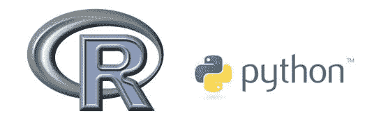
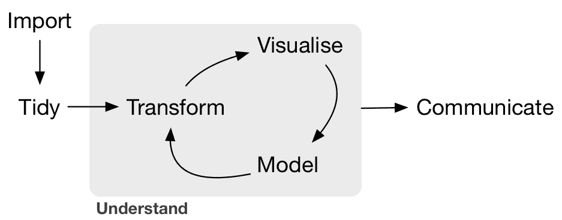
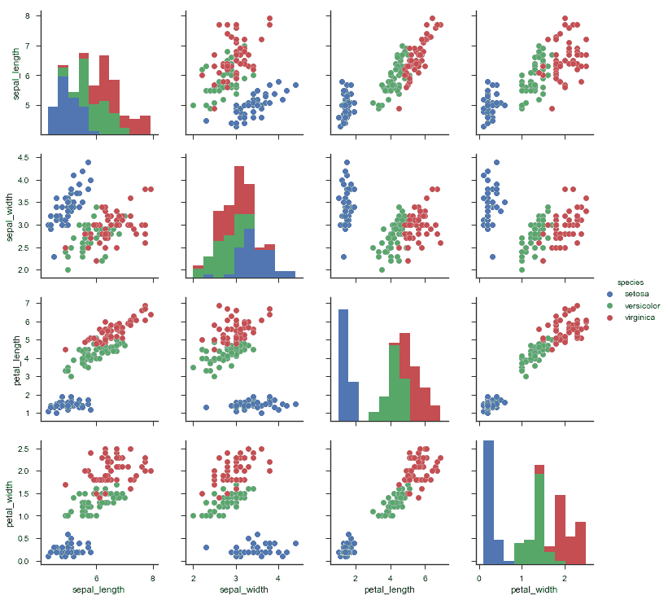
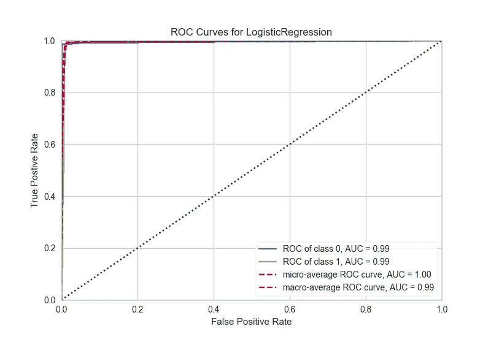
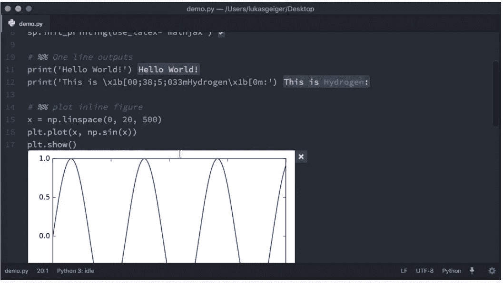
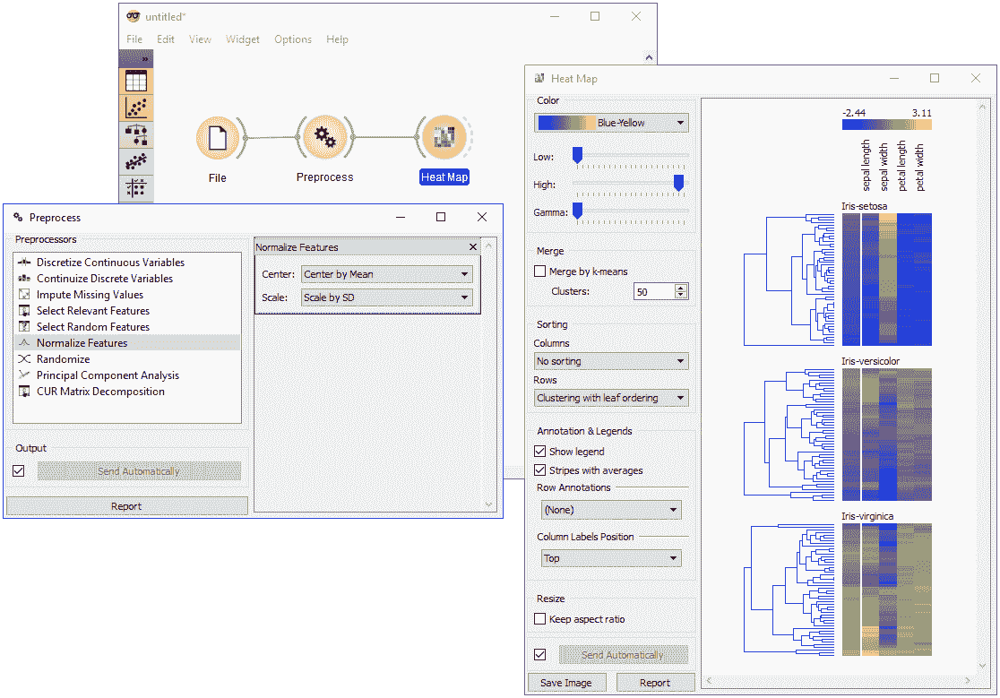

# 机器学习和人工智能的最佳工具

> 原文：<https://towardsdatascience.com/optimal-tooling-for-machine-learning-and-ai-e43495db59da?source=collection_archive---------5----------------------->

*注意:这篇文章基于我最近在脸书开发者圈和柏林数据本地人上的演讲。你可以在这里得到幻灯片***。**

*我将第一个承认工具可能是目前数据科学中最不令人兴奋的话题。人们似乎更有兴趣谈论最新的聊天机器人技术或深度学习框架。*

*这完全说不通。为什么你不花足够的时间来仔细挑选你的工具？还有一个额外的问题，这对于我的职业来说很典型——当你只有一把锤子时，一切都变成了钉子(这就是为什么你实际上可以用 R 建立网站；-)).我们来谈谈这个。*

*先说要领。*

# *我应该使用哪种语言？*

*好吧，这个有争议。在这个问题上有一些非常广泛的观点，从一个极端到另一个极端。我有一个可能是最不常见的——越多越好。**R 和 Python 都要用。***

**

*More is better*

*那么，为什么呢？r 可以说在数据可视化方面做得更好，并且有大量的统计软件包。另一方面，Python 将帮助您将模型投入生产，并且更受团队中其他开发人员的赞赏(想象一下，给他们一个 R 模型来部署)。*

*在这里，我想对茱莉亚大声疾呼。这是该领域的新来者，但潜力巨大。留意一下这个。*

# *基本软件包*

*我们不希望在工作中不断重复发明轮子，我们应该利用围绕这些语言的令人敬畏的开源社区。首先，快速回顾一下典型数据科学工作流中的主要任务。*

**

*A typical machine learning workflow*

*最重要的步骤是:**摄取**，**清洗**，**可视化**，**建模**和**交流**——我们需要所有这些的库。*

*对于 R 中的**数据清理**，有一个很棒的包叫做 [dplyr](https://github.com/tidyverse/dplyr) 。诚然，它有一个奇怪的合成轴，但这就是它的力量所在。注意 **% > %** —它的工作方式与*nix 中的管道( **|** )操作符完全相同，上一个操作的输出成为下一个操作的输入。这样，只需几行代码，您就可以构造非常复杂但可读的数据清理或转租操作。*

*python 的替代品是[熊猫](https://pandas.pydata.org/)。这个库大量借鉴了 R，尤其是 dataframe 的概念(其中行是观察值，列是特性)。它有一些学习曲线，但是一旦你习惯了它，你可以在数据操作中做几乎任何事情(你甚至可以直接写数据库)。*

*对于**数据可视化**，我们有 [ggplot2](http://ggplot2.org/) 和 [plotly](https://plot.ly/) 用于 r。gg plot 2 非常强大，但相当低级。同样，它有一点奇怪的语法，你应该阅读一下 Graphics 的[语法来理解为什么。Plotly 是一个较新的库，它可以让你的 ggplots 拥有超能力，只需要一行代码就可以让它们交互。Python 中 dataviz 的基础包是 matplotlib。它有一些非常神秘的特性，比如奇怪的语法和可怕的默认颜色，这就是为什么我强烈建议你使用更新的](http://vita.had.co.nz/papers/layered-grammar.html) [seaborn](http://seaborn.pydata.org/) 包。python 缺乏的一个领域是模型性能的可视化。这个缺口由优秀的[黄砖](https://github.com/DistrictDataLabs/yellowbrick)项目填补。您可以使用它来创建漂亮的图来评估您的分类器，查看特征重要性，甚至绘制一些文本模型。*

**

*Using Seaborn for scatter pair plotting of the iris dataset*

***R 中的机器学习**遭遇一致性问题。几乎所有的模型都有不同的 API，如果你只是想在你的数据上测试不同的算法(这是你应该做的)，你要么把所有的东西都背下来，要么打开几个文档标签。这一缺陷由两个主要的软件包解决，即 [caret](https://github.com/topepo/caret) 和 [mlr](http://mlr-org.github.io) ，后者较新。我会选择 mlr，因为它看起来更有结构性，而且维护得更积极。您需要的一切都在那里，从分割数据、训练、预测和性能评估的功能开始。Python 中相应的库可能是我最喜欢的，也难怪一些主要的科技公司支持它——[sci kit-learn](http://scikit-learn.org/)。它有一个非常一致的 API，超过 150+的可用算法(包括神经网络)，精彩的文档，主动维护和教程。*

**

*ROC/AUC plot in Python, using yellowbrick*

# *集成开发环境*

*为 R 选择一个 IDE 是显而易见的。RStudio 绝对是一个神奇的工具，它没有竞争对手。理想情况下，我们希望 python 像这样。我已经看过一打了(Spyder、PyCharm、Rodeo、spacemacs、Visual Studio、Canopy 等。等等。)，而且只有两个竞争者:[木星实验室](https://github.com/jupyterlab/jupyterlab)和[原子](https://atom.io/) + [氢](https://atom.io/packages/hydrogen)。*

*朱庇特实验室仍在(积极)建设中，看起来相当不错。尽管如此，它仍然继承了 Jupyter 笔记本的一些缺点，如电池状态、安全性以及最糟糕的 VCS 集成。基于这个原因，我推荐原子+氢。使用这个设置，你可以做各种各样的数据科学的事情，比如检查你的数据帧和变量，在**中绘制东西和所有内嵌的东西。py** 脚本。*

**

*Atom + Hydrogen*

# *EDA 工具*

*我们为什么需要它们？在数据科学过程中，我们经常(尤其是在开始时)需要快速探索数据。在我们致力于可视化之前，我们需要探索，并以最少的技术投资来完成。这就是为什么编写大量的 seaborn 或 ggplot 代码是次优的，你应该使用 GUI 界面。另外，它也可以被商业人士使用，因为不涉及任何代码。有两个非常酷的跨平台免费工具可用: [Past](https://folk.uio.no/ohammer/past/) 和 [Orange](http://orange.biolab.si) 。前者更侧重于统计分析，后者侧重于建模。两者都可以进行出色的数据可视化，因此它们完全符合我们的目的。*

**

*Stuff you can do with Orange*

# ***结论***

*作为临别赠言，我希望你保持高效，尽可能优化你的工具(不要把这作为不工作的借口；)).*