# 损失函数(第二部分):逻辑回归

> 原文：<https://towardsdatascience.com/optimization-loss-function-under-the-hood-part-ii-d20a239cde11?source=collection_archive---------0----------------------->


本系列旨在解释一些广泛使用的监督学习模型的损失函数，以及优化算法的一些选项。在[第一部分](/optimization-of-supervised-learning-loss-function-under-the-hood-df1791391c82)中，我用梯度下降法，用最小二乘误差作为损失函数，详细地走了一遍线性回归的优化过程。在这一部分，我将转向逻辑回归。

# **假设**

记住线性回归的假设是:

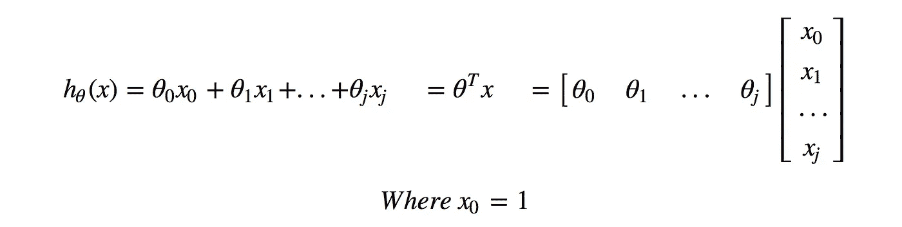

称这种线性回归的假设为原始模型输出。逻辑回归只是有一个基于它的变换。对于逻辑回归，这里着重于二元分类，我们有 0 类和 1 类。为了与目标值进行比较，我们希望将预测值限制在 0 到 1 之间。这就是为什么 **Sigmoid 函数**应用于原始模型输出并提供概率预测的能力。

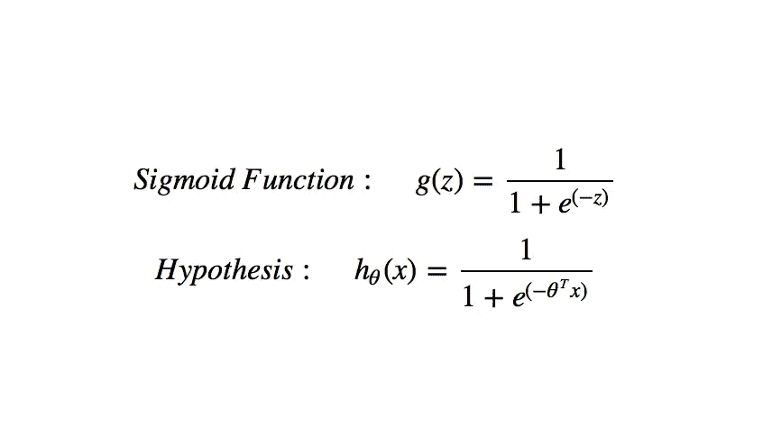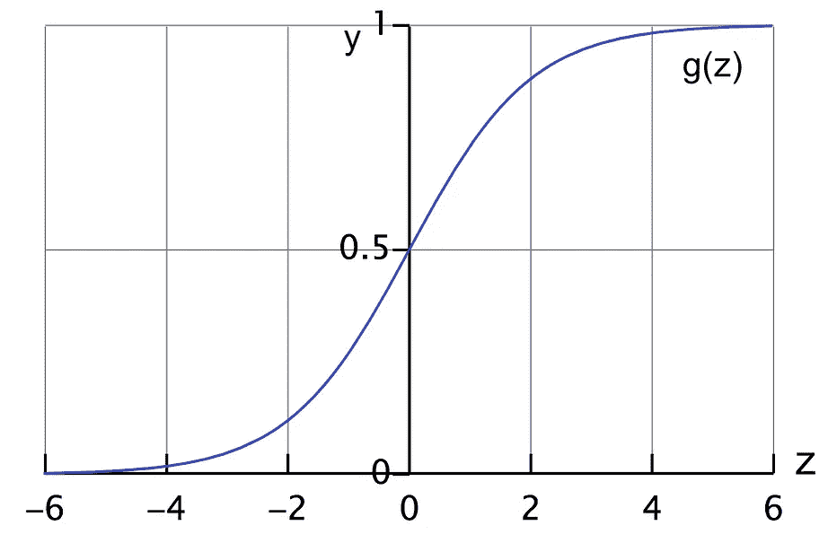

假设函数返回的是 y = 1 的概率，给定 x，用θ参数化，写成:h(x)= P(y = 1 | x；θ).决策边界可以描述为:预测 1，如果θᵀx≥0→h(x)≥0.5；预测 0，如果θᵀx < 0 → h(x) < 0.5.

# Cost Function

Linear regression uses**最小平方误差**作为损失函数，给出一个凸图，然后我们可以通过找到它的顶点作为全局最小值来完成优化。然而，它不再是逻辑回归的一个选项。由于假设发生了变化，通过对原始模型输出应用 sigmoid 函数进行计算，最小二乘误差将产生具有局部最小值的非凸图形。

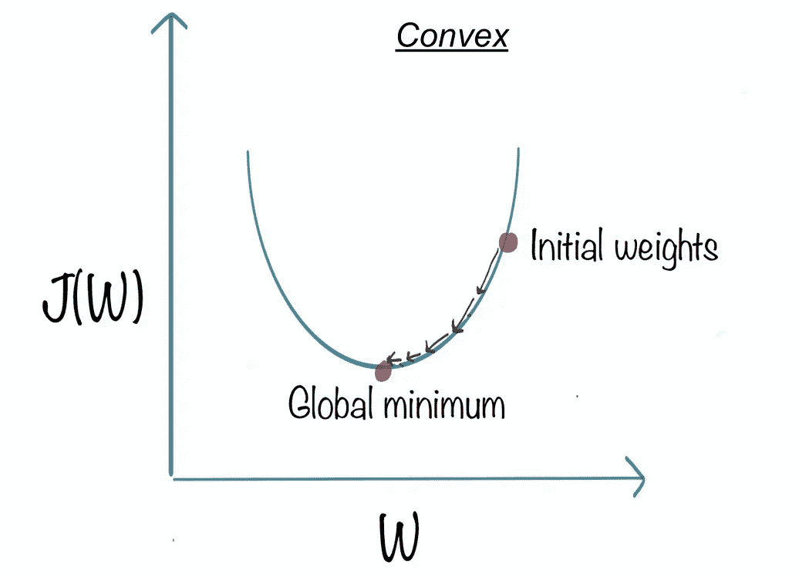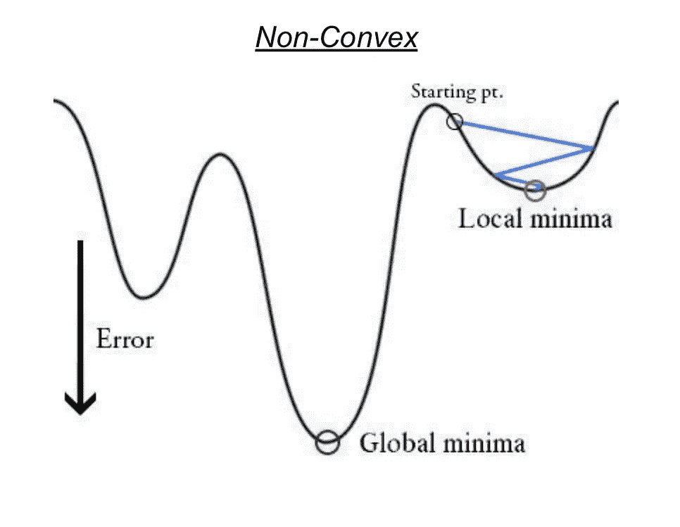

source: [https://medium.freecodecamp.org/understanding-gradient-descent-the-most-popular-ml-algorithm-a66c0d97307f](https://medium.freecodecamp.org/understanding-gradient-descent-the-most-popular-ml-algorithm-a66c0d97307f); [https://www.cs.ubc.ca/labs/lci/mlrg/slides/non_convex_optimization.pdf](https://www.cs.ubc.ca/labs/lci/mlrg/slides/non_convex_optimization.pdf)

直观地说，我们希望在预测 1 而实际为 0 和预测 0 而实际为 1 时分配更多的惩罚。逻辑回归的损失函数正是这样做的，它被称为**逻辑损失**。见下图。如果 y = 1，看下面左边的图，当预测= 1 时，成本= 0，当预测= 0 时，学习算法受到非常大的成本的惩罚。类似地，如果 y = 0，右边的图显示，预测 0 没有惩罚，但是预测 1 有很大的成本值。

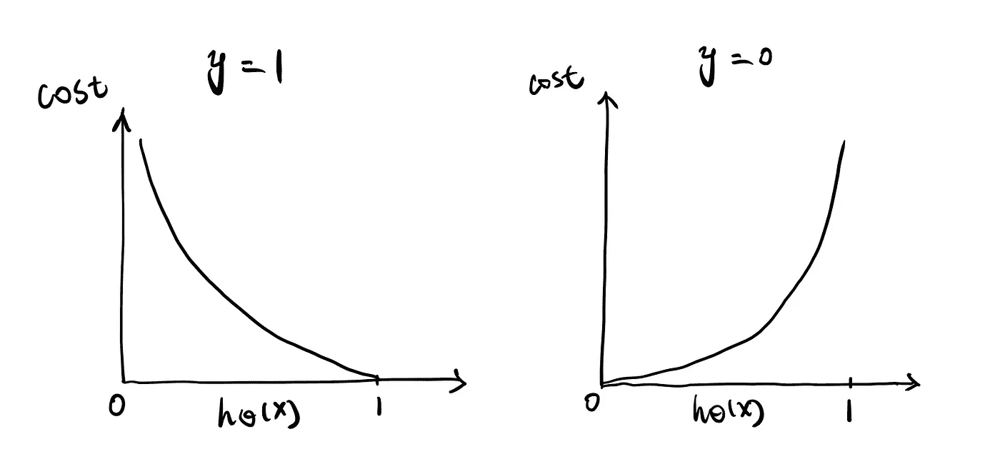

这个损失函数的另一个优点是，尽管我们分别从 y = 1 和 y = 0 的角度来看它，但它可以写成一个公式，便于计算:

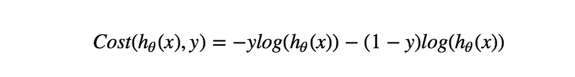

因此，模型的成本函数是所有训练数据样本的总和:

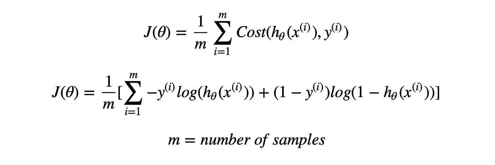

# 正规化

在用这个代价函数对训练数据进行参数拟合之前，先简单说一下**正则化**。常用的正则化类型有两种，**【套索】****【脊】**。不是直接优化上述成本函数，而是通过正则化，我们添加对系数可以达到多大的约束，以防止过拟合。L1 和 L2 采用不同的方式设置系数的上限，这决定了 L1 有能力通过将不太重要的特征的系数设为 0 来进行特征选择，并缓解多重共线性问题，而 L2 也惩罚非常大的系数，但不将任何系数设为 0。还有一个参数控制约束的权重λ，以便系数不会受到太大的惩罚而导致欠拟合。

关于为什么 L1 和 L2 由于“平方”和“绝对”值而具有不同的能力，以及λ如何影响正则项和原始拟合项的权重，这是一个非常有趣的话题。这里我们不会真的深究，但绝对值得你去学习和研究。下面显示了如何将原始成本函数更新为正则化成本函数。

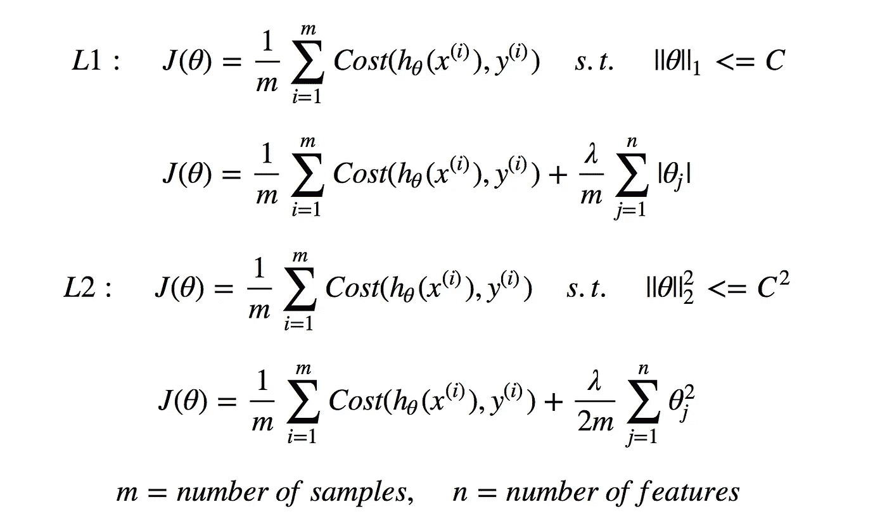

# 最佳化

使用正确的学习算法，我们可以通过最小化 J(θ)作为θ的函数来开始拟合，以找到最佳参数。我们仍然可以应用**梯度下降**作为优化算法。它采用 J 相对于θ的偏导数(J 的斜率)，并通过每次迭代以选定的学习速率α更新θ，直到梯度下降收敛。请参阅下面的 python 查询来优化 L2 正则化逻辑回归。这里有一篇很好的文章[非常详细地解释了优化过程的矢量化实现。](/vectorization-implementation-in-machine-learning-ca652920c55d)

```
## Vectorized Implementation of Optimization Using Gradient Descent# Define Cost functiondef cost(t, h, l=l, X=X, y=y, m=m):
    cost = np.transpose(-y)[@np](http://twitter.com/np).log(h) - np.transpose(1-y)[@np](http://twitter.com/np).log(1-h) + (l/2)*np.transpose(t[1:])[@t](http://twitter.com/t)[1:]
    cost = (1/m)*cost
    return cost # Define first derivative of cost functiondef cost_dev(j, t, X=X, y=y, m=m):
    dev = X[:, j]@(1/(1 + np.exp(-X@theta)) - y)
    dev = (1/m)*dev
    return dev# Define iterationscost_list = []theta_temp = np.zeros(theta.shape)theta_list = []for i in range(1000000):

    for j in range(len(theta)): 
        if j == 0:
            theta_temp[j] = theta[j] - a*cost_dev(j, theta)
        else:
            theta_temp[j] = theta[j]*(1 - (a*lmbd)/m) - a*cost_dev(j, theta)

    theta = theta_temp        
    hypo = 1/(1 + np.exp(-X@theta))

    theta_list.append(list(theta))
    cost_val = cost(theta, hypo)
    cost_list.append(cost_val)
```

我想谈一谈另一种流行的优化算法，**牛顿法**，它采用不同的方法来达到成本函数的全局最小值。类似于梯度下降，我们首先取 J(θ)的偏导数即 J(θ)的斜率，记为 f(θ)。牛顿方法不是通过某个选定的学习速率α乘以 f(θ)来减小θ，而是在先前θ和 x 轴处 f(θ)的切线的交点处获得更新的θ。经过一定的迭代次数后，牛顿法将收敛于 f(θ) = 0。

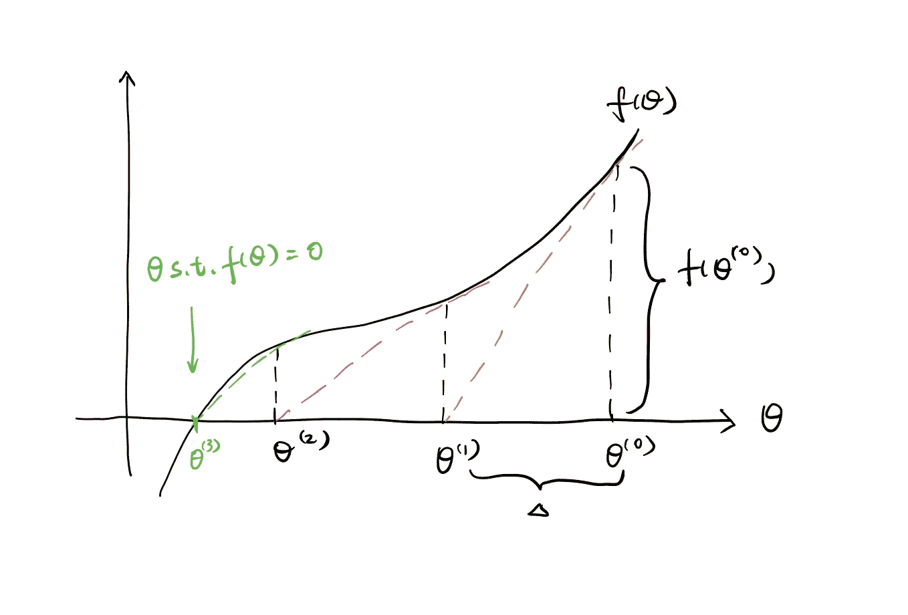

参见上面的简化图，从右边开始，黄色虚线是 f(θ)在θ0 处的切线。它决定了θ1 的位置，从θ0 到θ1 的距离是δ。重复该过程，直到找到服从 f(θ) = 0 的最优θ，即该图中的θ3。参见下面更新θ的公式。

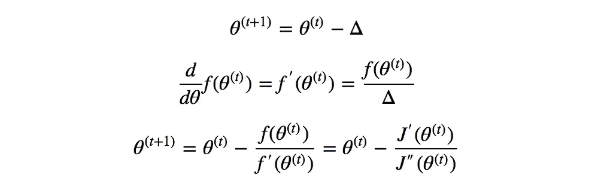

显然，牛顿的方法不需要选择固定的学习速率，并且每次迭代的步长较大并且也是变化的，因此，在适当的特征和样本大小下，它通常收敛得更快并且相当有效。

未完待续…