# 损失函数(第三部分):支持向量机

> 原文：<https://towardsdatascience.com/optimization-loss-function-under-the-hood-part-iii-5dff33fa015d?source=collection_archive---------2----------------------->

继续这个旅程，我已经在[第一部分](/optimization-of-supervised-learning-loss-function-under-the-hood-df1791391c82)讨论了线性回归的损失函数和优化过程，在[第二部分](/optimization-loss-function-under-the-hood-part-ii-d20a239cde11)讨论了逻辑回归，这一次，我们将前往支持向量机。

# 线性 SVM

让我们从线性 SVM 开始，它被称为无核 SVM。通过两个特征 X1 来看散点图，X2 如下。我们实际上用很多不同的方法来区分两个类别，粉线和绿线就是其中的两个。SVM 最终选择了绿线作为决策边界，因为 SVM 如何对样本进行分类是为了找到与最接近决策边界的样本距离最大的决策边界。这就是为什么线性 SVM 也被称为**大幅度分类器**的原因。

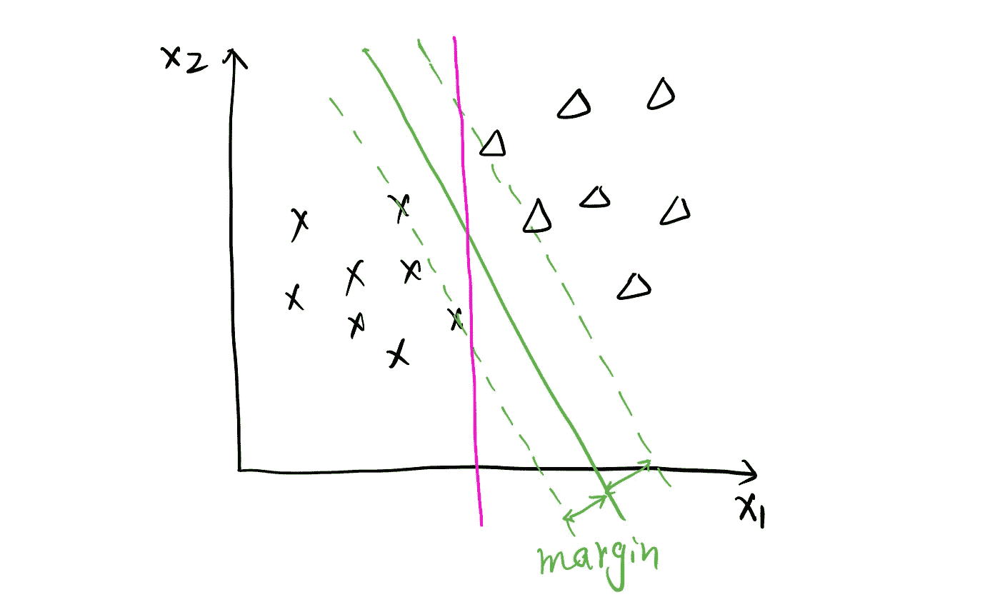

谁是支持向量？支持向量是被错误分类的样本或接近边界的样本。看下面的剧情。带红圈的样本就是决策边界。在 SVM，只有支持向量对模型训练有有效的影响，也就是说去除非支持向量对模型没有任何影响。为什么？我们会从它的成本函数中算出。

SVM 的损失函数非常类似于逻辑回归的损失函数。在下图中分别用 y = 1 和 y = 0 来看，黑线是逻辑回归的成本函数，红线是 SVM 的成本函数。请注意，这里的 x 轴是原始模型输出，θᵀx.记得把原始模型输出放入 Sigmoid 函数给了我们逻辑回归的假设。SVM 的假设是什么？简单明了。当θᵀx ≥ 0 时，预测 1，否则，预测 0。

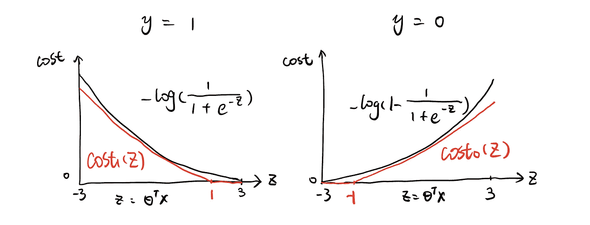

然后回到损失函数图。**铰链损耗**，当实际为 1 时(左图如下)，如果θᵀx ≥ 1，则完全没有成本，如果θᵀx < 1，则成本随着θᵀx 值的降低而增加。等等！当θᵀx ≥ 0 时，我们已经预测了 1，这是正确的预测。为什么成本从 1 而不是 0 开始增加？是的，SVM 对不正确的预测和那些接近决策边界(0 < θᵀx < 1)的预测都给予了一些惩罚，这就是我们如何称它们为支持向量。当数据点刚好在页边空白上时，θᵀx = 1，当数据点在判定边界和页边空白之间时，0 < θᵀx < 1。稍后我会解释为什么一些数据点出现在页边空白内。至于为什么去除非支持向量不会影响模型性能，我们现在可以回答了。记住模型拟合过程是最小化成本函数。由于非支持向量根本没有代价，所以代价函数的总值不会因为添加或删除它们而改变。

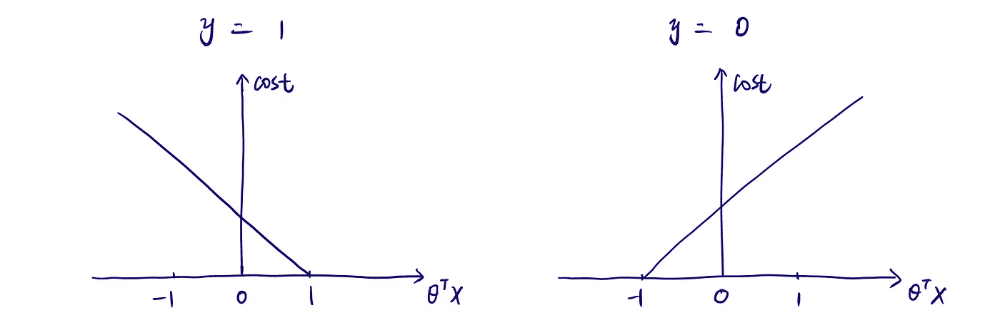

让我们写出 SVM 成本函数的公式:

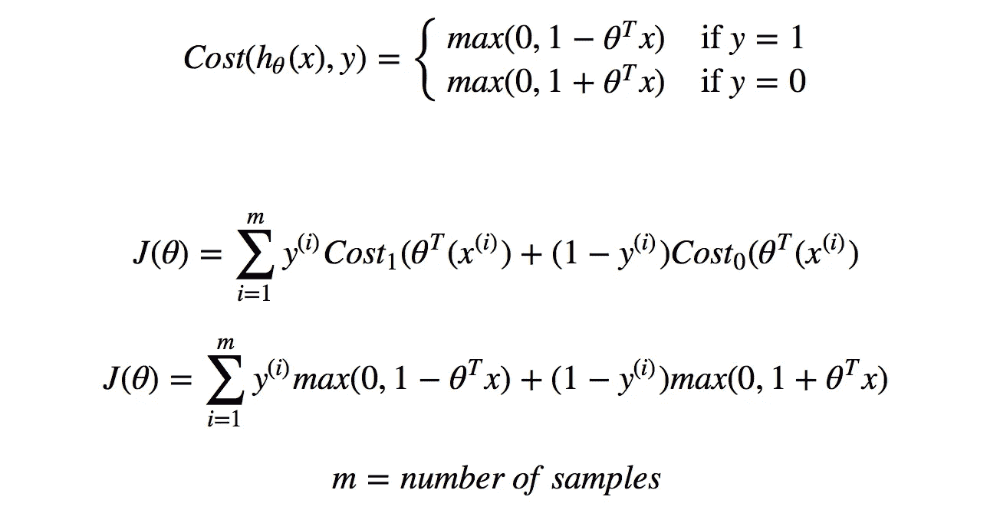

我们也可以将 SVM 正规化。例如，将 L2 正则化项添加到 SVM，成本函数变为:

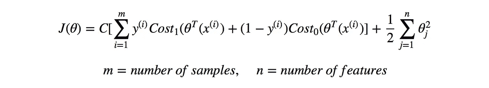

与 Logistic 回归在正则项前使用 **λ** 作为参数来控制正则化的权重不同，相应地，SVM 在拟合项前使用 **C** 。直观上，拟合项强调通过寻找最佳系数来很好地拟合模型，而正则化项通过约束大的系数值来控制模型的复杂性。在训练数据集上很好地拟合模型与可能导致过度拟合的模型复杂性之间存在权衡，这可以通过调整λ或 C 的值来调整。λ和 C 都优先考虑我们对优化拟合项和正则化项的关注程度。放在成本函数的不同地方，C 实际上起到了类似于 1/λ的作用。

在 C 值非常大的情况下(类似于没有正则化)，这个大间隔分类器将对异常值非常敏感。例如，在下图左侧的图中，理想的决策边界应该像绿线一样，通过添加橙色的橙色三角形(异常值)，加上一个非常大的 C，决策边界将移动到橙色线，以满足大幅度规则。另一方面，C 还起到调整边距宽度的作用，这使得边距违例成为可能。见下图右侧。当 C 较小时，边距较宽，显示为绿线。粉红色的数据点违反了边界。这在处理不可分离的数据集时特别有用。因此，这就是正则化如何影响决策边界的选择，使算法适用于非线性可分离数据集，允许数据点被错误分类或有边界违规。

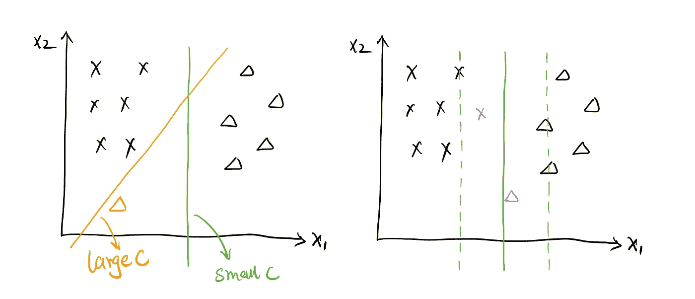

# 非线性 SVM

当决策边界不是线性时，假设和成本函数的结构保持不变。首先，让我们来看看。

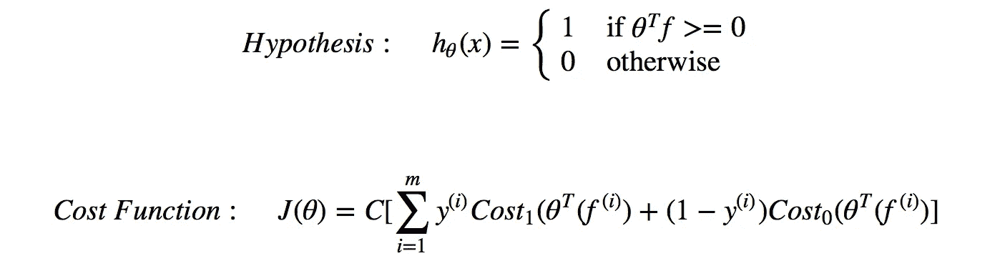

你可能已经注意到，非线性 SVM 的假设和成本函数与线性 SVM 几乎相同，只是这里的“x”被“f”代替了。f 是 x 的函数，我接下来会讨论如何求 f。让我们从头开始。假设我们有一个样本(见下图)具有两个特征 x1、x2。我在 x 周围随机放了几个点(l⁽ ⁾，l⁽ ⁾，l⁽ ⁾)，称它们为地标。我想看看 x 分别离这些地标有多近，记为 f1 =相似度(x，l⁽ ⁾)或 k(x，l⁽ ⁾)，f2 =相似度(x，l⁽ ⁾)或 k(x，l⁽ ⁾)，f3 =相似度(x，l⁽ ⁾)或 k(x，l⁽ ⁾).

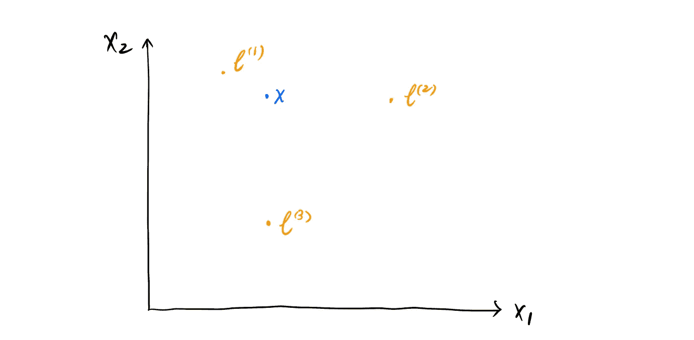

所以这叫做**核函数**，它就是你从上面的公式中看到的精确的‘f’。内核函数内部是什么？换句话说，我们应该如何描述 x 与地标的接近程度？有不同的类型。**高斯核**是最流行的一种。它是用两个向量的欧几里德距离和描述函数平滑度的参数σ计算的。高斯核提供了一个很好的直觉。如果 x ≈ l⁽ ⁾，f1 ≈ 1，如果 x 远离 l⁽ ⁾，f1 ≈ 0。在 Scikit-learn SVM 包中，高斯核被映射到' rbf '，**径向基函数核**，唯一不同的是' rbf '用γ来表示高斯的 1/2σ。

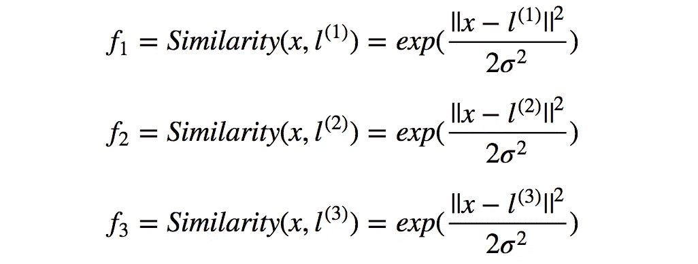

我们可以说样本 x 的位置已经被这三个核重新定义了。也就是说，非线性 SVM 根据与地标的接近度来计算新的特征 f1、f2、f3，而不再使用 x1、x2 作为特征，这是由所选择的地标决定的。这就是θᵀf 原始模型输出的来源。让我们试一个简单的例子。θᵀf = θ0 + θ1f1 + θ2f2 + θ3f3。指定θ0 = -0.5，θ1 = θ2 = 1，θ3 = 0，因此θᵀf 为-0.5 + f1 + f2。查看第一个样本(S1 ),它非常接近 l⁽ ⁾，而远离 l⁽⁾l⁽⁾，具有高斯核，我们得到 f1 = 1，f2 = 0，f3 = 0，θᵀf = 0.5。根据前面提到的假设，预测 1。样本 2(S2)远离所有地标，我们得到 f1 = f2 = f3 =0，θᵀf = -0.5 < 0，预测 0。基于当前的θs，很容易注意到靠近 l⁽ ⁾或 l⁽ ⁾的任何点将被预测为 1，否则为 0。绿线展示了一个大致的决策边界，如下所示。

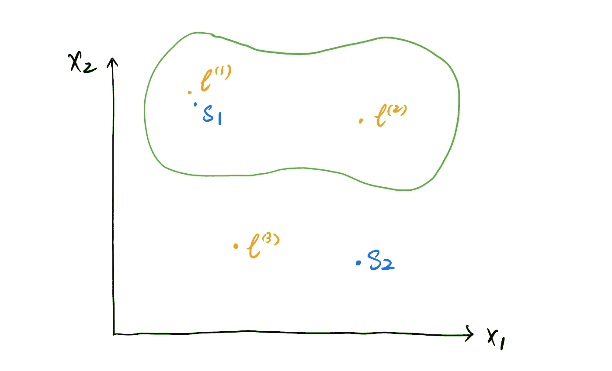

我们刚刚用我手动选择的某些特征和系数完成了预测部分。那么，这些地标来自哪里呢？我们需要多少地标？好吧，你可能会惊讶，给定 m 个训练样本，界标的位置就是你的 m 个训练样本的位置。

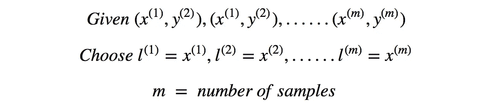

也就是说，非线性 SVM 通过将您的每个训练样本与所有其他训练样本进行比较来重建特征。因此，由标志创建的用于预测的特征的数量是训练样本的大小。对于给定的样本，我们更新了如下功能:

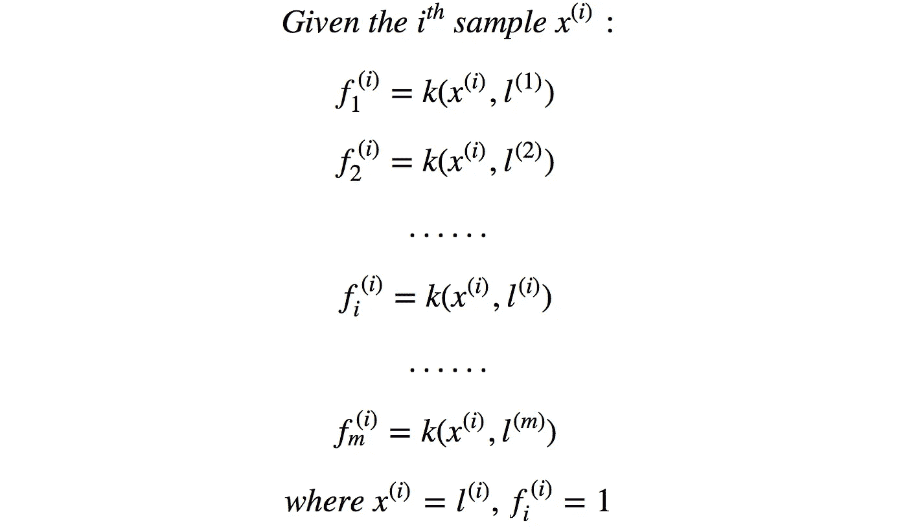

关于重新创建特征，这个概念就像当创建多项式回归以达到非线性效果时，我们可以通过对现有特征进行一些变换(例如平方它)来添加一些新的特征。例如，您有两个特征 x1 和 x2。为了创建多项式回归，您创建了θ0 + θ1x1 + θ2x2 + θ3x1 + θ4x1 x2，因此您的要素变为 f1 = x1，f2 = x2，f3 = x1，f4 = x1 x2

让我们重写假设，成本函数，和正则化的成本函数。

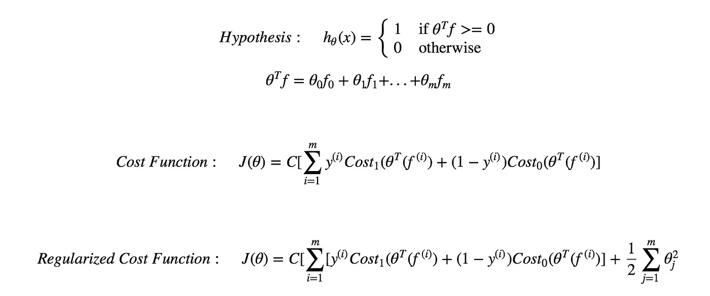

为了获得良好的模型性能并防止过拟合，除了选择适当的正则项 C 值，我们还可以从高斯核中调整σ，以找到偏差和方差之间的平衡。以某个样本 x 和某个地标 l 为例，当σ很大时，核函数 f 的输出接近 1，随着σ变小，f 向 0 移动。换句话说，对于 x 和 l 之间的固定距离，大σ认为它“更近”，具有较高的偏差和较低的方差(欠拟合)，而小σ认为它“更远”，具有较低的偏差和较高的方差(过拟合)。

像逻辑回归一样，SVM 的成本函数也是凸的。SVM 最流行的优化算法是**序列最小优化**，可以用 python **中的‘libsvm’包实现。** SMO 通过将大型二次规划(QP)问题分解为一系列可解析求解的小型 QP 问题来解决该问题，从而在一定程度上避免了耗时的过程。在详细的计算方面，它非常复杂，包含许多数值计算技巧，使得处理非常大的训练数据集的计算更加有效。

总之，如果您有大量的要素，线性 SVM 或逻辑回归可能是一个选择。如果您的特征数量较少(1000 以下)并且训练样本的大小不太大，则高斯核 SVM 可能很适合您的数据。