# 利用自动化机器学习优化您的电子邮件营销策略

> 原文：<https://towardsdatascience.com/optimize-your-email-marketing-strategy-with-automated-machine-learning-e1bfb8cc171b?source=collection_archive---------11----------------------->

## 个性化自动化

对全球企业来说，优化销售营销支出是一个价值 10 亿美元的问题，因为自 2017 年以来，每年有超过 1 万亿美元用于这项任务。然而，理解营销预算、行动和相关销售之间的关系是具有挑战性的，因为有许多同时发生且相互竞争的内部和外部因素会影响销售(心理、天气、情绪、位置、价格、广告……)。

由于机器学习技术能够在大型数据集上绘制复杂的关系，因此在该领域显示出了有希望的结果，但对于缺乏技术技能和背景的营销人员来说，它们的实施往往是一个障碍。入职顾问数据科学家的成本也很高，效率也很低，因为他们缺乏对市场营销和被营销行业的了解，无法提供有意义和可操作的见解。

在 [Mind Foundry](http://mind foundry.ai) ，我们相信问题所有者应该获得简单而可靠的工具来构建他们自己的数据科学解决方案，这就是为什么我们在 box 中建立了 [AuDaS](https://youtu.be/oovbfGo8Tn4) ，一个自动化数据科学团队。在这篇文章中，我们将看到营销人员如何使用 AuDaS 来设计他们的电子邮件营销活动，以提高他们的客户转化率和保留率。我们将使用 Corefactors.in 在 [Kaggle](https://www.kaggle.com/loveall/email-campaign-management-for-sme/home) 上托管的数据集。根据客户的各种属性和电子邮件的内容，我们试图预测的 3 种电子邮件状态是“忽略”、“已读”和“已确认”。

## 阶段 1:数据探索

将数据集上传到 AuDaS 后，我们会看到数据的快照，以及机器学习生成的关于如何清理和准备数据的建议。

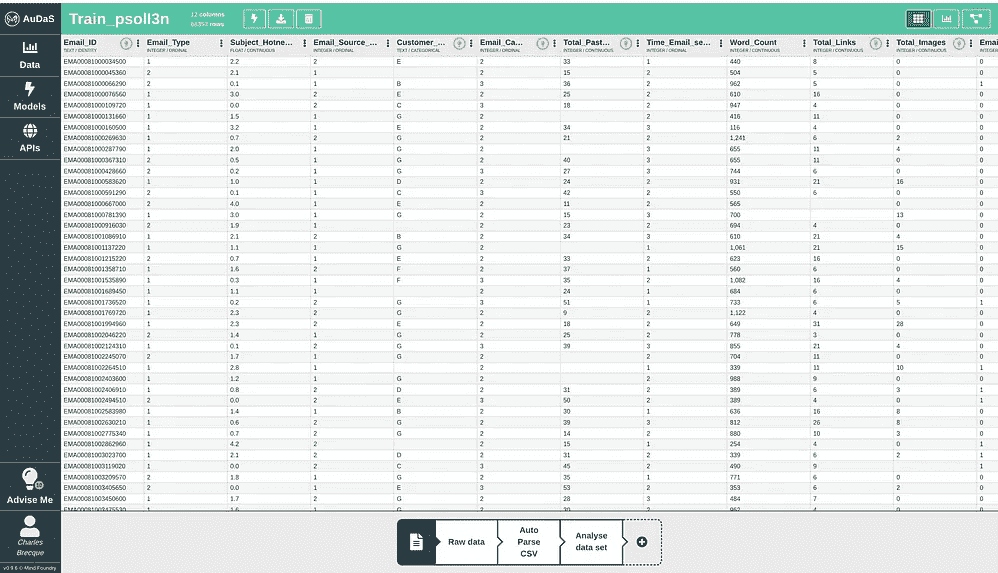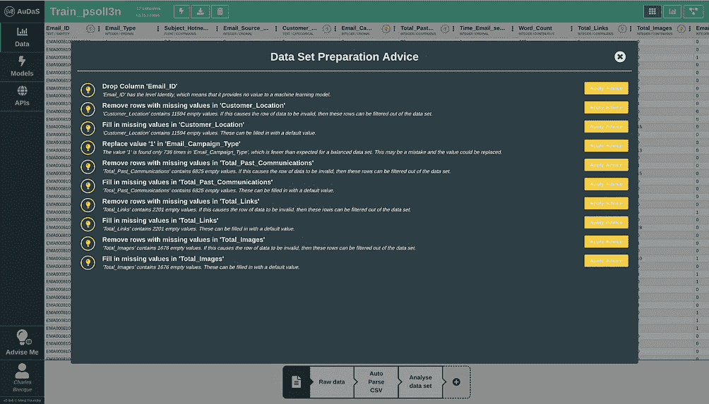

AuDaS Data Preparation

例如，AuDaS 已经检测到 *Email_ID* 列没有预测能力，可以删除。它还检测到几列中缺少的值，并询问用户是希望填充它们还是删除它们。通过查看列名，我们知道可以按如下方式填充它们:

*   总共有 0 个链接、图片和过去的交流
*   客户位置的 NA

下图显示了我们如何通过几次点击来实现建议。

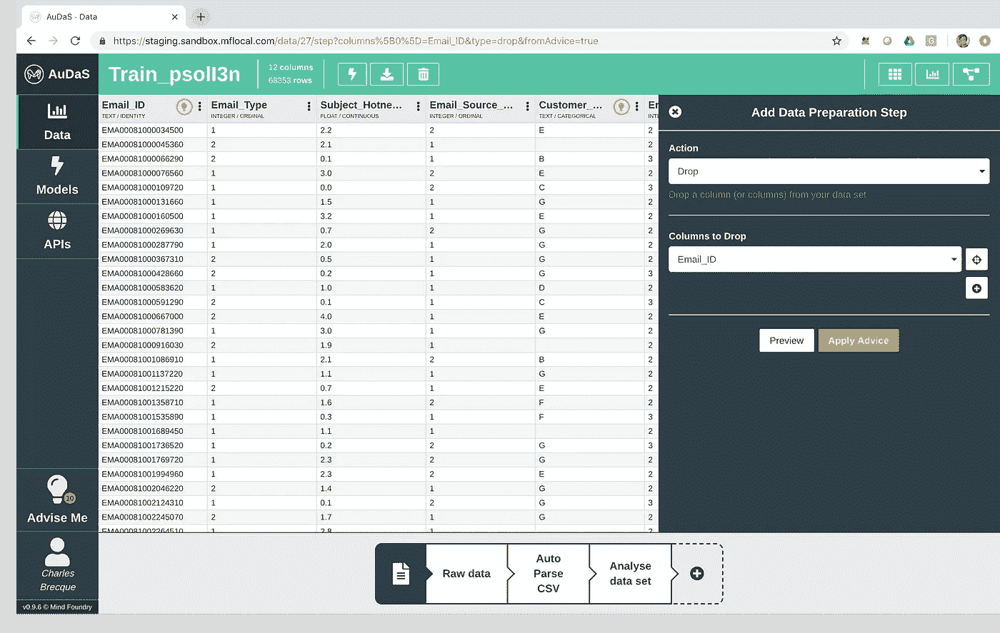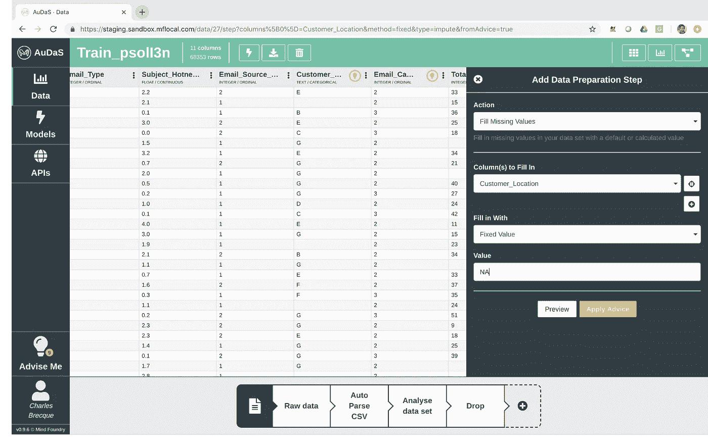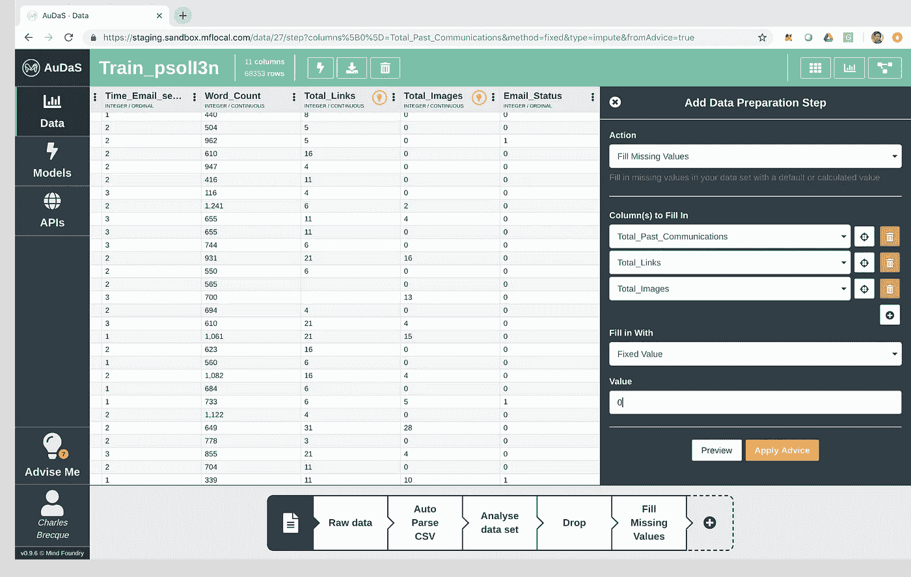

AuDaS 会自动为用户执行建议，同时在屏幕底部为应用于数据的每个操作创建审计跟踪。然后，用户可以返回到数据集的先前版本，并在必要时撤消步骤。

AuDaS 还自动生成直方图和特征相关性，为用户提供数据结构的高级概览。

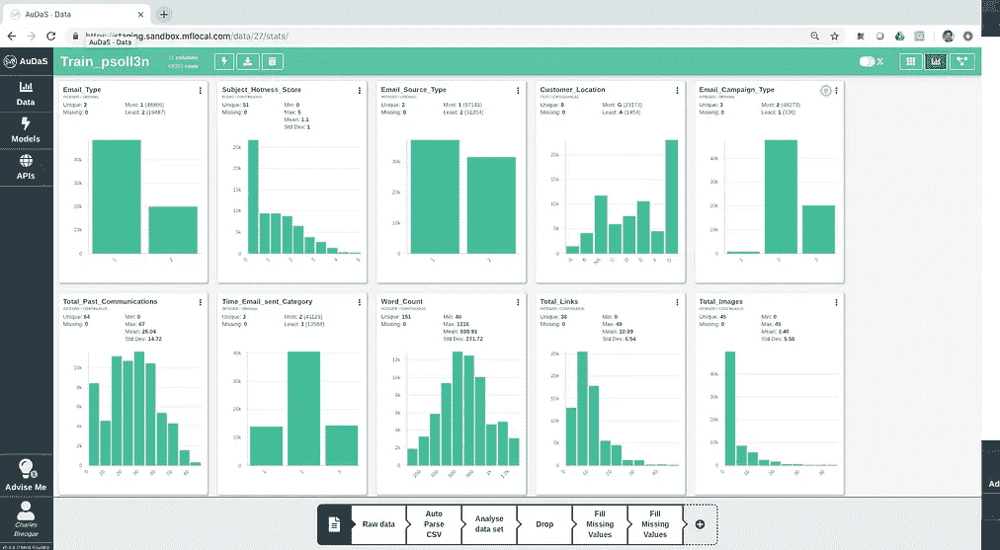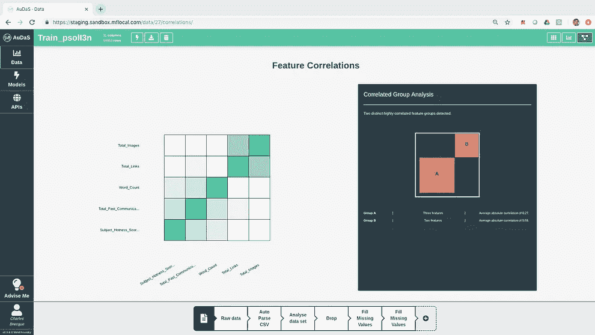

## 阶段 2:建模

对于这个电子邮件营销数据集，我们希望根据其他属性来预测电子邮件的状态(忽略、阅读、确认)，这意味着我们正在尝试解决一个 ***分类*** 问题。

在指定了我们要预测的列( *Email_Status* )之后，AuDaS 提供了一个健壮的框架来构建分类管道，该管道可以推广到其他数据集，而不会失去过多的预测能力，这通常是由[过拟合](https://en.wikipedia.org/wiki/Overfitting)引起的。这包括:

*   出于最终模型验证的目的，自动保留数据集的 10%平衡保留
*   执行 10 重交叉验证
*   优化 F1 分数

高级用户可以将这些默认值更改为他们的首选设置(N 倍、分割、可优化指标等)。

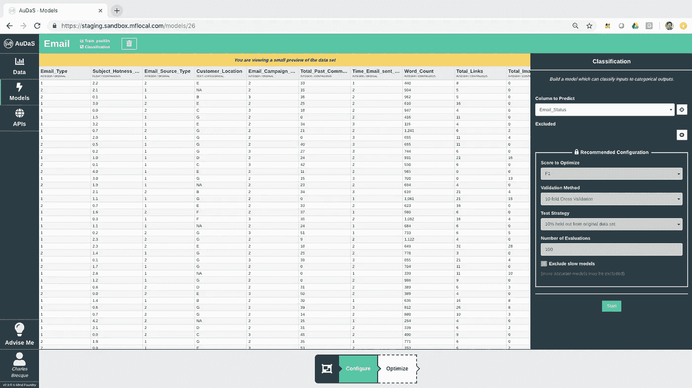

然后，AuDaS 将使用 Mind Foundry 的专有贝叶斯优化器( [OPTaaS](https://optaas.mindfoundry.ai) )在数百万个可能的解决方案中高效导航，以在不到 100 次迭代中确定最佳分类管道(特征工程、模型和最佳参数)。

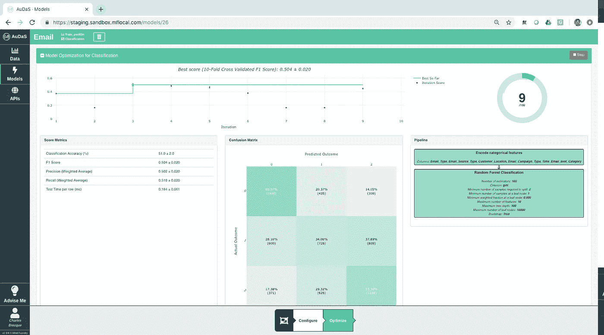

在执行这种搜索时，AuDaS 向用户提供了关于测试管道、模型和参数值及其相关性能统计和特征相关性的完全透明性。

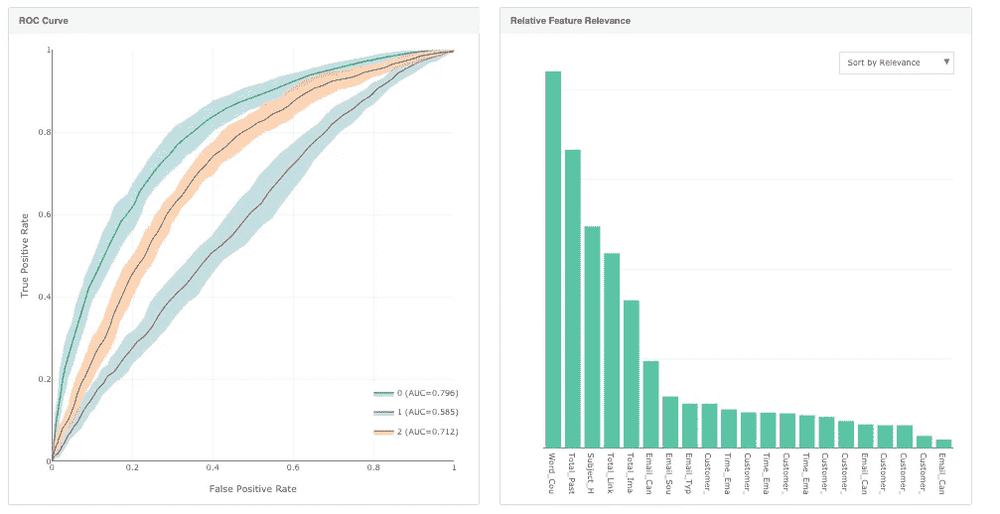

对于指定的分类模型，字数、过去的总通信量和主题热度是预测电子邮件状态的最相关的特征。用户还可以访问 AuDaS 尝试过的所有单一模型的完整审计跟踪。

## 阶段 3:模型验证和部署

当用户对模型性能满意或已经完成 100 次迭代时，AuDaS 将在 10%平衡支持下验证模型，并提供模型健康建议。在我们的案例中，对保留数据的测试与优化过程中的交叉验证测试一致，模型健康状况良好。这意味着用户可以对模型提供的见解充满信心，并将其部署到生产中。

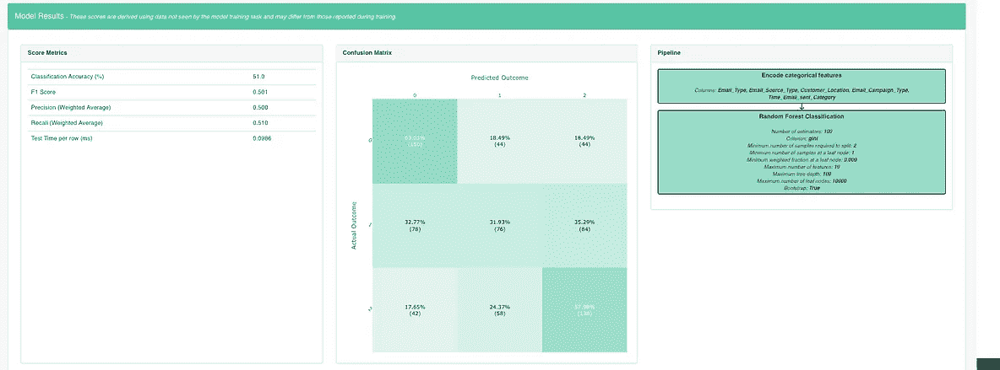

然后，用户可以上传测试集来预测电子邮件状态结果，对模型进行评分，或者通过可以集成到您的产品中的 RESTful API 自动部署它。

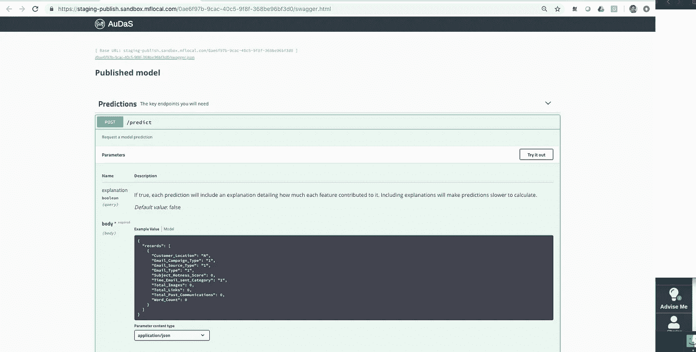

API documentation for the classification model

AuDaS 还提供了对预测的时间解释，让你了解每个特征对预测结果的贡献。一个简单的 web 应用程序展示了你如何与训练好的模型进行交互:

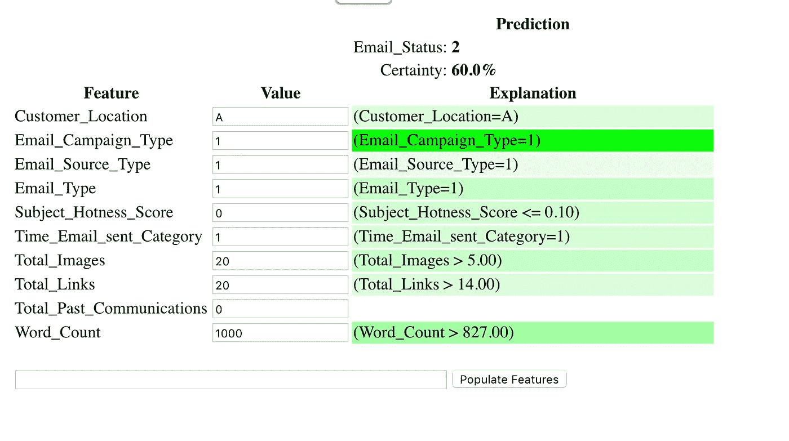

## 阶段 4:提高性能

在我们的第一次运行中，我们对所有 3 个类的分类准确率为 51%,这比随机分类要好，但并不理想。我们知道电子邮件状态值 0、1、2 代表忽略、已打开和已转换，为了提高模型的性能，我们可以尝试重新组合 0 和 1，因为它们的结果对于营销人员来说是相同的。通过在数据准备阶段重新分组类别并重新训练模型，我们能够在 10%的保留率上实现 73.7%的更好的分类准确度。

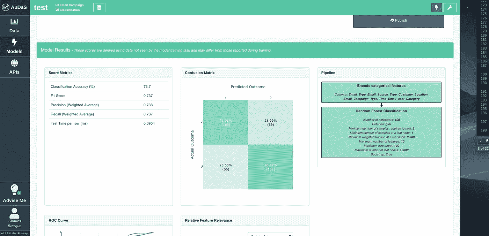

更完整的教程可以在下面查看:

如果您喜欢这篇文章，并且很想知道您还可以用 AuDaS 解决什么问题？检查我的其他职位如下:

 [## 利用 AuDaS 在几分钟内解决 Kaggle Telco 客户流失挑战

### AuDaS 是由 Mind Foundry 开发的自动化数据科学家，旨在允许任何人，无论是否有…

towardsdatascience.com](/solving-the-kaggle-telco-customer-churn-challenge-in-minutes-with-audas-2273fed19961) 

如果你有兴趣尝试奥达斯，请不要犹豫，联系 [out](http://Charles.brecque@mindfoundry.ai) ！

【**更新**:我开了一家科技[公司](http://www.legislate.tech)。你可以在这里找到更多的

## 团队和资源

Mind Foundry 是牛津大学的一个分支机构，由斯蒂芬·罗伯茨(Stephen Roberts)和迈克尔·奥斯本(Michael Osborne)教授创建，他们在数据分析领域已经工作了 35 年。Mind Foundry 团队由 30 多名世界级的机器学习研究人员和精英软件工程师组成，其中许多人曾是牛津大学的博士后。此外，Mind Foundry 通过其分拆地位，拥有超过 30 名牛津大学机器学习博士的特权。Mind Foundry 是牛津大学的投资组合公司，其投资者包括[牛津科学创新](https://www.oxfordsciencesinnovation.com)、[牛津技术与创新基金、](http://www.oxfordtechnology.com)、[牛津大学创新基金](https://innovation.ox.ac.uk/award-details/university-oxford-isis-fund-uoif/)和 [Parkwalk Advisors](http://parkwalkadvisors.com) 。