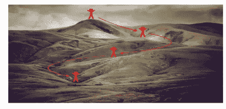
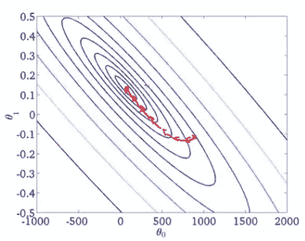
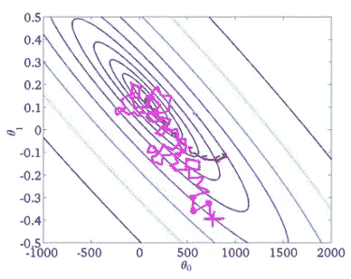
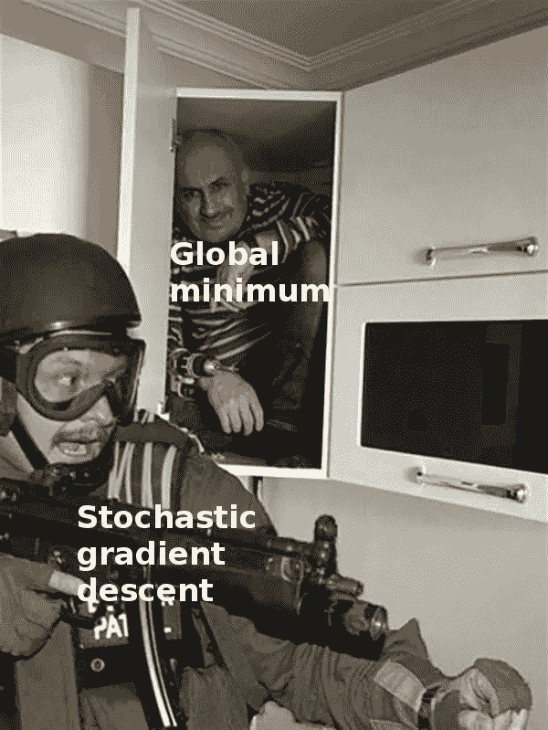
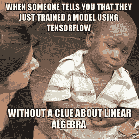

# 优化器是 TensorFlow 的开胃菜

> 原文：<https://towardsdatascience.com/optimizers-be-deeps-appetizers-511f3706aa67?source=collection_archive---------6----------------------->

Photo by [Patrick McManaman](https://unsplash.com/@patmcmanaman?utm_source=medium&utm_medium=referral) on [Unsplash](https://unsplash.com?utm_source=medium&utm_medium=referral)

随着大量深度学习框架的兴起，训练深度学习模型变得日益容易。TensorFlow 就是这样一个框架。

尽管最初只在谷歌内部使用，但它在 2015 年被开源，此后一直是 ml 爱好者和研究人员使用最多的框架之一。

但是不管这个框架对我们有多大帮助，还是有一些超参数会对我们训练的模型产生重大影响。改变一个超参数，也就是说，tensorflow 中的一行代码可以让你从 70%的准确率达到最先进的水平。

在 TensorFlow 中，为了调整我们的模型，我们必须做出一些优化选择。正如该领域的许多领导者所说，机器学习是一个高度迭代的过程。选择超参数没有硬性规定。你必须遵循这个过程

***试→调→提高→试→调→提高→试→***

在使用 TF 时，您会遇到两个重要的超参数。他们是**初始化器**和**优化器**。

想象一下“ ***成本山*** ”。

我们的目标是到达成本山的底部。

The “cost hill”

> 把初始化器看作是你开始下坡路的起点。和优化器作为你走下坡路的方法。

**初始化器**用于初始化我们神经网络各层之间的权重。虽然我们可能会认为它们只是我们探索“成本山”*底部之旅的随机起点，但它们远不止看上去那么简单。*

*阅读这篇关于为什么初始化如此重要的博客。*

* [## 神经网络的随机初始化:过去的事情

### 最近，神经网络已经成为几乎所有机器学习相关问题的解决方案。仅仅是因为…

towardsdatascience.com](/random-initialization-for-neural-networks-a-thing-of-the-past-bfcdd806bf9e)* 

*然后我们有**优化器。它们被用来决定我们下坡的步伐。我们可以通过三种主要方式实现这些跨越。***

1.  *批量梯度下降*

*2.小批量梯度下降*

*3.随机梯度下降*

***我们培训流程中的一个步骤包括以下内容**:*

*正向传播→寻找成本→反向传播→寻找梯度→更新参数*

***批量梯度下降**是指我们的整个训练集(即:我们的“m”个训练示例中的每一个)用于上述步骤。对“m”个训练样本进行前向传播，计算成本，对所有“m”个训练样本进行后向传播。对所有“m”个训练样本计算梯度。并且参数被更新。*

*简而言之，在向成本山的底部迈出一小步之前，计算机必须经历所有的“m”训练示例。当训练集示例的数量很小时，比如说在 1000 到 5000 之间，这是理想的。但在通常包含数百万训练样本的现代数据集上，这种方法注定会失败。原因是缺乏计算能力和磁盘空间来一次性计算所有的训练集示例。毕竟，我们只能朝着“成本山”向下迈出一小步。*

**

*batch gradient descent as shown on a slide from Andrew N G’s machine learning course on Coursera*

*注意成本是如何均匀地直线下降到成本山的底部的。这是在梯度下降的每一步中使用我们所有的‘m’训练示例的优势。这是因为我们使用所有梯度的平均值来更新我们的参数，这将最有可能直接朝着最小成本的方向。*

***随机梯度下降**是一种方法，在这种方法中，我们一完成对每个训练集示例的计算，就开始采取向下的步骤。这有助于我们通过使用来自每个训练集示例的梯度来更新参数，从而在向下的旅程中尽快取得进展。这样，我们将在整个训练集的一次通过中向底部迈出“m”步，而不是在批量梯度下降中仅迈出一步。*

*这种方法可以快速得出结果，但有两个主要缺点:*

*首先，由于我们的每个训练集示例都是不同的，对每个示例计算的梯度都指向不同的方向，因此我们不会直接朝着最小成本的方向前进，而是不一致地、有效地朝着最小成本的方向前进。因此，参数实际上永远不会达到最小成本点，而只会一直在它的附近盘旋。*

*随机梯度下降的第二个缺点是，我们将失去向量化对代码的影响。矢量化是深度学习的核心，这是我们的计算机能够以如此快的速度执行如此复杂的计算的原因。在随机梯度下降中，由于计算是在每个训练集示例上一个接一个地进行的，因此必须使用 for 循环来遍历训练集，与矢量化计算相比，这可能需要花费一生的时间。*

**

*this image shows stochastic gradient descent*

*请注意成本如何有效地朝着成本最小点前进，但不是直接到达那里。它也永远不会真正达到最低成本，它只能在自己的区域内循环。*

**

*[https://www.facebook.com/convolutionalmemes/](https://www.facebook.com/convolutionalmemes/)*

*这就是**小批量梯度下降**发挥作用的地方。它处于批量梯度下降和随机梯度下降之间最佳点。我们不想通过一次获取所有的训练样本来浪费计算能力和内存。我们也不想因为一次只取一个训练样本而失去矢量化的能力。所以我们一次取多个训练样本，通常是 2 的幂。通过这种方式，我们可以在遍历整个训练集之前开始采取向下的步骤，而且还可以利用矢量化的能力来实现快速计算和更少的内存需求。*

*这是通过将我们的训练集分成固定数量的样本来完成的。这个数字被称为批量。它通常是 2 的幂。32 和 64 是常见的批量大小。训练集首先被混洗，因为我们不希望在每个时期计算相同的批次(一个时期是一次通过整个训练集，一个迷你批次接一个迷你批次)。下面给出了将训练集分割成小批次的代码。*

*我在 TensorFlow 中训练了一个模型，使用时尚-MNIST 数据集识别 10 种不同类型的衣服。该数据集由 70，000 幅灰度图像组成。每张图片属于十类服装中的一类。*

*这是我在 [**GitHub**](https://github.com/aditya9898/tensor-fashion) 上训练过的模型的代码。*

## *一如既往的快乐学习。*

**ps:忽略俗气的标题**

**