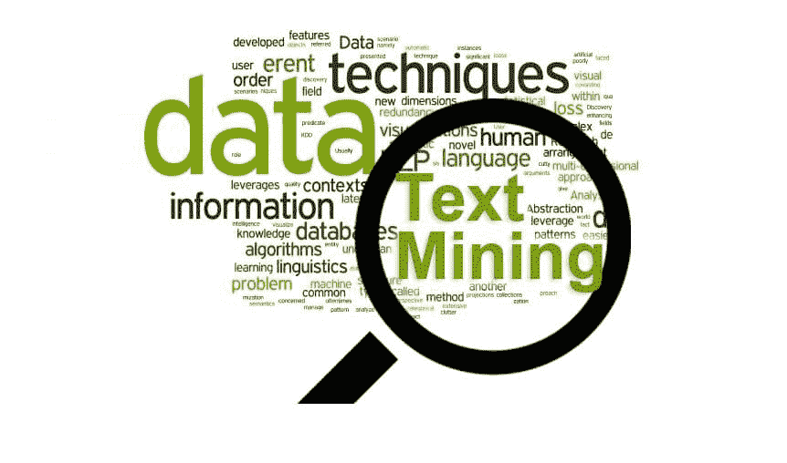
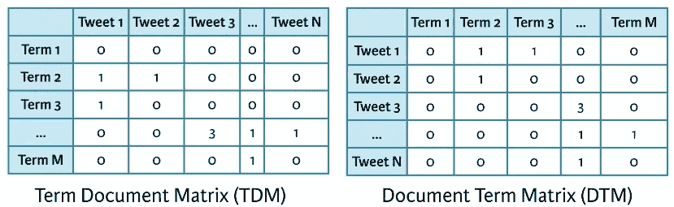
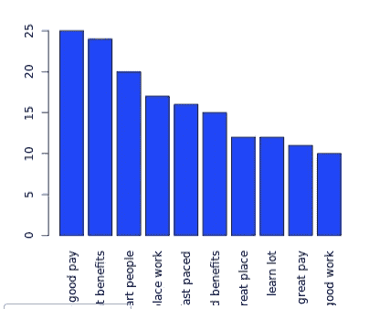
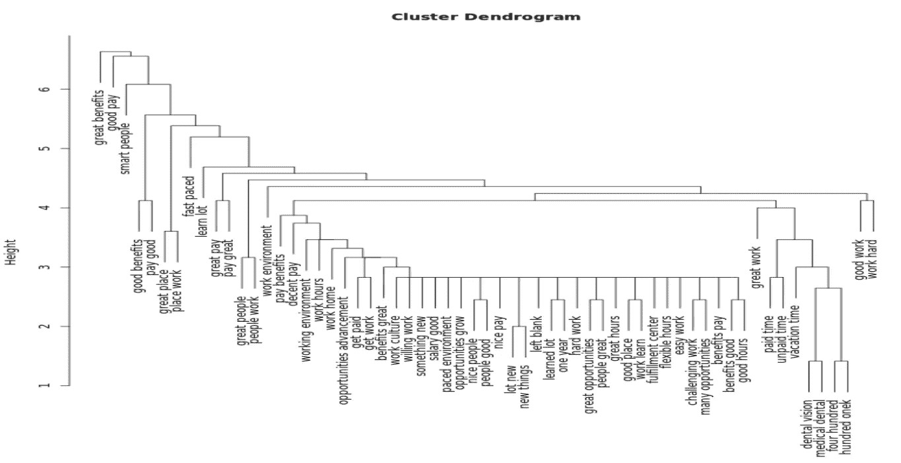
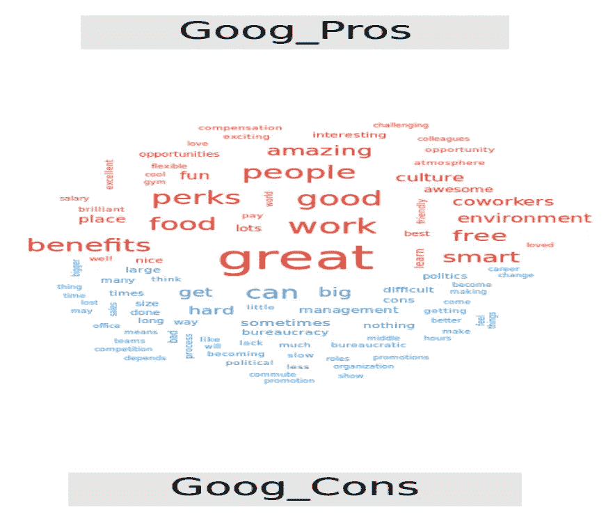

# 组织你的第一个文本分析项目

> 原文：<https://towardsdatascience.com/organizing-your-first-text-analytics-project-ce350dea3a4a?source=collection_archive---------5----------------------->

> 使用自然语言工具发现会话数据。



**文本分析**或文本挖掘是使用各种方法、工具和技术对自然语言文本中包含的“非结构化”数据进行分析。

如今，文本挖掘的流行是由统计数据和非结构化数据的可用性推动的。随着社交媒体的日益流行，以及互联网成为各种重要对话的中心位置，**文本挖掘提供了一种低成本的方法来衡量公众意见。**

这是我学习文本分析和写这篇博客并与我的数据科学家同事分享我的学习的灵感！

我这篇博客的主要参考是 DataCamp 设计精美的课程[文本挖掘——单词袋](https://www.datacamp.com/courses/intro-to-text-mining-bag-of-words)。

下面是文本挖掘项目的六个主要步骤。在这篇博客中，我将关注第 3、4、5 和 6 步，并讨论 R 中可用于这些步骤的关键包和函数。

# 1.问题定义

确定任何项目的具体目标是项目成功的关键。人们需要对领域有所了解，才能恰当地定义问题陈述。

在这篇文章中，我会问，根据在线评论，亚马逊和谷歌的薪酬水平更高，根据当前员工的评论，哪家的工作生活平衡更好。

# 2.识别文本来源

可以有多种方式来收集员工评论，从 Glassdoor 这样的网站，甚至是与工作场所评论一起发布的文章，甚至是通过员工的焦点小组访谈。

# 3.文本组织

这涉及到清理和预处理文本的多个步骤。R 中有两个主要的包可以用来执行这个: [**qdap**](https://cran.r-project.org/web/packages/qdap/qdap.pdf) 和 [**tm**](https://cran.r-project.org/web/packages/tm/vignettes/tm.pdf) **。**

*要点记住:*

*   tm 包处理文本语料库对象
*   qdap 包直接应用于文本向量

**x - >对亚马逊有正面评价的向量**

```
*# qdap cleaning function* > qdap_clean <- function(x)  {
  x <- replace_abbreviations(x)
  x <- replace_contractions(x)
  x <- replace_number(x)
  x <-  replace_ordinal(x)
  x <-  replace_symbol(x)
  x <-  tolower(x)
  return(x)
}
```

* *根据具体要求，您还可以在上述功能的基础上增加更多清洁功能。

**语料库->v corpus(vector source(x))**

然后使用 *tm_map()* 函数——由 *tm* 包提供——对语料库应用清理函数。**将这些函数映射到一个完整的语料库使得清洗步骤的缩放变得非常容易。**

```
*# tm cleaning function*
> clean_corpus <- function(corpus){
 corpus <- tm_map(corpus, stripWhitespace)
 corpus <- tm_map(corpus, removePunctuation)
 corpus <- tm_map(corpus, content_transformer(tolower))
 corpus <- tm_map(corpus, removeWords, c(stopwords("en"), "Google", "Amazon", "company))
 return(corpus)
}
```

[单词词干](https://nlp.stanford.edu/IR-book/html/htmledition/stemming-and-lemmatization-1.html)和使用 tm 包完成句子上的词干

*tm* 包提供了 *stemDocument()* 函数来获取单词的词根。这个函数要么接受一个字符向量并返回一个字符向量，要么接受一个 PlainTextDocument 并返回一个 PlainTextDocument。

```
*# Remove punctuation*
> rm_punc <- **removePunctuation**(text_data)

*# Create character vector*
> n_char_vec <- **unlist(strsplit**(rm_punc, split = ' '))

*# Perform word stemming: stem_doc*
> stem_doc <- **stemDocument**(n_char_vec)

*# Re-complete stemmed document: complete_doc*
> complete_doc <- **stemCompletion**(stem_doc, comp_dict)
```

*点记:*

定义您自己的 **comp_dict** ，这是一个自定义词典，包含您想要用来重新完成词干的单词。

# 4.特征抽出

在完成了对文本的基本清理和预处理后，下一步就是提取关键特征，可以通过**情感评分**或提取 **n 元图**并绘制的形式来完成。为此，*术语文档矩阵* (TDM)或*文档术语矩阵* (DTM)函数非常方便。



```
*# Generate TDM*
> coffee_tdm <- **TermDocumentMatrix**(clean_corp)

*# Generate DTM*
> coffee_dtm <- **DocumentTermMatrix**(clean_corp)
```

*要点记住:*

当你要复习的单词比文档多的时候，你可以使用 TDM，因为阅读大量的行比阅读大量的列更容易。

然后，您可以使用 as.matrix ()函数将结果转换成矩阵，然后对这些矩阵的各个部分进行切片和检查。

**让我们看一个为二元模型创建 TDM 的简单例子:**

为了创建一个二元模型 TDM，我们使用 *TermDocumentMatrix* ()以及一个接收控制函数列表的控制参数(更多细节请参考 [TermDocumentMatrix](https://www.rdocumentation.org/packages/tm/versions/0.7-3/topics/TermDocumentMatrix) )。这里使用了一个名为*标记器*的内置函数，它有助于将单词标记为二元模型。

```
*# Create bigram TDM*
> amzn_p_tdm <- TermDocumentMatrix(
amzn_pros_corp,
control = list(tokenize = tokenizer))*# Create amzn_p_tdm_m*
> amzn_p_tdm_m <- as.matrix(amzn_p_tdm) 

*# Create amzn_p_freq* 
> amzn_p_freq <- rowSums(amzn_p_tdm_m)
```

# 5.特征分析

有多种方法来分析文本特征。下面讨论其中的一些。

## a.条形图

```
*# Sort term_frequency in descending order*
> amzn_p_freq <- sort(amzn_p_freq, decreasing = TRUE) > 

*# Plot a barchart of the 10 most common words*
> barplot(amzn_p_freq[1:10], col = "tan", las = 2)
```



## b.WordCloud

```
*# Plot a wordcloud using amzn_p_freq values*
> wordcloud(names(amzn_p_freq), amzn_p_freq, max.words = 25, color = "red")
```


要进一步了解绘制 wordcloud 的不同方法，请参考这篇[文章](http://www.sthda.com/english/wiki/text-mining-and-word-cloud-fundamentals-in-r-5-simple-steps-you-should-know)，我发现它相当有用。

**c .聚类树状图**

这是一个简单的聚类技术，用于执行层次聚类并创建一个树状图来查看不同短语之间的联系。

```
*# Create amzn_p_tdm2 by removing sparse terms*
> amzn_p_tdm2 <- removeSparseTerms(amzn_p_tdm, sparse = .993) > 

*# Create hc as a cluster of distance values*
> hc <- hclust(dist(amzn_p_tdm2, method = "euclidean"), method = "complete") > 

*# Produce a plot of hc*
> plot(hc)
```



你可以在整个树形图中看到类似的主题，如“巨大的利益”、“高薪”、“聪明人”等。

**d .单词联想**

这用于检查出现在单词云中的顶级短语，并使用来自 *tm* 包的 *findAssocs()* 函数找到相关术语。

下面的代码用于查找与亚马逊正面评论中最频繁出现的词语最相关的单词。

```
*# Find associations with Top 2 most frequent words*
> findAssocs(amzn_p_tdm, "great benefits", 0.2)
 $`great benefits`
 stock options  options four four hundred vacation time
     0.35          0.28         0.27          0.26
 benefits stock competitive pay   great management   time vacation
     0.22              0.22                  0.22          0.22> findAssocs(amzn_p_tdm, "good pay", 0.2)
 $`good pay`
 pay benefits  pay good  good people  work nice
     0.31        0.23        0.22       0.22
```

**e .比较云**

当您希望一次检查两个不同的单词库，而不是分别分析它们(这可能更耗时)时，可以使用这种方法。

下面的代码比较了对谷歌的正面和负面评价。

```
*# Create all_goog_corp*
> all_goog_corp <- tm_clean(all_goog_corpus) > # Create all_tdm
> all_tdm <- TermDocumentMatrix(all_goog_corp)

<>
Non-/sparse entries: 2845/1713
Sparsity : 38%
Maximal term length: 27
Weighting : term frequency (tf)

*> # Name the columns of all_tdm*
> colnames(all_tdm) <- c("Goog_Pros", "Goog_Cons") > # Create all_m
> all_m <- as.matrix(all_tdm) > # Build a comparison cloud
> comparison.cloud(all_m, colors = c("#F44336", "#2196f3"), max.words = 100)
```



**f .金字塔图**

金字塔图用于显示金字塔(相对于水平条)图，有助于根据相似的短语进行简单的比较。

下面的代码比较了亚马逊和谷歌正面短语的出现频率。

```
*# Create common_words*
> common_words <- subset(all_tdm_m, all_tdm_m[,1] > 0 & all_tdm_m[,2] > 0)
> str(common_words)
 num [1:269, 1:2] 1 1 1 1 1 3 2 2 1 1 ...
 - attr(*, "dimnames")=List of 2
 ..$ Terms: chr [1:269] "able work" "actual work" "area traffic" "atmosphere little" ...
 ..$ Docs : chr [1:2] "Amazon Pro" "Google Pro"

*# Create difference*
> difference <- abs(common_words[,1]- common_words[,2]) >

*# Add difference to common_words*
> common_words <- cbind(common_words, difference) > head(common_words)
 Amazon Pro Google Pro difference
 able work 1 1 0
 actual work 1 1 0
 area traffic 1 1 0
 atmosphere little 1 1 0
 back forth 1 1 0
 bad work 3 1 2

*# Order the data frame from most differences to least*
> common_words <- common_words[order(common_words[,"difference"],decreasing = TRUE),]

*# Create top15_df*
> top15_df <- data.frame(x = common_words[1:15,1], y = common_words[1:15,2], labels = rownames(common_words[1:15,]))

*# Create the pyramid plot*
> pyramid.plot(top15_df$x, top15_df$y,
 labels = top15_df$labels, gap = 12,
 top.labels = c("Amzn", "Pro Words", "Google"),
 main = "Words in Common", unit = NULL)
 [1] 5.1 4.1 4.1 2.1
```


# 6.得出结论

基于上述视觉(“共同语言”金字塔图)，总体而言，亚马逊看起来比谷歌有更好的工作环境和工作生活平衡。亚马逊的工作时间似乎更长，但也许它们为恢复工作与生活的平衡提供了其他好处。我们需要收集更多的评论来做出更好的结论。

所以，最后我们来到这个博客的结尾。我们学习了如何组织我们的文本分析项目，清理和预处理中涉及的不同步骤，以及最终如何可视化功能并得出结论。我正在完成我的文本分析项目，这是基于我的博客和从 DataCamp 学到的东西。我将很快贴出我的 GitHub 项目库来进一步帮助你。我们的下一个目标应该是进行情感分析。在那之前继续编码！！

希望你喜欢这个博客。请在我的下一篇博客中分享你喜欢的内容和希望我改进的地方。

请继续关注这个空间，了解更多信息。干杯！

*(首发@www.datacritics.com)*