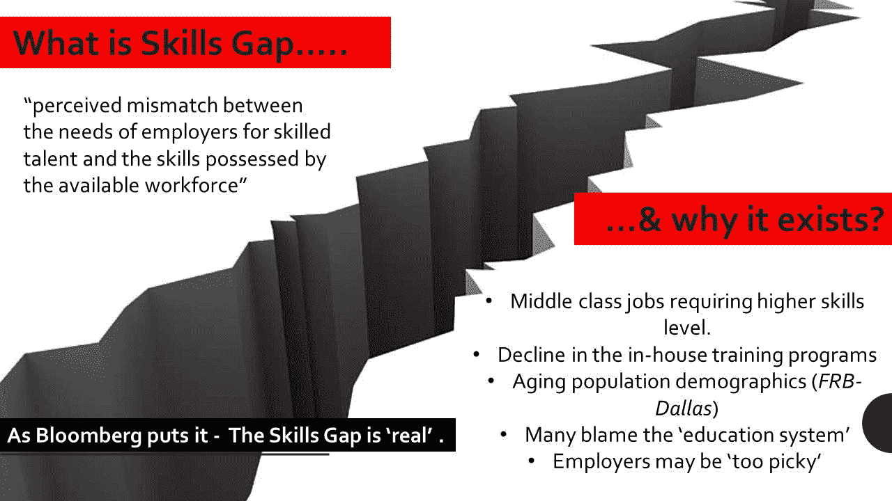
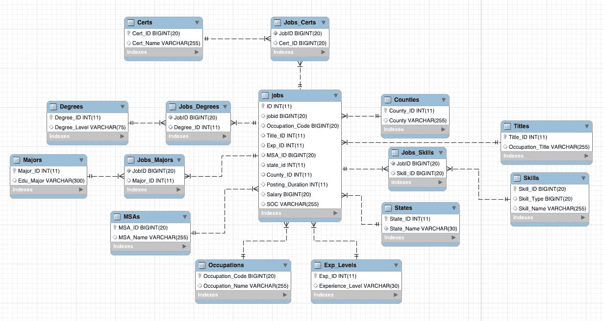
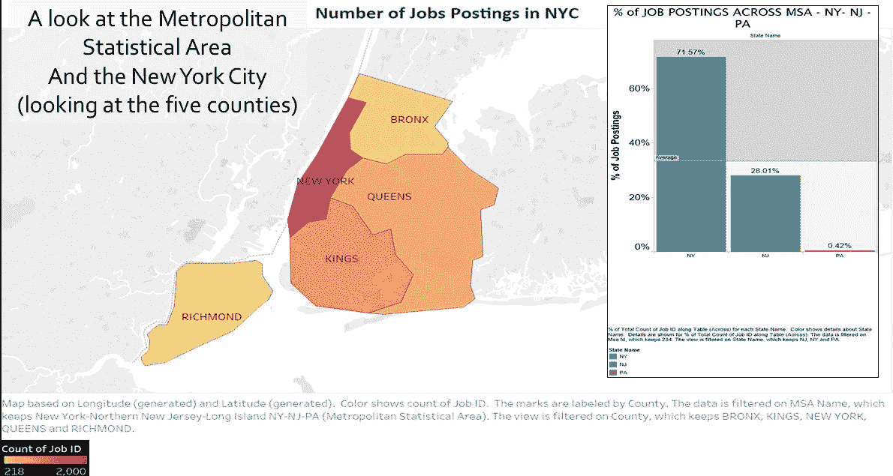
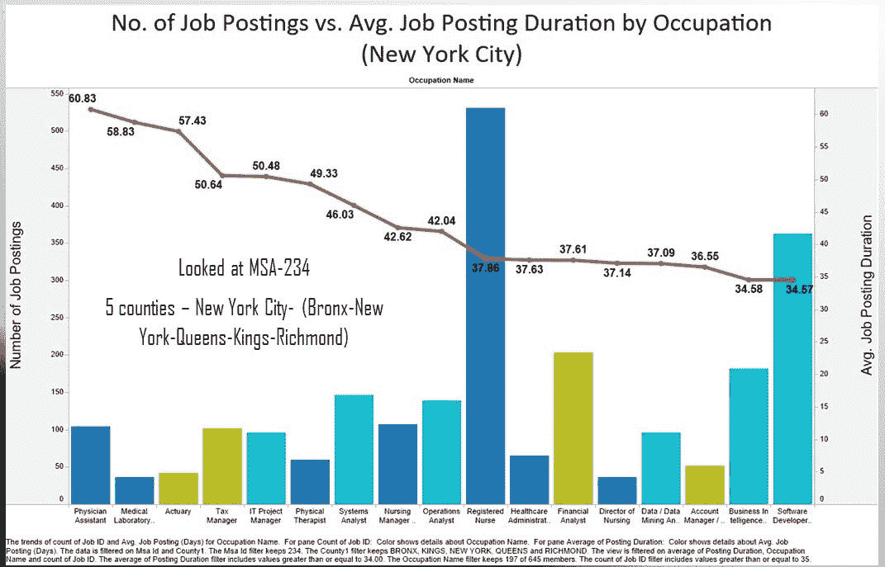
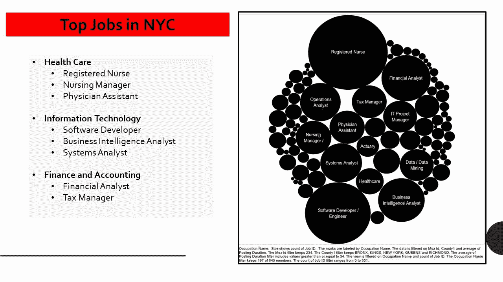
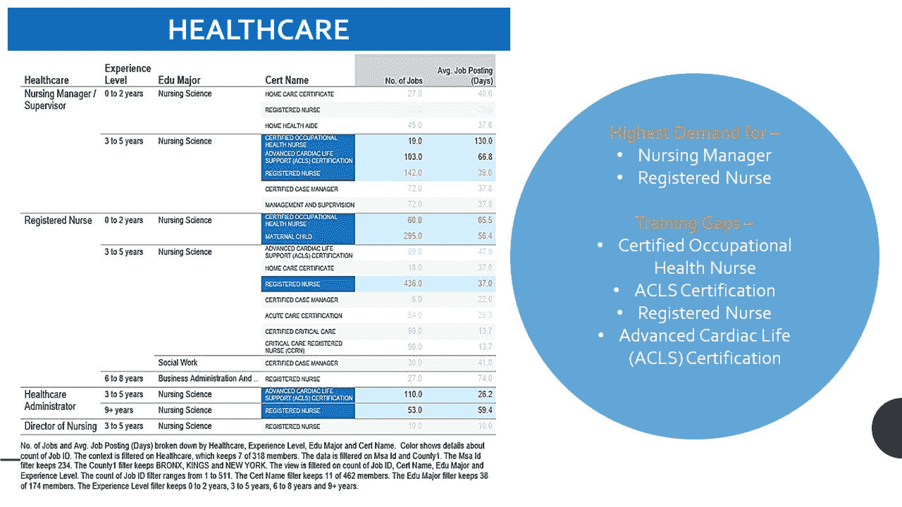
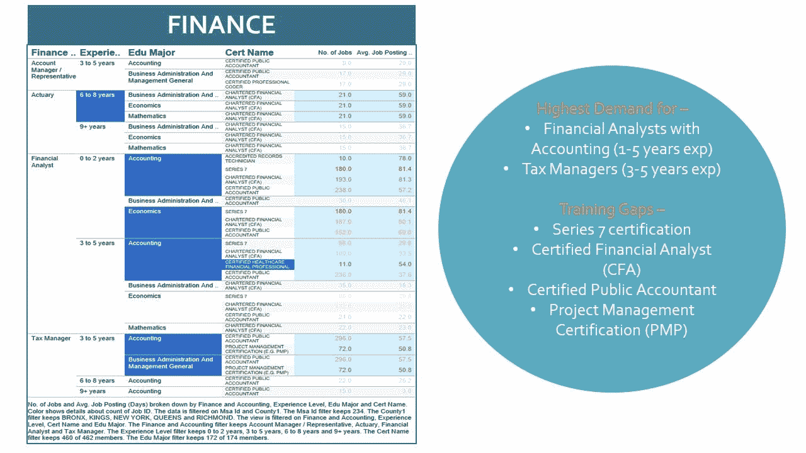
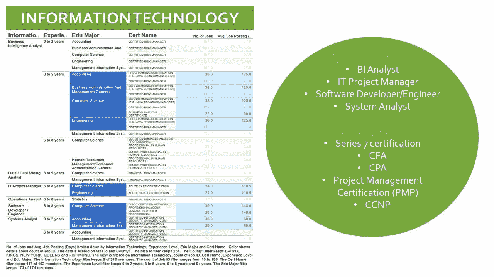
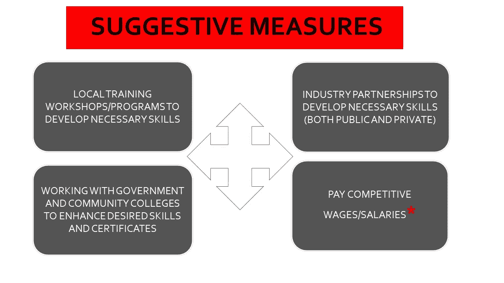
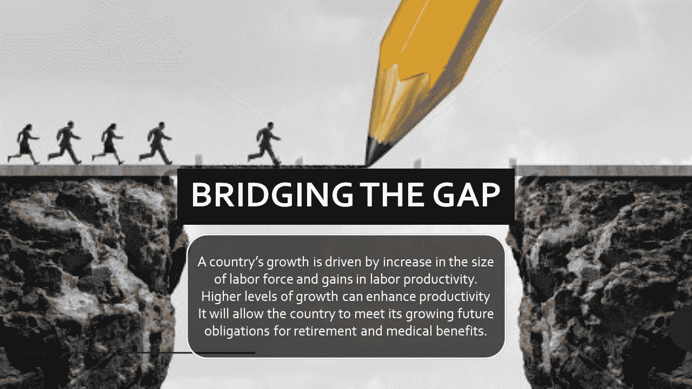

# 缩小纽约市的技能差距

> 原文：<https://towardsdatascience.com/originally-published-on-the-tableau-community-daf58c97e84f?source=collection_archive---------4----------------------->

***原载于*** [***画面***](https://community.tableau.com/blogs/deenazaidi/2017/09/15/bridging-the-skills-gap-in-nyc-a-case-study) ***社区***

D 没有数据可视化，数据分析仍然不完整。

在为期 8 周的数据分析课程中，我很快理解了 Tableau 是一个非常有用的工具，可以用来创建和解释一个严重依赖于大数据的视觉故事。作为一名学生，我得到了 x 案例，这些案例需要数据检索、清理、处理和分析，以便提出适当的建议。

首先，我拥有金融和国际银行的双学位，并对数据分析有所了解。Tableau 的特点不仅易于理解，而且使用简单。从 Excel 到 R 再到 SQL，最后到 Tableau 的有趣旅程是一次很棒的经历，在我的课程结束后，我很兴奋地分享了一个严重依赖 Tableau 的项目。

我把这个项目分成了四个部分

1.  这个问题
2.  答案

*   该过程
*   调查结果

3.局限性

4.结论

我首先研究了这个问题，了解了缺少什么数据，并试图在我的 SQL 工作台中检索和创建一个实体关系图。由于重点是纽约市-MSA 地区，后来又将其削减至仅纽约市，我必须确保我筛选的数据仅反映了问题所在。我的发现是基于这些数据以及它们被分类和清理的方式。根据检索到的数据，我注意到各州技能的供需不匹配。我的 Tableau 工作表还查看了 11 个州的平均发布持续时间，我保持在 35 天。

下表总结了平均持续时间(以天为单位),并将其与所有州的职位发布百分比进行了比较。

**问题**

布鲁金斯学会最近对 Burning Glass 数据的研究发现，在全国范围内，STEM 职位空缺的广告持续时间中位数是非 STEM 职位空缺的两倍多。这个案件围绕着教育和领先的劳动力市场分析公司——燃烧的玻璃公司正在进行的辩论。该案件旨在-

该案件旨在-

*   评估纽约市技能差距
*   向纽约市技能联盟(NYCSC)提供数据驱动的建议
*   帮助在十年内拨款 1 亿美元用于发展纽约市的劳动力。

**据*全国独立商业联合会*T21:**

> *截至 2017 年第一季度，45%的小企业报告称，他们无法找到合格的申请人来填补职位空缺。*

# 答案

为了评估城市的技能，详细的路线图需要联邦、州和私人基金会的合作努力。为了回答这个问题，我首先处理数据，然后根据调查结果看一些建议性的措施。

**流程**

在进入数据集之前，我首先试图理解技能差距的含义以及它为什么存在。简而言之，它是可获得的工作的需求和供应与理想候选人所需的必要技能之间的差异。由于各种因素，包括工作机会不足和缺乏适当的技能组合，这些差距有时会存在。

数据是 CSV 格式，有不同的职业，技能，县。重复项被删除，N/A 值被转换为空值。

使用 MySql Workbench 创建了一个实体关系图(ERD ),以便使用主键和外键对数据进行排序和连接。

**调查结果**

创建 ERD 后，我查看的信息仅限于纽约市。纽约市的五个县是布朗克斯、金斯、纽约、皇后区和里士满。我使用 R 来执行这个任务，并利用可用的数据，使用 Tableau 创建一个热图。数据显示，纽约市的职位发布数量最多，然后，我将重点放在纽约、新泽西和宾夕法尼亚三州的职位发布百分比上，以分析纽约的情况。

Tableau 中的这些发现如下

然后，我试着深入了解某个职位空缺需要多长时间。为此，我按职业(仅针对纽约市)将职位发布数量与平均职位发布时长进行了比较。我的发现表明，纽约市的缺口主要是由缺乏具备特定技能的工人造成的。MSA 地区代码是 234。

纽约的顶级职位来自三个行业:医疗保健、信息技术和金融会计。我试着使用 Table 创建一个气泡图来查看热门职位。(*点击下图放大*)

然后对纽约的顶级工作进行深入分析，我试图通过编辑经验水平、教育程度、证书名称来做到这一点。相应地，我会查看职位的数量以及这些职位发布后未被填补的平均天数。调查结果如下

**1。医疗保健行业**

医疗保健行业似乎对护理经理和注册护士的需求最大，下面列出了这些职位所需的证书。培训缺口很有可能是由于护理经理和注册护士没有必要的证书，使他们没有资格申请职位。

*(点击下方放大图片)*

**2。金融业**

通过 Tableau 查看可用数据并简化视觉效果，我的发现表明，对具有会计背景的入门级财务分析师和具有 3-5 年工作经验的税务经理有巨大的需求。仔细看，注册会计师和注册金融分析师课程是金融分析师寻求弥合技能差距的热门选择。

*(点击下方放大图片)*

**3。信息技术产业**

第三个可以从资金中获益的行业是信息技术行业。

通过数据排序，并在 Tableau 的帮助下，我能够直观地看到可能受益的顶级职位是商业智能分析师、it 项目经理、软件开发人员/工程师和系统分析师。对这些头衔的这种需求意味着两件事:要么是巨大的需求也能很快得到满足，要么是缺乏技能，这可能导致招聘进展缓慢。

就 IT 行业而言，后者似乎是正确的。仔细观察，可以得出这样的结论:像系列 7，项目管理认证(PMP)等证书将增加简历的价值的职位需求很高。虽然这对于处于中高层的人来说可能是正确的，但在早期阶段获得这样的证书可能会让一个值得的候选人在招聘名单上名列前茅。

*(点击下方放大图片)*

但是这个百万美元的问题仍然存在:在技能差距分析之后，地方当局可以采取什么样的建议性措施来缩小差距，使纽约市的就业率上升。经过彻底的文献回顾，我设计了几个步骤作为建议性措施，可以让企业、政府以及非营利组织更多地参与进来。

***** *表示支付有竞争力的薪酬可能是一种建议性措施，但所用数据可能/可能不支持这一点。这一措施是基于广泛的二手文献。*

**局限性**

像大多数情况一样，所提供的数据受到一些限制，可能/可能无法确定上述措施。考虑的最大限制之一是数据的年份。由于没有提供年份，这一发现可能意味着 2016 年或 2017 年不成立。此外，在清理和分类时，无法获取有多少在职人员、失业者或劳动力中的工人拥有填补需求岗位所需的技能。当清理后的非结构化数据包含形成强大分析所需的必要组件时，可以做出谨慎的决策。从数据来看，工资没有被考虑在内，因为它很少，而且仅仅是因为缺少日期，很多数据都丢失了。由于没有可能影响数据集的实时信息或附加信息，建议也可能不同。

有时，行政管理的变化允许新的劳动法律法规生效。通过发送的数据给出的建议也可能不同，因为对实时信息或附加信息没有责任。我也观察了纽约市的整个城市，但我确信还有进一步分析的空间，观察单个县可能会显示技能差距的变化。

**结论**

**参考文献**

*   *哥伦比亚大学在线图书馆*
*   *“特朗普推进就业培训，将‘技能差距’辩论推向前台”——《纽约时报》，2017 年*
*   *Inc.com&彭博*
*   *美国达拉斯联邦储备银行*
*   *图片提供:知识共享/Flickr/Instagram*
*   [白皮书:“工作中的新技能:缩小技能差距”](https://www.jpmorganchase.com/corporate/Corporate-Responsibility/document/54841-JPMC-GAP-REP-AW6.pdf)
*   [白皮书:“通往繁荣之路:迎接挑战，让美国年轻人为 21 世纪做好准备”](https://dash.harvard.edu/bitstream/handle/1/4740480/Pathways_to_Prosperity_Feb2011-1.pdf?sequence=1)
*   [未来的工作](http://www.jff.org/)