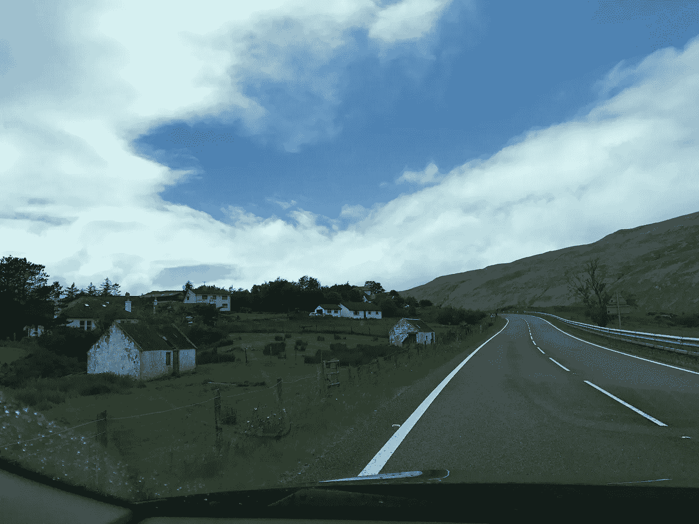
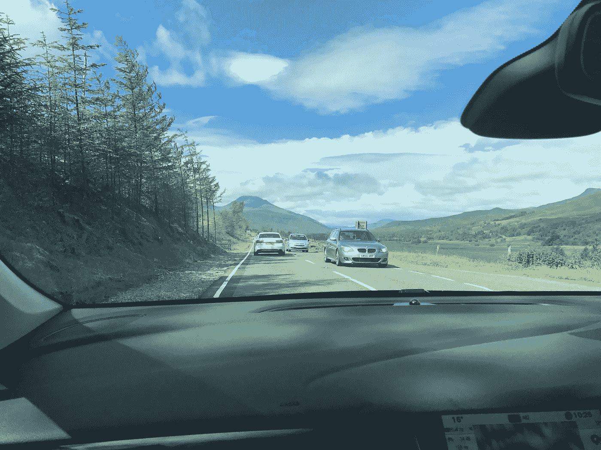
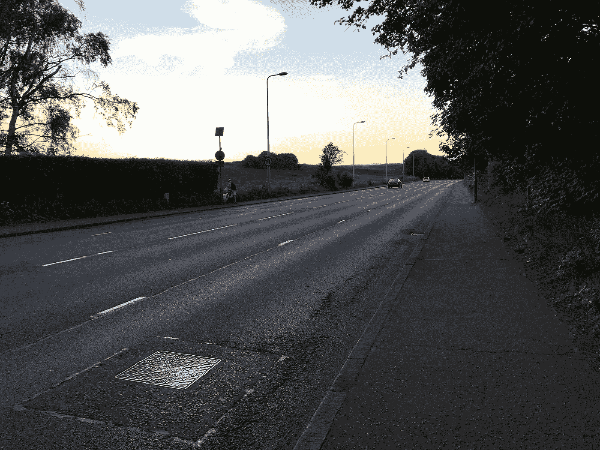
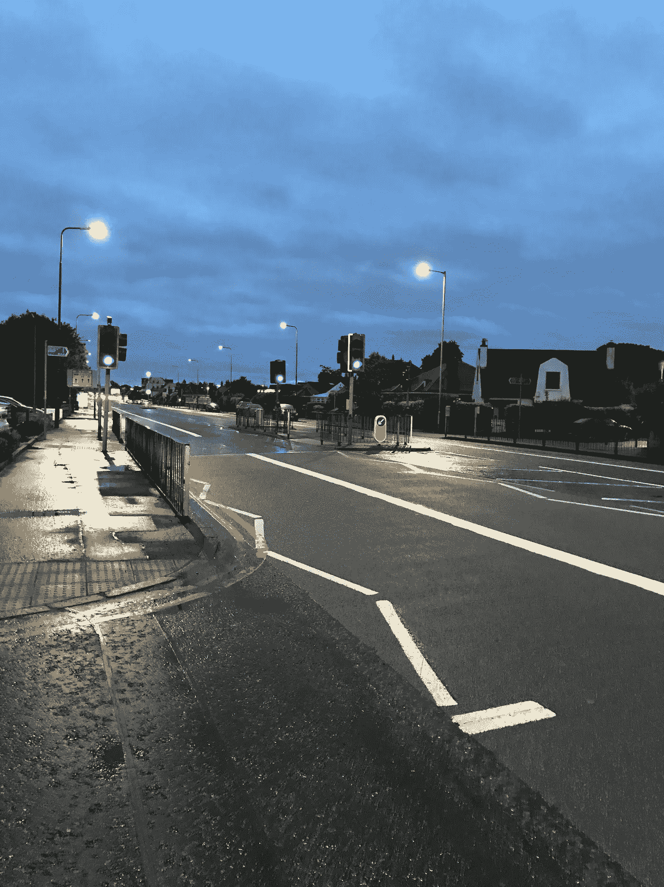
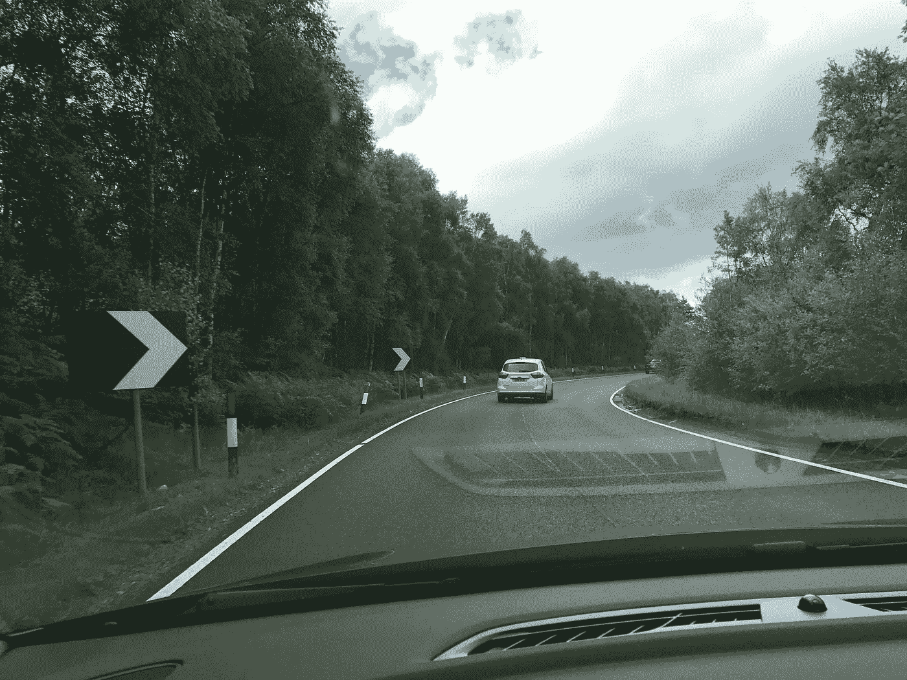
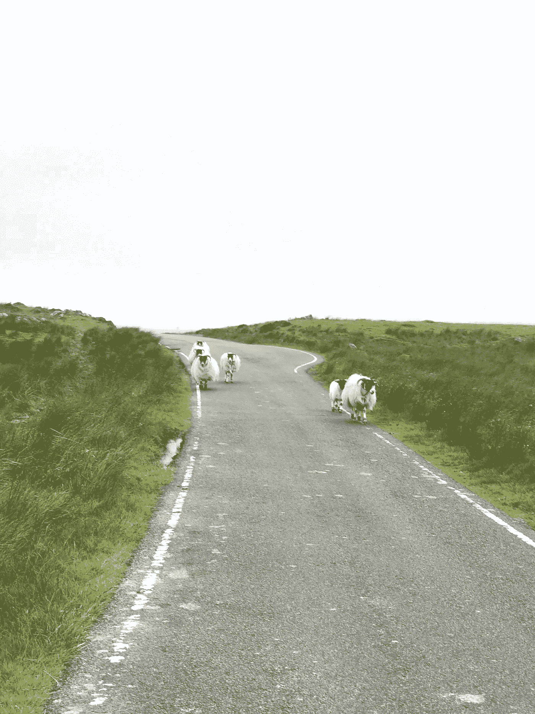

# 池塘的另一边，路的另一边

> 原文：<https://towardsdatascience.com/other-side-of-the-pond-other-side-of-the-road-dd36538916bc?source=collection_archive---------10----------------------->

我刚从苏格兰出差回来，我觉得讨论自动驾驶汽车在不同国家之间的差异会很有趣。从美国到英国有一个非常明显的区别——汽车在路的另一边行驶！但是还有许多其他重要的不同之处。

在美国，如果你来到下面这条路，你可能会认为它是单行道。

All white lines in the US would indicate one-way…

但是你错了。

White lines in the UK can also separate driving directions.

在美国，白线通常用于指示你右边的道路外侧(在英国，人们天真地认为它会指示左边的道路)，白色虚线指示同一方向的其他车道。黄线是用来指示你的方向和相反方向的车道之间的界限。英国用稍微长一点、近一点的白线来表示行驶方向的不同，用黄线来表示“禁止等待”区域。

The shorter lines are for lanes in the same direction, the longer ones separate directions.

Notice the yellow lines on the outside, indicating a no waiting area.

当然还有下面的弯曲线，我以前从未见过，但显然是向司机表明他们正在接近人行横道，除非允许行人穿过，否则不允许在该区域停车。

Approaching a pedestrian crossing

我错过了另一个不同之处的照片，这一次是刹车灯——英国使用(在我看来非常有用)一种在绿灯之前发出红色和黄色光的灯。这有助于提醒驾车者是时候踩油门了(或者，似乎是为了说明更常见的手动变速器启动所需的时间)。

在美国，经常有没有完整车道标志的区域，比如下面，这里实际上是一条双向道路。

A two-way road with little room for error

鉴于最近关于[沃尔沃与袋鼠](https://www.theguardian.com/technology/2017/jul/01/volvo-admits-its-self-driving-cars-are-confused-by-kangaroos)之间的困难的新闻，我想我也应该分享下面的图片(再次是一条双向交通的道路——有弯道要通过)。无论汽车在哪里，识别动物路障都将是一个问题。

“Don’t mind us”

对于任何试图制造可在多个地点使用的无人驾驶汽车的公司来说，解决国家和地区之间的一些差异无疑是一个挑战。也许为长途旅行下载 GPS 地图也需要汽车为旅行区域下载不同的规则和感知模型。这将是一个很难解决的问题。