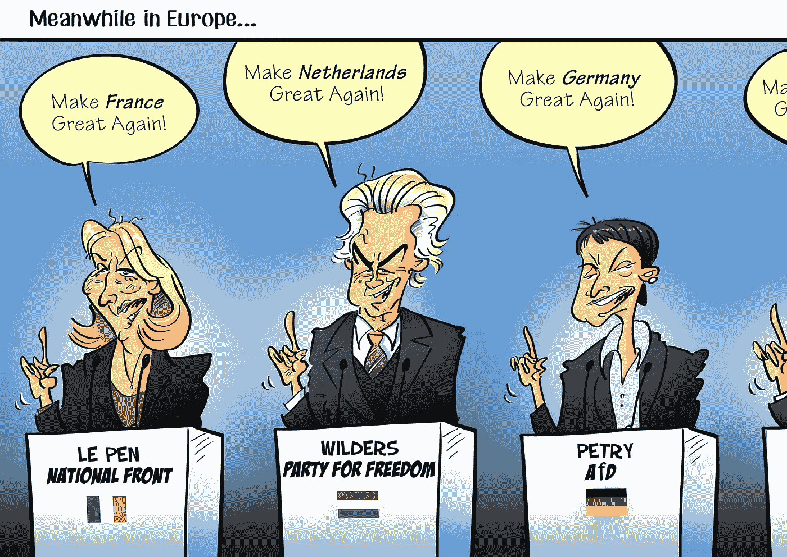
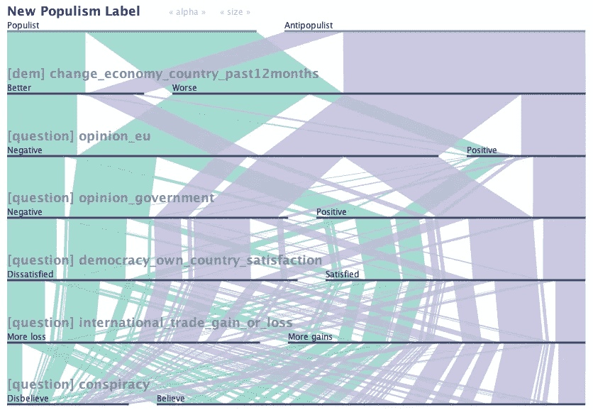

# 通过民粹主义预测选举

> 原文：<https://towardsdatascience.com/our-project-in-review-8d7f892ac790?source=collection_archive---------8----------------------->

## 民粹主义情绪可能会决定选举结果

我们已经到达了项目的终点，并且，恕我直言，我们发现计算社会科学在试图量化和合理化人类的复杂决策和行为时，需要大量的努力来重新解释和正确地制定数据分析以实现其基本目标。人、他们的想法和驱动力不适合量化的类别。然而，我们已经成功地达到了我们的目标。我们在整个欧盟范围内创建了一个民粹主义指数，并分离出表明民粹主义者的特征。虽然我们的结果可能会受到定性复杂性的影响，但我们发现它提供了对欧洲政治气候的丰富见解。

我们吸取的一个关键教训是，民粹主义是由对现有制度的经济和政治不满所催生的。当人们认为他们的经济利益因外部威胁而处于危险之中时，这些威胁可能是老牌精英或贫困移民的威胁，他们会变得更容易接受民粹主义信息。在我们的例子中，“民粹主义者”并不是一些与普通民众隔离的变异物种(正如我们在 K-Means 将民粹主义者从普通民众中分离出来的明显失败所表明的那样)。相反，正是普通人求助于民粹主义来解决他们的问题，因为他们对那些让他们远离物质福祉和民主机构感的机构感到失望。

# 结果

在法国，我们发现反民粹主义和民粹主义选民的比例分别为 56:44。因此，我们预计埃马纽埃尔·马克龙会在最近的法国大选中以这样的优势击败马林·勒·庞。令人惊讶的是。马克龙获得了总选民的 66%，表明法国选民比我们预测的更不倾向于支持极右翼。我们推测，这种差异可能是由于中右翼民粹主义选民不愿支持他们认为是古怪候选人的勒庞，和/或左翼和中间派选民反对反动政治的激增。

令人困惑的是，德国和西班牙的态度都比当前的政治表现更加极端，59%和 63%的选民坚决支持民粹主义。在西班牙，这可能显示出佛朗哥政权挥之不去的影响，该政权不鼓励极右政治选择的存在，同时吸引了许多中间偏右的人民党支持佛朗哥的国家保守主义。然而，在德国，正如宾尼格教授指出的，人们必须根据占主导地位的文化和社会态度将这些结果正常化，并确定政治态度是否发生了转变。正如传说和事实所言，德国人对自己和欧盟的经济前景都相当悲观，尽管他们反对采取极端措施来改变这一困境。因此，为了进一步分析，我们可以将这些数据与历史值进行比较，以观察潜在情绪的变化，这可能预示着民粹主义愤怒的爆发。

相反，我们发现整个东欧的民粹主义情绪得分出奇地低，最显著的是 Visegrád 集团，包括波兰、匈牙利、捷克共和国和斯洛伐克。根据我们的计算，即使维克托·欧尔班可能是全欧洲反对难民和外国融合的最极端的态度，也只有大约 30%的匈牙利人被预测为民粹主义者。这种不一致性也警告我们，盲目选择六个特征来决定民粹主义态度，而不根据每个国家的情况进行调整。在许多东欧国家，对现政府的高支持率可能对应着*更大的*而不是更小的民粹主义情绪。

毫不奇怪，我们观察到英国是民粹主义的大本营，揭示了英国退出欧盟挥之不去的怨恨。

我们发现最相关的关键特征(向调查对象提出的问题)是:

**你认为过去 12 个月的总体经济形势有什么变化？**

经济增长/衰退仍然是影响民粹主义诉求发展的关键因素。当一个国家面临经济衰退的危险时，选民开始拒绝建立政府机构来阻止这种恶化。

你对欧盟有什么看法？

如果一个人倾向于不信任欧盟，他们就会对试图阻止这一机构存在的政党更加敏感，从而倾向于选择批评现状的民粹主义政党，而不是社会自由主义政党。

你对政府有什么看法？

类似地，当选民无视自己的政府时，他们会通过选择民粹主义候选人来寻求“推翻”其执政的政治代表。

您对自己国家的民主运作方式有多满意？

类似地，那些认为他们的自由民主形式已经从根本上腐败的人倾向于寻求促进普通人意愿的替代方案。

**总体而言，您认为【在此插入国家】在与其他国家的贸易中获益还是受损？**

这一特征表明，经济因素在助长民粹主义情绪方面起着关键作用。当人们认为外国人在经济上损害了他们的利益时，他们会选择支持民粹主义政党，这些政党寻求恢复国家霸权以抵御外国(经济和社会文化)入侵。

**你同意还是不同意下面的说法:“体制对像我这样的人不利。”**

因为这一特征反映了个人自身的经济利益与统治精英的经济利益相冲突的观念，所以人们会认为反映这一观点的人非常容易接受民粹主义言论。

反民粹主义者和民粹主义者及其观点的分布可以用以下平行集合可视化来可视化:

这种形象化可以通过关注民粹主义者和反民粹主义者对每个问题的回答来解释。

这些功能如我们所愿地出现了。它们表明，我们基于投票历史和党派偏好的分析仍然紧紧抓住民粹主义的意识形态。这些特征表明，与社会文化不满相反，主要是经济和政治方面的不满推动了民粹主义情绪。这可能揭示了社会态度可能反映了各国当前的经济立场，为了减少民粹主义情绪，人们应该考虑促进国家之间的经济合作和纳入全体民众的全球一体化，而不仅仅是支持这些“既定精英”。

此外，通过使用这一数据预测未来选举结果，我们发现民粹主义虽然放大了其影响，但似乎还不能像推翻美国制度那样推翻欧洲制度。总之，我们发现我们的工作强烈地预示了一个国家内部的情绪。虽然存在混杂因素和一些异常值，但我们对整个欧盟民粹主义的理解似乎已经揭示了当前的政治气候。