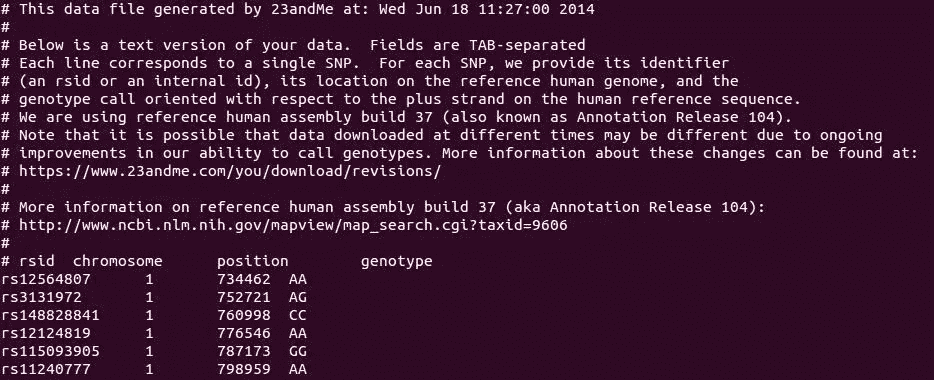
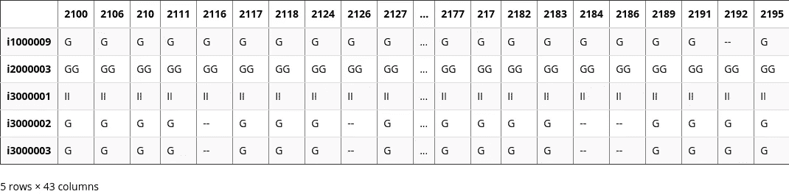
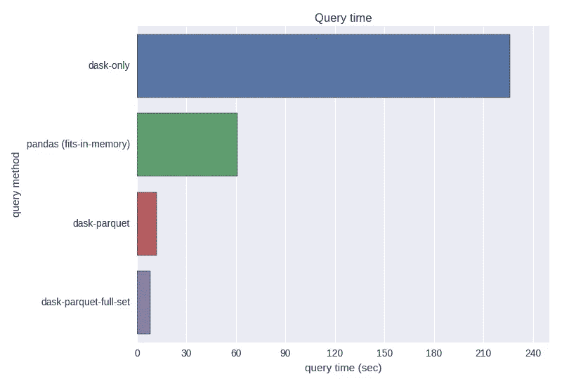
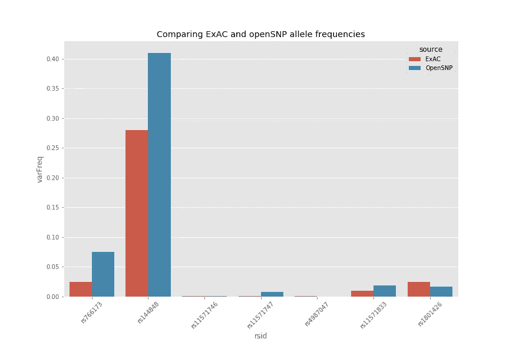

# Python 中的核心基因组学

> 原文：<https://towardsdatascience.com/out-of-core-genomics-8aa5ef487d1e?source=collection_archive---------4----------------------->


通常情况下，数据科学家想要探索一个不适合内存的数据集。随着数据量的持续增长，我们处理这些数据的工具也需要扩展。这篇文章的动机源于我对处理 [openSNP](https://opensnp.org/) 数据的兴趣。openSNP 是一个开源平台，用户可以从 [23andMe](https://www.23andme.com/) 等直接面向消费者的遗传学公司上传他们的基因型数据。原始结果文件通常有几十万条记录，每条记录代表人类基因组中的一个位置。openSNP 数据中有超过 4，000 个原始结果文件。然而，我的笔记本电脑运行的 VirtualBox 只有 5GB RAM，这意味着我需要找到一些超出标准 pandas 库的聪明解决方案，以便处理这么多数据。这篇文章描述了几个可以从核外计算中受益的应用之一。

# 下载 openSNP 数据

openSNP 有超过 40 GB 的基因型和表型数据存储为文本文件！
出于本演示的目的，分析将仅限于 23andMe 文件。下面是几个 shell 命令，用于下载原始数据，创建目录，并将 23andMe 文件移动到它们自己的目录中。

这里有一个示例 23andMe 结果文件，文件头用`#`注释掉，然后有 600，000+行基因型数据。



# 提取合理规模的测试集

在本练习中，使用完整 openSNP 数据的一个可管理的子集，以便在合理的时间内执行演示。创建一个新目录，复制以名称:`user21`开头的基因型文件。

# 纯种熊猫

首先，从一个纯粹的[熊猫](http://pandas.pydata.org/) `read_csv`解决方案开始，这应该是 Python 数据科学家所熟悉的。尽量在内存中创建一个大的`DataFrame`。`join`方法可以完成这项任务。尽管这是一个昂贵的操作，我们刚刚提取的测试数据集足够小，它将成功执行。

```
CPU times: user 7min 48s, sys: 9.83 s, total: 7min 58s 
Wall time: 8min 15s
```



在 43 个文件的测试集上，整个`DataFrame`适合内存。然而，对包含 1，915 个文件的整个 openSNP 数据集使用这种纯 pandas 方法最终会使笔记本电脑崩溃，因为它会耗尽物理内存。

# Dask —并行核外数据帧

进入 [dask](http://dask.pydata.org/en/latest/index.html) ，一个实现核外数据帧的 Python 库。它的 API 类似于 pandas，增加了一些额外的方法和参数。Dask 创建了一个计算图，它将并行读取相同的文件，并创建一个“lazy”`DataFrame`,直到`comptue()`被显式调用后才会执行。


example computation graph from [http://dask.pydata.org/en/latest/_images/pipeline.png](http://dask.pydata.org/en/latest/_images/pipeline.png)

惰性地将基因型文件读入 dask 数据帧，这个操作实际上并没有将文件读入内存，这可以通过 cpu 时间来证明，相反，它构建了一个类似于上图的图形。

```
CPU times: user 112 ms, sys: 52 ms, total: 164 ms 
Wall time: 298 ms
```

对 dask 数据帧执行操作，如`set_index()`触发计算。

```
CPU times: user 4min 44s, sys: 23 s, total: 5min 7s 
Wall time: 4min 45s
```

dask `compute()`方法提供了熟悉的结果。因为`join`方法不是在 dask 数据框架上执行的，与纯 pandas 方法相反，只调查一个记录(或一个 SNP)。

```
CPU times: user 3min 31s, sys: 36.1 s, total: 4min 7s 
Wall time: 3min 46s CC 37 
CT 5
TT 1 
Name: genotype, dtype: int64
```

同样，与`ddf` (dask)相反，`gtdf`在内存中，所以这个操作非常快。

```
CPU times: user 4.3 s, sys: 8.1 s, total: 12.4 s 
Wall time: 1min 1sCC 37 
CT 5
TT 1 
Name: rs1333525, dtype: int64
```

乍一看，计算时间是骗人的。dask 方法花费了更长的时间，因为计算缓慢，它仍然必须读取所有文件，然后执行操作。然而，当你考虑到加入数据帧所需的 **8 分 15 秒**加上`gtdf.loc[rs13333525'].value_counts()`的 **1 分 1 秒**时，那就是 **9 分 16 秒**。相比之下，dask 方法需要 3 个步骤。第一次设置计算图形为< 1 秒。所以真正的比较来自于设定指标的 **4 分 45 秒**和执行`ddf.loc['rs1333525']['genotype'].value_counts().compute()`的 **3 分 46 秒**总计 **8 分 31 秒**。在我们只有 43 个文件的测试数据上，这似乎是一个微小的加速。当数据帧根本放不进内存时,`dask`的真正威力就发挥出来了。

# 提高查询性能—转换。txt/。csv 呼叫拼花地板！

如果能加快 dask 查询的速度就好了，这样我们就可以在合理的时间内使用数据帧进行下游分析。解决方案是将原始文本数据以有效的二进制格式存储在磁盘上。传统上，一个流行的选择是 [HDF5](https://support.hdfgroup.org/HDF5/doc/H5.intro.html) ，但是我选择使用 [parquet](https://parquet.apache.org/) ，因为 HDF5 可能很难使用。Dask 使用了 [fastparquet](http://fastparquet.readthedocs.io/en/latest/index.html) 实现。

```
CPU times: user 12min 35s, sys: 1min 41s, total: 14min 17s
Wall time: 19min 30s
```

从本质上讲，这样做的目的是将`.txt`文件转换成 parquet 文件。从中真正获得了多少性能？重温 dask 数据帧`ddf`，记得计算`value_counts()`花了 3 分 46 秒。转换为拼花格式后进行比较。

```
CPU times: user 8.18 s, sys: 608 ms, total: 8.79 s 
Wall time: 11.7 s CC 37 
CT 5 
TT 1 
Name: genotype, dtype: int64
```

Parquet 为查询数据提供了显著的性能提升，即使只有 43 个文件的验证集。将这个扩展到 1915 个文件，并行的`.txt`版本`ddf`，花了 5 个多小时来执行一个 SNP 的`value_counts()`。在 1915 号文件上`DataFrame`花了几个小时。一旦看到查询性能的提高，从`.txt`或`.csv`转换到 parquet 的前期成本是值得的。



# 整个 openSNP 数据集上的性能

我使用上面相同的命令预先计算了整个`gt23`目录的拼花文件，并将拼花文件存储在`gt23_pq`中。需要清理和/或删除一些格式错误的文件。

```
$ find gt23_pq/ -type f | wc -l1898
```

现在，发出与前面代码块中的测试数据集相同的`value_counts()`命令，但是这将考虑所有的 23andMe 基因型文件。

```
CPU times: user 6.67 s, sys: 112 ms, total: 6.78 s
Wall time: 7.2 sCC    1625
CT     277
TT      13
Name: genotype, dtype: int64
```

这些结果凸显了拼花地板远优于`.csv`或`.txt`的性能。此外，dask 证明了当物理内存受到限制时，它作为一个易于使用的工具的价值。到目前为止，您可能已经注意到，我无法将用户标识符分配给每一列。`dd.read_csv()`假设每个文件中的列名相同。

# 在整个 openSNP 数据集上实现

教程的 dask 和 parquet 部分已经结束。我想展示 dask 和 parquet 如何轻松地处理大型数据集。以下示例比较了 openSNP 数据和 [exAC](http://exac.broadinstitute.org/) 数据中的不同频率。



我希望这篇文章对你有用，并在处理结构化文本文件时考虑使用 dask 和 parquet。我真的鼓励你查看 dask 和 parquet 文档，并跟随他们的一些教程。感谢阅读，欢迎评论和代码改进！

从我的 github 页面站点更新【https://arvkevi.github.io/Out_of_Core_Genomics.html 