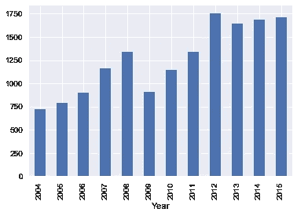
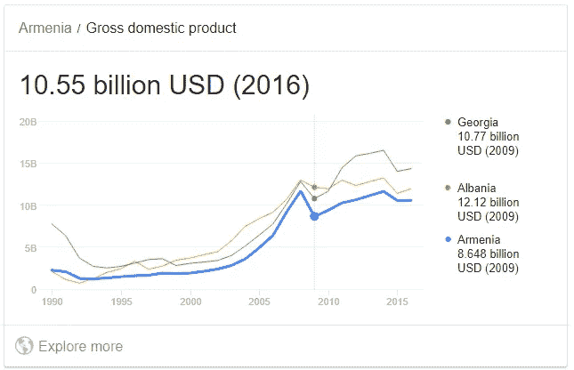
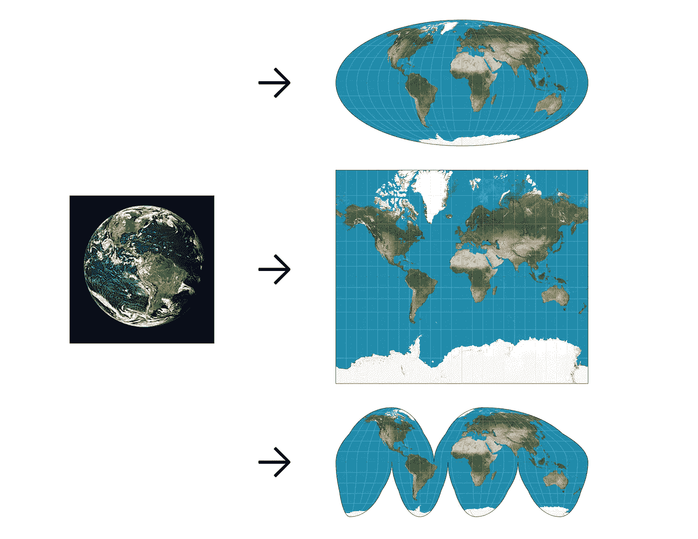
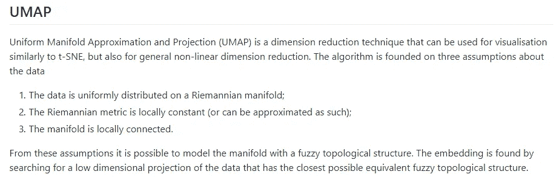
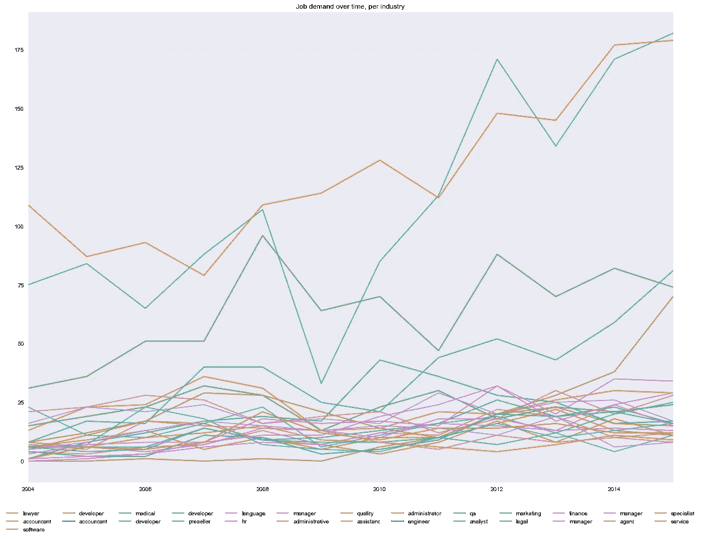

# 离群点感知聚类:超越 K 均值

> 原文：<https://towardsdatascience.com/outlier-aware-clustering-beyond-k-means-76f7bf8b4899?source=collection_archive---------6----------------------->


Picture from [fauxels](https://www.pexels.com/photo/photo-of-man-wearing-brown-sweater-3184603/) on [Pexels.com](http://pexels.com)

数据科学能帮你选择下一份工作吗？首先，这是个糟糕的主意。

但是，让我们看看会发生什么。

# 方法

我们提出了一种优化聚类的组合降维方法。是的，我肯定你们中的一些人在读完这篇文章后仍然会坚持 ol' PCA/K-Means，但是我希望你的工具箱里会有一个同样快速的新工具。

该方法使用了两种迅速流行的方法:用于降维的 UMAP 和用于聚类的 HDBSCAN。在行为原型定义的人力资源和客户细分的推荐系统的多个项目中，我们已经取得了很多成功。

# 寻找要使用的数据集

让我们用一个劳动力市场分析作为这个测试的例子。面对不断变化的工作、角色和责任，你应该在哪个行业工作？那些已经有很高需求的，或者正在增长的。

劳动力市场分析是确定就业市场趋势的标准方法。这将让我们了解一段时间内的工作需求。然后，我们将把每项工作分成特定的类别。这些类别将代表我们可能感兴趣的每个主要行业。

为了仅根据数据集确定行业类别，我们将使用 UMAP+HDBSCAN 方法。

## 我们的行动计划

我们将为职位发布收集一个样本数据集，其中包含职位名称、职位描述和发布年份。从那里，我们将根据单词的相似性将发布的信息分组，以了解每个组的消长情况，根据该特定组中每年的职位发布数量。

我们将让一些聚类算法为我们做出这些决定，而不是从应该选择的聚类的假设开始。这是表演 LMA 时最棘手的部分。一个社交媒体总监是管理、营销还是 IT 部门的人？医疗机器人服务技术员，或者自动驾驶汽车食品配送主管怎么样？

通过查看标题和描述的内容，我们将让类别自己决定。

## 数据

Kaggle 的亚美尼亚招聘数据集已经对 2004 年至 2015 年年中的招聘信息进行了过滤。这是一个很好的数据集，因为:

*   它是大多数现代经济的典型代表。
*   这是一个足够小的数据集，很容易使用；
*   它包含的工作范围很广，不仅仅是特定的行业。

和其他人一样，它也受到了 2008-2009 年经济衰退的影响:



Number of job postings in the dataset, per year.



GDP of Armenia vs. Georgia and Albania, showing the Great Recession.

这意味着我们已经准备好组织这些数据，以了解每个工作部门的表现。

## 对每个职位名称、描述和职位发布执行单词嵌入

让我们为这个项目加载所有相关的库。

在我们决定为每个文本元素生成一个向量之前，我们将删除所有通用的英语停用词(“if”、“I”、“因为”…)，以及每个类别的其他通用词。我们通过查找每种条目类型的最常用单词、生成自定义词典并删除所选单词来实现这一点。

在我们删除了第一个停用词列表并按计数打印出这个单词列表后，我们注意到在所有的招聘信息中有很多重复的单词。这会输出一个清晰的“无聊”单词列表:

```
[('responsible', 4711),
 ('looking', 4290),
 ('incumbent', 3840),
 ('position', 3717),
 ('development', 3538),
 ('seeking', 3015)...
```

这本来是使用 TF-IDF 根据单词出现的频率来删除单词的一个很好的机会，但是这个数据集太小了，不值得使用，并且可以手动执行编辑。(只要能更快完成工作，我们就喜欢这样。)

让我们删除一些精选词，以便下面的单词嵌入在整个数据集中有较少的常用词。

现在我们开始有趣的事情——单词嵌入。虽然不建议用于长语句或文档(例如，Yoon Kim CNN 在对语句进行分类时通过使用每个单词的向量来实现最佳效果)，但我们知道，删除低信号/通用单词将为我们提供向量之间的一些更好的定义。

## 弗兰克·爱因斯坦生活:UMAP + HDBSCAN

在典型的数值或分类数据上，K-Means 对于创建聚类很有意义。当分离简单的单词嵌入(1 到 4 个单词)时，我们也可以使用这种方法，但是当组合字符串向量时，它会丢失信号，其中单词嵌入之间的余弦相似性要相似得多。使用 K-Means 对聚类进行排序的典型方法包括以下内容:

*   我们将选择不同数量的集群(通常是从 1 到 20 的滑块)。
*   使用[肘法](/elbow-clustering-for-artificial-intelligence-be9c641d9cf8)，我们将找到最佳的集群数。
*   为了确认肘方法有助于决定簇的数量，我们将使用剪影值，以便查看每个点在目标簇中的拟合程度。

然而，这种方法有一些潜在的问题。这就是为什么我们希望 HDBSCAN 关注这些点，而不是 K-Means:

*   并非所有的点都可以或应该被聚类。
*   也许星团不是圆形或球形的。(雪茄形、半月形等。)

为什么 K-Means 不适合大词嵌入聚类？因为它试图找到球状星团的中心。如果有一个长方形簇，末端将被切断，中心将暴露于异常值。

让我们合并 UMAP 和 HDBSCAN，而不是调整 K-Means 参数直到母牛回家。这包括:

1.  通过使用 UMAP 在黎曼流形上定义新的嵌入空间来重新定义向量存在的空间；
2.  使用 HDBSCAN 将接近但不一定是球形的簇聚集在一起，同时忽略异常值。

## 什么是 UMAP？

一致[流形逼近和投影(UMAP)](https://arxiv.org/abs/1802.03426) 是一种新的降维技术。

在 PCA 中，通过创建能够充分重建每个点的位置的向量来执行维数减少。如果我的数据存在于ℝ ⁰⁰ (hello word 嵌入)，我可以定义 10 个(或 2 个，或 20 个)特征向量，这些特征向量可以尽可能多地复制这些点。总会有信息丢失，但主成分分析通常可以达到 70%-80%的代表性准确率。

在 UMAP，方法是创建一个[黎曼流形](https://en.wikipedia.org/wiki/Riemannian_manifold)——一个弯曲的、平滑的、连接回自身的任意形状。我现在有一个形状，我解开扭曲和展平，在这个形状上，我所有的点都相当接近曲面，特别是如果我有一根足够长的绳子。想象一个两端相交的线团，这将是ℝ的黎曼流形。


此时我需要做的就是解开绳子，弄平圆柱体，并缩放数据。嘣！你现在有一个 2D 投影。

另一种思考方式是当你把地球放在地图上。墨卡托投影和极坐标投影将具有不同的偏斜，根据我们正在查看的数据，这些偏斜可以被忽略(或不被忽略)。



它的 GitHub 页面对此做了最好的解释:



但是为什么要用黎曼流形呢？相当简单。

1.  3D 空间由规则(重力、时间、距离等)定义。).如果我说，“让我们想象一个距离和角度不成问题的世界”，你会说“太好了！现在一个立方体是一个球体是一个棱镜，因为距离和角度并不重要。”
2.  现在我们生活在 ElastiSpace 中，我们可以更容易地解决某些问题。距离仍然不重要，但你很快意识到立方体和棱柱上的锐边会弄乱你的方程。因此，我创建了 ElastiSpaceV2，其中球体和椭球体是一回事，但现在立方体有了自己的类别。
3.  但是你在高中学到的所有数学知识呢？在你花了那么多时间练习那些习题之后，三角学不应该仍然有效吗？ElastiSpaceV2 帮不了你，但黎曼先生有 chu，fam。这就是球体和椭圆不同的地方，所有的数学问题仍然有效，所以你可以做你想做的所有数学。

(这一部分转述自 [Quora 帖子](https://www.quora.com/What-is-the-mathematical-intuition-of-what-a-Riemannian-Manifold-is)。)

现在回到招聘启事。

## 减少和聚集向量

下面是降低维数并开始对集合向量进行聚类的代码。

这里有两件事需要注意:

1.  集群的数量是由 HDBSCAN 决定的，而不是我们。如果你重新运行它，你会得到一些波动，所以一旦你有了工作的东西，保存集群。
2.  还有一些没有聚类的值(用“-1”表示)，大概有三分之一。这意味着只对剩余的值执行聚类。

```
[21 -1 -1 -1  4 -1 -1 25 25 -1  7 12 19 -1 25 -1 25  4 25  
  8 25  8 -1 -1 -1 -1 -1 -1 -1 -1 -1  5 -1  9 -1 -1  9  1 
 25 -1 20 -1 -1 -1 -1 -1 -1 -1 12 -1 -1 24 -1  2 25 -1  1 
 -1  7 12 -1 -1 14 -1 11 25 -1 -1 21 -1 -1 -1 -1  2  9 -1 
 11 12  9 12 25 11  7 -1 12 25 25  7 -1 -1 -1 -1 -1 -1 25 
  7 -1 21 -1 -1 19 -1 14 -1 -1 25 25 -1 25  8 25 25 -1 -1 
 -1 -1 -1 -1 25 12 -1 -1 25  8 -1 25 -1 -1 -1 -1  7 -1 25 
 -1 22 -1 25 16  9 -1 12  9 -1  7 12 -1 -1  8 -1 -1  8 24 
 24  7 25 -1 -1  7  7  7 25  7  1 -1 24 12 -1 -1 25 -1  7 
 -1 -1  8 13 -1  8  8  1 -1 -1 13 13 13 13 16 16 18  0 -1 
 16 25 -1 -1 -1  4 -1 -1 -1 15 25 -1 -1  6  7 -1  8 -1 25 
 -1 -1 -1  4 -1 -1 -1 -1 18 25 25 -1 25 20 25  7  7  7 25 
 -1 -1 25 25 -1 -1 -1 -1 27 -1 11 25 -1 25 25 18 -1  8 25 
 25 25  2 -1 -1 25  0 -1 -1 25 -1 12 25 -1 -1 -1 -1  7 -1 
 -1 -1  7 -1 27 25 -1 27 -1 -1 16 -1 -1 -1 -1 -1 -1 25 -1 
 -1 25 -1 25 14 -1  1 -1 -1  8 -1  1 25 25  7  7 -1  7 25 
 -1 25 -1 -1 -1  7 -1  7 -1 25 -1 25 12 -1 25  4  7  7  7 
  7  6 -1  7 -1  6 -1 11 16 19 -1 -1 -1 25 24 -1 16 -1 -1 
 -1 -1 -1 -1 -1 -1 -1  2 -1  4  7 25 -1 25  4  7 -1 25 25 
  1 -1 25 -1 -1  4 -1  7 -1  9 25 -1 -1  7  8  8 25 14 -1 
 -1  4 25 25 -1  8 25 19 -1 -1 25 15 16 -1 -1 15 21 -1 -1 
 25 -1  7  7 -1 -1  7  7  8 -1 18  2 16  4 -1 -1  9  9 -1 
 -1 -1 -1 -1 25 -1 -1 12 -1  7 20  7 -1 -1 25 -1 25 25 -1 
 25  6 25  7 17 -1  7 16 17  7  7 -1  4 15 -1  7 16 25 -1 
 25 25 -1 -1 -1  1 25 -1 25 -1 16 25 25 24 -1 12 -1 -1 -1 
  6 -1 25  1 11 -1  7  6 25 25 -1 25 25 -1 -1 25  1 -1  7  
  1 -1 -1  4 12 14]
```

那么这些集群代表了什么呢？让我们统计每个集群的热门词汇，以确定它们包含的内容。

看它分解得多好！

```
Cluster: 0
[('lawyer', 125), ('advocate', 3), ('attorney', 1)]
---
Cluster: 1
[('accountant', 259), ('auditor', 22), ('outsourcing', 4), ('cheef', 1), ('bookkeeper', 1)]
---
Cluster: 2
[('software', 130), ('developer', 125), ('developers', 4), ('programmer', 4), ('programmers', 1)]
---
Cluster: 3
[('developer', 166), ('android', 70), ('ios', 64), ('senior', 48), ('application', 32)]
---
Cluster: 4
[('accountant', 233), ('chief', 225), ('assistant', 29), ('deputy', 26), ('engineer', 11)]
---...---
Cluster: 25
[('specialist', 227), ('expert', 226), ('development', 217), ('coordinator', 157), ('program', 147)]
---
Cluster: 26
[('service', 78), ('manager', 55), ('customer', 49), ('department', 17), ('corporate', 15)]
---
```

我们甚至可以得到一个更紧凑的视图:

```
Cluster 0: lawyer / advocate / attorney
Cluster 1: accountant / auditor / outsourcing / cheef 
Cluster 2: software / developer / developers / programmer 
Cluster 3: developer / android / ios / senior 
Cluster 4: accountant / chief / assistant / deputy 
Cluster 5: medical / representative / yerevan / armenia 
Cluster 6: developer / java / php / senior 
Cluster 7: developer / senior / software / web 
Cluster 8: preseller / merchandiser / methodologist / 3d 
Cluster 9: language / translator / english / interpreter 
Cluster 10: hr / manager / assistant / generalist 
Cluster 11: manager / project / construction / senior 
Cluster 12: administrative / assistant / office / manager 
Cluster 13: quality / assurance / engineer / tester 
Cluster 14: assistant / executive / director / ceo
Cluster 15: administrator / system / network / systems 
Cluster 16: engineer / software / senior / support 
Cluster 17: qa / engineer / senior / manager 
Cluster 18: analyst / financial / business / senior 
Cluster 19: marketing / specialist / pr / digital 
Cluster 20: legal / lawyer / senior / consultant
Cluster 21: finance / officer / chief / financial 
Cluster 22: manager / branch / operator / teller 
Cluster 23: manager / sales / assistant / retail 
Cluster 24: agent / sales / manager / international 
Cluster 25: specialist / expert / development / coordinator 
Cluster 26: service / manager / customer / department
```

这是一个漂亮的图表，按集群划分。

我们现在有了一个漂亮的图表，显示了随着时间的推移，每个工作领域的需求。耶！



总的来说，这种方法实现起来几乎和标准的 PCA/K-Means 一样快。然而，通过中间的可视化步骤，我发现就集群而言，判断我们是否在正确的轨道上要容易得多。

你可以在这里找到所有的代码:[https://github.com/elmathioso/lma_jobs](https://github.com/elmathioso/lma_jobs)

## 快乐聚类！

马特。
[matt@lemay.ai](mailto:matt@lemay.ai)

[https://www.linkedin.com/in/mnlemay/](https://www.linkedin.com/in/mnlemay/)

Lemay.ai
1 (855) LEMAY-AI

## 你可能喜欢的其他文章

*   [深度学习图像分类器的罗夏测试](/rorschach-tests-for-deep-learning-image-classifiers-68c019fcc9a9)
*   [傲慢、懒惰和玩玩具:一个创业工程师的成功态度](https://medium.com/@lsci/hubris-laziness-and-playing-with-toys-the-winning-attitudes-of-a-startup-engineer-84c9fc08239d)
*   [为客户提供人工智能原型作为营销策略](/ai-prototypes-for-clients-as-a-marketing-strategy-70de404d27b5)

我的首席技术官丹尼尔·夏皮罗(Daniel Shapiro)的其他文章您可能会喜欢:

*   [人工智能和不良数据](/artificial-intelligence-and-bad-data-fbf2564c541a)
*   [人工智能:超参数](/artificial-intelligence-hyperparameters-48fa29daa516)
*   人工智能:让你的用户给你的数据贴上标签