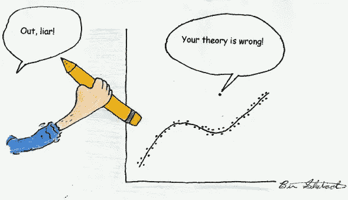
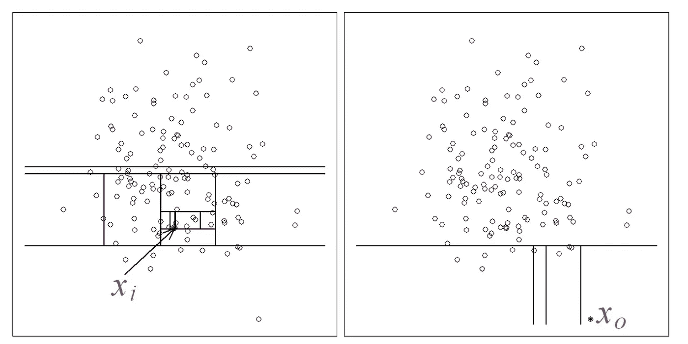
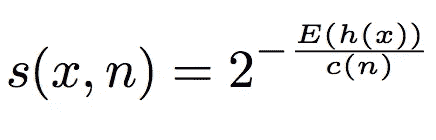
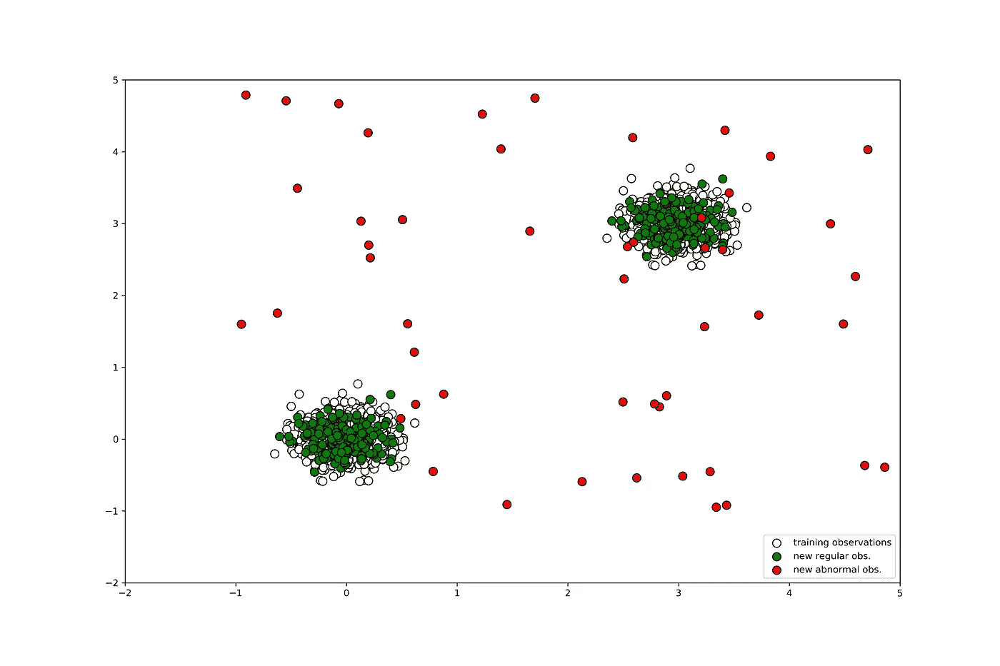
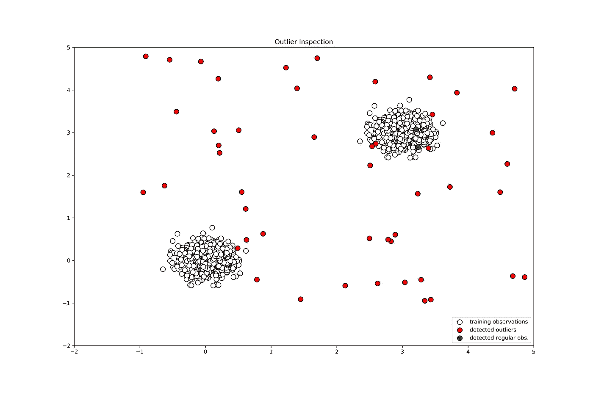

# 基于隔离森林的离群点检测

> 原文：<https://towardsdatascience.com/outlier-detection-with-isolation-forest-3d190448d45e?source=collection_archive---------0----------------------->



## 了解如何有效地检测异常值！

更新:描述扩展隔离林的第 2 部分可从[这里](https://medium.com/@eryk.lewinson/outlier-detection-with-extended-isolation-forest-1e248a3fe97b)获得。

在最近的一个项目中，我正在处理一个从移动应用程序用户那里收集的数据的聚类问题。目标是根据用户的行为对用户进行分类，可能使用 K-means 聚类。然而，在检查数据后，发现一些用户表现出异常行为——他们是异常值。

当离群值没有被处理时，许多机器学习算法的性能都会受到影响。例如，为了避免这种问题，您可以将它们从样本中删除，在某个合理的点(基于领域知识)限制这些值，或者转换数据。然而，在这篇文章中，我想把重点放在识别它们上，把可能的解决方案留到以后。

在我的例子中，我考虑了很多特征，我理想地想要有一个算法来识别多维空间中的异常值。那时我遇到了隔离森林，这种方法在原理上类似于众所周知和流行的随机森林。在本文中，我将重点关注隔离森林，而不详细描述决策树和集成背后的思想，因为已经有太多的好资料了。

# 先来点理论

与其他流行的离群点检测方法不同，隔离林的主要思想是显式识别异常，而不是分析正常数据点。隔离森林和任何树集合方法一样，是建立在决策树的基础上的。在这些树中，通过首先随机选择一个特征，然后在所选特征的最小值和最大值之间选择一个随机分割值来创建分区。

原则上，异常值比常规观测值更少出现，并且在值方面与常规观测值不同(在特征空间中，它们离常规观测值更远)。这就是为什么通过使用这种随机划分，它们应该被识别为更靠近树的根(更短的平均路径长度，即，观察在树中从根到终端节点必须经过的边的数量)，需要更少的分裂。

从[1]的图 1 中可以看出识别正常和异常观察的想法。正常点(左侧)比异常点(右侧)需要识别更多的分区。



Figure 1 Identifying normal vs. abnormal observations

与其他异常值检测方法一样，异常值是决策所必需的。对于隔离林，它被定义为:



其中 *h(x)* 是观测值 *x* 的路径长度， *c(n)* 是二叉查找树中搜索不成功的平均路径长度， *n* 是外部节点数。有关异常分数及其组成部分的更多信息，请参见[1]。

每个观察值都有一个异常值，可以在此基础上做出以下决定:

*   接近 1 的分数表示异常
*   分数远小于 0.5 表示正常观察
*   如果所有分数都接近 0.5，那么整个样本似乎没有明显的异常

# Python 示例

好，现在我们来看一个动手的例子。为了简单起见，我将使用一个人工的二维数据集。通过这种方式，我们可以监控图中异常值的识别过程。

首先，我需要生成观察结果。我将从被视为正常并将用于训练模型的观察开始(Python 的`scikit-learn`隔离森林实现中的训练和评分类似于所有其他机器学习算法)。第二组是新的观察值，来自与训练值相同的分布。最后，我生成离群值。

```
*# importing libaries ----*
**import** **numpy** **as** **np**
**import** **pandas** **as** **pd**
**import** **matplotlib.pyplot** **as** **plt**
**from** **pylab** **import** savefig
**from** **sklearn.ensemble** **import** IsolationForest*# Generating data ----*

rng = np.random.RandomState(42)

*# Generating training data* 
X_train = 0.2 * rng.randn(1000, 2)
X_train = np.r_[X_train + 3, X_train]
X_train = pd.DataFrame(X_train, columns = ['x1', 'x2'])

*# Generating new, 'normal' observation*
X_test = 0.2 * rng.randn(200, 2)
X_test = np.r_[X_test + 3, X_test]
X_test = pd.DataFrame(X_test, columns = ['x1', 'x2'])

*# Generating outliers*
X_outliers = rng.uniform(low=-1, high=5, size=(50, 2))
X_outliers = pd.DataFrame(X_outliers, columns = ['x1', 'x2'])
```

图 2 展示了生成的数据集。正如所期望的，训练和“正常”观察基本上是相互叠加的，而异常值是分散的。由于异常值的随机性质，它们中的一些与训练/正常观察重叠，但是我将在后面说明。



Figure 2 Generated Dataset

现在我需要在训练台上训练隔离林。我在这里使用默认设置。值得注意的一点是污染参数，它指定了我们认为是异常值的观察值的百分比(`scikit-learn`的默认值是 0.1)。

```
*# Isolation Forest ----*

*# training the model*
clf = IsolationForest(max_samples=100, random_state=rng)
clf.fit(X_train)

*# predictions*
y_pred_train = clf.predict(X_train)
y_pred_test = clf.predict(X_test)
y_pred_outliers = clf.predict(X_outliers)
```

好了，现在我们有了预测。如何评估绩效？我们知道，测试集只包含来自与正态观测值相同分布的观测值。因此，所有的测试集观测值都应该归类为正常。对于离群值集合，反之亦然。再来看准确度。

```
*# new, 'normal' observations ----*
print("Accuracy:", list(y_pred_test).count(1)/y_pred_test.shape[0])
# Accuracy: 0.93*# outliers ----*
print("Accuracy:", list(y_pred_outliers).count(-1)/y_pred_outliers.shape[0])
# Accuracy: 0.96
```

起初，这看起来很好，特别是考虑到默认设置，但是，还有一个问题需要考虑。由于异常值数据是随机生成的，一些异常值实际上位于正常观察值内。为了更仔细地检查它，我将绘制正常观察数据集和带标签的异常值集。我们可以看到，一些位于正常观察集内的异常值被正确地归类为正常观察值，其中一些被错误地归类。我们可以做的是尝试不同的参数规格(污染、估计数、抽取样本数以调整基本估计数等)。)来获得更好的契合度。但目前来看，这些结果还是令人满意的。



Figure 3 Inspecting outlier classification

# 外卖食品

*   隔离林是一种异常值检测技术，可识别异常值而非正常观察值
*   类似于随机森林，它是建立在二元(隔离)树的集合上
*   它可以扩展到处理大型高维数据集

这是我在这里的第一篇文章，如果我再写一些，我会努力提高写作和编辑的水平。一如既往，我们欢迎任何建设性的反馈。你可以在推特上或评论中联系我。

本文中使用的代码可以在我的 [GitHub](https://github.com/erykml/isolation_forest_example/blob/master/isolation_forest_example.ipynb) 上找到。

您可能还对一种更简单的异常值检测算法感兴趣 Hampel 滤波器。我在上面写了一小段[这里](/outlier-detection-with-hampel-filter-85ddf523c73d)。

喜欢这篇文章吗？成为一个媒介成员，通过无限制的阅读继续学习。如果你使用[这个链接](https://eryk-lewinson.medium.com/membership)成为会员，你将支持我，不需要额外的费用。提前感谢，再见！

# 参考

[1]刘福亭，丁克明，周振华(2008 年 12 月).隔离森林。在*数据挖掘，2008 年。08 年的 ICDM。第八届 IEEE 国际会议*(第 413-422 页)。IEEE。

[2][http://sci kit-learn . org/stable/modules/generated/sk learn . ensemble . isolation forest . html](http://scikit-learn.org/stable/modules/generated/sklearn.ensemble.IsolationForest.html)