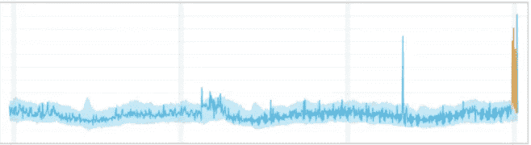
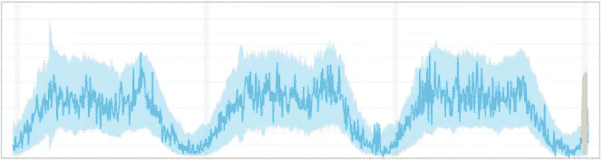
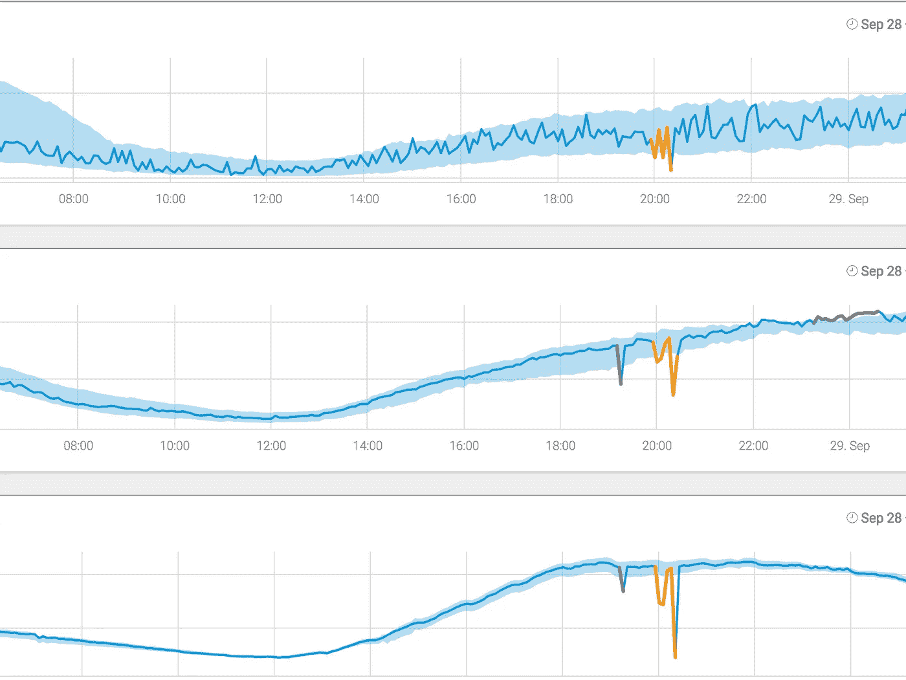

# 离群值解释:不同类型离群值的快速指南

> 原文：<https://towardsdatascience.com/outliers-analysis-a-quick-guide-to-the-different-types-of-outliers-e41de37e6bf6?source=collection_archive---------8----------------------->

商业上的成功取决于在正确的时间做出正确的决定。然而，只有当你在适当的时候拥有所需的洞察力，你才能做出明智的决定。当合适的时机到来时，异常值检测(也称为异常检测)可以帮助您在风暴来临时，或者在业务趋势向有利于您的方向转变时，为您的公司制定更好的路线。在这两种情况下，快速检测和分析异常值可以让你及时调整你的路线，以产生更多的收入或避免损失。说到分析，第一步是知道你面对的是什么类型的异常值。

# 三种不同类型的异常值

在统计学和数据科学中，所有异常值都属于三个普遍接受的类别:

**类型 1:全局异常值(也称为“点异常”):**
如果数据点的值远在发现它的整个数据集之外，则该数据点被认为是全局异常值(类似于计算机程序中的“全局变量”可以被程序中的任何函数访问)。

**类型 2:上下文(条件)异常值:**
如果一个数据点的值明显偏离相同上下文中的其余数据点，则该数据点被认为是上下文异常值。请注意，这意味着如果相同的值出现在不同的上下文中，它可能不会被视为异常值。如果我们将讨论局限于时间序列数据，那么“上下文”几乎总是时间性的，因为时间序列数据是一段时间内特定数量的记录。因此，在时间序列数据中，背景异常值很常见也就不足为奇了。

**类型 3:集体异常值:**
如果作为集合的那些值明显偏离整个数据集，则数据集内的数据点子集被认为是异常的，但是单个数据点的值本身在上下文或全局意义上不是异常的。在时间序列数据中，这种情况的一种表现方式是，当季节性序列正常时，出现在时间范围之外的正常峰值和谷值，或者作为一组处于异常值状态的时间序列的组合。

请这样想:

一块拳头大小的陨石撞击你邻居的房子是一个全球性的异常事件，因为陨石撞击建筑物的事件非常罕见。如果降雪发生在仲夏，而你的邻居被埋在两英尺厚的雪中，这将是一个**上下文**异常值，通常你在冬天之外不会下雪。你的每一个邻居都在同一天搬出这个社区，这是一个集体的离群值，因为尽管人们从一个住所搬到另一个住所肯定不罕见，但整个社区同时搬迁是非常不寻常的。

这个类比有助于理解这三种异常值之间的基本差异，但是它如何适应业务度量的时间序列数据呢？

让我们转到更具体的业务示例:

一位银行客户通常每月在当地自动取款机上存入不超过 1000 美元的支票，但在两周内突然存入两笔各为 5000 美元的现金，这是一种全球性的异常现象，因为这种情况在这位客户的历史上从未发生过。他每周存款的时间序列数据会显示最近的突然飙升。如此剧烈的变化会引起警觉，因为这些巨额存款可能是由于非法交易或洗钱。

一家电子商务公司的订单量突然激增，如该公司每小时的总订单量所示，如果这一高量发生在已知的促销折扣或高量时段(如黑色星期五)之外，则可能是**上下文异常值**。这种蜂拥现象会不会是由于定价失误，让消费者以低廉的价格购买产品？

一家上市公司的股票从来都不是静态的，即使价格相对稳定，没有整体趋势，而且随着时间的推移会有微小的波动。如果股票价格在很长一段时间内保持完全相同的价格(相对于一分钱)，那么这将是一个**集体异常值**。事实上，这件事发生在 2017 年 7 月 3 日纳斯达克交易所的几家科技公司身上，当时包括科技巨头苹果和微软在内的几家公司的上市股价为 123.45 美元。

这些异常是什么样子的？下面是几个例子。

**全局异常:**由于异常值明显超出正常的全局范围，主页的反弹次数出现峰值。

**情境异常:**应用崩溃一直在发生，并且有季节性模式(更多用户=更多崩溃)。然而，在这种异常情况下，应用崩溃的数量并没有超出正常的全球范围，但与季节性模式相比是不正常的。

**集体异常:**在本例中，发现三个不同产品类别的成功购买数量的异常下降相互关联，并组合成一个异常。对于每个时间序列，个人行为没有明显偏离正常范围，但综合异常表明支付存在更大的问题。

# 检测所有类型异常值的三个关键步骤

不考虑行业，不考虑数据源，离群点检测系统应该实时地在时间序列数据中发现所有类型的离群点，并且是在数百万个度量的尺度上。

异常值和异常检测算法已经在学术界进行了研究，最近已经开始作为商业服务和开源软件提供。所有这些都依赖于统计和机器学习算法，基于诸如 ARIMA、霍尔特-温特斯、动态状态空间模型(HMM)、PCA 分析、LSTMs 和 RNNs 等方法。除了基本算法之外，在构建这样的系统时还有许多额外的考虑。

关于如何构建这样一个系统的全面指南在关于异常检测的白皮书中概述。适用于所有基本异常值检测算法的关键步骤有助于检测各种异常值:

1.  为每个时间序列选择最合适的模型和分布:这是检测任何异常值的关键步骤，因为时间序列可以以各种方式表现(平稳、非平稳、不规则采样、离散等)，每种方式都需要具有不同基本分布的不同正常行为模型。
2.  说明季节性和趋势模式:如果在描述正常行为的模型中没有说明季节性和趋势，就无法检测到上下文和集体异常值。自动检测这两者对于自动化异常检测系统至关重要，因为这两者不能针对所有数据手动定义。
3.  检测集体异常涉及理解不同时间序列之间的关系，并说明用于检测和调查异常的关系。

离群值通常是潜在问题的可见症状，需要快速修复。然而，这些症状只有在你的异常值检测系统让它们变得可见时才可见。

如需更多视觉效果，请参见我们的简短[解释视频](https://www.youtube.com/watch?v=pXGqDiE4N0I)。

最初发表于 2019 年 11 月[此处](https://www.anodot.com/blog/quick-guide-different-types-outliers/)。