# 优于 Tensorflow 的默认自动微分优化器，具有交互式代码[带 TF 的手动回推]

> 原文：<https://towardsdatascience.com/outperforming-tensorflows-default-auto-differentiation-optimizers-with-interactive-code-manual-e587a82d340e?source=collection_archive---------4----------------------->


Image from [pixel bay](https://pixabay.com/en/winter-wintry-moon-human-2945906/)

所以我对这个想法思考了很久，有没有一种不同的(甚至更好的)方法来训练一个神经网络？Tensroflow、Keras、pyTorch 等框架都很神奇，非常好用。这不仅要感谢它们为我们执行自动微分的能力，还要感谢它们为我们提供了广泛的优化选择。但这并不意味着我们只能依靠他们的自动微分。

因此，让我们做一些不同的事情，我将尝试超越 Tensorflows 自动微分在他们的默认实现中，总共有 10 个优化器。我们将用来超越自动差异化的两项技术是…

a.[谷歌大脑的梯度噪声](https://becominghuman.ai/only-numpy-implementing-adding-gradient-noise-improves-learning-for-very-deep-networks-with-adf23067f9f1)
b. [每层用 ADAM 优化器放大反向传播](https://hackernoon.com/only-numpy-dilated-back-propagation-and-google-brains-gradient-noise-with-interactive-code-3a527fc8003c)

**网络架构/实验任务**

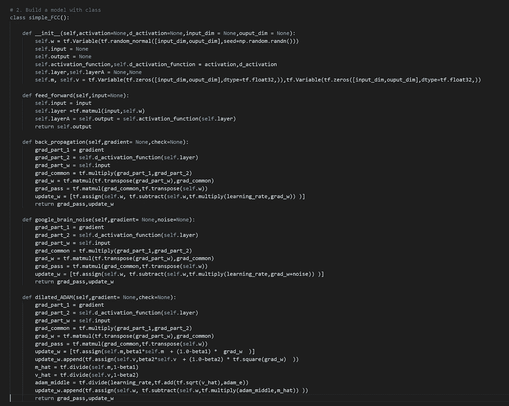

我们的实验非常简单，我们将使用全连接神经网络(有 5 层)，对 [Tensorflow 的 MNIST 数据集](https://www.tensorflow.org/versions/r1.1/get_started/mnist/beginners#the_mnist_data)进行分类。以上是每一层是如何构建的。由于我们将使用不同的优化方法，各层应该有不同的方法来执行反向传播，因此有三种方法。标准反向传播、Google Brain 的附加噪声和 ADAM 反向传播。另外，请注意两个细节。

> 1.我们将使用 Tensorflow [MNIST](https://www.tensorflow.org/versions/r1.1/get_started/mnist/beginners#the_mnist_data) 数据集提供的每一个数据。
> 
> 2.我们将使用矢量图像。

**tensor flow 优化人员列表**

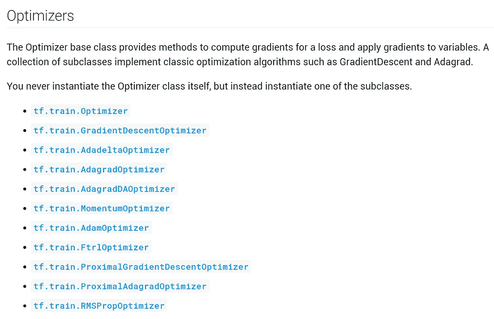

Screen Shot from [Tensor Flow](https://www.tensorflow.org/api_guides/python/train#Optimizers)

以上是我们将与谷歌大脑的噪声和扩张反向传播进行比较的优化器的完整列表。现在，为了更容易地看出哪些是哪些，让我们为每个优化器分配颜色。

**对比案例列表**

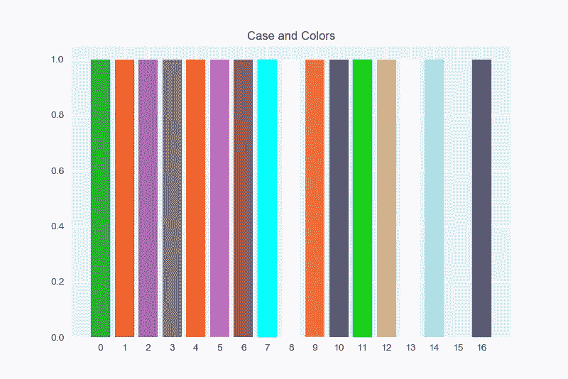

如上所示，我们总共有 17 个案例，每个案例都有自己的颜色。请查看下面我使用的确切颜色。

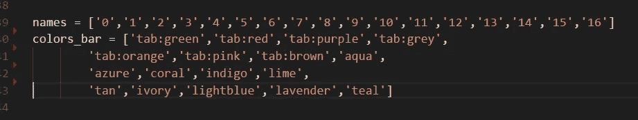

如果您希望了解更多关于 matplotlib 颜色的信息，请访问此页面获取更多信息。现在让我们给每种情况分配不同的优化方法。

```
Case 0  → Google Brain's Added Gradient Noise + Standard Back PropCase 1  → Dilated ADAM Back Propagation Sparse Connection by Multiplication Case 2  → Dilated ADAM Back Propagation Sparse Connection by Multiplication + Google Brain's Added Gradient NoiseCase 3  → Dilated ADAM Back Propagation Dense Connection by AdditionCase 4  → Dilated ADAM Back Propagation Dense Connection by MultiplicationCase 5  → Dilated ADAM Back Propagation Dense Connection by Addition (Different Decay / Proportion Rate)Case 6  → Dilated ADAM Back Propagation Dense Connection by Addition (Different Decay / Proportion Rate)Case 7  → [tf.train.GradientDescentOptimizer](https://www.tensorflow.org/api_docs/python/tf/train/GradientDescentOptimizer)
Case 8  → [tf.train.AdadeltaOptimizer](https://www.tensorflow.org/api_docs/python/tf/train/AdadeltaOptimizer)
Case 9  → [tf.train.AdagradOptimizer](https://www.tensorflow.org/api_docs/python/tf/train/AdagradOptimizer) 
Case 10 → [tf.train.AdagradDAOptimizer](https://www.tensorflow.org/api_docs/python/tf/train/AdagradDAOptimizer)
Case 11 → [tf.train.MomentumOptimizer](https://www.tensorflow.org/api_docs/python/tf/train/MomentumOptimizer)
Case 12 → [tf.train.AdamOptimizer](https://www.tensorflow.org/api_docs/python/tf/train/AdamOptimizer)
Case 13 → [tf.train.FtrlOptimizer](https://www.tensorflow.org/api_docs/python/tf/train/FtrlOptimizer)
Case 14 → [tf.train.ProximalGradientDescentOptimizer](https://www.tensorflow.org/api_docs/python/tf/train/ProximalGradientDescentOptimizer)
Case 15 → [tf.train.ProximalAdagradOptimizer](https://www.tensorflow.org/api_docs/python/tf/train/ProximalAdagradOptimizer)
Case 16 → [tf.train.RMSPropOptimizer](https://www.tensorflow.org/api_docs/python/tf/train/RMSPropOptimizer)
```

> ***本质上情况 0 ~ 6 是手动反向传播，情况 7 ~ 16 是自动微分。***

**不同试验列表/基础优势/
随机初始化**

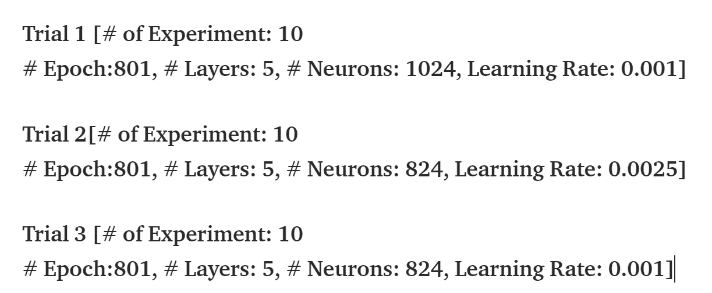

Experiment Trials

如果其中一个优化方法 ***从根本上优于另一个*** ，那么每次我们运行实验时，那个方法都会胜过其余的。为了增加我们捕捉这一基本特征的概率，让我们进行 3 次不同的试验，每次试验我们将进行 10 次试验。(***注意* *每次试验的超参数设置互不相同。*)

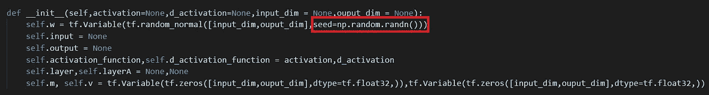

另外为了保证方法的优越性，让随机种子值来初始化权重。

> **每次实验后，我们都会比较所有案例，以了解哪一个案例有…**
> 
> **a .最低成本率(或错误率)
> b .训练图像的最高精度
> c .测试图像的最高精度**
> 
> **当所有实验完成后，我们将会看到频率条形图，其中哪个案例在每个标准下表现最佳。**

**试验一结果**

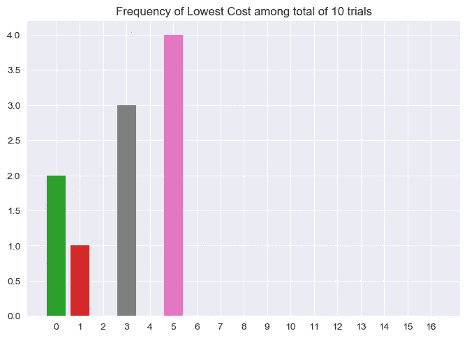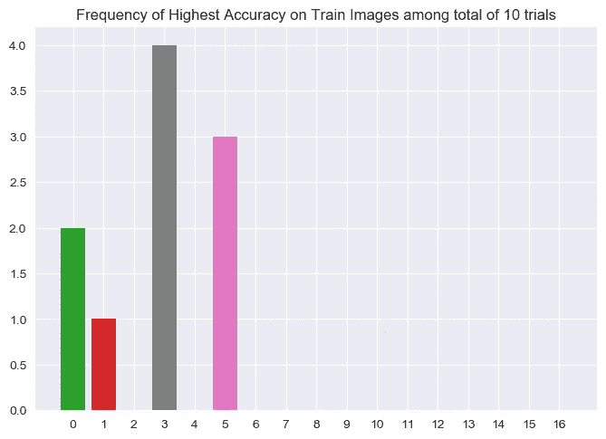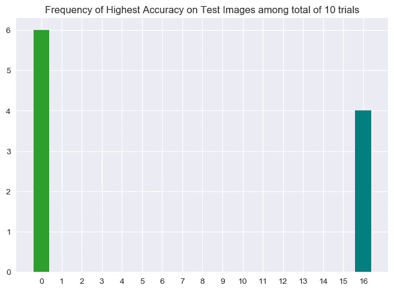

**左侧图**→10 次实验的频率柱状图*最低成本率*
**中间图**→10 次实验的频率柱状图*训练图像的最高准确率*
**右侧图**→10 次实验的频率柱状图*测试图像的最高准确率*

当学习率设置为 0.001 时，神经元更宽，每层有 1024 个神经元。似乎扩张反向传播易于过度拟合，因为它们在训练图像上的最低成本率和最高精度上最频繁，但是在测试图像上的最高精度上没有显示出来。

我看到了一种潜力，通过适当的调整，他们可以超越每一个案例。

```
**Percentage of Best Performing at *Lowest Cost Rate***1\. **Case 5: 60%**
('Dilated ADAM Back Propagation Dense Connection by Addition (Different Decay / Proportion Rate)')2\. **Case 3: 30%**
('Dilated ADAM Back Propagation Dense Connection by Addition')3\. **Case 0: 20%**
('Google Brain's Added Gradient Noise + Standard Back Prop')4\. **Case 1: 10%**
('Dilated ADAM Back Propagation Sparse Connection by Multiplication')
-------------------------------------------------------------
**Percentage of Best Performing at *Highest Accuracy on Training Images***1\. **Case 3: 40%**
('Dilated ADAM Back Propagation Dense Connection by Addition')2\. **Case 5: 30%**
('Dilated ADAM Back Propagation Dense Connection by Addition (Different Decay / Proportion Rate)')3\. **Case 0: 20%**
('Google Brain's Added Gradient Noise + Standard Back Prop')4\. **Case 1: 10%**
('Dilated ADAM Back Propagation Sparse Connection by Multiplication')
-------------------------------------------------------------
**Percentage of Best Performing at *Highest Accuracy on Testing Images***1\. **Case 0: 60%**
('Google Brain's Added Gradient Noise + Standard Back Prop')2\. **Case 16: 40%**
('[tf.train.RMSPropOptimizer](https://www.tensorflow.org/api_docs/python/tf/train/RMSPropOptimizer)')
```

> 实际上，情况 0 ~ 6 是人工反向传播，而情况 7 ~ 16 是自动微分。

**试验 2 结果**

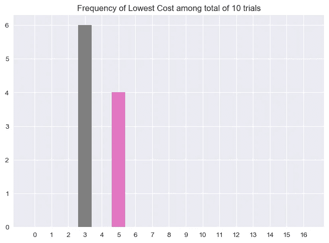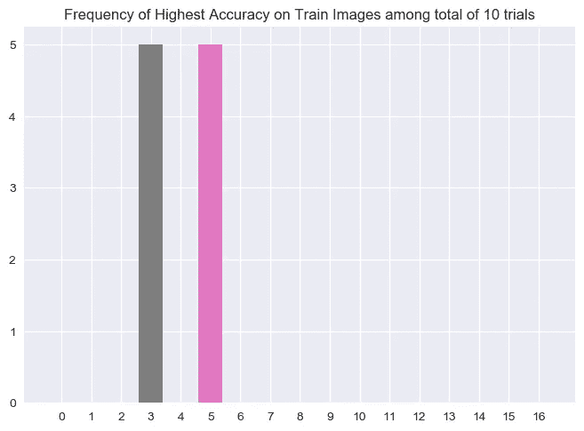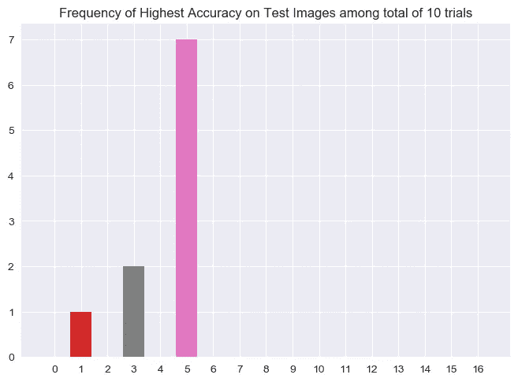

**左侧图** →最低成本率
**上 10 次实验的频率柱状图** →训练图像上 10 次实验的频率柱状图*→最高准确率*
**右侧图** →测试图像上 10 次实验的频率柱状图*最高准确率*

当学习率设置得稍高(0.0025)且神经元较窄(824)时，情况 5(大部分)优于所有其他情况。

```
**Percentage of Best Performing at *Lowest Cost Rate***1\. **Case 3: 60%**
('*Dilated ADAM Back Propagation Dense Connection by Addition*')2\. **Case 5: 40%**
('Dilated ADAM Back Propagation Dense Connection by Addition (Different Decay / Proportion Rate)')
-------------------------------------------------------------
**Percentage of Best Performing at *Highest Accuracy on Training Images***1\. **Case 3: 50%**
('*Dilated ADAM Back Propagation Dense Connection by Addition*')2\. **Case 5: 50%**
('Dilated ADAM Back Propagation Dense Connection by Addition (Different Decay / Proportion Rate)')
-------------------------------------------------------------
**Percentage of Best Performing at *Highest Accuracy on Testing Images***1\. **Case 5: 70%**
('Dilated ADAM Back Propagation Dense Connection by Addition (Different Decay / Proportion Rate)')2\. **Case 3: 20%**
('*Dilated ADAM Back Propagation Dense Connection by Addition*')3\. **Case 1: 10%**
('Dilated ADAM Back Propagation Sparse Connection by Multiplication')
```

> 实际上，情况 0 ~ 6 是人工反向传播，而情况 7 ~ 16 是自动微分。

**试验三结果**

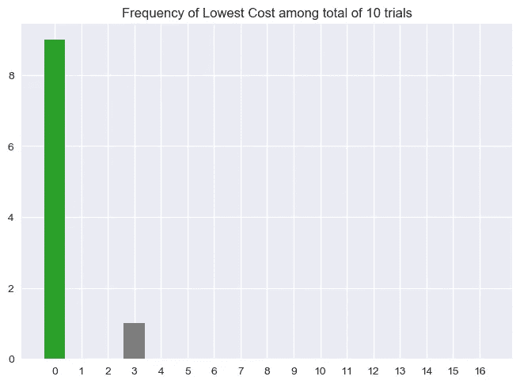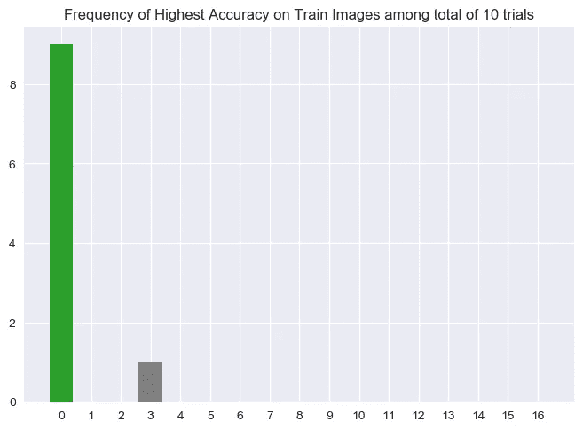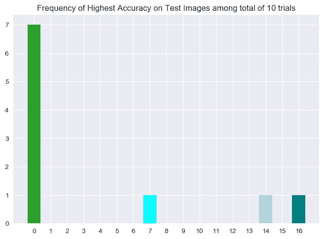

**左图** →最低成本率
**上 10 次实验的频率柱状图** →训练图像上 10 次实验的频率柱状图 ***右图** →测试图像上 10 次实验的频率柱状图*

**当学习率设置为 0.001，神经元更窄(824)时，谷歌自己的方法(大部分)优于所有其他情况。**

```
****Percentage of Best Performing at *Lowest Cost Rate***1\. **Case 0: 90%**
('Google Brain's Added Gradient Noise + Standard Back Prop')2\. **Case 3: 10%**
('*Dilated ADAM Back Propagation Dense Connection by Addition*')
-------------------------------------------------------------
**Percentage of Best Performing at *Highest Accuracy on Training Images***1\. **Case 0: 90%**
('Google Brain's Added Gradient Noise + Standard Back Prop')2\. **Case 3: 10%**
('*Dilated ADAM Back Propagation Dense Connection by Addition*')
-------------------------------------------------------------
**Percentage of Best Performing at *Highest Accuracy on Testing Images***1\. **Case 0: 70%**
('Google Brain's Added Gradient Noise + Standard Back Prop')2\. **Case 7: 10%**
('[tf.train.GradientDescentOptimizer](https://www.tensorflow.org/api_docs/python/tf/train/GradientDescentOptimizer)')3\. **Case 14: 10%**
('[tf.train.ProximalGradientDescentOptimizer](https://www.tensorflow.org/api_docs/python/tf/train/ProximalGradientDescentOptimizer)')4\. **Case 16: 10%**
('[tf.train.RMSPropOptimizer](https://www.tensorflow.org/api_docs/python/tf/train/RMSPropOptimizer)')**
```

> **实际上，情况 0 ~ 6 是人工反向传播，而情况 7 ~ 16 是自动微分。**

****(3 月 6 日更新)试验 4 结果****

**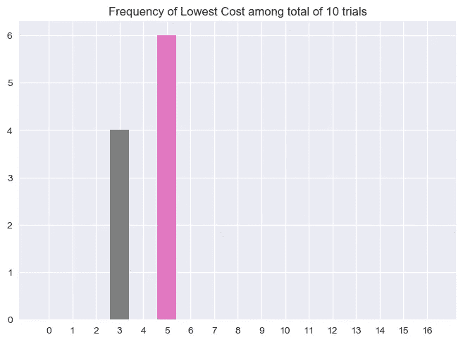****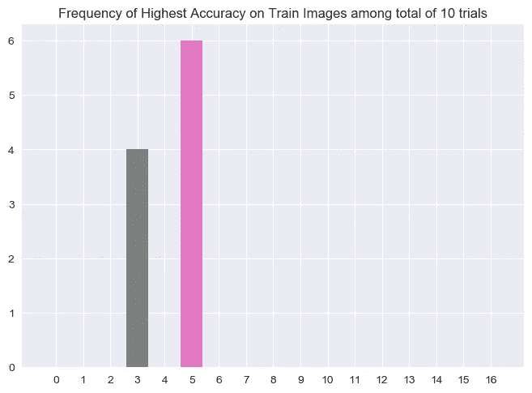****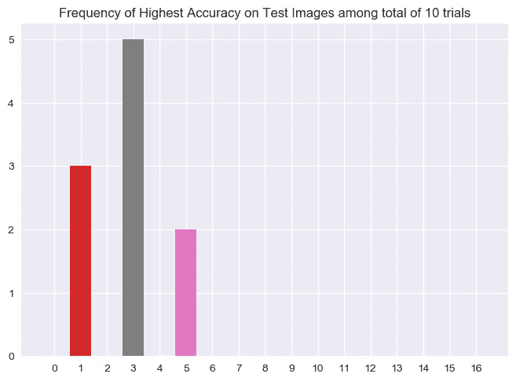**

****左侧图**→10 次实验的频率柱状图*最低成本率*
**中间图**→10 次实验的频率柱状图*训练图像的最高准确率*
**右侧图**→10 次实验的频率柱状图*测试图像的最高准确率***

**当学习率被设置为 0.0025 且具有更宽的神经元(1024)时，情况 2 表现良好。**

```
****Percentage of Best Performing at *Lowest Cost Rate***1\. **Case 5: 60%**
('Dilated ADAM Back Propagation Dense Connection by Addition (Different Decay / Proportion Rate)')2\. **Case 3: 40%**
('Dilated ADAM Back Propagation Dense Connection by Addition')
-------------------------------------------------------------
**Percentage of Best Performing at *Highest Accuracy on Training Images***1\. **Case 5: 60%**
('Dilated ADAM Back Propagation Dense Connection by Addition (Different Decay / Proportion Rate)')2\. **Case 3: 40%**
('Dilated ADAM Back Propagation Dense Connection by Addition')
-------------------------------------------------------------
**Percentage of Best Performing at *Highest Accuracy on Testing Images***1\. **Case 3: 50%**
('Dilated ADAM Back Propagation Dense Connection by Addition')2\. **Case 1: 30%**
('Dilated ADAM Back Propagation Sparse Connection by Multiplication')2\. **Case 5: 20%**
('Dilated ADAM Back Propagation Dense Connection by Addition (Different Decay / Proportion Rate)')**
```

****存档的培训结果****

**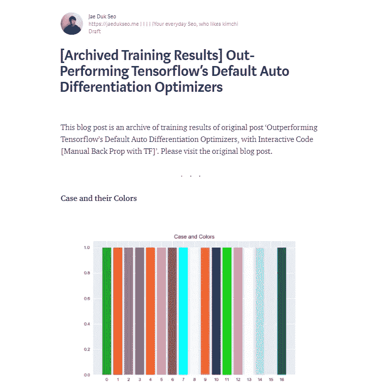**

**为了增加这个实验的透明度，我写了另一篇博文，其中包含随着时间推移的成本图、随着时间推移的训练图像的准确性图和随着时间推移的测试图像的准确性图。[要访问它，请点击此处](https://medium.com/@SeoJaeDuk/archived-training-results-out-performing-tensorflows-default-auto-differentiation-optimizers-28c5a75e9fc0)。**

****缺点****

**我还没有时间来优化每个汽车差异化的所有超参数。然而，我在每种情况下都保持了完全相同的学习率，但是有可能我设置的学习率对于张量流的自动微分来说不是最优的。如果你正在进行这个实验(如果你愿意，你可以使用我在交互代码部分提供的代码。)并为每个设置找到一个好的 hyper 参数，请通过评论让我知道，我很想看看它们是否也能被超越。**

**也就是说，我相信 Tensorflow 已经超级优化了它的算法，这使得自动微分执行得更快，但在每个网络上都获得了最高的性能。总的来说，这可能是一个公平的比较。**

**我还注意到扩张反向传播的两点。
*1。它在浅网络或神经元数量较少的情况下表现不佳
2。它长期表现良好。***

**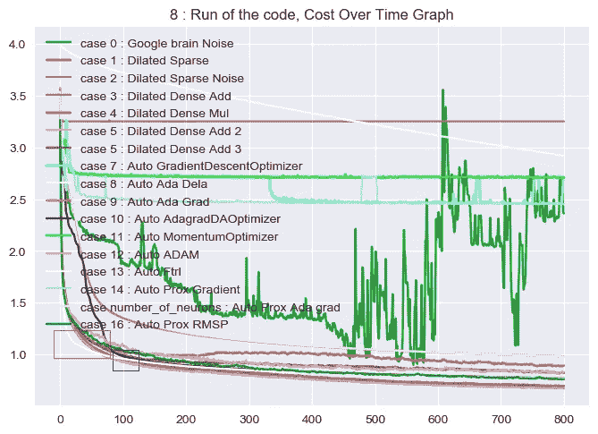**

****红框→** 案例 15 的错误率低于任何其他案例
**蓝框→** 在第 100 个时期后，案例 5 开始超出执行**

**如上所述，大多数时候，在第一个 100 个时期，自动微分方法具有较低的误差率。然而，在一定量的时期之后，例如 100 或 150，扩张的反向传播开始胜过。**

****交互代码****

**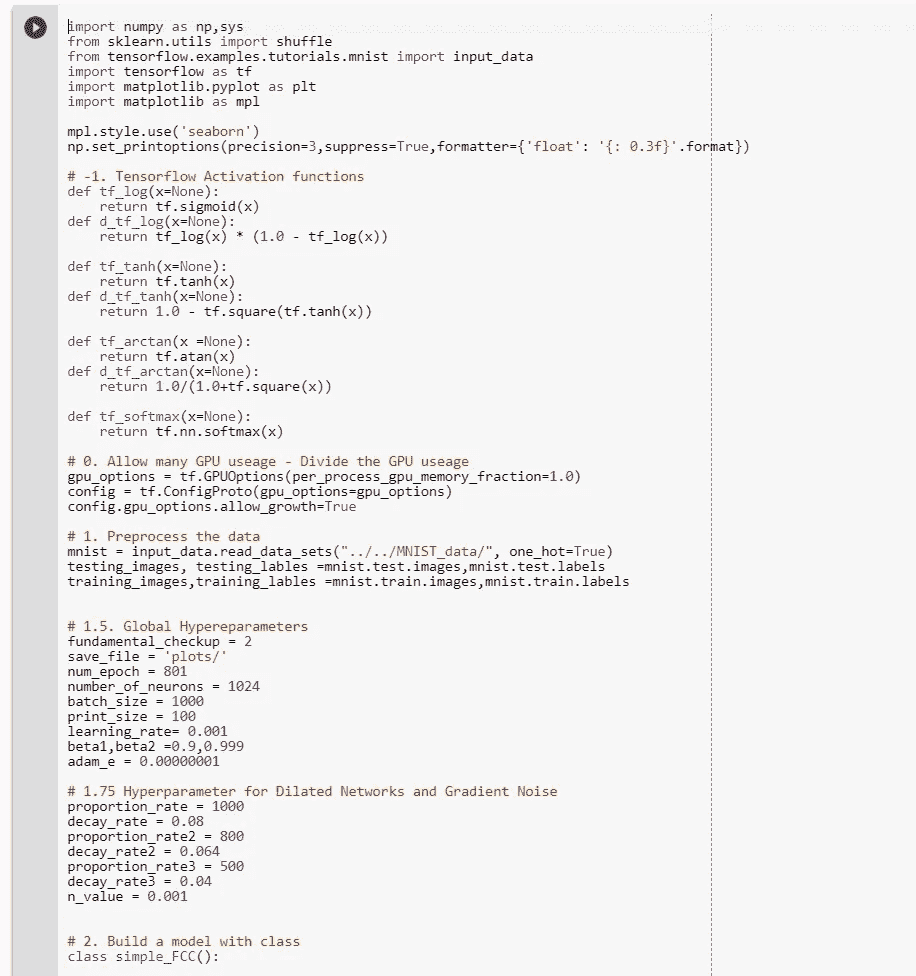**

***我搬到了谷歌 Colab 寻找交互代码！所以你需要一个谷歌帐户来查看代码，你也不能在谷歌实验室运行只读脚本，所以在你的操场上做一个副本。最后，我永远不会请求允许访问你在 Google Drive 上的文件，仅供参考。编码快乐！***

**要访问[试验 1 的代码，请点击此处](https://colab.research.google.com/drive/1JZgghElrUi_PExj04mLiIWYPYjvb0Md7)。
要访问[试验 2 的代码，请点击此处](https://colab.research.google.com/drive/1BzDIPr386Nq9Pnqdgt7xKAVteyYS_IO5)。
要访问[试验 3 的代码，请点击此处](https://colab.research.google.com/drive/1fZYVGloay9AUVBWKidKFLiRVpcz9NefO)。**

****引用
(如果您希望使用该实现或任何信息，请引用这篇博文)****

***APA***

```
**Outperforming Tensorflow’s Default Auto Differentiation Optimizers, with Interactive Code [Manual…. (2018). Medium. Retrieved 3 March 2018, from [https://medium.com/@SeoJaeDuk/outperforming-tensorflows-default-auto-differentiation-optimizers-with-interactive-code-manual-e587a82d340e](https://medium.com/@SeoJaeDuk/outperforming-tensorflows-default-auto-differentiation-optimizers-with-interactive-code-manual-e587a82d340e)**
```

***司法协助***

```
**"Outperforming Tensorflow’S Default Auto Differentiation Optimizers, With Interactive Code [Manual…." Medium. N. p., 2018\. Web. 3 Mar. 2018.**
```

***哈佛***

```
**Medium. (2018). Outperforming Tensorflow’s Default Auto Differentiation Optimizers, with Interactive Code [Manual…. [online] Available at: [https://medium.com/@SeoJaeDuk/outperforming-tensorflows-default-auto-differentiation-optimizers-with-interactive-code-manual-e587a82d340e](https://medium.com/@SeoJaeDuk/outperforming-tensorflows-default-auto-differentiation-optimizers-with-interactive-code-manual-e587a82d340e) [Accessed 3 Mar. 2018].**
```

****最后的话****

**我想用我最喜欢的两句话来结束这篇文章。**

**[杰夫·贝索斯](https://en.wikipedia.org/wiki/Jeff_Bezos)(亚马逊 CEO):[***一切都是为了长远……***](https://medium.com/parsa-vc/what-i-learned-from-jeff-bezos-after-reading-every-amazon-shareholder-letter-172d92f38a41)
[金尼·罗梅蒂](https://en.wikipedia.org/wiki/Ginni_Rometty)(IBM CEO):[***成长与安逸不能共存***](http://www.businessinsider.com/ibm-ceo-growth-and-comfort-dont-co-exist-2014-10)**

**如果发现任何错误，请发电子邮件到 jae.duk.seo@gmail.com 给我，如果你希望看到我所有写作的列表，请在这里查看我的网站。**

**同时，在我的 twitter 上关注我[这里](https://twitter.com/JaeDukSeo)，访问[我的网站](https://jaedukseo.me/)，或者我的 [Youtube 频道](https://www.youtube.com/c/JaeDukSeo)了解更多内容。如果你感兴趣的话，我还做了解耦神经网络[的比较。](https://becominghuman.ai/only-numpy-implementing-and-comparing-combination-of-google-brains-decoupled-neural-interfaces-6712e758c1af)**

****参考****

1.  **训练| TensorFlow。(2018).张量流。检索于 2018 年 3 月 3 日，来自[https://www . tensor flow . org/API _ guides/python/train # optimizer](https://www.tensorflow.org/api_guides/python/train#Optimizers)**
2.  **Seo，J. D. (2018 年 02 月 05 日)。带张量流的手动回推:解耦递归神经网络，从 Google 修改 NN…2018 年 2 月 21 日检索，来自[https://towards data science . com/manual-Back-Prop-with-tensor flow-Decoupled-Recurrent-Neural-Network-modified-NN-from-Google-f9c 085 Fe 8 FAE](/manual-back-prop-with-tensorflow-decoupled-recurrent-neural-network-modified-nn-from-google-f9c085fe8fae)**
3.  **j . bort(2014 年 10 月 07 日)。IBM 首席执行官 Ginni Rometty:增长和舒适不能共存。检索于 2018 年 2 月 21 日，来自[http://www . business insider . com/IBM-CEO-growth-and-comfort-don-co-exist-2014-10](http://www.businessinsider.com/ibm-ceo-growth-and-comfort-dont-co-exist-2014-10)**
4.  **Saljoughian，P. (2017 年 11 月 20 日)。读完每一封亚马逊股东信后，我从杰夫·贝索斯身上学到了什么。检索于 2018 年 2 月 21 日，来自[https://medium . com/parsa-VC/what-I-learn-from-Jeff-be zos-after-reading-every-Amazon-shareholder-letter-172d 92 f 38 a 41](https://medium.com/parsa-vc/what-i-learned-from-jeff-bezos-after-reading-every-amazon-shareholder-letter-172d92f38a41)**
5.  **页（page 的缩写）(未注明)。Pinae/TensorFlow-MNIST 示例。检索于 2018 年 2 月 22 日，来自[https://github . com/pinae/tensor flow-MNIST-example/blob/master/full-connected . py](https://github.com/pinae/TensorFlow-MNIST-example/blob/master/fully-connected.py)**
6.  **如何打印一个前面有一定数量空格的整数？(未注明)。检索于 2018 年 2 月 22 日，来自[https://stack overflow . com/questions/45521183/how-do-I-print-an-integer-with-set-number-of-spaces-before-it](https://stackoverflow.com/questions/45521183/how-do-i-print-an-integer-with-a-set-number-of-spaces-before-it)**
7.  **如何在没有科学记数法和给定精度的情况下漂亮地打印一个 numpy.array？(未注明)。检索于 2018 年 2 月 22 日，来自[https://stack overflow . com/questions/2891790/how-to-pretty-printing-a-numpy-array-with-with-given](https://stackoverflow.com/questions/2891790/how-to-pretty-printing-a-numpy-array-without-scientific-notation-and-with-given)**
8.  **将浮点数限制在小数点后两位。(未注明)。检索于 2018 年 2 月 22 日，来自[https://stack overflow . com/questions/455612/limiting-floats-to-two-decimal-points](https://stackoverflow.com/questions/455612/limiting-floats-to-two-decimal-points)**
9.  **如何防止 tensorflow 分配整个 GPU 内存？(未注明)。检索于 2018 年 2 月 23 日，来自[https://stack overflow . com/questions/34199233/how-to-prevent-tensor flow-from-allocation-the-total-of-a-GPU-memory](https://stackoverflow.com/questions/34199233/how-to-prevent-tensorflow-from-allocating-the-totality-of-a-gpu-memory)**
10.  **关闭 tensorflow 中的会话不会重置图形。(未注明)。检索于 2018 年 2 月 23 日，来自[https://stack overflow . com/questions/42706761/closing-session-in-tensor flow-sints-reset-graph](https://stackoverflow.com/questions/42706761/closing-session-in-tensorflow-doesnt-reset-graph)**
11.  **[1]“TF . reset _ default _ graph | tensor flow”， *TensorFlow* ，2018。【在线】。可用:[https://www . tensor flow . org/API _ docs/python/TF/reset _ default _ graph。](https://www.tensorflow.org/api_docs/python/tf/reset_default_graph.)【访问时间:2018 年 2 月 23 日】。**
12.  **在 tensorflow 中创建 float64 变量。(未注明)。检索于 2018 年 2 月 23 日，来自[https://stack overflow . com/questions/35884045/creating-a-float 64-variable-in-tensor flow](https://stackoverflow.com/questions/35884045/creating-a-float64-variable-in-tensorflow)**
13.  **Tensorflow 中的 global_step 是什么意思？(未注明)。检索于 2018 年 2 月 23 日，来自[https://stack overflow . com/questions/41166681/what-does-global-step-mean-in-tensor flow](https://stackoverflow.com/questions/41166681/what-does-global-step-mean-in-tensorflow)**
14.  **python 中的零列表。(未注明)。检索于 2018 年 2 月 23 日，来自[https://stack overflow . com/questions/8528178/list-of-zeros-in-python](https://stackoverflow.com/questions/8528178/list-of-zeros-in-python)**
15.  **使用列表中的 max()/min()获取返回的 max 或 min 项的索引。(未注明)。检索于 2018 年 2 月 23 日，来自[https://stack overflow . com/questions/2474015/getting-the-index-of-returned-max-or-min-item-using-max-min-on-a-list](https://stackoverflow.com/questions/2474015/getting-the-index-of-the-returned-max-or-min-item-using-max-min-on-a-list)**
16.  **如何防止 tensorflow 分配整个 GPU 内存？(未注明)。2018 年 2 月 23 日检索，来自[https://stack overflow . com/questions/34199233/how-to-prevent-tensor flow-from-allocation-the-total-of-a-GPU-memory](https://stackoverflow.com/questions/34199233/how-to-prevent-tensorflow-from-allocating-the-totality-of-a-gpu-memory)**
17.  **如何用 TensorFlow 得到稳定的结果，设置随机种子？(未注明)。2018 年 2 月 23 日检索，来自[https://stack overflow . com/questions/36288235/how-to-get-stable-results-with-tensor flow-setting-random-seed](https://stackoverflow.com/questions/36288235/how-to-get-stable-results-with-tensorflow-setting-random-seed)**
18.  **指定颜色。(未注明)。检索于 2018 年 2 月 23 日，来自[https://matplotlib.org/users/colors.html](https://matplotlib.org/users/colors.html)**
19.  **艾森，硕士(未注明)。使用 matplotlib 设置绘图的条形颜色。检索于 2018 年 2 月 24 日，来自[http://matthiaseisen.com/pp/patterns/p0178/](http://matthiaseisen.com/pp/patterns/p0178/)**
20.  **关闭事件。(未注明)。检索于 2018 年 2 月 24 日，来自[https://matplotlib . org/gallery/event _ handling/close _ event . html # sphx-glr-gallery-event-handling-close-event-py](https://matplotlib.org/gallery/event_handling/close_event.html#sphx-glr-gallery-event-handling-close-event-py)**
21.  **模块:tf.contrib.opt | TensorFlow。(2018).张量流。检索于 2018 年 3 月 3 日，来自[https://www.tensorflow.org/api_docs/python/tf/contrib/opt](https://www.tensorflow.org/api_docs/python/tf/contrib/opt)**
22.  **吉尼·罗梅蒂。(2018).En.wikipedia.org。检索于 2018 年 3 月 3 日，来自[https://en.wikipedia.org/wiki/Ginni_Rometty](https://en.wikipedia.org/wiki/Ginni_Rometty)**
23.  **杰夫·贝索斯。(2018).En.wikipedia.org。检索于 2018 年 3 月 3 日，来自[https://en.wikipedia.org/wiki/Jeff_Bezos](https://en.wikipedia.org/wiki/Jeff_Bezos)**
24.  **Only Numpy:实现“添加梯度噪声改善非常深度网络的学习”来自…(2018).成为人类:人工智能杂志。检索于 2018 年 3 月 3 日，来自[https://becoming human . ai/only-numpy-implementing-adding-gradient-noise-improves-learning-for-very-deep-networks-with-ADF 23067 F9 f1](https://becominghuman.ai/only-numpy-implementing-adding-gradient-noise-improves-learning-for-very-deep-networks-with-adf23067f9f1)**