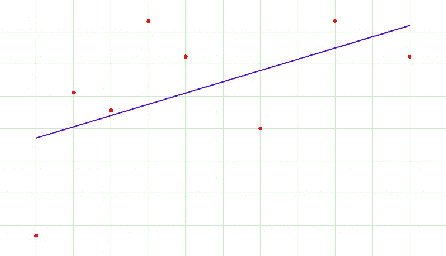
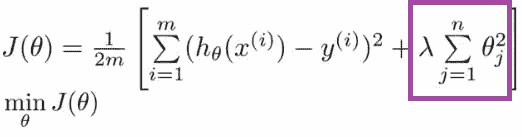

# 过度拟合和正则化

> 原文：<https://towardsdatascience.com/over-fitting-and-regularization-64d16100f45c?source=collection_archive---------1----------------------->

机器学习

在有监督的机器学习中，模型是在数据的子集上训练的，也就是训练数据。目标是根据训练数据计算每个训练示例的目标。

现在，当模型在训练数据中学习信号和噪声时，就会发生过度拟合，并且在模型没有训练的新数据上表现不佳。在下面的例子中，你可以看到前几步的欠拟合和后几步的过拟合。

现在，有几种方法可以避免在训练数据上过度拟合模型，如交叉验证采样、减少特征数量、修剪、正则化等。

随着模型复杂性的增加，正则化基本上增加了惩罚。正则化参数(lambda)惩罚除截距之外的所有参数，以便模型概括数据，不会过度拟合。

Regularization in cost function

在上面的 gif 中，随着复杂度的增加，正则化将增加对更高术语的惩罚。这将降低高次项的重要性，并使模型变得不那么复杂。

敬请关注下一篇文章，它将涵盖不同类型的正规化技术。