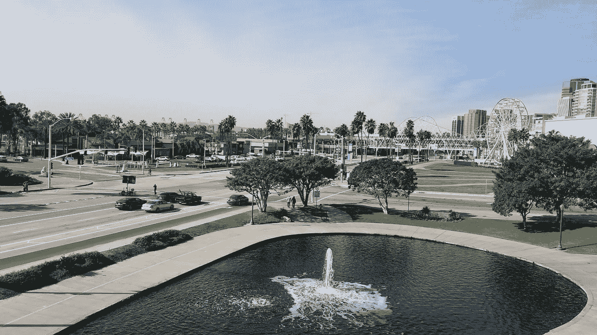

# NIPS 2017 上的总体趋势和应用(带链接！)

> 原文：<https://towardsdatascience.com/overarching-trends-and-applications-at-nips-2017-with-links-fc523d3354a7?source=collection_archive---------5----------------------->

Long Beach was really pretty at night.

我最近有机会参加了神经信息处理系统会议(NIPS)。我很高兴我参加了，因为我学到了很多东西，建立了很多非常好的关系(另外，我还看到了我从未见过的南加州，并逃离了缅因州的严冬)。在 NIPS 上，几个重要的主题和技术似乎贯穿了整个会议和研讨会。此外，ML 的几个应用一直受到很多关注。因为一个人可以很容易地写十几篇关于 NIPs 的文章，所以在这篇文章中，我将简要地调查一下我认为是什么构成了这些支配性的主题。稍后，我会就我在 NIPS 亲自探索的那些写更详细的文章。我会把其他的留给参加过的人。我在页面底部提供了相关链接，这样你就可以在闲暇时探索这些话题。

(请注意，NIPs 是一个如此大的会议，我很容易错过一些东西，在一定程度上，这些可能反映了我自己的经历和我交往的人。尽管如此，我还是尽最大努力捕捉了 NIPs 中所有跨“学科”的突出观点。

此外，在开始之前，似乎有必要提一下，谢天谢地，会议没有受到火灾的影响，但南加州的许多人却没有这么幸运。所以，如果你有机会并且有能力的话，请[向](http://www.unitedwayla.org/ventura_county_thomas_fire)[联合慈善基金会](http://www.unitedwayla.org/ventura_county_thomas_fire)或[其他慈善机构](http://www.newsweek.com/how-help-southern-california-wildfire-victims-donate-volunteer-741827)捐赠。

## 贝叶斯深度学习(和深度贝叶斯学习)

在 NIPs，将贝叶斯技术应用于深度学习是一个巨大的话题。周四 Yee Whye Teh 做了一个关于贝叶斯深度学习和深度贝叶斯学习的演讲。他描述了同步在分布式贝叶斯深度学习中的工作方式，指出服务器本质上维护的是后验分布，而不是参数的权威副本。然后，他将这一想法与克服神经网络中的灾难性遗忘和弹性权重整合的问题联系起来。在演讲的第二部分，他描述了深度学习技术如何改善贝叶斯学习。他描述了 DL 如何帮助克服贝叶斯模型中的一些僵化之处，并增加它们的推理和可伸缩性。除了主题演讲，还有几个关于贝叶斯技术的焦点。我个人最喜欢的是贝叶斯甘斯。

我还看到贝叶斯技术在元学习研讨会上出现了几次。此外，贝叶斯技术保持着四个直接相关的研讨会的记录(至少今年如此)。在大楼的四周，你可以听到人们在谈论一些技术或模型的贝叶斯理论。最后，在深度学习中使用贝叶斯方法有可能帮助解决可解释性问题，或者至少提供更多“微妙”的决策。这就引出了我们的下一个趋势。

**严谨性、可解释性、稳定性/安全性和理论性**

这种趋势并不奇怪。到现在为止，你可能已经看过阿里·拉希米的《时间的考验》视频以及由此引发的讨论(如果你还没有下面的演示链接)。需要注意的是，这四个主题是相似的，但并不完全相同。我选择将它们归为一类，因为它们都与提供一种解释有关，无论是技术的还是非技术的，理论的还是实验的，经验的还是定性的，解释了为什么一个模型会以这种方式运行(或者保证模型的整体稳定性)。例如，人们可以通过实验结果而不是理论来证明严谨性。此外，可解释性对不同的人来说可能意味着不同的事情(例如，ML 研究员认为对模型决策的合理解释可能不足以说服医生做出诊断[或让患者接受])。我不会过多地讨论关于炼金术和工程学的激烈争论，除了说它肯定在双方都产生了大量的讨论和强烈的观点(下面的链接)。

我要说的是，无论你是否认为可解释性或“严谨性”对研究是必不可少的，它在应用的实践层面上是重要的。如果我们不能解释国会做出的决定及其原因，我们怎么能指望国会批准无人驾驶汽车呢？或者我们怎么能仅仅因为一个模型认为某人患癌症的概率很高就指望医生进行手术呢？最后，对可解释性的研究将大大有助于调试神经网络。至少对我来说，有很多次当我写代码时，它运行得很好，但是网络不会收敛，或者它给我一个完全意想不到的结果。也就是说，在可解释性研讨会和专题讨论会上，有许多很好的演示和有趣的作品，我强烈建议你们去看看。

## 几何深度学习和图形 CNN

很多数据自然最好用图类型结构来表示；例如，社交网络、多个城市之间的路线或化学品。然而，传统的神经网络不能很好地处理这种类型的结构化数据。在 NIPs 2017 上，图形神经网络或 GNN 是突出的特色。在 NIPS 的第一天，迈克尔·布朗斯坦、琼·布鲁纳、阿瑟·斯拉姆和扬·勒昆主持了一个关于结构和流形的几何深度学习的教程。在教程中，他们解释了 GNN 模型背后的理论及其几个应用。但是 GNN 也出现在一些 NIPS 的报纸和许多车间里。这个话题在非正式讨论中也多次出现。就个人而言，我认为能够在神经网络中“保持”图形或流形结构是一大进步，可以应用于各种不同的领域。

## **生成性对抗网络**

今年 GANs 在日本很受欢迎。也许没有去年那么热，但在整个主要会议期间和几乎每个研讨会上都可以看到它们。在主会议上，我们有“[双代理甘斯的照片真实感和身份](https://papers.nips.cc/paper/6612-dual-agent-gans-for-photorealistic-and-identity-preserving-profile-face-synthesis)”、“[维甘](https://papers.nips.cc/paper/6923-veegan-reducing-mode-collapse-in-gans-using-implicit-variational-learning)”、“[f-甘斯](https://papers.nips.cc/paper/6649-f-gans-in-an-information-geometric-nutshell)”、“[双代理甘斯](https://papers.nips.cc/paper/7144-dualing-gans)”、“[瓦瑟斯坦甘斯](https://papers.nips.cc/paper/7159-improved-training-of-wasserstein-gans)的改良训练，仅举几例。尽管没有专门的工作室，他们仍然在周五和周六到处出现。例如，创意工作室几乎完全由创造艺术、音乐和演讲的甘人组成。几位发言人甚至在 ML4H 和 MedNIPS 研讨会上提到了 gan。显然，在医学领域中有几种应用，例如扩充训练数据、生成合成数据(不符合 HIPPA ),以及重建/改变图像的模态(即，从 MRI 到 ct)。

## 强化学习(特别是深度强化学习)

强化学习仍然是 NIPs 的热门话题。主要会议有一个完整的轨道致力于 RL，一个关于如何与人一起使用 RL 的教程，以及一个关于深度 RL 的研讨会。但更重要的是 RL 在其他研讨会和讨论中出现的次数。例如，ML4H 研讨会上的几篇论文讨论了使用 RL 来指导[败血症治疗](https://arxiv.org/pdf/1711.09602.pdf)和[疟疾可能性预测](https://arxiv.org/pdf/1711.09223.pdf)。

这次会议清楚地表明(至少对我来说), RL 不再仅仅用于有明确规则的计算机和棋盘游戏，现在研究人员积极地将 RL 应用于解决从败血症治疗到聊天机器人到机器人的现实世界问题。

## **元学习**

在 NIPS，元学习也是一个相当大的话题。元学习本质上是学习学习或优化优化算法的艺术。如果这看起来令人困惑，你并不孤单。在小组讨论中，关于元学习到底是什么有很长的争论。至少在这次会议的背景下，元学习似乎本质上包括使用算法来寻找模型的最优超参数和/或网络的最优结构。

基本思想是，大量时间(通常是金钱)被浪费在手工测试各种超参数配置和不同的网络结构上。很多时候，可能永远也找不到真正的最佳结构。如果我们有一种算法可以学习优化网络以提供最佳结果，那会怎么样？几位发言者在周四晚上的研讨会上探讨了这一问题，讨论在周五的研讨会上继续进行。许多人还在交谈中提出元学习，询问演讲者他们是否会自动调整他们的超参数。

# **二。应用领域**

Long Beach was bright and sunny for the pretty much the entire conference.

## **医疗保健**

将机器学习应用于医疗保健是今年会议上的一个热门话题。会议有两个研讨会，医疗保健的机器学习(ML4H)和医学成像会议 NIPs(这两个我将在未来的文章中详细总结)，以及几个相关的研讨会，其中包括大量医疗保健相关的提交材料(例如，计算生物学)。总之，ML4H 专注于医疗保健的各个领域。这些领域包括将 ML 用于药物研发、医院运营(如预测住院时间、手部卫生等。)，以及遗传学研究。医学成像与专注于医学成像的 NIPS 相遇，主要探索 ML 技术如何帮助医学图像分割、重建和分类。

医疗保健也出现在主要会议上。周二，Deep Genomics 的布伦丹·弗雷(Brendan Frey)发表了关于人工智能如何加快研究甚至提供遗传病治疗效果的主题演讲。此外，有大量的医疗人工智能公司在会议中心进行互动演示。

## 机器人学

机器人技术似乎是另一个在主要会议和研讨会上受到相当多关注的领域。周二，在太平洋舞厅有一场“*使用视觉想象和元学习的深度机器人学习”*的演示。然后在周三，Pieter Abbel 做了一个关于机器人深度学习的演讲。同样，周五也有一个讨论“现实世界中的表演和互动”的研讨会

## 科学、能源和工程

似乎也有很多关于在其他科学中应用机器学习技术(或者反过来使用其他科学的原理来增强机器学习)和解决能源问题的内容。在主会议上，有一个关于能源和排放的主题发言。具体来说，周一在开场白之后，约翰·普拉特谈到了“减少二氧化碳排放的能源战略”在这篇文章中，他描述了如何应用最大似然法来预测能源的利用和寻找能源的组合，以便降低到当前排放量的一个设定的分数。普拉特接着讨论了如何利用 ML 在核聚变研究中取得进展。

在工作室那边有两个有趣的工作室。第一次是针对物理科学的深度学习，第二次是针对分子和材料的深度学习。ML for computational biology workshop 也关注这些想法(尽管正如人们所料，它确实与医疗保健相关的想法有相当多的重叠)。

# 结论

这只是今年 NIPs 上展示的一些真正令人兴奋的趋势和想法的一瞥。这些话题中有许多我只是刚刚触及，所以我鼓励你更详细地探索它们。此外，还有许多其他的小话题也同样有趣，如果不是更有趣的话。我将会写几篇关于 ML4H、MedNIPs、可解释性和(可能)元学习的后续文章。敬请关注。一如既往，如果你认为我错过了什么或有其他意见，请在下面留下。

# 链接(如承诺的)

## 贝叶斯技术

Keynote by Yee Whye Teh

 [## 贝叶斯深度学习研讨会| NIPS 2017

### NIPS 2017 贝叶斯深度学习研讨会—2017 年 12 月 9 日，美国长滩长滩会议中心。

bayesiandeeplearning.org](http://bayesiandeeplearning.org)  [## bayesopt.com

### 编辑描述

bayesopt.com](http://bayesopt.com/)  [## (几乎)贝叶斯学习的 50 个阴影:PAC-贝叶斯趋势和见解- NIPS 2017 研讨会

### 我们认为，现在是时候确定当前 PAC-Bayesian 相对于其他现代方法的趋势了

bguedj.github.io](https://bguedj.github.io/nips2017/50shadesbayesian.html) 

## 严谨性和可解释性

 [## NIPS 2017 研讨会:解读、解释和可视化深度学习——现在怎么办？

### 黑匣子。在医疗诊断或自动驾驶汽车等敏感应用中，模型对环境的依赖性越来越大

www.interpretable-ml.org](http://www.interpretable-ml.org/nips2017workshop/)  [## 可解释的 ML 研讨会— NIPS 2017

### 美国加州长滩 NIPS 2017 可解释 ML 研讨会

可解释的. ml](http://interpretable.ml) 

The talk of Ali Rahimi at NIPS

Facebook post in response by Yann and the resulting discussion in the comments.

## 几何深度学习

 [## 几何深度学习

### 在过去十年中，深度学习方法(例如卷积神经网络和递归神经网络)允许…

geometricdeeplearning.com](http://geometricdeeplearning.com/) 

## **强化学习**

Tutorial on RL with people

Keynote at the Deep Reinforcement Learning Symposium

Main conference RL spotlight

 [## 深度强化学习研讨会，NIPS 2017

### 虽然强化学习的理论解决了一类极其普通的学习问题，但它有一个共同的特点

sites.google.com](https://sites.google.com/view/deeprl-symposium-nips2017/home) 

## 甘斯

如前所述，没有太多的“纯 GAN”内容，但它们出现在许多研讨会和聚光灯下。

本次会议有很多关于甘斯。

## **元学习**

 [## 元学习研讨会

### 出现了几种元学习方法，包括基于贝叶斯优化、梯度下降…

metalearning-symposium.ml](http://metalearning-symposium.ml/)  [## 主页

### @NIPS 2017 年 12 月 09 日星期六长滩凯悦酒店，灯塔舞厅 D+E+F+H

metalearning.ml](http://metalearning.ml/) 

车间

## 卫生保健

[https://ml 4 health . github . io](https://ml4health.github.io)

 [## med-nips 2017

### “医学成像与 NIPS 相遇”是 NIPS 2017 的卫星研讨会。该研讨会旨在将来自…的研究人员聚集在一起

sites.google.com](https://sites.google.com/view/med-nips-2017) 

## 能源和科学

 [## 物理科学深度学习，NIPS 2017

### 第 31 届神经信息大会物理科学深度学习(DLPS)研讨会网站…

dl4physicalsciences.github.io](http://dl4physicalsciences.github.io)  [## NIPS 2017 研讨会:分子和材料的机器学习

### 机器学习的成功一次又一次地在分类、生成模型和…

www.quantum-machine.org](http://www.quantum-machine.org/workshops/nips2017/) 

## **机器人**

 [## NIPS 17 机器人学习

### 近年来，机器人技术在公共领域的实际应用方面取得了长足的进步。机器人…

sites.google.com](https://sites.google.com/view/nips17robotlearning/home)