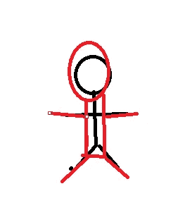
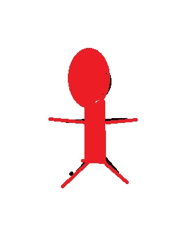
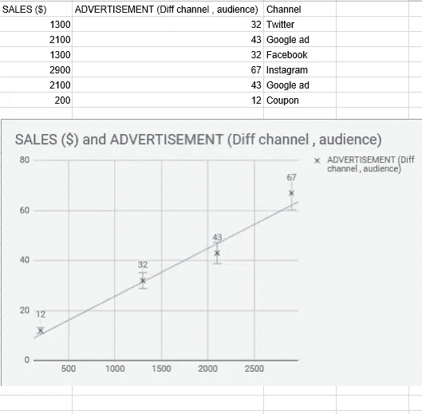
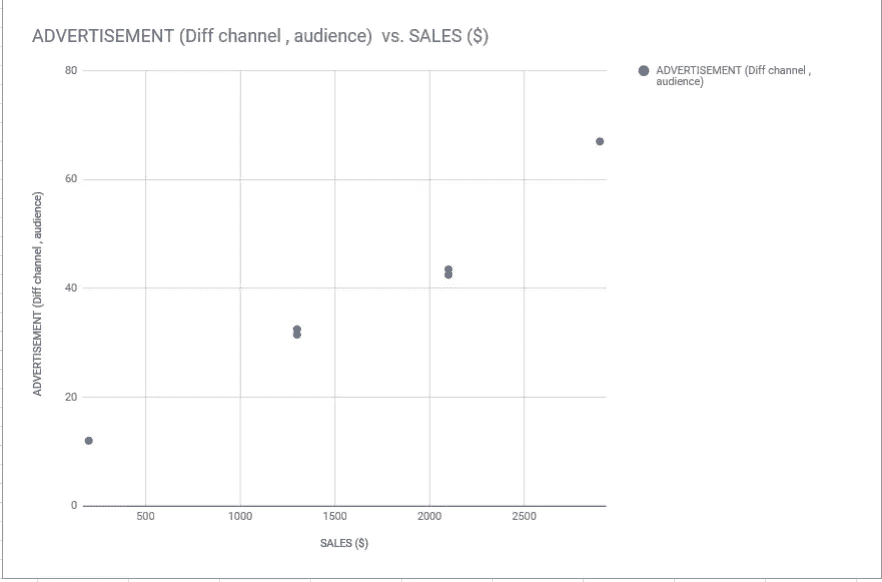
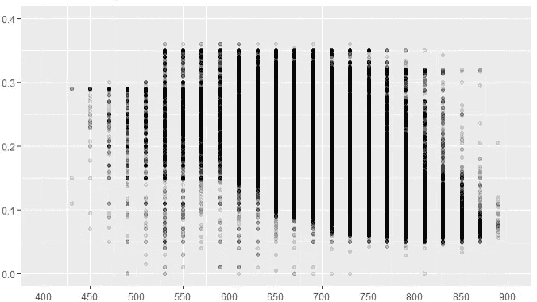
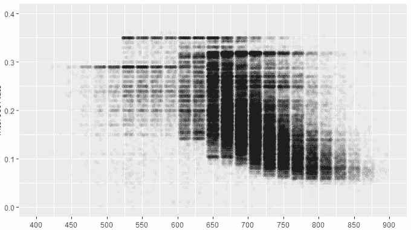
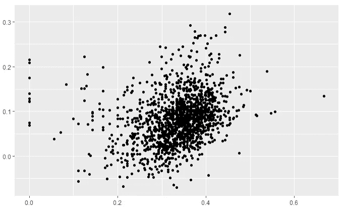
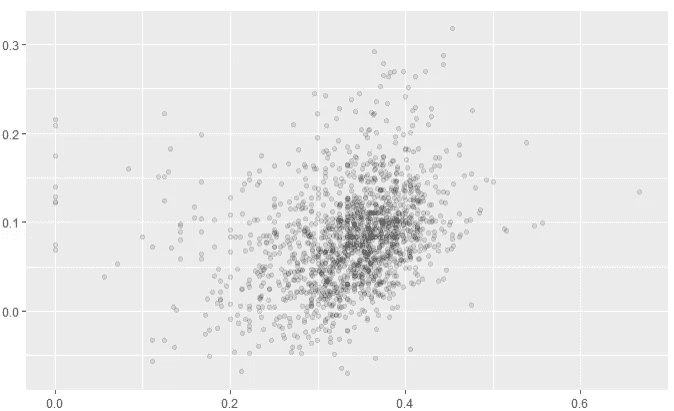
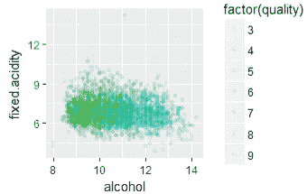
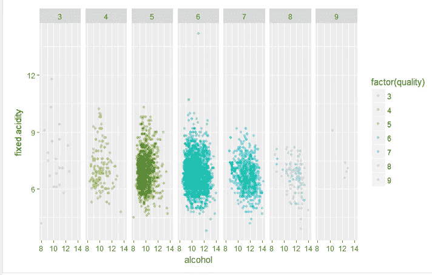

# 盖过了其他的点！过度抽签的问题。

> 原文：<https://towardsdatascience.com/overshadowing-the-other-points-the-overplotting-issue-e6d1ebbdef20?source=collection_archive---------3----------------------->

在讨论了关于第一个帖子的数据的情节后。我在这里谈论一个关于视觉化的非常重要的问题，一个实际上可以让你的推论完全错误的问题。所以在我继续之前，这里是可视化讨论的第一部分

 [## 什么情节？为什么有这个情节，为什么没有！

### 因此，在我上一篇文章发表一年后，我来到了这里。发生了各种各样的事情，但有一件事是不变的，那就是…

towardsdatascience.com](/what-plot-why-this-plot-and-why-not-9508a0cb35ea) 

言归正传！

那么什么是**过抽**？在先前的图/数据上绘制数据的“现象”。迷惑？让我用更简单的话来分解一下想象一下，有一个身材矮小苗条的人站在一条线上，然后一个肥胖高大的人站在他的正前方，这基本上隐藏/遮蔽了身材矮小苗条的人，并从线上彻底根除了他的存在。

让我们来看看这个小小的“艺术”

Red guy overshadows the slim one!

如果你注意到上图中红色的人遮住了他身后的人。我没有给它上色，这样可以理解为红色的人后面有一个人。但是想象它是一个人，红色的人基本上会隐藏苗条的人。

Where’s the slim guy ?

这是一个问题不是吗？嗯，同样的问题发生在视觉化过程中。许多有抱负的数据科学家和分析师专注于绘制数据，但有时往往会忽略过度绘制，因为显示的是多数，但**少数是重要的。**

## 战战兢兢！

在前一篇文章中，我提到了抖动点的问题，这是解决过度渲染点的一个好方法。那么抖动背后的想法是什么？让我们假设您正在为一个数据集绘制点，该数据集由 X 轴销售和 Y 轴广告组成。

这是 Google Sheet 上的一个带有散点图的模拟数据。

Well , Where are the other two points ?

如果你从图中注意到只有 4 个图，但有 6 行！两排在哪里？

坦白地说，这似乎很完美。因为我们有两点具有相同的销售价值和广告价值。但是应该有六个情节，那么到底发生了什么？facebook 使用 channel 的意义在于过度渲染了 twitter 的意义。第二个谷歌广告超过了第一个谷歌广告点。(不要混淆为重复)

现在修复！抖动点。**那么它是做什么的呢？抖动点基本上创建了范围，所以 twitter 和 facebook 的同一点会直观地位于区间[31.5 到 32.5]。**

所以改变后的情节看起来像这样，

6 points! Awesome

所以如果你注意到有 6 个点！很棒吧？抖动就是这样工作的，我们再举一个例子。

Another example of Overplotting!

如果你注意到分数抽多了！现在，让我们利用抖动的力量！

Shape looks the same as previous plot!

如果你现在注意到了，我们可以说低于 650 范围的点的人口分布更少！但是我们实际上不能从前面的情节中推断出同样的情况。我在这里试图推断的是，我们可以看到巨大的人口差异！由于点的透明性，这也是可能的。这就把我带到了下一个环节。

## 透明度很重要

无论你谈论的是政府还是你的个人生活，透明度对于某些特定的事情总是很重要的，同样，对于一个数据科学家来说，用透明度来描绘这些点也是非常重要的。这有助于理解点的分布以及异常值。在我作为一名评审员的经验中，我注意到许多学生试图推断散点图而没有实际调整`alpha`，这实际上是点的透明度。所以你可能会想，这真的有什么不同吗？

的确如此。它确实很重要。有时我们会处理包含异常值和超出范围值的数据。我们可以通过使用不同的技术来移除它们，这将是我下一篇博客的一部分。但有时它们确实有重要意义，比如想象一下，你有相同的销售和广告数据，你有像[(1，1)，(3，2)，(4，4)，(10，10)]这样的点，这些点的值基本上都在增加，在检查异常值时，我们实际上可能会删除该点。但这一点可能具有重要意义。这就是点的透明度进入画面的地方。

让我们看看这个例子，

Lots of point’s

所以人口看起来是中心的。但是让我们来看看同样的透明情节。

Oh , Here’s where it lies!

现在，我们可以推断出，大多数点在 x 轴上大约是 0.3 到 0.4，在 y 轴上大约是 0.05 到 0.1，这是一个故事。

关于过抽的最后一点是`facet_grid`。让我们把它盖住！

## 刻面！看到点的不同面

那么什么是刻面呢？面是事物的一个侧面或方面。如果你正在考虑辞去你的日常工作，成为一名马戏团演员，你应该首先考虑你的新生活会是什么样的。Facet 与 face 这个词有关，也可以指钻石或其他宝石的平面。(根据词汇)

当比较两个以上的变量时使用，它形成由行和列刻面变量定义的面板矩阵。当您有两个离散变量，并且变量的所有组合都存在于数据中时，这是最有用的。

参考，

(【http://ggplot2.tidyverse.org/reference/facet_grid.html】T2

那么，刻面是如何帮助减少过度绘制的呢？想象一下，你有不同类的不同点，一个类比另一个类出现的次数多。在这种情况下，出现次数较多的类的点将比出现次数较少的类的点更加可见。

让我们看看这个例子，

如果你从图中注意到，即使在设置了透明度之后，我们仍然不能确定各个类的分布，在这种情况下，小平面图就出现了。这是同样的情节，

Clear.

与上面的图相比，上面的图更清晰，我们可以更好地从这个图中推断。

因此，这些是少数真正有用的技术。

***数据可视化是一门艺术，是通过视觉信息讲述故事的艺术。在我看来，每个数据科学家都不应该忽视对可视化的强调。***

再见了。