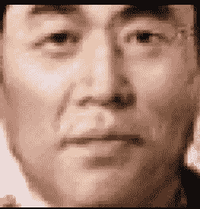
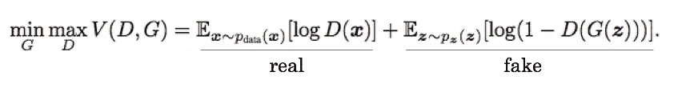
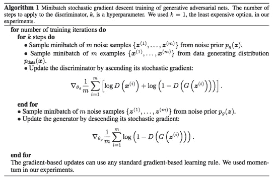
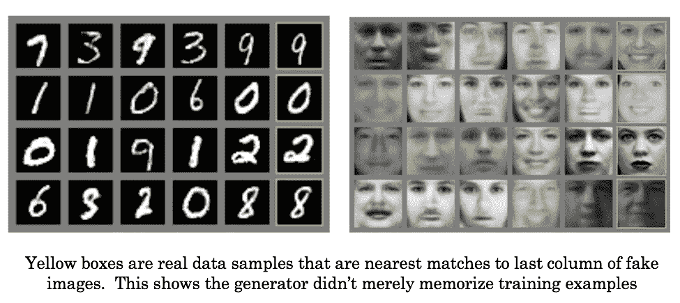

# 生成性对抗网络概述——第一部分

> 原文：<https://towardsdatascience.com/overview-of-gans-generative-adversarial-networks-part-i-ac78ec775e31?source=collection_archive---------5----------------------->

*看看我的* [*YouTube 上甘斯*](https://www.youtube.com/watch?v=3z8VSpBL6Vg&list=PLSgGvve8UweFoMyAEFlFiE--JtWect5-T) *的视频换个视角。本文原载于*

*本系列文章的目的是提供 GAN 研究的概述并解释其贡献的性质。我自己是这个领域的新手，所以这肯定是不完整的，但希望它可以为其他新手提供一些快速的背景。*

*对于第一部分，我们将在高层次上介绍 GANs，并总结原始论文。如果您已经熟悉了基础知识，请随意跳到第二部分。假设你熟悉神经网络的基础知识。*

# *背景*

**创成式*是什么意思？在高层次上，生成模型意味着您已经绘制了数据本身的概率分布。在图像的情况下，这意味着你有每一个可能的像素值组合的概率。这也意味着您可以通过从该分布中采样来生成新的数据点(即选择具有大概率的组合)。如果你在计算机视觉领域，这意味着你的模型可以从头开始创建新的图像。例如，这是一个生成的面。*

**

*以防这还没有完全被理解:这不是一个真实的人，这是一张电脑发明的脸。GAN 可以做到这一点，因为它被给予了大量的面部图像来学习，这导致了概率分布。这个图像是从分布中提取的一个点。有了创成式模型，你可以创造出以前不存在的新东西。音频、文本、图像…等等。非常非常酷的东西。*

# *原甘*

*Ian Goodfellow 等人的[原始论文](https://arxiv.org/abs/1406.2661)概述了基本方法，构建了理论基础并给出了一些示例基准。*

*GANs 没有发明生成模型，而是提供了一种有趣而方便的学习方法。它们被称为“对抗性的”，因为问题的结构是两个实体相互竞争，而这两个实体都是机器学习模型。*

*最好用一个例子来解释。假设您想要构建一个面部图像生成器。你首先向一个系统输入一堆随机数，它将它们相加相乘，然后应用一些奇特的功能。最后，它输出每个像素的亮度值。这是你的*生成模型*——你给它噪音，它生成数据。现在，假设你这样做 10 次，得到 10 个不同的假图像。*

*接下来，你抓取 10 张真实面孔的图像。然后，你把假图像和真图像都输入到一个不同的叫做*鉴别器的模型中。它的工作是为每个输入图像输出一个数字，告诉你图像是真实的概率。开始时，生成的样本只是噪声，所以您可能认为这很容易，但鉴别器也一样糟糕，因为它也没有学到任何东西。**

**

*对于假图像上的每一个错误，鉴别者会受到惩罚，而生成者会得到奖励。基于对真实图像的正确分类，鉴别器也受到惩罚或奖励。这就是为什么它们被称为对抗性的——鉴别者的损失就是生产者的收益。久而久之，竞争导致相互提高。*

*最后，使用“网络”一词，因为作者使用神经网络来模拟发生器和鉴别器。这太棒了，因为它提供了一个简单的框架，使用惩罚/奖励来调整网络参数，使它们能够学习:熟悉的反向传播。*

# *理论基础*

*我不会再现论文中所有血淋淋的细节，但值得一提的是，它们展示了两者:*

*   *优化目标 V(D，G)导致发电机概率分布与真实概率分布精确匹配。这意味着你的假例子是完美的，无法与真实的例子区分开来。*

**

*   *作者的梯度上升/下降训练算法收敛到这个最优值。所以你不仅知道你需要做什么，而且知道怎么做。*

**

*为了建立直觉，在上面的优化目标 V(D，G)中，D(x)项是鉴别器对以下问题的回答:输入 x 来自真实数据集的概率是多少？如果你把 G(z)代入这个函数，当你给它假数据时，它就是鉴别器的猜测。如果你分别考虑 D 和 G，你会发现 G 希望 V(D，G)小，而 D 希望这个大。这激发了算法中的梯度上升/下降技术。【E 的意思是“期望”，只是一个平均值。下标显示了你正在平均的概率分布，或者是真实的数据，或者是生成器变成假图像的噪声】。*

*然而，他们提供的证明并不直接适用，因为我们是通过优化神经网络的*参数*来间接优化这些概率分布的，但很高兴知道该基金会有理论保证。*

# *结果*

*值得注意的是，很难量化假数据的质量。如何判断假脸一代的进步？除此之外，当涉及到生成逼真的图像时，它们具有最先进的性能，这引起了很多关注。图像通常看起来没有其他方法模糊。*

*尽管自最初的论文(将在第二部分中讨论)以来已经取得了巨大的进步，这里还是有一些例子:*

**

# *问题*

*原始 GAN 实施的最大问题是:*

*   *训练困难。有时模型永远不会学到任何东西或收敛到局部极小值。*
*   *“模式崩溃”，即生成器本质上一遍又一遍地输出同样的东西。*

*这些问题通过对架构的改进得到了解决，并将在以后的文章中提出。*

# *结论*

*最终，这个框架允许我们以*无监督*的方式使用神经网络的正常监督学习方法。这是因为我们的标签很容易生成，因为我们知道哪些数据来自训练集，哪些数据是生成的。值得注意的是，在上面的手写数字图像中，数字标签本身并没有在训练中使用。尽管如此，生成器和鉴别器都能够学习数据的有用表示，正如生成器模拟数据的能力所证明的那样。*

*在第二部分中，我们将讨论如何解决许多训练问题，以及在真实图像生成方面做出巨大的改进。*