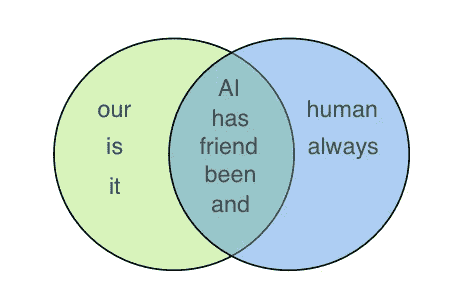
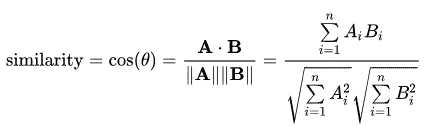
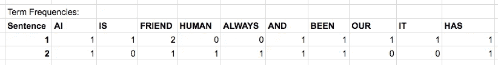
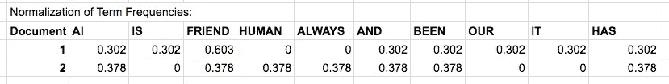

# Python 中文本相似性度量概述

> 原文：<https://towardsdatascience.com/overview-of-text-similarity-metrics-3397c4601f50?source=collection_archive---------1----------------------->

## Jaccard 指数和余弦相似度——应该在哪里使用，各有利弊。

在研究搜索引擎的自然语言模型时，我经常会问这样的问题“这两个词有多相似？”、“这两句话有多像？”，“这两个文档有多相似？”。我已经在之前的帖子中谈到过[自定义单词嵌入，其中单词的意思被考虑到单词的相似性。在这篇博文中，我们将更多地研究句子或文档相似性的技术。](/how-to-train-custom-word-embeddings-using-gpu-on-aws-f62727a1e3f6)


How do we make sense of all this text around us?

有一些文本相似性度量，但我们将查看最常见的 Jaccard 相似性和余弦相似性。

# **Jaccard 相似度:**

[雅克卡相似度](https://en.wikipedia.org/wiki/Jaccard_index)或并集上的交集被定义为**交集的大小除以两个集合的并集的大小。**让我们以两个句子为例:

**句子 1:** AI 是我们的朋友，它一直很友好
**句子 2:** AI 和人类一直很友好

为了使用 Jaccard 相似度计算相似度，我们将首先执行**词条化**以将单词减少到相同的根单词。在我们的例子中，“朋友”和“友好的”都将成为“朋友”，“有”和“有”都将成为“有”。画出我们得到的两个句子的维恩图:



Venn Diagram of the two sentences for Jaccard similarity

对于上面两个句子，我们得到 Jaccard 相似度为 **5/(5+3+2) = 0.5** ，这是集合的交集的大小除以集合的总大小。
Python 中 Jaccard 相似度的代码为:

```
def get_jaccard_sim(str1, str2): 
    a = set(str1.split()) 
    b = set(str2.split())
    c = a.intersection(b)
    return float(len(c)) / (len(a) + len(b) - len(c))
```

这里要注意的一点是，由于我们使用集合，“朋友”在句子 1 中出现了两次，但这并不影响我们的计算——这将随着余弦相似度而改变。

# 余弦相似度:

[余弦相似度](https://en.wikipedia.org/wiki/Cosine_similarity)通过测量**两个矢量**之间角度的余弦来计算相似度。计算方法如下:



Cosine Similarity calculation for two vectors A and B [[source](https://en.wikipedia.org/wiki/Cosine_similarity)]

**用余弦相似度，我们需要把句子转换成向量**。一种方法是使用带有 TF (术语频率)**或 TF-IDF** (术语频率-逆文档频率)的**单词包。TF 或 [TF-IDF](https://en.wikipedia.org/wiki/Tf%E2%80%93idf) 的选择取决于应用，与余弦相似性的实际执行方式无关，余弦相似性只需要向量。 *TF 一般对文本相似性比较好，但 TF-IDF 对搜索查询相关性比较好。***

另一种方法是使用 [Word2Vec](https://machinelearningmastery.com/develop-word-embeddings-python-gensim/) 或我们自己定制的单词嵌入将单词转换成向量。在之前的[帖子](/how-to-train-custom-word-embeddings-using-gpu-on-aws-f62727a1e3f6)中，我谈到了训练我们自己的自定义单词嵌入。

具有单词包和单词嵌入 tf/ tf-idf 之间有两个主要区别:
1 .tf / tf-idf 为每个单词创建一个数字，单词嵌入通常为每个单词创建一个向量。
2。tf / tf-idf 对于分类文档整体来说是好的，但是单词嵌入对于识别上下文内容是好的。

让我们计算这两个句子的余弦相似度:

**句子 1:** 人工智能是我们的朋友，它一直很友好
**句子 2:** 人工智能和人类一直很友好

**第 1 步**，我们将使用单词袋来计算词频:



Term Frequency after lemmatization of the two sentences

**第二步，**上面显示的词频计数的主要问题是，它倾向于较长的文档或句子。解决这个问题的一个方法是**用各自的量值或 [L2 规范](https://en.wikipedia.org/wiki/Norm_(mathematics))来归一化**术语频率。对每个频率的平方求和并取平方根，句子 1 的 L2 范数是 3.3166，句子 2 是 2.6458。将上述频率除以这些标准，我们得到:



Normalization of term frequencies using L2 Norms

**步骤 3，**由于我们已经将两个向量归一化为长度为 1，所以可以用点积计算余弦相似度:
余弦相似度=(0.302 * 0.378)+(0.603 * 0.378)+(0.302 * 0.378)+(0.302 * 0.378)+(0.302 * 0.378)= 0.684

因此，两个句子的余弦相似度是 **0.684** ，这不同于完全相同的两个句子的 Jaccard 相似度是 **0.5** (上面计算的)

Python 中字符串成对余弦相似性的代码是:

```
from collections import Counter
from sklearn.feature_extraction.text import CountVectorizer
from sklearn.metrics.pairwise import cosine_similarity
def get_cosine_sim(*strs): 
    vectors = [t for t in get_vectors(*strs)]
    return cosine_similarity(vectors)

def get_vectors(*strs):
    text = [t for t in strs]
    vectorizer = CountVectorizer(text)
    vectorizer.fit(text)
    return vectorizer.transform(text).toarray()
```

## **雅克卡相似度和余弦相似度的区别:**

1.  Jaccard 相似度对于每个句子/文档只取**唯一的一组单词**，而余弦相似度取**向量的总长度**。(这些向量可以由词项频率包或 tf-idf 构成)
2.  这意味着，如果你在句子 1 中多次重复单词“朋友”，余弦相似度**会改变**，但 Jaccard 相似度不会改变。对于 ex，如果单词“朋友”在第一句中重复 50 次，余弦相似性下降到 0.4，但是 Jaccard 相似性保持在 0.5。
3.  Jaccard 相似性适用于重复不重要的情况，余弦相似性适用于在分析文本相似性时重复很重要的情况。对于两个产品描述，使用 Jaccard 相似度会更好，因为一个词的重复不会降低它们的相似度。

如果你知道每一个的更多应用，请在下面的评论中提及，因为这将帮助其他人。我的关于文本相似性度量概述的博客到此结束。祝你在自己的文本探索中好运！

我发现的关于信息检索主题的最好的书之一是[信息检索简介](https://www.amazon.com/dp/0521865719/?tag=omnilence-20)，这是一本涵盖了许多关于 NLP、信息检索和搜索概念的极好的书。


[One of the best books on this topic: Intro To Information Retrieval](https://www.amazon.com/dp/0521865719/?tag=omnilence-20)

另外，看看我的播客吧！我有一个播客叫做“[数据生活播客](https://podcasts.apple.com/us/podcast/the-data-life-podcast/id1453716761)”。你可以在任何地方听到你的播客。在这一集[中](https://open.spotify.com/episode/6ju3WreKQUtvcKvL9j76l9)你将听到与 Paul Azunre(曼宁著作[NLP 中的迁移学习](https://www.manning.com/books/transfer-learning-for-natural-language-processing?a_aid=Omnilence&a_bid=d53fed17)的作者)关于 BERT、Elmo、单词嵌入等趋势的有趣对话。


My podcast [episode](https://open.spotify.com/episode/6ju3WreKQUtvcKvL9j76l9) with Paul Azunre on transfer learning and NLP

如果您有任何问题，请在我的 [LinkedIn 个人资料](https://www.linkedin.com/in/sanketgupta107/)中给我留言。感谢阅读！