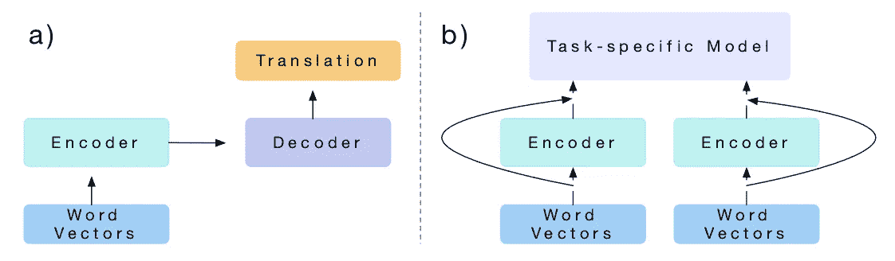
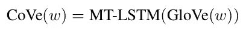
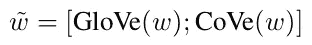
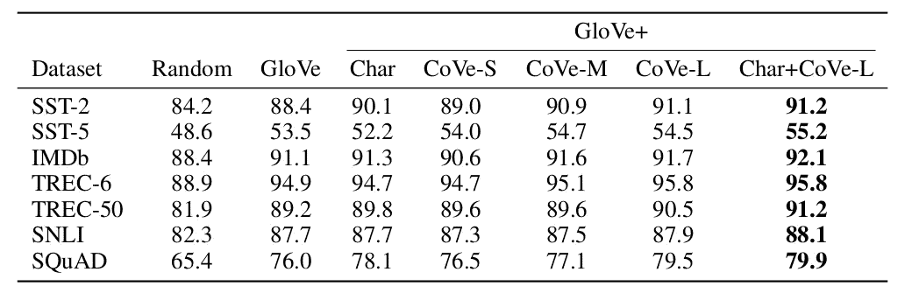
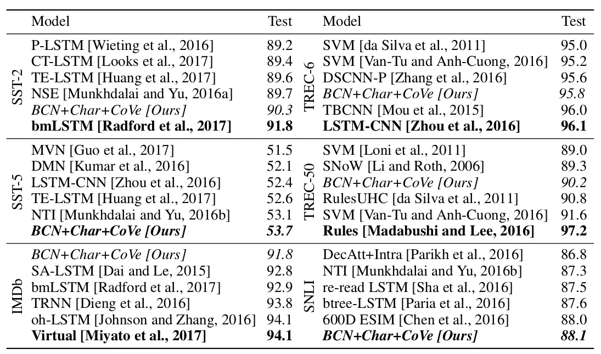
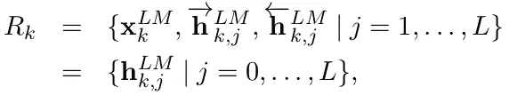
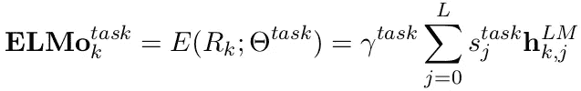
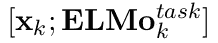
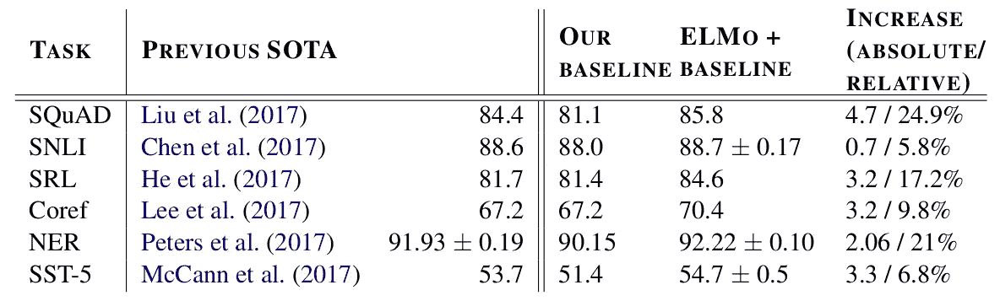
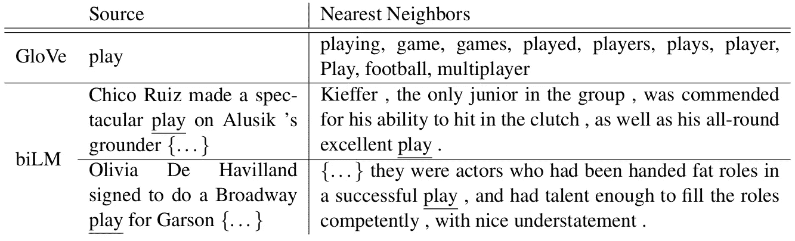

# 自然语言处理中的迁移学习——语境词向量综述

> 原文：<https://towardsdatascience.com/overview-of-transfer-learning-in-nlp-part-ii-fd2e8c72eb98?source=collection_archive---------12----------------------->

## 监督目标任务的迁移学习研究综述。

本系列的[篇第一篇](https://medium.com/@poojarao126/overview-of-transfer-learning-in-nlp-d74749d00d77)讨论了 NLP 中的迁移学习，并发表了— [*半监督序列学习*](https://papers.nips.cc/paper/5949-semi-supervised-sequence-learning.pdf) *。*我们看到了使用序列自动编码器的简单预训练步骤如何改善所有四个分类任务的结果。

在这篇文章中，我想简单介绍一下[列表](https://medium.com/@poojarao126/overview-of-transfer-learning-in-nlp-d74749d00d77/#cd96)中的下两个出版物。语境化的单词表示是这两个出版物的焦点。研究人员试图产生通常被称为嵌入的单词表示，它知道句子中的上下文含义。生成单词嵌入的过程是两者的区别所在。CoVe 使用类似 ***机器翻译*** 的监督任务，而 ELMo 使用类似 ***语言建模的非监督任务。***

*   在翻译中学习:语境化的词向量— [CoVe](https://arxiv.org/abs/1708.00107)
*   深层语境化的词汇表征——埃尔莫

让我们深入研究每一份研究出版物，并指出其相似之处和不同之处。

## 在翻译中学习:语境化的词向量

*机器翻译数据可以是 NLP 中 ImageNet 的潜在等价物。*(由于使用 ImageNet 在计算机视觉中进行迁移学习取得了巨大成功)。作者试图通过采用为机器翻译训练的注意序列到序列模型来证明这一假设。机器翻译序列到序列模型在上下文中对单词进行编码，并将其解码成另一种语言。这些模型通常包含一个基于 LSTM 的编码器。他们利用这个编码器来获得他们所谓的上下文向量。

a) Training an encoder b) Reusing it for a downstream task. Source: “Learned in Translation: Contextualized Word Vectors” by McCann et al. 2017

这个过程包括两个步骤。a)训练用于机器翻译的注意力序列到序列模型。b)将学习到的信息传递给下游任务。

英语到德语的翻译数据用于训练机器翻译模型。他们使用一个标准的两层双向 LSTM 网络作为编码器(MT-LSTM)，用手套向量初始化，一个两层单向 LSTM 作为解码器。预训练编码器 MT-LSTM 的输出被视为上下文向量。

*w* 是输入单词的序列，而 *GloVe(w)* 是由 GloVe 模型产生的单词向量的序列。 *CoVe(w)* 是 MT-LSTM 产生的上下文向量序列。

作者检查了 CoVe 向量在一系列分类任务数据集上的优势，即情感分析、问题分类和蕴涵；还有问答。分类模型使用双注意分类网络[1]，问题回答模型使用动态共注意网络[2]。这些网络的架构超出了本文的范围。

与目标任务被预定义的[第一次审查](https://medium.com/@poojarao126/overview-of-transfer-learning-in-nlp-d74749d00d77)不同，这里没有目标下游任务。目的是使向量适应任何下游任务。

GloVe(w)中的每个向量与其 CoVe(w)中的对应向量连接在一起

作者将这些连接的向量作为分类和问答网络的输入。这些向量在整个实验过程中保持固定(不像[第一次审查](https://medium.com/@poojarao126/overview-of-transfer-learning-in-nlp-d74749d00d77)，在第一次审查中，预先训练的权重在目标任务上进行微调)。

Validation results: Accuracy for classification tasks and F1 for SQuAD. Source: “Learned in Translation: Contextualized Word Vectors” by McCann et al. 2017

使用 CoVe 和手套的模型始终比仅使用手套的模型表现更好。附加字符 n-gram 嵌入可以进一步提高某些任务的性能。他们在 SST-5 和 SNLI 数据集上实现了新的最先进的性能(在当时)。从实验中得到的一个重要启示如下。机器翻译数据集越大，使用 CoVe 对下游目标任务的改进越好。这是从实验中得到的重要启示之一。因此，这种相关性可以证明他们的假设，即在 NLP 中使用机器翻译数据作为 ImageNet 的等价物。

Test performance results. Source: “Learned in Translation: Contextualized Word Vectors” by McCann et al. 2017

## 深层语境化的词汇表征

艾伦人工智能研究所的这项研究介绍了另一种深度上下文单词表示。目标是学习对句法、语义和多义性(一个单词存在许多可能的含义)建模的表示。研究人员在语言建模任务中训练了一个双向 LSTM 网络来导出向量。这些被称为 ELMo(来自语言模型的嵌入)。ELMo 向量是语言模型所有内部层的函数，因此比 CoVe 更深。

双向语言模型是前向语言模型和后向语言模型的组合。正向 LM 通过模拟记号 *k* 的概率来计算序列的概率，提供了 *k-1* 记号的历史。反向 LM 类似于正向 LM，以相反的顺序运行序列，预测提供未来上下文的前一个标记。biLM 的架构与[3]相当。它是在 1B 单词基准语料库[4]上训练的。

作者修正了预先训练的 biLM，并用它来计算任何下游任务的表示。在某些情况下，对下游任务数据的 biLM 进行微调可以提高性能。因此，他们对特定任务数据的一个时期的 biLM 进行微调，去除受监督的标签，并在此后的整个任务实验中固定权重(不像[第一次审查](https://medium.com/@poojarao126/overview-of-transfer-learning-in-nlp-d74749d00d77)，他们在任务实验中微调权重)。在大多数情况下，他们使用微调的 biLM。

*ELMo 是 biLM 中中间层表示的特定任务组合。*一个 L 层 biLM 计算一组 2L+1 表示，如下所示。

ELMo 计算 biLM 中所有层的特定任务加权组合，如下所示。

s^task 是 softmax 归一化权重，标量参数 ***γ*** 通过实验确定。最简单的情况，它可以像 CoVe 一样只选择最后一层。

预训练的单词嵌入与来自 biLM 的 ELMo 向量连接，作为输入传递给下游任务。

他们验证了 ELMo vectors 在各种 NLP 任务中的性能，并在每个任务上实现了新的艺术水平(在当时)。他们为每项任务使用不同的基线架构，并将 ELMo 向量添加到输入中。与强基础模型相比，它们实现了 6–20%的相对误差减少。结果如下所示。

Test set results on 6 benchmark NLP tasks. Source: “Deep contextualized word representations” by ME Peters et al. 2018

它们表明，与仅使用最后一层相比，所有层的表示的加权组合提高了整体性能。在有可能进行比较的任务中，ELMo 胜过 CoVe。有时，在下游任务模型的输出层包含 ELMo 可以提高性能。它还成功地消除了一个词在上下文中的歧义，实现了一词多义。请参见下面的示例。

Nearest neighbours to ‘play’ using GloVe and ELMo. Source: “Deep contextualized word representations” by ME Peters et al. 2018

实验表明，biLM 的不同层描述了一个词的不同种类的信息。第二层在词义消歧方面表现更好，而第一层在词性标注方面实现了更高的准确性。这样，包含所有的 biLM 层是至关重要的。

通过 ELMo 制图表达添加大型无监督数据集非常有利。该模型更快地收敛到更高的精度，并且需要更小的训练集。该模型提高了训练数据的利用率。它显著减少了达到性能水平所需的训练数据量。

因此，ELMo 使用来自语言模型的深层嵌入来捕获上下文中单词的语法和语义。

CoVe 和 ELMo 在计算上下文单词表示的方式上是相似的。一些相似之处—

*   尝试计算上下文单词向量。
*   使用大型语料库进行预训练。
*   使用预先训练的模型以单词表示的形式传递学习到的信息。
*   计算出的单词向量被用作下游特定任务网络的输入。
*   预训练的权重在任务训练期间是固定的。

一些主要的区别—

*   CoVe 在预训练步骤中使用机器翻译编码器来生成单词表示，而 ELMo 使用语言模型。
*   CoVe 在有监督的机器翻译数据集上训练，而 ELMo 在无监督的语言模型数据上训练。
*   CoVe 将最后一层机器翻译 LSTM 的输出视为上下文向量，而 ELMo 是语言模型 LSTM 中所有层的加权组合。
*   CoVe 向量在任务训练期间是固定的，而来自 biLM 模型的权重在为任务训练固定之前用任务特定的数据进行微调。
*   CoVe 的研究人员为各种下游分类任务使用通用架构，而 ELMo 则针对每项任务使用强大的基线架构。

上下文词向量的第一次审查和这次审查之间的一个重要区别是，研究人员选择了一个通用数据集进行独立于任务的预训练。这可能被视为向 ImageNet 类数据集发展的下一步。

参考资料:

[1] [机器理解的双向注意流](https://arxiv.org/abs/1611.01603)

[2] [视觉和文本问答的动态记忆网络](https://arxiv.org/abs/1603.01417)

[3] [探索语言建模的极限](https://arxiv.org/abs/1602.02410)

[4] [测量统计语言建模进展的十亿字基准](https://arxiv.org/abs/1312.3005)

延伸阅读:

1.  CoVe — [研究论文](https://arxiv.org/abs/1708.00107)，[官方博客](https://einstein.ai/research/learned-in-translation-contextualized-word-vectors)，[代号](https://github.com/salesforce/cove)
2.  ELMo — [研究论文](https://arxiv.org/abs/1802.05365)，[官方博客文章](https://allennlp.org/elmo)，[代码](https://github.com/allenai/allennlp/blob/master/tutorials/how_to/elmo.md)

这是系列文章中的第二篇，在这篇文章中，我简要介绍了最近关于 NLP 中迁移学习的出版物。你可以在这里找到第一个帖子。非常感谢任何反馈/建议。欢迎在下面发表评论，或者在 [Twitter](https://twitter.com/poojaraosb) 或 [LinkedIn](https://www.linkedin.com/in/pooja-rao/) 上联系我。