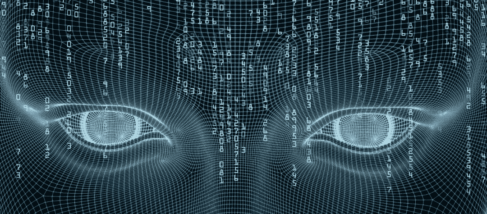

# Udacity 人工智能工程师纳米学位概述，第 2 期

> 原文：<https://towardsdatascience.com/overview-of-udacity-artificial-intelligence-engineer-nanodegree-term-2-fc1d1ca8c7ae?source=collection_archive---------6----------------------->

在完成了[人工智能纳米学位](https://www.udacity.com/ai)的第一个学期后，我报名参加了第二个学期，明确期望学习更多关于深度神经网络的知识，特别是关于卷积和递归神经网络的知识。此外，中途停止也不符合逻辑:-)

# 等待时间 1

我在截止日期前 3 周完成了第一学期，一直等到 Udacity 解锁了第二学期。我把那段时间用于学习其他东西和[做小项目](/serving-tensorflow-models-serverless-6a39614094ff)，但是我认为从时间的角度来看并不是很有效。如果 Udacity 在完成第一个学期后马上解锁下一个学期，我会非常感激。

我还询问了他们对相反情况的支持——是否有可能在两个学期之间休息更长时间，然后再开始另一个学期。答案是肯定的，而且没有任何惩罚。所以如果你不能连续完成两个学期，这应该不是问题。

# 第二学期。深度学习和应用

## 结构

术语 2 由两部分组成:

*   深度学习和应用，您可以从中了解 CNN、和 GAN 的更多详细信息
*   专注部分，你可以深入到你最感兴趣的领域。你在计算机视觉、自然语言处理和语音用户界面之间进行选择。今天你只能做一个浓度，这很遗憾，因为从我的角度来看，至少有两个浓度是绝对可行的。

## 卷积神经网络

应用深度学习技术的第一部分是关于卷积神经网络。这一部分的结构非常好，你会得到详细的解释，解答测验和课程中的小项目。材质肯定比用深度学习基础纳米度要高。最后一个项目是一个狗品种检测器，你可以使用迁移学习技术来达到合理的结果。

您使用 Keras 作为掌握项目的工具，因此避免了应用原始 TensorFlow 的麻烦，可以专注于理解 CNN 而不是学习工具。

这些材料对我来说刚刚好，解释以一种清晰而恰当的方式给出，提供的参考资料也非常有用。亚历克西斯·库克是一位非常好的导师，我很喜欢这部分。

读完这一节后，我有一个印象，我理解了 CNN 的背景和他们的应用。这个项目要求有点高，但我更喜欢做一些准备不足的代码，自己多做一些研究。

## 递归神经网络和 LSTM

第二部分是关于递归神经网络(香草和 LSTM)及其应用。结构类似于 CNN 的一个部分，有解释、参考、小测验和项目。

我必须说，从讲解质量的角度来看，这是整个课程中最好的部分，不可能做得更好了。在我开始之前，我对概念的理解有一些问题，而且 LSTM 建筑对我来说也不是 100%清楚。完成后，我会说，我抓住了这个想法很好。[杰里米·瓦特](https://www.linkedin.com/in/jeremy-watt-8bbb1544/)非常擅长用简单的方式解释复杂的事情。

**但是！！！**一个情绪预测的最终项目，真的是一个笑话。几乎一切都准备好了，你只需要做很少的事情就可以通过。真的真的很令人失望。学习材料这么好，最终项目却这么差:-(

## 生成对抗网络

最后一部分是关于生成性对抗网络。它由普通解释、深度卷积神经网络和半监督学习组成。由于导师是 Ian Goodfellow，你可以期待一个高质量的解释，最后，你对 GANs 背后的概念有一个很好的理解。

不幸的是，我在深度学习基金会 Nanodegree 中学习的所有材料都已经存在。我很失望，因为我以为我会花钱买到新东西，而不是我已经学会的东西。反正我刷新了一下知识，去做了专注部分。

# 等待时间 2 和浓度

我比要求提前 2 周完成了所有项目，必须等到专注部分解锁。再次从时间的角度来看，这不是最佳的，我看不到任何理由，为什么下一部分不能马上解锁。

## 浓度选择

你可以深入解决计算机视觉、自然语言处理或语音用户界面任务。所有三个浓度都由 Udacity 导师和一个公司的人(Affectiva 的情况下是工程师或首席执行官)提供给你，帮助你准备这个部分。

计算机视觉集中是与 Affectiva 合作完成的，start 项目是关于使用他们的 T2 SDK 进行情感识别。自然语言处理(NLP)的重点是与 [IBM](https://www.ibm.com/) 合作，启动项目是关于使用 [IBM Watson](https://www.ibm.com/watson/) 来解决 NLP 任务。语音用户界面的集中是与亚马逊的合作，启动项目是关于使用 Alexa 的技能来创建你自己的语音界面。所有的 start 项目大多是为了好玩，不做评估。

最初，我想选择计算机视觉，但在看了介绍后，我改变了主意，选择了语音用户界面。原因是(从我的角度来看)这三个项目中最好的一个，我在 Udacity 论坛上读到，capstone 项目要求最高。

## 语音用户界面集中

一开始，你用亚马逊 Alexa 开发一个语音界面。亚马逊 Alexa 能够识别语音，理解它并做出适当的反应。在该项目中，您创建了自己的技能的语音交互模型，该模型在 Amazon Alexa 上运行，并创建了 AWS Lambda 函数来处理请求。其实你学会用亚马逊生态系统来解决语音识别及其理解的任务。该项目不是关于深度学习，而是关于使用准备好的积木。反正挺有意思的，也不是很简单。

学完这一非常实用的部分后，你就可以开始研究语音识别的问题了。您将了解挑战、信号分析、数据准备、特征提取、语音学、语言模型、传统自动语音识别系统(带隐马尔可夫模型)以及语音识别中的深层神经网络。

材料的质量和提供的参考资料都很棒，这个项目要求很高，尽管我希望它不是那么准备充分。我不后悔我的选择，如果必须的话，我会再次选择。

# 结论

最重要的是——我觉得自己已经做好了从纯软件工程领域转向机器学习/人工智能领域的充分准备。我非常清楚，我缺乏解决现实世界问题的专业经验，所以第一步将是在软件工程和机器学习领域之间的某个地方工作，以从我们可以通过应用机器学习和深度学习技术解决的问题中获取更多信息。

Udacity 为你成为一名从业者做了很好的准备，但我不指望你有机会通过完成这门课程转变为纯粹的研究领域。我强烈建议首先完成深度学习基础——如果你是该领域的新手，它在人工智能工程师纳米学位期间会有很大帮助。另一方面，我只需要 4 个月，每周 10-15 个小时就可以完成课程，而不是广告上说的 6 个月。

我仍然不确定这项投资——两个纳米学位需要 2000 美元。但至少我去年学到了很多新东西，希望它能帮助我在目前的职业道路上，或者改变到一个新的领域。无论如何，我明白深度学习技术对于一个纯粹的软件工程师来说也是解决新问题所必须的:-)

你可以在我的 [GitHub](https://github.com/Vetal1977?tab=repositories) 上找到所有的项目——第一期以 *aind-* 开始，第二期以 *aind2-* 开始。