# 使用加密货币进行配对交易

> 原文：<https://towardsdatascience.com/pairs-trading-with-cryptocurrencies-e79b4a00b015?source=collection_archive---------1----------------------->

本文简要介绍了 pairs 交易，包括概念、基础数学、策略算法、交易机器人开发、回溯测试和转发测试评估，以及未来问题讨论。作为一个实际的例子，机器人将进行加密货币交易。

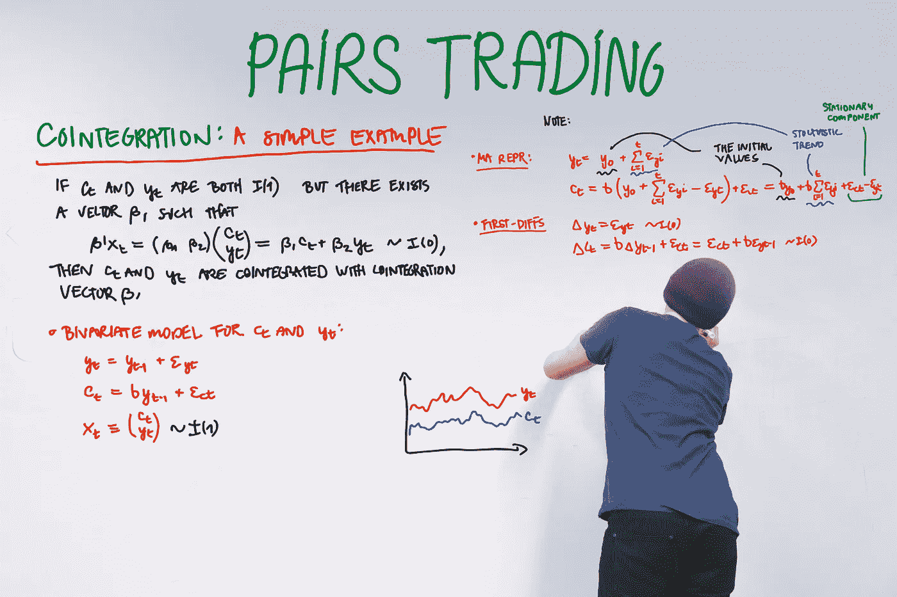

# 概念

Pairs trading 是一种市场中立的交易策略，在一对高度联动的资产中使用多头头寸和空头头寸。

> 该策略的利润来源于两种工具之间的价格变化差异，而不是两者的变动方向。所以，如果多头涨得比空头多，或者空头跌得比多头多，就可以实现盈利(完美的情况下，多头涨，空头跌，但那不是盈利的要求)。配对交易者有可能在各种市场条件下获利，包括市场上涨、下跌或横盘——以及波动性低或高的时期。
> 
> 来源: [Investopedia](https://www.investopedia.com/university/guide-pairs-trading/)

# 协整与相关性

在定量交易中，我们通常使用非平稳的时间序列。通常，当两个资产一起移动时，人们认为两个资产的*相关*，但是这个术语在这个上下文中是不正确的。皮尔逊相关性仅适用于静态变量。正如我们所看到的，这个公式使用了期望值和标准偏差，但是这些值在非平稳过程中是随时间变化的。

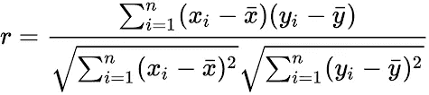

Correlation formula

对于这些过程，我们可以定义为*协整*。协整是指几个非平稳时间序列的平稳线性组合。你可以在这个视频中找到简单的解释

这张图片显示了两个过程(X 和 Y)，以及它们的传播。这是一个没有协整的相关性的例子。

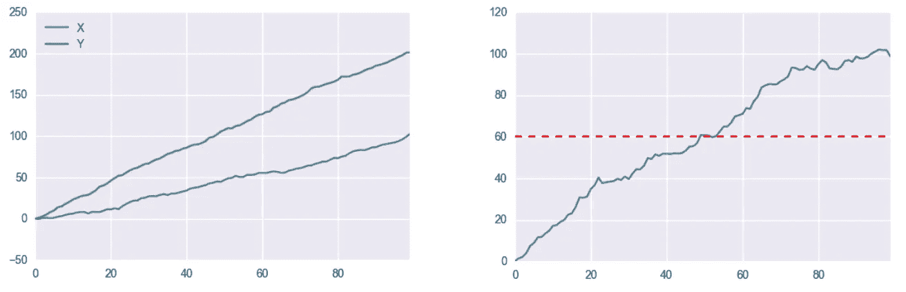

Correlation with no cointegration

这个例子反之亦然(无相关性的协整)

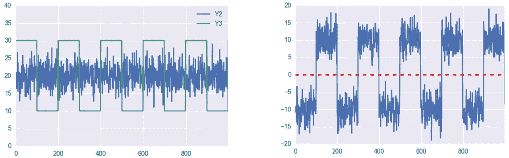

Cointegration with no correlation

如何使用 Python 构建这些流程你可以在这里找到。

为了进入下一章，我们应该知道如何检测协整。

> 检验协整的三种主要方法是:
> 
> **恩格尔-格兰杰两步法**
> 
> 如果 *xt* 和 *yt* 是非平稳且协整的，那么它们的线性组合一定是平稳的。换句话说:
> 
> *yt-βXT = ut，*其中 ut 为静态。
> 
> 如果我们知道 *ut* ，我们就可以用类似[迪基-富勒测试](https://en.wikipedia.org/wiki/Dickey%E2%80%93Fuller_test)、[菲利普-佩伦测试](https://en.wikipedia.org/wiki/Phillips%E2%80%93Perron_test)的东西来测试它的平稳性，然后就完成了。但是因为我们不知道 *ut* ，我们必须先估计这个，一般用[普通最小二乘法](https://en.wikipedia.org/wiki/Ordinary_least_squares)，然后在估计的 *ut* 序列上运行我们的平稳性测试。
> 
> 2.**约翰森测试**
> 
> [Johansen 检验](https://en.wikipedia.org/wiki/Johansen_test)是一种允许多个协整关系的协整检验，与 Engle-Granger 方法不同，但该检验受渐近性质的影响，即大样本。如果样本量太小，那么结果将是不可靠的，应该使用自回归分布滞后(ARDL)。
> 
> 3.**菲利普斯-欧利亚斯协整检验**
> 
> [Peter C. B. Phillips](https://en.wikipedia.org/wiki/Peter_C._B._Phillips) 和 [Sam Ouliaris](https://en.wikipedia.org/w/index.php?title=Sam_Ouliaris&action=edit&redlink=1) (1990)表明，应用于估计协整残差的基于残差的单位根检验在非协整的零假设下不具有通常的 Dickey-Fuller 分布。由于零假设下的虚假回归现象，这些检验的分布具有渐近分布，这取决于(1)确定性趋势项的数量和(2)被检验协整的变量的数量。这些分布被称为菲利普斯-欧利阿里斯分布，临界值已被制成表格。在有限样本中，使用这些渐近临界值的一个更好的替代方法是从模拟中产生临界值。
> 
> 来源:[维基百科](https://en.wikipedia.org/wiki/Cointegration)

让我们为这个问题编写一些分析代码。首先从 Bitfinex 下载几个加密货币的数据(2018–01–01 到 2018–05–31)。下一步是策划加密货币的表演。最后，对所有资产对进行协整检验。

加密货币的表现是

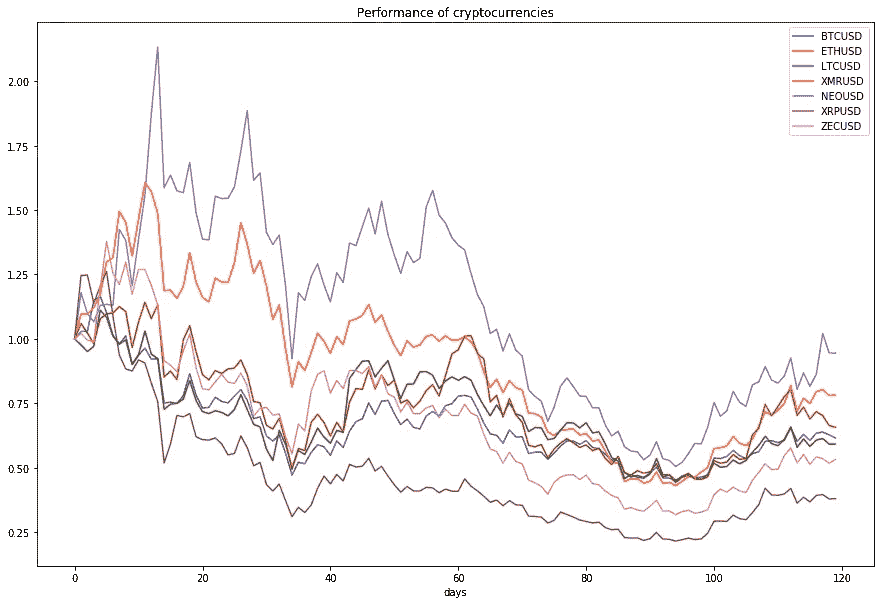

Performance of cryptocurrencies (from 2018–01–01 to 2018–05–31)

零假设是不存在协整关系，另一个假设是存在协整关系。如果 p 值很小，低于一个临界大小，那么我们可以拒绝没有协整关系的假设。

Cointegration test result

我们可以得出结论，其中一些对是协整的，可以选择下一步的研究。

# 交易策略

结对交易中没有单一的方法来计算差价并进行交易。一些方法使用线性回归和残差作为分布。我们将使用下一个算法。

算法策略包含以下步骤:

1.  通过上述方法之一(如 Engle-Granger)识别协整对。应该定期执行此步骤，以获得将在接下来的步骤中使用的一对(或几对)。
2.  通过长度 *N* 获取资产的价格历史。计算资产对中每项资产(如 *A* 和 *B* )的收益

3.计算退货之间的差额

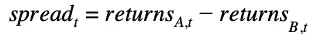

4.计算 z 得分，z 得分是数据点平均值的标准偏差数。

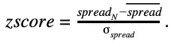

这张图片展示了 z 分数

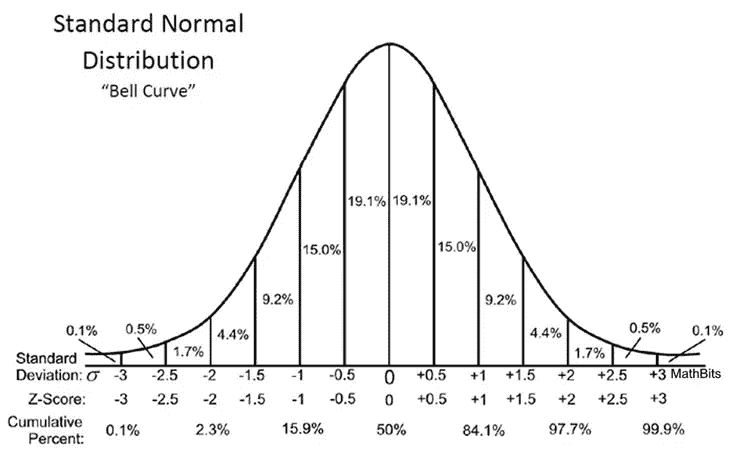

Standard normal distribution

5.选中输入职位规则:

*如果该条件为真，则打开 A (50%资本)的多头头寸和 B (50%资本)的空头头寸*

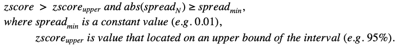

*如果该条件为真，则打开 A 的空头头寸和 B 的多头头寸*

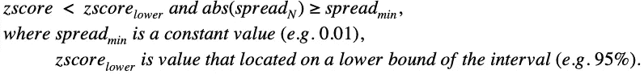

6.检查平仓规则:

如果这一条件成立，平仓所有头寸

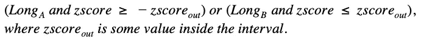

让我们用 Catalyst 框架来编码这个算法。我在我的[上一篇文章](https://hackernoon.com/adaptive-trend-following-trading-strategy-based-on-renko-9248bf83554)中提供了 Catalyst 的快速介绍。你在那里找到的*初始化*、 *handle_data* 、 *analyze* 和 *run_algorithm* 函数的信息。

一个标准的方法是使用训练\测试分割，但是我们也有一个协整测试周期。这些时间段不应交叉。因此，我们有

> 协整检验期— 5 个月(从 2018 年 1 月 1 日到 2018 年 5 月 31 日)
> 
> 回测期— 4 个月(从 2018 年 6 月 1 日至 2018 年 9 月 30 日)
> 
> 转发期— 2 个月(从 2018 年 10 月 1 日至 2018 年 11 月 30 日)

首先要验证算法。让我们使用 XMR/USD 和 NEO/USD 对运行这个脚本，禁用佣金成本并关闭滑点模型。

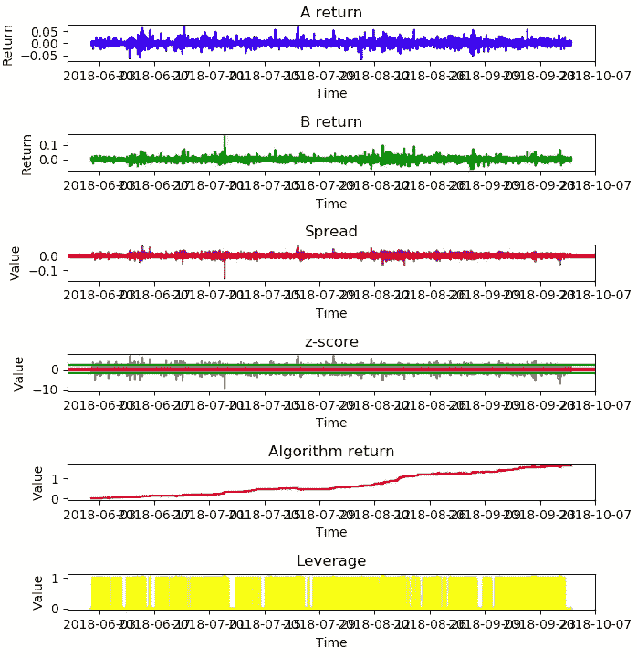

XMR/USD and NEO/USD with no commission

正如我们所见，算法返回曲线相当不错。这看起来就像它应该如何工作(非常高的分拣率和回报是 4 个月 164%)。控制台输出性能:

总回报:1.645993234216582

索提诺系数:30 . 96620118

最大压降:-0.05125165292172551

# 回溯测试

让我们建立佣金成本和滑点模型

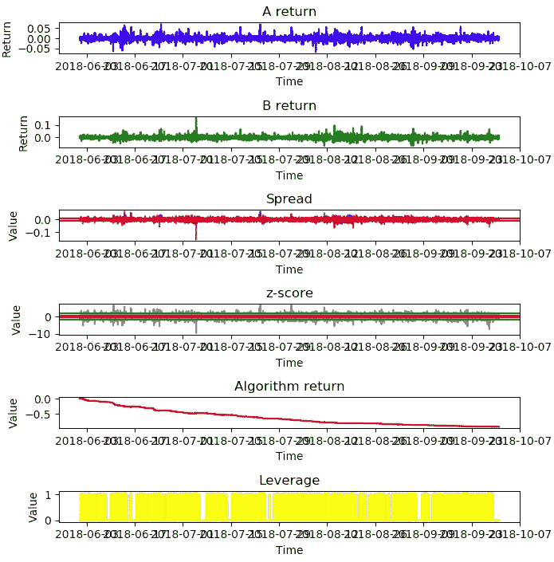

XMR/USD and NEO/USD with commission and slippage

业绩差，权益(红线)平滑递减。通常情况下，当一个策略产生了许多平均利润值较低的信号时，就会发生这种情况。控制台输出性能:

总回报:-0.9160713719222552

*Sortino coef:-11.6499238*

*最大压降:-0.914893278444377*

我们应该尽量减少交易信号的数量，而且交易的潜在利润应该很高。我建议增加 *min_spread* 的值，设为 0.035，就意味着 spread 要比往返交易成本高几倍。另外， *z_signal_in* 值应该更高，例如对于 99.99%的间隔。时间范围可以更改为更大的值(例如每小时)，但分析周期将保持不变(3 天)。

XMR/USD and NEO/USD with updated params

这组参数实现了我们的目标。信号数量较低(黄色线代表使用的杠杆)，算法在 4 个月内表现良好:

*总回报:0.0946758967277288*

Sortino coef:8.343300492

*最大压降:-0.0281546269574607*

# 促进

这一步更真实地展示了所开发的算法。让我们对样本外数据(过去 2 个月)运行策略。

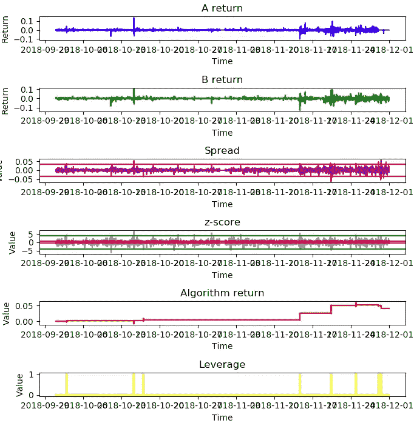

XMR/USD and NEO/USD forwarding test

性能仍然很好，指标接近回溯测试值:

*总回报:0.040754467244888515*

Sortino coef:8.20447014148

最大压降:-0.010029904921808908

我们可以通过排序比值来比较结果。

该战略的权益图是

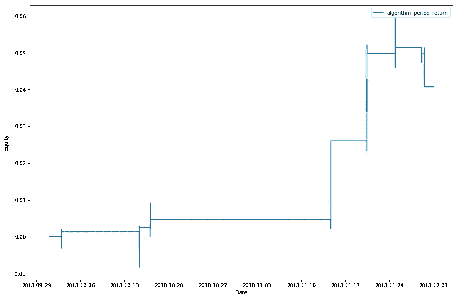

Equity of the algorithm

# 进一步的问题讨论

1.  对不同的资产进行大量实验，以创建可靠的资产组合，并在它们之间调整资金管理。它将允许获得更重要的统计数据，因为事务的数量将会更大。
2.  尝试交叉货币对以降低交易成本(例如，用 XMR/NEO 代替 XMR/USD 和 NEO/USD)。
3.  为投资组合中的每一对调整以下步骤*协整检验—回测—前推*，以在生产模式中获得更可靠的性能。用于调整的参数:历史长度、p 值阈值和算法参数。
4.  创建当共同运动属性被破坏时停止算法的规则。如果没有预见到这一点，结果可能是一场灾难。

# 结论

1.  描述了方法，并创建了算法交易策略。
2.  该算法在回溯测试和转发测试中都取得了积极的结果。展示了不同的性能指标和图表。
3.  就如何改进这项研究提出了建议。
4.  源代码可以在 [github](https://github.com/lamres/pairs_trading_cryptocurrencies_strategy_catalyst) 上得到。

最诚挚的问候，

谢尔盖