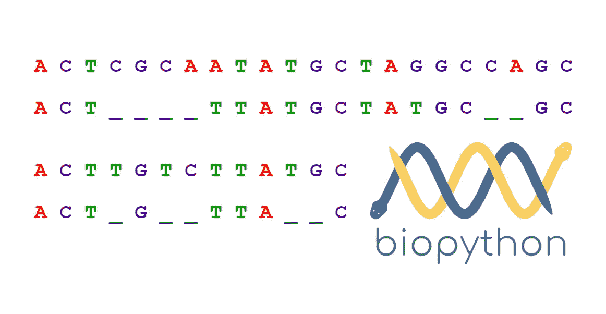
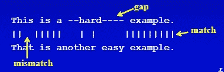
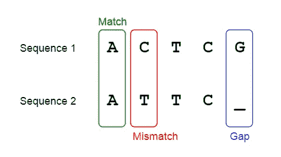
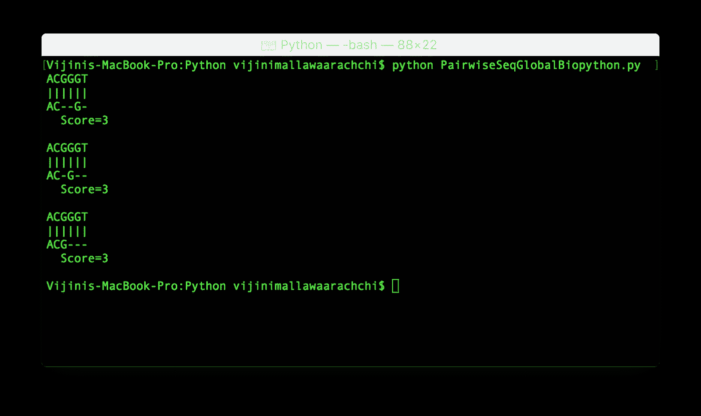
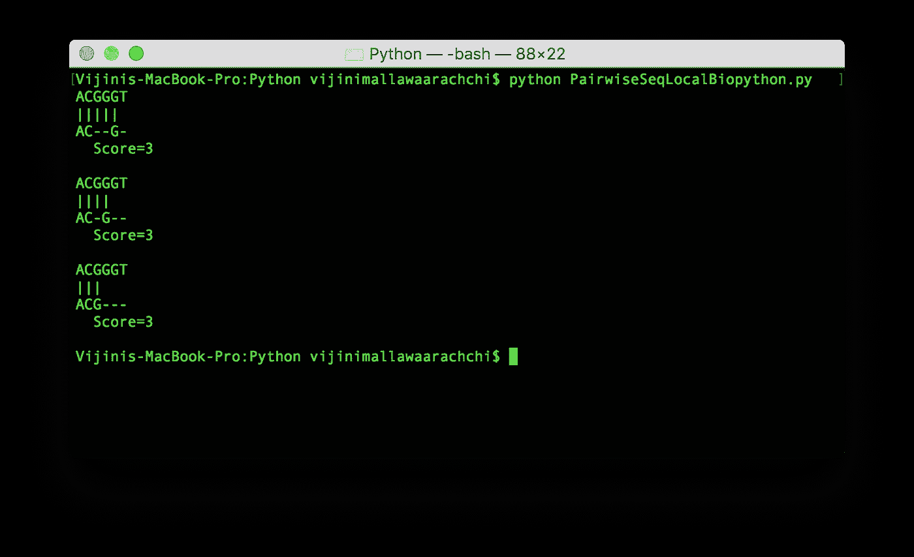
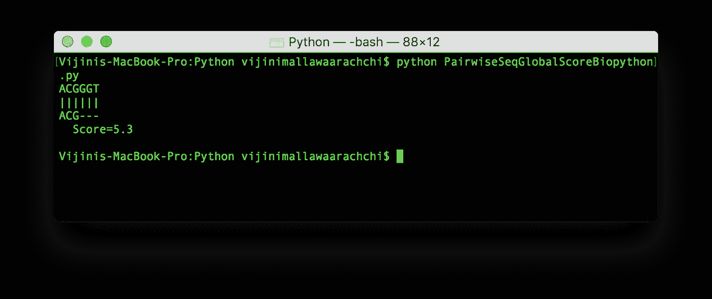

# 使用 Biopython 的成对序列比对

> 原文：<https://towardsdatascience.com/pairwise-sequence-alignment-using-biopython-d1a9d0ba861f?source=collection_archive---------0----------------------->

## 使用 Python 生物信息学工具检查两个序列有多相似

> 两个序列有多相似？

想要回答这个问题，你需要对**序列比对**有一个基本的了解。正如我在[的上一篇文章](https://medium.com/towards-data-science/dna-sequence-data-analysis-starting-off-in-bioinformatics-3dba4cea04f)、**序列比对**中描述的，序列比对是一种排列 DNA、RNA 或蛋白质序列以识别相似区域的方法。被鉴定的相似性可能是序列之间的功能、结构或进化关系的结果。

在这篇文章中，我将带你完成**两两序列比对**。此外，我们将使用一个名为 **Biopython** 的很酷的 python 工具尝试一些编码。



Figure 1: Pairwise Sequence Alignment using Biopython

# 什么是成对序列比对？

**成对序列比对**是序列比对技术的一种形式，这里我们只比较 ***两个序列*** 。这个过程包括找到两个序列之间的最佳比对，根据它们的相似性(它们有多相似)或距离(它们有多不同)进行评分，然后评估这个评分的显著性。



Figure 2: Image Scource: [http://compbio.pbworks.com/w/page/16252912/Pairwise%20Sequence%20Alignment](http://compbio.pbworks.com/w/page/16252912/Pairwise%20Sequence%20Alignment)

# **评分**

在继续进行成对序列比对技术之前，让我们看一下评分过程。

序列比对的基础在于评分过程，在该过程中，根据两个序列彼此相似(或不同)的程度给它们打分。成对序列比对算法需要一个**评分矩阵**来记录分配的分数。评分矩阵为匹配分配一个正分，为不匹配分配一个罚分。

分配分数时考虑三个基本方面。他们是，

1.  **匹配值** —分配给匹配字符的值
2.  **不匹配值** —分配给不匹配字符的值
3.  **空位罚分** —分配给空位的值

下面给出的图 3 显示了如何识别两个序列之间的匹配、错配和缺口。



Figure 3: Match, mismatch and gap

两个序列的第一个字符是匹配的**，因为两个都是字母 **A** 。第一个序列的第二个字符是 **C** ，第二个序列的第二个字符是 **T** 。所以，是**不匹配**。**

**在第二个序列的末尾引入一个空格以匹配 g。这个空格被称为**间隙**。间隙是给定比对中单个序列中最大的连续空格。**

**一般来说，缺口被表示为**缺口罚函数**，该函数将缺口的成本作为其长度的函数(可能是非线性的)来测量。**

# **成对序列比对的类型**

**考虑给你两个序列如下。**

```
***X = x1 … xi … xn******Y = y1 … yj … ym***
```

1.  ****全局比对**:该方法在 2 个序列的整个长度上寻找最佳比对。序列 ***X*** 和 ***Y*** 的最大相似度是多少？**
2.  ****局部比对**:该方法在两个序列中寻找最相似的子序列。 ***X*** 的一个子序列和 ***Y*** 的一个子序列的最大相似度是多少？**

# **全球对齐**

**在该方法中，我们考虑 2 个序列的整个长度，并尝试将它们匹配以获得最佳比对。将***gap***(空格)插入到 *X* 和 *Y* 中，直到两个序列的长度相同，这样两个序列就匹配了。**

**例如，考虑序列 X = **ACGCTGAT** 和 Y = **CAGCTAT** 。一种可能的全局对准是，**

```
**AC-GCTGAT
 | ||  ||
-CAGC-TAT**
```

**并不是说我们已经包含了 ***间隙*** 以便字符串对齐。**

**如果我们设置一个评分方案为*匹配分数= 1* ，*错配分数= 0* ，*空位罚分= 0* ，那么上述比对的总分数将为:**

```
Score = nMatch x 1 + nMismatch x 0 + nGap x 0
      = 6x1 + 1x0 + 2x0
      = 6
```

## ****Needleman-Wunsch 算法****

**使用动态编程获得全局比对的算法之一是 ***Needleman-Wunsch 算法*** 。该算法由 **Needleman** 和 **Wunsch** 于 1970 年发表，用于两个蛋白质序列的比对，这是动态编程首次应用于生物序列分析。Needleman-Wunsch 算法寻找两个序列之间的最佳得分全局比对。**

# **局部对齐**

**在这种方法中，我们考虑 2 个序列中每一个的子序列，并试图匹配它们以获得最佳比对。**

**例如，将两个序列视为 X=GGT **CTGAT** G 和 Y=AAA **CGAT** C。粗体字符是要考虑的子序列。最佳的局部对准是，**

```
**CTGAT** (in X)
**| |||
C-GAT** (in Y)
```

**这里，引入一个 ***缺口*** 以匹配 2 个子序列。**

**如果我们设置一个评分方案为*匹配分数= 1* ，*错配分数= 0* ，*空位罚分= 0* ，那么上述比对的总分数为:**

```
Score = nMatch x 1 + nMismatch x 0 + nGap x 0
      = 4x1 + 0x0 + 1x0
      = 4
```

## ****史密斯-沃特曼算法****

**使用动态编程在两个给定序列内获得局部比对的算法之一是 ***Smith-Waterman 算法*** 。 **Smith** 和 **Waterman** 在 1981 年发表了一个动态规划的应用来寻找最优的局部排列。该算法类似于 Needleman-Wunsch 算法，但与评分过程略有不同。**

**在本文中，我们不会深入讨论上述两种算法的细节。**

# **练习时间到了**

**既然我们有了关于成对序列比对的基本概念和两个有用的算法，现在是时候尝试一些编码了。**

## **biopython——用于计算分子生物学的 python 工具**

****

**Figure 4: Biopython ([http://biopython.org](http://biopython.org))**

**在这篇文章中，我将向你介绍一套工具，我们将使用它来处理以后的生物数据。 [**Biopython**](http://biopython.org) 是一套用 python 编写的工具，可用于各种生物计算、模拟和分析。**

**你可以从 [*这里*](http://biopython.org/wiki/Download) 下载并安装 Biopython。确保您已经安装了 [**Python 2.7、3.4、3.5 或 3.6**](http://www.python.org/) 。你可以参考 [**Biopython 教程和食谱**](http://biopython.org/DIST/docs/tutorial/Tutorial.html) 来进一步了解我们能做什么以及如何使用这些工具。**

## ****bio . pairwise 2-P**使用动态编程进行空中序列比对**

**让我们试用一些编码来模拟使用 Biopython 的成对序列比对。我将成对使用 [**模块，该模块可以在 **Bio** 包中找到。该模块提供了**比对函数**来获得两个序列之间的全局和局部比对。**](http://biopython.org/DIST/docs/api/Bio.pairwise2-module.html)**

**对齐函数的名称遵循惯例；**

```
**<alignment type>XX** 
```

**其中 **<对准类型>** 是**全局**或**局部**并且 **XX** 是一个 2 字符代码，表示它所采用的参数。第一个字符表示匹配(和不匹配)的参数，第二个字符表示空位罚分的参数。**

****匹配参数**为:**

```
CODE  DESCRIPTION
x     No parameters. Identical characters have score of 1, else 0.
m     A match score is the score of identical chars, else mismatch
      score.
d     A dictionary returns the score of any pair of characters.
c     A callback function returns scores.
```

****间隙惩罚参数**为:**

```
CODE  DESCRIPTION
x     No gap penalties.
s     Same open and extend gap penalties for both sequences.
d     The sequences have different open and extend gap penalties.
c     A callback function returns the gap penalties.
```

**让我们使用 ***Bio.pairwise2*** 模块尝试几个成对序列比对的例子。**

## **示例 1**

**考虑下面给出的两个序列。我们想找出所有可能的具有最大相似性得分的**全局比对**。**

```
**X = ACGGGT
Y = ACG**
```

**下面给出了获得给定两个序列的全局比对的 python 代码。请注意我们是如何使用 ***Bio.pairwise2*** 模块及其功能的。**

**Code Snippet 1: Pairwise sequence alignment (global)**

**通过运行代码，我们可以得到所有可能的全局比对，如图 5 所示。**

****

**Figure 5: Pairwise sequence alignment (global) output**

**在这个例子中，注意匹配的字符被给予 1 分。没有因不匹配或差距而扣分。**

## **示例 2**

**考虑前面例子中给出的两个序列。我们想要找出所有可能的具有最大相似性得分的**局部比对**。**

**下面给出了获得给定两个序列的局部比对的 python 代码。**

**Code Snippet 2: Pairwise sequence alignment (local)**

**通过运行代码，我们可以得到所有可能的局部比对，如图 6 所示。**

****

**Figure 6: Pairwise sequence alignment (local) output**

**在这个例子中，注意匹配的字符被给予 1 分。没有因不匹配或差距而扣分。**

## **示例 3**

**在本例中，我们将更改评分方案，并为匹配、不匹配和差距赋值。我们将考虑和以前一样的两个序列。我们想找出所有可能的具有最大相似性得分的**全局比对**。**

**匹配字符得 2 分，每不匹配一个字符扣 1 分。开一个缺口扣 0.5 分，延伸一个缺口扣 0.1 分。**

**Code Snippet 3: Pairwise sequence alignment (global with custom scoring)**

**通过运行代码，我们可以得到所有可能的全局比对，如图 7 所示。**

****

**Figure 7: Pairwise sequence alignment (global with custom scoring) output**

**希望你喜欢读这篇文章，并学到一些有用和有趣的东西。**

**因为我对这个领域还很陌生，所以我想听听你的建议。😇**

**感谢阅读…😃**