# 熊猫数据框架:轻量级介绍

> 原文：<https://towardsdatascience.com/pandas-dataframe-a-lightweight-intro-680e3a212b96?source=collection_archive---------1----------------------->


Introduction to Pandas → The Pandas DataFrame by @DakshHub

> Pandas 是一个开源的、BSD 许可的库，为 Python 编程语言提供了高性能、易于使用的数据结构和数据分析工具。

Pandas 提供的数据结构有两种不同的类型

1.  ***熊猫数据帧&***
2.  ***熊猫系列***

我们将在本帖中查看 ***熊猫数据帧*** 。

> 学习熊猫(包括官方文档)的总趋势是先进入**熊猫系列**，再进入**熊猫数据框**。然而，在使用熊猫很长时间后，我确信我们应该从熊猫数据框架开始。一旦我们熟悉了**熊猫数据框架，熊猫系列**背后的概念和基本原理就会变得清晰易懂。

## 什么是数据帧？

这是技术定义的样子

> Pandas DataFrame 是一个带有潜在不同类型列的二维标签数据结构。

你应该这样理解它

> Pandas DataFrame 只不过是一个通过 Python 编程语言在内存中表示的 excel 表格

所以， ***熊猫数据框*** 类似于 excel 表格，看起来是这样的


A Panda DataFrame ( An In-Memory representation of Excel Sheet)

就像 excel 一样，***Pandas data frame***提供了各种功能来分析、更改和从给定的数据集中提取有价值的信息。

## 如何创建熊猫数据框架？

在现实世界中，通过从持久存储中加载数据集，包括但不限于 excel、csv 和 MySQL 数据库，将创建一个***Panda data frame***。

> 然而，为了帮助你更好地理解它，我将在这里使用 Python 数据结构(字典和列表)。

如上面的 excel 表格所示，如果我们将列名视为 ***【键】*** ，并将该列下的项目列表视为 ***【值】*** ，我们可以轻松地使用 python 字典来表示相同的

```
my_dict = { 
     'name' : ["a", "b", "c", "d", "e","f", "g"],
     'age' : [20,27, 35, 55, 18, 21, 35],
     'designation': ["VP", "CEO", "CFO", "VP", "VP", "CEO", "MD"]
}
```

我们可以从这个字典中创建一个 ***熊猫数据帧*** 作为

```
import Pandas as pddf = pd.DataFrame(my_dict)
```

生成的数据框架应该类似于我们在上面的 excel 表格中看到的

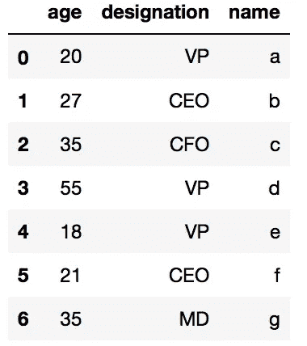

Result of -> df = pd.DataFrame(my_dict)

> 有可能这些列没有按照字典中定义的顺序排列，因为 python 将字典实现为 hash，并且不保证保留顺序。

## 行索引→

> 由于我们没有向**数据帧**提供任何行索引值，它会自动生成一个序列(0…6)作为行索引。

为了提供我们自己的行索引，我们需要将`DataFrame(...)`函数中的`index`参数作为

```
df = pd.DataFrame(my_dict, index=[1,2,3,4,5,6,7])
```

索引不需要一直是数字，我们也可以通过字符串作为索引。例如

```
df = pd.DataFrame(
     my_dict, 
     index=["First", "Second", "Third", "Fourth", "Fifth", "Sixth", "Seventh"]
)
```

正如您可能已经猜到的那样，索引本质上是*，这意味着我们也可以使用 ***NumPy 数组*** 作为索引。*

```
*np_arr = np.array([10,20,30,40,50,60,70])
df = pd.DataFrame(my_dict, index=np_arr)*
```

## *熊猫数据框的列*

*与 python 列表或字典不同，就像***NumPy***,***data frame***的一列将始终是同一类型。*

*我们可以使用类似字典的语法或者使用 DataFrame `.`添加列名来检查列的数据类型*

```
*df['age'].dtype    # Dict Like Syntaxdf.age.dtype       # DataFrame.ColumnName
df.name.dtype      # DataFrame.ColumnName*
```

*如果我们想检查*数据框内所有列的数据类型，我们将使用 ***数据框*** 的`dtypes`函数作为**

```
**df.dtypes** 
```

**它将所有列的类型显示为**

**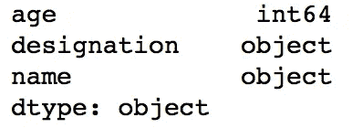**

**Displaying Types of all Columns**

## **查看数据帧的数据**

**在任何时间点， ***熊猫数据帧*** 将包含数百(如果不是数千)行数据。我们只能在任何时间点选择性地查看它们。**

> **为了有选择地查看行，我们可以使用 ***head(…)和 tail(…)*** 函数，这些函数默认给出前五行或后五行(如果没有提供输入)，否则从顶部或底部显示具体的行数**

**下面是它显示内容的方式**

```
**df.head()   # Displays 1st Five Rows**
```

**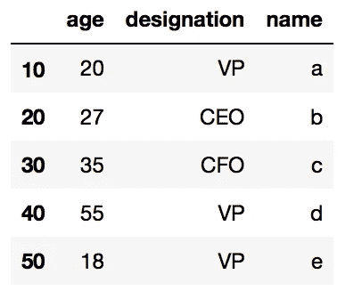**

**df.head()**

```
**df.tail()    # Displays last Five Rows**
```

**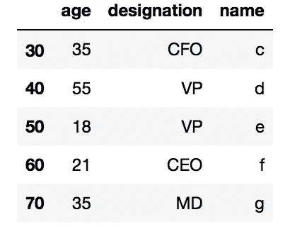**

**df.tail()**

```
**df.head(2)   # Displays 1st two Rows**
```

**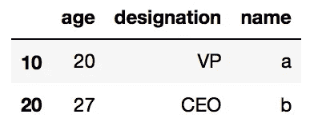**

**df.head(2)**

```
**df.tail(7)     # Displays last 7 Rows**
```

**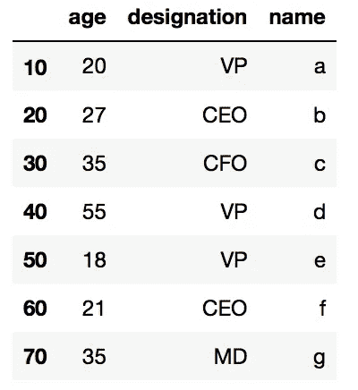**

**df.tail(7)**

**这都是关于数据的，但是，如果我们想看到行索引和列名呢？ ***熊猫数据框*** 提供了查看它们的特定功能**

```
**df.index     # For Row Indexesdf.columns   # For Columns**
```

## **熊猫数据框架列助手函数**

*****Pandas data frame***提供了各种列助手函数，对于从列中提取有价值的信息非常有用。其中一些是**

**`unique` →通过删除重复项来提供列中的唯一元素。例如**

```
**df.designation.unique()**
```

**`mean` →提供该列中所有项目的平均值。例如**

```
**df.age.mean()**
```

## **使用列作为行索引**

**大多数情况下，给定的数据集已经包含一个行索引。在那些情况下，我们不需要***Pandas data frame***来生成单独的行索引。**

> **这不仅是一个冗余信息，而且占用了不必要的内存。**

**Pandas DataFrame 允许将任何现有列或一组列设置为行索引。下面是如何使用前面创建的 ***熊猫******data frame***的列(使用字典`my_dict`**

```
**df = pd.DataFrame(my_dict)df.set_index("name")**
```

**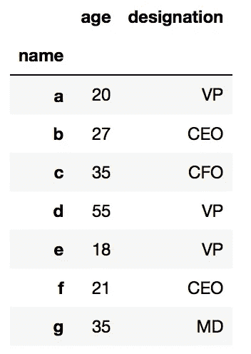**

**df.set_index(“name”)**

```
**df.set_index("age")**
```

**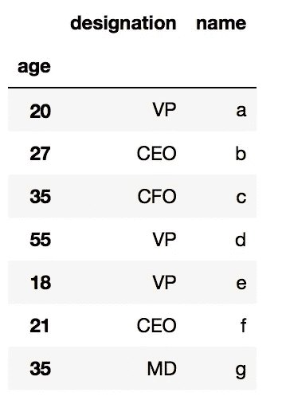**

**df.set_index(“age”)**

**我们可以通过传递一个列表将多个列设置为索引**

```
**df.set_index(["name","age"])**
```

**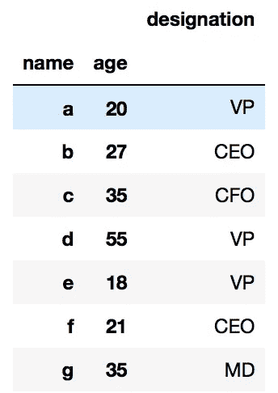**

**df.set_index([“name”,”age”])**

## **在数据框架中加载选择的列**

**任何数据分析活动都需要数据清理，我们很可能会得出结论，从需要分析的数据集中排除一些列。**

> **这不仅节省了内存，而且有助于分析感兴趣的数据**

**我们将使用相同的字典来加载***Pandas DataFrame***，但是这次我们将指定将成为 data frame 一部分的列**

```
**df = pd.DataFrame(my_dict, columns=["name", "age"])**
```

**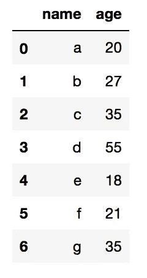**

**df = pd.DataFrame(my_dict, columns=[“name”, “age”])**

## **从数据帧中删除行和列**

*****熊猫 DataFrame*** 提供了多种删除行和列的方式。选择一个而不是另一个并没有功能上的损失。你可以使用任何你觉得舒服的语法。**

*****使用字典语法→要删除一列，我们就用*** `***del***` ***作为*****

```
**del df['name']**
```

*****使用*** `***Drop***` ***功能→允许我们删除列以及行*****

**我们是删除行还是列由`drop`函数中的第二个参数决定。**

> **函数`drop(...)`中的第二个参数**“1”**表示删除“列”，而**“0”**表示删除“行”**

```
**# Delete Column "age"df.drop('age',1)# Delete the Row with Index "3"df.drop(3,0)**
```

> **我们也可以通过在`drop(...)`函数中传递列表来删除多行和多列**

```
**# Delete Columns "name" & "age"df.drop(['name','age'],1)# Delete Rows with index "2","3", & "4"df.drop([2,3,4],0)**
```

**注意:行索引不是索引号，而是包含该值的行**

## **从列表中创建熊猫数据帧**

**如果我们得到一个没有任何列的数据集呢？**

**嗯，***Pandas DataFrame***并不介意这一点，它通过为我们隐式添加行索引和列标题来生成 data frame。**

**例如，如果我们从下面的列表中创建一个数据帧**

```
**my_list = [[1,2,3,4],
           [5,6,7,8],
           [9,10,11,12],
           [13,14,15,16],
           [17,18,19,20]]df = pd.DataFrame(my_list)**
```

**它看起来会像这样**

**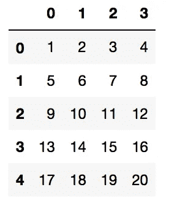**

**df = pd.DataFrame(my_list)**

**如果我们不想让***Pandas data frame***自动生成行索引和列名，我们可以将这些在`DataFrame`函数中作为**

```
**df = pd.DataFrame(
my_list, 
index = ["1->", "2->", "3->", "4->", "5->"], 
columns = ["A", "B", "C", "D"]
)**
```

**这是它看起来的样子**

**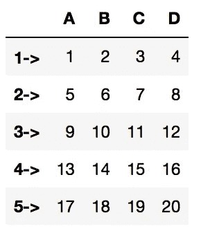**

**df with Row and Column Provided**

**应该注意的是，我们也可以从 NumPy 数组创建 Pandas 数据帧，如下所示**

```
**np_arr = np.array([[1,2,3,4],
                   [5,6,7,8],
                   [9,10,11,12],
                   [13,15,16,16],
                   [17,18,19,20]])df = pd.DataFrame(np_arr)**
```

## **数据帧上的数学运算**

**就像 Excel 表格一样， ***熊猫数据框*** 在完整的 ***数据框*** 上轻松进行数学运算。**

> **在一个单独的列中完成这些操作是可能的，这就是熊猫系列出现的原因。**

**我们将在下一篇文章中研究熊猫系列，让我们先看看数学运算是如何在完整的 ***数据帧*** 上工作的**

> *****乘法→我们可以将标量值为的数据帧与另一个数据帧*** 相乘**

```
**df * df**
```

**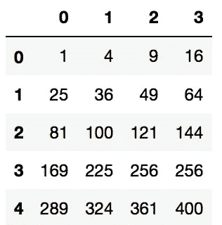**

**df * df**

```
**df * 10**
```

**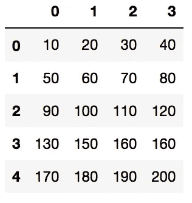**

**df * 10 ( A Scalar Value)**

> *****加法/减法→与上面的乘法类似，一个数据帧可以与一个标量值或另一个数据帧*** 相加/相减**

```
**df + 100**
```

**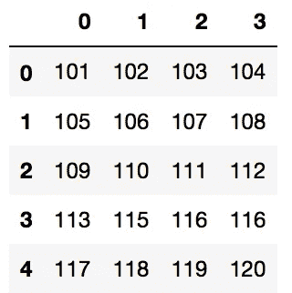**

**df + 100**

> *****位运算→可以进行位运算(AND( &)、OR (|))等来完成数据帧*****

```
**df & 0**
```

**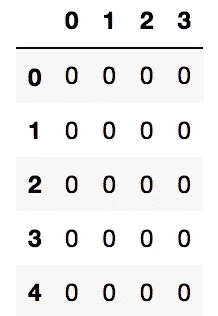**

**df & 0**

## **熊猫系列是什么？**

> **除了熊猫数据框架的一列之外，什么也没有的系列。**

> **每当我们要处理一个以上的系列时，我们就有数据框架。**

> **二者择一地**

> ****熊猫数据框是熊猫系列的集合****

***我会在下一篇文章*中谈论 [*熊猫系列*](/pandas-dataframe-a-lightweight-intro-680e3a212b96)**

***感谢阅读…！！！！***

******达克什******