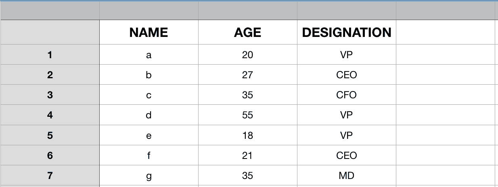
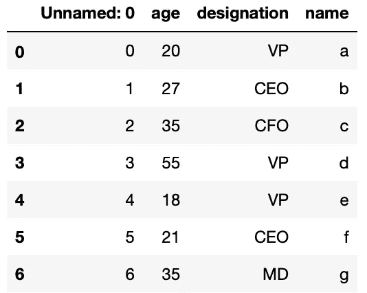
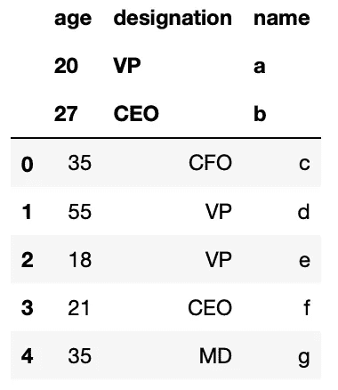
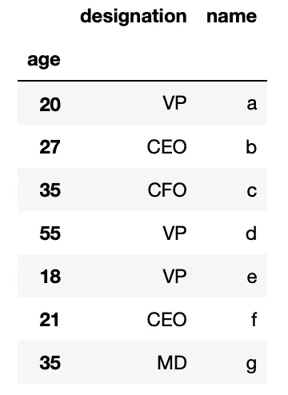
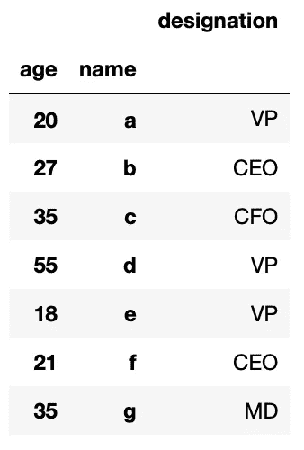
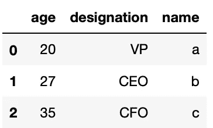

# 熊猫数据帧:使用 CSV 文件

> 原文：<https://towardsdatascience.com/pandas-dataframe-playing-with-csv-files-944225d19ff?source=collection_archive---------0----------------------->


Pandas DataFrame: Playing with CSV files

> CSV 代表逗号分隔值，这是一种在持久性存储中表示和存储面向表格、列的数据的流行方式

Pandas DataFrames 通常用于表示内存中类似 Excel 的数据。在大多数情况下，我们很可能会从持久存储中加载数据，持久存储可以是数据库或 CSV 文件。

在这篇文章中，我们将会看到如何使用 Pandas DataFrame 加载、存储和播放 CSV 文件

## 概述熊猫数据框架

我已经写了一篇名为[熊猫数据框架:轻量级介绍](/pandas-dataframe-a-lightweight-intro-680e3a212b96)的详细文章。如果你对熊猫数据框架不满意，我强烈建议你在继续这篇文章之前先看看这篇文章。

简而言之，Pandas DataFrame 只不过是 excel 之类的数据在内存中的表示。举个例子，



Pandas DataFrame → Excel like Data in Memory

该数据也可以使用 Python 字典表示为

```
my_dict = { 'name' : ["a", "b", "c", "d", "e","f", "g"],
                   'age' : [20,27, 35, 55, 18, 21, 35],
                   'designation': ["VP", "CEO", "CFO", "VP", "VP", "CEO", "MD"]}
```

我们知道我们可以通过调用`DataFrame(...)`函数从 python 字典中创建一个熊猫数据帧

```
df = pd.DataFrame(my_dict)
```

生成的数据帧应如下所示


Pandas DataFrame → From Python Dictionary

# 将数据帧保存到 CSV 文件中

一旦我们有了数据帧，我们可以将它保存在本地磁盘上的 CSV 文件中。让我们首先使用数据帧中当前存在的数据创建我们自己的 CSV 文件，我们可以使用 Pandas 数据帧的 API`to_csv(...)`以 CSV 格式存储该数据帧的数据

```
df.to_csv('csv_example')
```

现在我们有了 CSV 文件，它包含了上面数据帧中的数据。

> 正如我们可以将数据帧保存在 CSV 文件中一样，我们也可以从 CSV 文件中加载数据帧。

让我们继续加载 CSV 文件，并从中创建一个新的数据帧

```
df_csv = pd.read_csv('csv_example')
```

生成的数据帧(df_csv)应如下所示



df_csv

> 你注意到不寻常的事情了吗？

嗯，我们可以看到这个索引生成了两次，第一次是从 CSV 文件加载的，而第二次，也就是`Unnamed`是熊猫在加载 CSV 文件时自动生成的。

这个问题可以通过确保 CSV 文件的写入不写索引来避免，因为`DataFrame`无论如何都会生成。我们可以通过在`to_csv(...)`函数中指定`index = False`参数来做同样的事情

```
df.to_csv('csv_example', index=False)
```

现在，如果我们把文件读成

```
df_csv = pd.read_csv('csv_example')
```

生成的数据帧应如下所示


df_csv

现在，您可以看到输出类似于我们之前从 python 字典创建数据帧时的输出，这是我们所期望的。

## 玩弄列标题

正如我们已经看到的，第一行总是被认为是列标题，但是，通过在`read_csv(...)`函数中指定一个名为`header=<integer>`的参数，可以有多行作为列标题。

默认情况下，该值被指定为“0”，这意味着第一行将被视为标题。

```
df_csv = pd.read_csv('csv_example', header = 0)
```

结果输出将与上面相同。然而，它提供了很多机会来安排头球。例如，我们也可以将多行作为标题

```
df_csv = pd.read_csv('csv_example', header=[0,1,2])
```

生成的数据帧应如下所示



df_csv → with 3 rows as Header

正如我们在这里看到的，列 0、1 和 2 现在是标题。

> 也没有必要将第一行序列作为标题，我们可以跳过前几行，然后从特定的行开始查看表格

例如

```
df_csv = pd.read_csv('csv_example', header=5)
```

这里，产生的数据帧应该看起来像


df_csv → After skipping 5 rows

唯一的缺点是我们必须放弃标题行号之前的可用数据。它不能是结果数据帧的一部分。

即使在标题为多行的情况下，实际数据帧数据也只能从最后一个标题行之后的行开始。

```
df_csv = pd.read_csv('csv_example', header=[1,2,5])
```

产生的数据帧将从行“6”开始，看起来应该像这样


df_csv → Multiple Row Headers

## 自定义列名

尽管我们从带有列标题的 CSV 文件中读取数据，但我们仍然可以拥有自己的列名。我们可以通过在`read_csv(...)`中添加一个名为`names`的参数来达到同样的效果

```
df_csv = pd.read_csv('csv_example', names=['a', 'b', 'c'])
```

生成的数据帧应如下所示


df_csv → with our own column names

然而，即使我们成功地添加了自己的标题，顶行仍然显示一个不需要的标题。

这可以通过使用`read_csv(…)`中的`header`参数跳过描述标题的行来避免。在这种特殊情况下，我们知道第一行，即第 0 行是标题，所以我们可以跳过它

```
df_csv = pd.read_csv('csv_example', names=['a', 'b', 'c'], header=1)
```


df_csv → With Customised Header

现在，我们得到了我们想要的带有定制头的输出。

另一种方法是在将 CSV 文件写成

```
df.to_csv('csv_example', index=False, header = False)
```

阅读时，我们可以不跳过标题

```
df_csv = pd.read_csv('csv_example', names=['AGE', 'DESIGNATION', 'NAME'])
```


df_csv → With customised header

# CSV 到(任何)分隔值

虽然逗号分隔的值是众所周知的，但是`read_csv(...)`函数可以识别逗号以外的分隔符。

唯一的区别是，我们需要在函数中显式传递分隔符，而默认情况下使用逗号

*让我们首先使用不同的分隔符创建一个 CSV 文件，即“:”(冒号)*

```
df.to_csv('csv_example', index=False, sep=":")
```

这将创建一个文件，其中冒号(':')而不是逗号('，')将用作分隔符。我们可以这样阅读文件

```
df_csv = pd.read_csv('csv_example', sep=":")
```

生成的数据帧应如下所示


df_csv → with “:” as separator

# 设置行索引

默认情况下，Pandas DataFrame 会自动生成一个行索引，我们可以通过将任何列设置为索引来进行更改

```
df_csv.set_index('age')
```

下面是结果数据帧的样子



df_csv → Using ‘age’ as row index

以这种方式设置索引是一种后期操作。也就是说，我们已经有了一个带有预定义索引的数据框架，但是我们后来又改变了它。

我们可以在加载 CSV 文件时通过传递一个名为`index_col`的参数来做到这一点，该参数将自动分配由`index_col`描述的列作为行索引。

```
df_csv = pd.read_csv('csv_example', sep=":", index_col=1)
```

同样的输出应该看起来像


df_csv → with index_col = 1

我们甚至可以提供一个以上的`index_col`作为索引来对待

```
df_csv = pd.read_csv('csv_example', sep=":", index_col=[0,2])
```

输出将会是这样的



df_csv → index_col = [0,2]

## 如果不需要所有的行…不要加载它们

大多数情况下，CSV 文件都相当大，加载时可能会遇到内存限制。有一个选项，只从它加载选定的几行。

您可以通过在`read_csv(...)`中传递一个参数`nrows`来指定要加载的行数

```
# Load Only 3 Rows
df_csv = pd.read_csv('csv_example', sep=":", nrows=3)
```

这是它看起来的样子



df_csv → Loading only 3 Rows

## 跳过 CSV 文件中的空行

> 默认情况下，`read_csv(...)`函数跳过空行，即在加载文件和构建数据帧时会忽略空行。

但是，如果您想要加载空行来进行一些显式的计算，比如对空记录进行计数，您应该将跳过的空行标记为`False`

```
df_csv = pd.read_csv('csv_example', skip_blank_lines=False, sep=":")
```

这就是这篇文章的全部内容

感谢阅读…！！！

达克什