# 熊猫系列:轻量级介绍

> 原文：<https://towardsdatascience.com/pandas-series-a-lightweight-intro-b7963a0d62a2?source=collection_archive---------2----------------------->

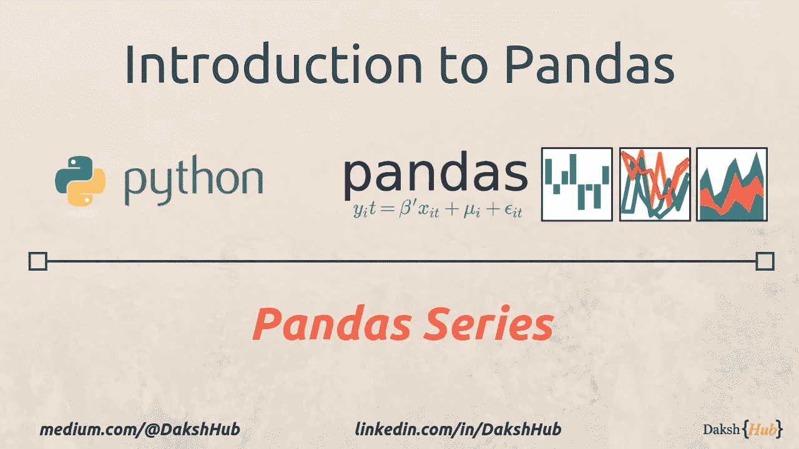

Pandas Series: A Lightweight Intro

> Pandas 是一个开源的、BSD 许可的库，为 Python 编程语言提供了高性能、易于使用的数据结构和数据分析工具。

Pandas 提供的数据结构有两种不同的类型

1.  ***熊猫数据帧&***
2.  ***熊猫系列***

本帖我们就来看看 ***熊猫系列*** 。

***注:为了更好地理解熊猫系列******之前，我强烈推荐阅读我之前在*** [***上的帖子***](/pandas-dataframe-a-lightweight-intro-680e3a212b96)

## 什么是系列？

从技术上来说，Pandas Series 是一个一维标签数组，能够保存任何数据类型。

通俗地说，熊猫系列不过是 excel 表中的一列。如下图所示，带有**名称、年龄和职务**的列代表一个系列

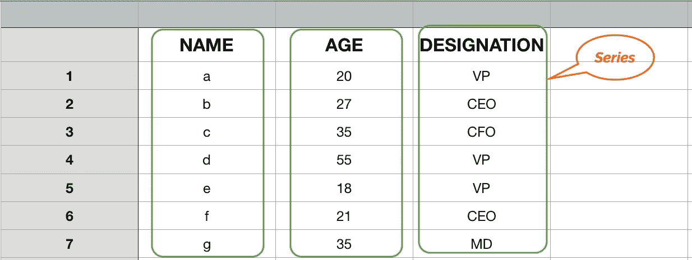

Pandas Series

> *因此，根据 Pandas 数据结构，一个系列代表内存中的一个单独的列，它或者是独立的，或者属于 Pandas 数据帧*。

> 注意:一个系列可以有自己独立的存在，而不是数据帧的一部分。

## 如何打造系列？

Pandas 系列可以从 Python 列表或 NumPy 数组中创建。必须记住，与 Python 列表不同，一个系列将总是包含相同类型的数据。这使得 NumPy 数组成为创建熊猫系列的更好的候选对象

下面是我们如何使用以上两者来创建一个熊猫系列

```
series_list = pd.Series([1,2,3,4,5,6])
series_np = pd.Series(np.array([10,20,30,40,50,60]))
```

这是它们的样子

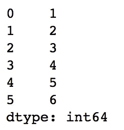

Result of → series_list = pd.Series([1,2,3,4,5,6])

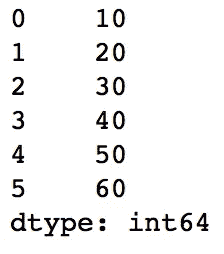

Result of → series_np = pd.Series(np.array([10,20,30,40,50,60]))

正如在创建[熊猫数据帧](/pandas-dataframe-a-lightweight-intro-680e3a212b96)时一样，该系列也默认生成行索引号，这是一个从‘0’开始的递增数字序列

正如您可能已经猜到的，在创建一个系列时，有可能拥有我们自己的行索引值。我们只需要传递索引参数，这些参数接受相同类型的列表或 NumPy 数组。

以下示例使用了 NumPy 生成的序列

```
series_index = pd.Series(
      np.array([10,20,30,40,50,60]), 
      index=np.arange(0,12,2) 
)
```

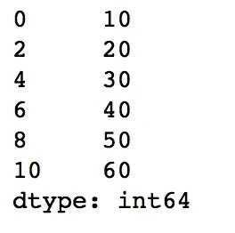

Result of → series_index = pd.Series(np.array([10,20,30,40,50,60]), index=np.arange(0,12,2) )

下面的示例使用字符串作为行索引

```
series_index = pd.Series(
        np.array([10,20,30,40,50,60]), 
        index=['a', 'b', 'c', 'd', 'e', 'f' ] 
)
```

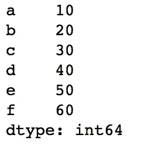

Result of → series_index = pd.Series(np.array([10,20,30,40,50,60]), index=[‘a’, ‘b’, ‘c’, ‘d’, ‘e’, ‘f’ ] )

我们可以使用序列的行索引作为

```
series_index.index
```

它返回一个 NumPy 数组，而不管我们在创建序列时是传递了一个列表还是一个 NumPy 数组

## 从 python 字典创建熊猫系列

正如我们在创建 [Pandas DataFrame](/pandas-dataframe-a-lightweight-intro-680e3a212b96) 的过程中所看到的，从 python 字典创建 DataFrame 非常容易，因为**键**映射到列名，而**值**对应于列值列表。

> **那么在创作熊猫系列的时候是如何贴图的呢？**

如果我们从 python 字典创建一个序列，那么**键**成为行索引，而**值**成为该行索引的值。

作为一个例子，让我们看看一个非常简单的只有一个键值对的字典会发生什么

```
t_dict = {'a' : 1, 'b': 2, 'c':3}# Creating a Series out of above dict
series_dict = pd.Series(t_dict)
```

这是输出的样子

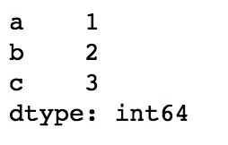

Result of → Code block Above

如果字典中的值包含一个项目列表，情况不会改变。列表项仍然是单行索引的一部分，如下例所示

```
t_dict = {'a' : [1,2,3], 'b': [4,5], 'c':6, 'd': "Hello World"}# Creating a Series out of above dict
series_dict = pd.Series(t_dict)
```

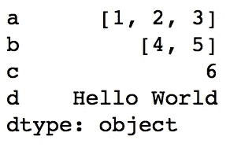

Result of → series_dict = pd.Series(t_dict)

## 从熊猫数据帧中获取序列

虽然 Pandas Series 本身对于进行数据分析非常有用，并提供了许多有用的帮助函数，但是大多数时候，分析需求将迫使我们一起使用 DataFrame 和 Series。

让我们先创建一个熊猫数据帧，就像我们在[这里](/pandas-dataframe-a-lightweight-intro-680e3a212b96)创建的一样

```
my_dict = { 
'name' : ["a", "b", "c", "d", "e"],
'age' : [10,20, 30, 40, 50],
'designation': ["CEO", "VP", "SVP", "AM", "DEV"]
}df = pd.DataFrame( my_dict, 
index = [
"First -> ",
"Second -> ", 
"Third -> ", 
"Fourth -> ", 
"Fifth -> "])
```

下面是结果数据帧的样子

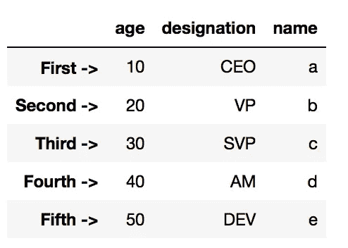

Result of → DataFrame creation from dictionary

DataFrame 提供了两种访问列的方法，即使用字典语法`df['column_name']`或`df.column_name`。每次我们使用这些表示得到一个列，我们得到一个熊猫系列。

在上面的例子中，我们可以通过访问列来获得序列(即一个单独的列)

```
series_name = df.name
series_age = df.age
series_designation = df.designation
```

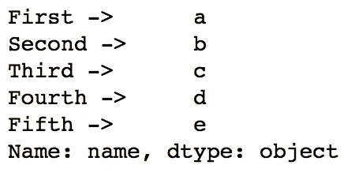

series_name

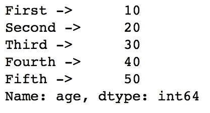

Series_age

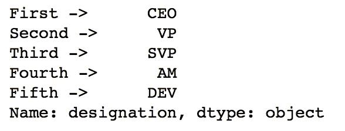

series_designation

## 通过遍历数据帧的列来获取序列

> 如果我们不知道列的名称会怎么样？

Pandas DataFrame 是可迭代的，我们可以遍历各个列来获得序列

```
series_col = []
for col_name in df.columns:
    series_col.append(df[col_name])
```

## 使用系列创建数据框(独立或组合)

熊猫数据帧只不过是一个系列(1+)的集合。我们可以通过使用单个系列或组合多个系列来生成数据帧

例如，让我们通过组合`series_name`和`series_age`生成一个数据帧

```
df_from_series = pd.DataFrame([series_name, series_age])
```

令您惊讶的是，生成的数据帧看起来应该是

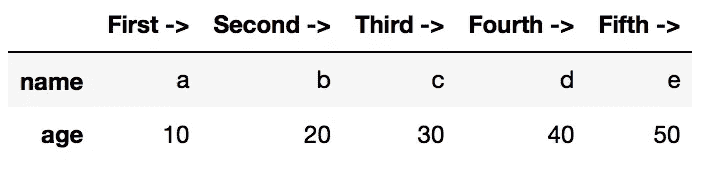

df_from_series

是的，序列的行索引成为列，而列成为行索引值。你可以认为这类似于矩阵的转置。即使我们提供单个系列来创建数据帧，也是如此

```
df_from_series_single = pd.DataFrame([series_name])
```

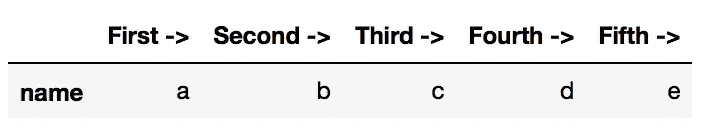

df_from_series_single

然而，当我们从序列中移除列表/数组符号时，这种情况不会发生。例如

```
df_from_series_single = pd.DataFrame(series_name)
```

将导致序列列名和行索引的保留

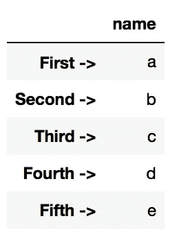

df_from_series_single

> 注意:不幸的是，这仅限于一个系列，因为 DataFrame API 不接受一个以上的系列参数

## 用 Python 字典创建数据帧的行为

当我们将 python 字典作为数组传递来创建 DataFrame 时，也会观察到同样的行为。让我们看看我们之前创建的`t_dict = {'a': 1, ‘b’: 2, ‘c’:3}`

```
ds = pd.DataFrame([t_dict])
```

得到的数据帧应该看起来像这样

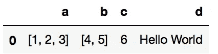

ds

其中键被表示为列，否则如果我们创建了一个序列，它们将被表示为行索引

我们甚至可以组合多个`t_dict`来创建一个数据帧

```
ds = pd.DataFrame([t_dict, t_dict ], index=[1,2])
```

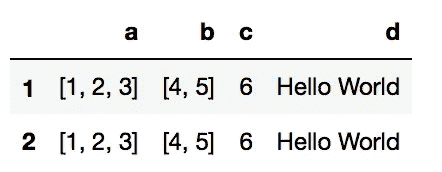

ds

## 系列助手功能

就像熊猫 DataFrame 一样，Series 也有多组帮助器函数用于数据分析。

请注意，Pandas DataFrame 的所有列助手功能都将适用于 Pandas 系列。一些例子是

```
#Getting the mean of a Series
series_age.mean()# Getting the size of the Series
series_age.size# Getting all unique items in a series
series_designation.unique()# Getting a python list out of a Series
series_name.tolist()
```

## 迭代序列

就像 python 中的许多其他数据结构一样，可以使用一个简单的 for 循环来迭代序列

```
for value in series_name:
    print(value)
```

我们还可以迭代索引为

```
for row_index in series_name.keys():
    print(row_index)
```

熊猫系列的基本用法就这些了。

感谢阅读…！！！

达克什