# 熊猫的提示和技巧

> 原文：<https://towardsdatascience.com/pandas-tips-and-tricks-33bcc8a40bb9?source=collection_archive---------0----------------------->

这篇文章包括一些有用的提示，告诉你如何使用 Pandas 对大型数据集进行有效的预处理和特征工程。

# 熊猫 [Ufuncs](https://docs.scipy.org/doc/numpy/reference/ufuncs.html) 以及为什么它们比应用命令好得多

Pandas 有一个**应用**函数，可以让你对一列中的所有值应用任何函数。注意，**应用**比循环的 **python 快一点点！这就是为什么最推荐使用 pandas built[**ufuncs**](https://docs.scipy.org/doc/numpy/reference/ufuncs.html)**对列应用预处理任务(如果有合适的 **ufunc** 可用于您的任务)**。**[**Ufuncs**](https://docs.scipy.org/doc/numpy/reference/ufuncs.html)**，**是用 C 实现的特殊函数(基于 numpy 库)，这也是它们高效的原因。我们将提到的有用的 ufuncs 有:。**差异，。移位，。累计。累计，。str 命令**(作用于字符串)**，。dt 命令**(作用于日期)等等。****

# **示例数据集—夏季活动**

**我将用不同的人名、它们的夏季活动和它们相应的时间戳来演示熊猫的把戏。一个人可以在不同的时间戳中进行多个活动。**

**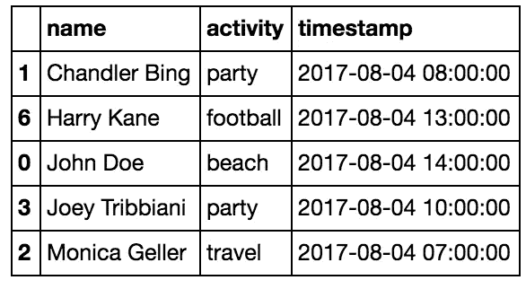**

**Randomly generated data with summer activities**

**假设我们的目标是预测，基于给定的数据集，谁是数据集中最有趣的人:)。**

****

**Fun Fun Fun!**

# **1.字符串命令**

**对于字符串操作，最推荐使用 Pandas **字符串** **命令**(它们是**ufunc)。****

**例如，您可以使用 **.str.split** 和 expand=True 将包含一个人的全名的列拆分为包含名和姓的两列。**

**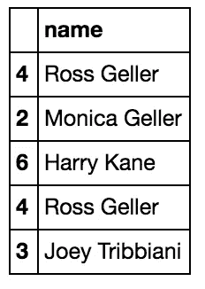**

**Name column before split**

```
df[‘name’] = df.name.str.split(" ", expand=True)
```

**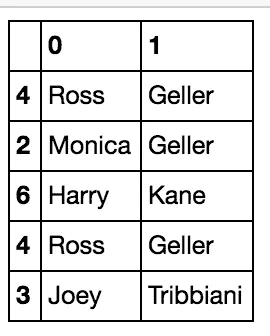**

**Name column after split**

**此外，您可以使用 **.str.replace** 和合适的 **regex** 有效清洁任何管柱[。](https://pandas.pydata.org/pandas-docs/stable/generated/pandas.Series.str.replace.html)**

# **2.分组依据和值计数**

****Groupby** 是一个非常强大的熊猫方法。您可以按一列分组，并使用 **value_counts** 对另一列的值进行计数。使用 **groupby** 和 **value_counts** 我们可以计算每个人做了多少活动。**

```
df.groupby('name')['activity'].value_counts()
```

**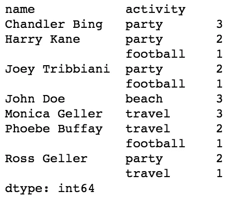**

**Group by person name and value counts for activities**

**这是[多索引，](https://pandas.pydata.org/pandas-docs/stable/advanced.html)pandas 数据框架中的一个有价值的技巧，它允许我们在数据框架中有几级索引层次。在这种情况下，人名是索引的第 0 层，而活动在第 1 层。**

# ****3。拆垛****

**我们还可以通过在上面的代码中应用 unstack 来为每个人的夏季活动计数创建特性。**取消堆叠**将行切换到列，以获取活动计数作为特征。通过执行 **unstack** ，我们将索引的最后一级转换为列。所有的活动值现在将成为数据帧的列，当一个人没有进行某项活动时，该功能将获得一个值。 **Fillna** 用 0 填充所有这些缺失的值(人员没有访问的活动)。**

```
df.groupby('name')['activity'].value_counts().unstack().fillna(0)
```

**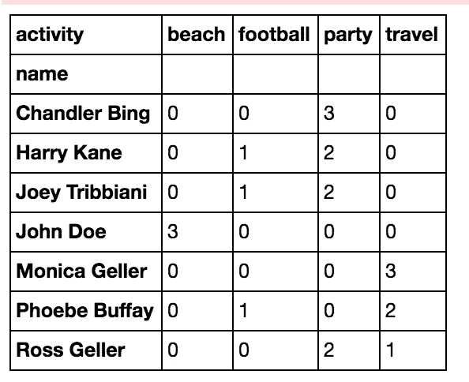**

**Activity count in columns**

# **3.groupby、diff、shift 和 loc +提高效率的绝佳技巧**

**了解个人活动之间的时差对于预测谁是最有趣的人来说是非常有趣的。一个人在聚会上混了多久？他/她在海滩逗留了多长时间？这可能对我们有用，取决于活动。**

**计算时差的最直接的方法是通过人名对**分组，然后使用 **diff** 计算时间戳字段的时差():****

```
df = df.sort_values(by=['name','timestamp'])
df['time_diff'] = df.groupby('name')['timestamp'].diff()
```

**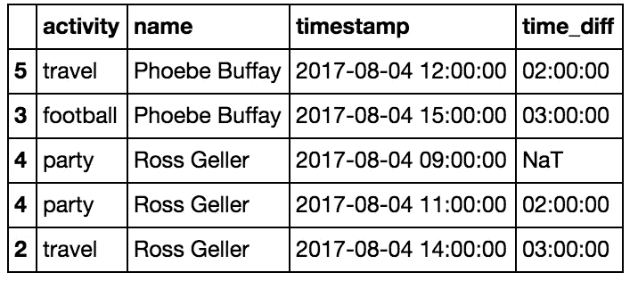**

**Calculating the time difference between person activities to get the duration of each activity**

**如果你有很多数据，并且你想节省一些时间(根据你的数据大小，这可以快 10 倍左右)，你可以跳过 **groupby** ，在对数据排序后只做 **diff** ，然后删除不相关的每个人的第一行。**

```
df = df.sort_values(by=['name','timestamp'])
df['time_diff'] = df['timestamp'].diff()
df.loc[df.name != df.name.shift(), 'time_diff'] = None
```

**BTW —有用的**。Shift** 命令将所有列向下移动一个空格，这样我们就可以看到该列在哪一行发生了变化:df.name！=df.name.shift()。**

**还有**。loc** 命令是为特定索引设置列值的最推荐方法。**

**要将 time_diff 更改为秒单位:**

```
df['time_diff'] = df.time_diff.dt.total_seconds()
```

**要获得每行的持续时间:**

```
df[‘row_duration’] = df.time_diff.shift(-1)
```

**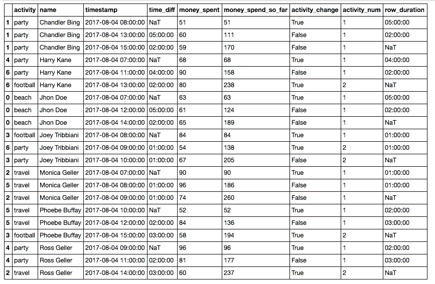**

**Added duration per row**

# **4.累计和累计**

**这是两个非常酷的 Ufuncs，可以帮助你做很多事情。累计计数创建累计计数。例如，我们可以通过按人名分组，然后应用累计，只对每个人进行第二项活动。这将只是按顺序对活动进行计数。然后，我们可以通过 do = = 1(或通过 do = = 2 的第三个活动)并在原始排序的数据帧上应用索引，为每个人仅获取第二个活动。**

```
df = df.sort_values(by=['name','timestamp'])df2 = df[df.groupby(‘name’).cumcount()==1]
```

**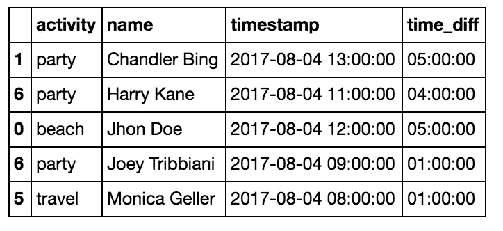**

**The second activity of each person**

```
df = df.sort_values(by=[‘name’,’timestamp’])df2 = df[df.groupby(‘name’).cumcount()==2]
```

**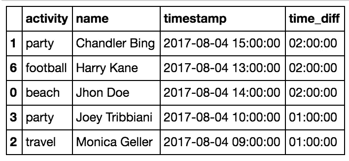**

**The third activity of each person**

**累计只是一个数值单元格的累计汇总。例如，您可以将一个人在每项活动中花费的钱添加为附加单元格，然后使用以下公式汇总一个人在一天中每个时间花费的钱:**

```
df = df.sort_values(by=[‘name’,’timestamp’])df['money_spent_so_far'] = df.groupby(‘name’)['money_spent'].cumsum()
```

**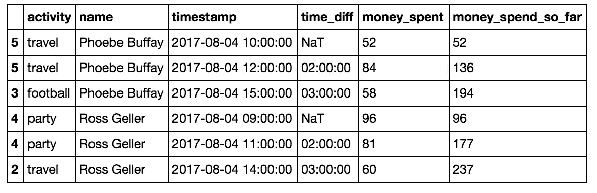**

**Money spent so far**

# **5.用于测量活动持续时间的 groupby、max、min**

**在第 3 部分，我们想知道每个人在每项活动中花费了多少时间。但是我们忽略了有时我们会得到一个活动的多个记录，而这个活动实际上是相同活动的继续。因此，为了获得实际的活动持续时间，我们应该测量从第一个连续活动出现到最后一个活动出现的时间。为此，我们需要标记活动的变化，并用活动编号标记每一行。我们将使用**来做这件事。换档**命令和**。我们之前看到的 cumsum** 命令。新活动是指活动发生变化**或**时，人员发生变化。**

```
df['activity_change'] = (df.activity!=df.activity.shift()) | (df.name!=df.name.shift())
```

**然后，我们将通过对每个用户进行分组并应用 glorious 来计算每行的活动数量。**累计值**:**

```
df['activity_num'] = df.groupby('name')['activity_change'].cumsum()
```

**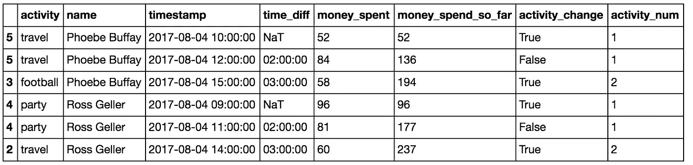**

**Add activity num for the activities which continues between rows**

**现在，我们可以按如下方式计算每个活动的持续时间:按名称和活动编号(以及活动—这并不真正改变分组，但我们需要它具有活动名称)分组，并计算每行活动持续时间的总和:**

```
activity_duration = df.groupby(['name','activity_num','activity'])['activity_duration'].sum()
```

**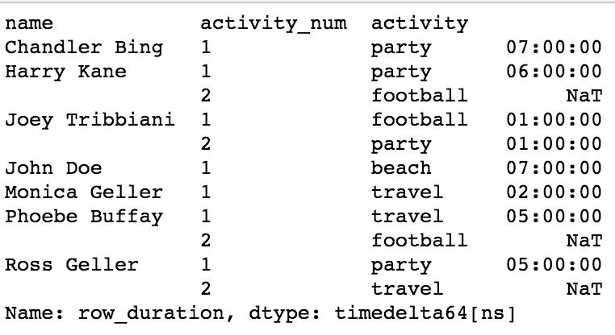**

**activity duration**

**这将返回某种 timedelta 类型的活动持续时间。您可以使用. dt.total_seconds 获得以秒为单位的会话活动持续时间:**

```
activity_duration = activity_duration.dt.total_seconds()
```

**然后，您可以使用如下命令计算每个人的最大/最小活动持续时间(或中位数或平均值):**

```
activity_duration = activity_duration.reset_index().groupby('name').max()
```

****

**Maximal activity duration per user**

# **摘要**

**这是一个短期的熊猫旅行，使用了一个夏季活动的数据集。希望你已经学会并喜欢它。祝你的下一个熊猫项目好运，享受这个夏天！**