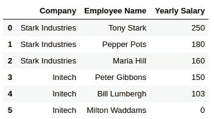
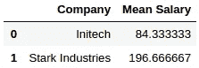
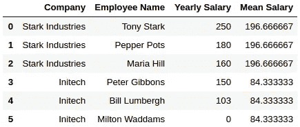
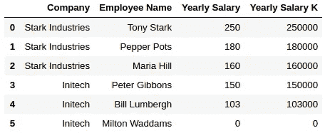
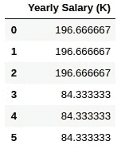

# 熊猫变了——不仅仅是看上去那样

> 原文：<https://towardsdatascience.com/pandas-transform-more-than-meets-the-eye-928542b40b56?source=collection_archive---------4----------------------->

最近我一直在和熊猫一起工作。在做一个项目时，我遇到了一个我以前不知道的漂亮的函数，经过询问，似乎我不是唯一一个错过的人，所以让我们补救一下。


首先，让我们回顾一下基础知识。

# **拆分—应用—合并**

这是一种常见的方法。我们希望根据某些标准将数据分组，然后将我们的逻辑应用于每个组，最后将数据组合回单个数据框中。让我们看看我们的数据。我们有两家不同公司的几名员工的年薪:



Well researched data, aka I made it up.

“应用”阶段的一个众所周知的函数是 aggregate(或 agg)。当你可以把那些讨厌的细胞压缩成一个的时候，为什么还要有它们呢？使用 aggregate，您可以对数据求和、求平均值或任何其他此类计算，如下所示:

```
mean_salary = df.groupby('Company')['Yearly Salary'].\
aggregate('mean').rename("Mean Salary").reset_index()
```



您甚至可以为每列指定不同的功能！

在任何情况下，结果都是组中的每一列都减少为一个数据单元格。现在，为了将它组合回我们的数据帧，我们需要使用 merge。

```
df1 = df.merge(mean_salary)
```



我们可以在“应用”阶段使用的另一个功能是(惊喜！)应用功能。它允许我们对数据框中的一列(或一行)应用任何我们想要的函数。它可以是 lambda 函数，也可以是我们在别处定义的函数。这一次，数据没有减少，而是对每个单元格分别进行操作:

```
df['Yearly Salary K'] = df['Yearly Salary'].apply(lambda x: x*1000)
```



当我遇到一个问题时，我已经愉快地使用这些功能有一段时间了。我有想要拆分、运行一些逻辑并重新组合的数据，但我不想减少数据或单独运行每一行。相反，我希望对每组中我的列的每个单元格进行一些计算，并返回一个考虑到整个组的结果。数据的大小需要保持不变。

长话短说——在与这个问题纠缠了一会儿之后，一个队友告诉我去查一下 aggregate 的一个不太出名的表亲 transform。答对了。

# 改变

让我们看看变换是如何工作的:

```
df.groupby('Company').transform('mean')
```



我们得到的不是减少结果，而是与原始数据大小相同的结果。这使得组合数据变得非常简单。让我们添加另一行来展示我们可以做些什么:

```
df['avg_company_salary'] = df.groupby('Company').transform('mean')
df['is_above_avg_salary'] = \
df['avg_company_salary'] < df['Yearly Salary']
```


正如我们之前所展示的，在这个具体的例子中，您可以使用 aggregate 和 merge 来完成相同的结果，但是关于 transform 很酷的一点是，您可以在一个步骤中完成它。

我希望您也会发现转换函数很有用，并且您很快就会有机会使用它！


©Hasbro

对 git 也感兴趣吗？阅读我的帖子 [Git:升级](https://medium.com/@daphnaregev/git-level-up-bfbd85444622)来提升你的 Git 游戏。