# 计算生物学中机器学习的十个快速提示

> 原文：<https://towardsdatascience.com/paper-break-down-ten-quick-tips-for-machine-learning-in-computational-biology-3b224f6fed7e?source=collection_archive---------6----------------------->

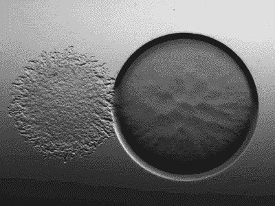

Gif from [here](https://giphy.com/gifs/art-design-biology-Wk0f3Mri3iSVW/download)

所以今天，我不想做一些技术性的东西。我发现了这篇由[大卫](https://twitter.com/DavideChicco_it)写的论文[计算生物学中机器学习的十个快速技巧](https://biodatamining.biomedcentral.com/articles/10.1186/s13040-017-0155-3)。因此，让我们深入研究生物学中机器学习的十个技巧吧！

**提示 1:检查并合理安排你的输入数据集**

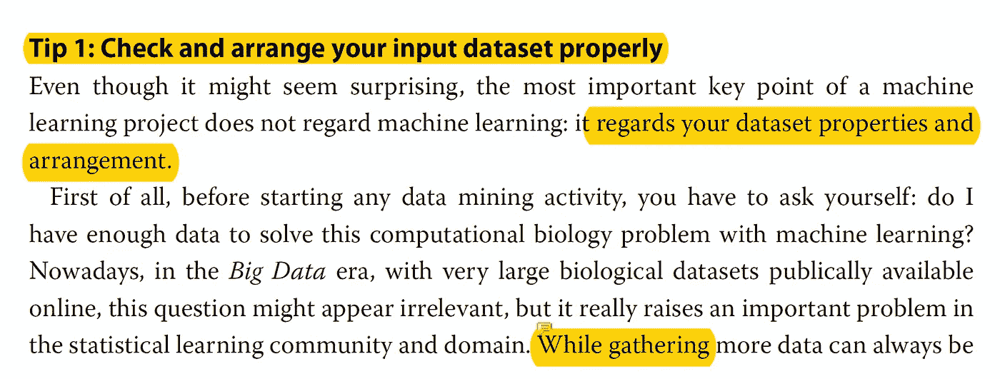

因此，在第一部分，作者建议，拥有足够的数据来实际上使机器学习模型正常工作。以及一些其他方法，例如随机混洗给定的数据。最后，作者建议，如果你有足够的数据，去除一个离群值，当你没有足够的数据时，将离群值四舍五入到上限。

**提示 2:将你的输入数据集分成三个独立的子集(训练集、验证集、测试集)**

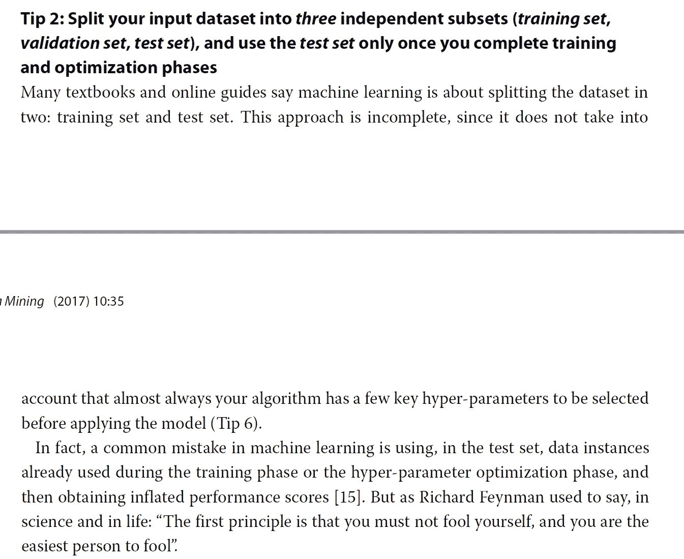

很标准的方法来分割数据集，分成三个不同的数据集。训练、验证和测试集。作者还说，不要试图用训练阶段的测试数据来欺骗自己，以达到更高的准确率。

**提示 3:将你的生物学问题纳入正确的算法范畴**

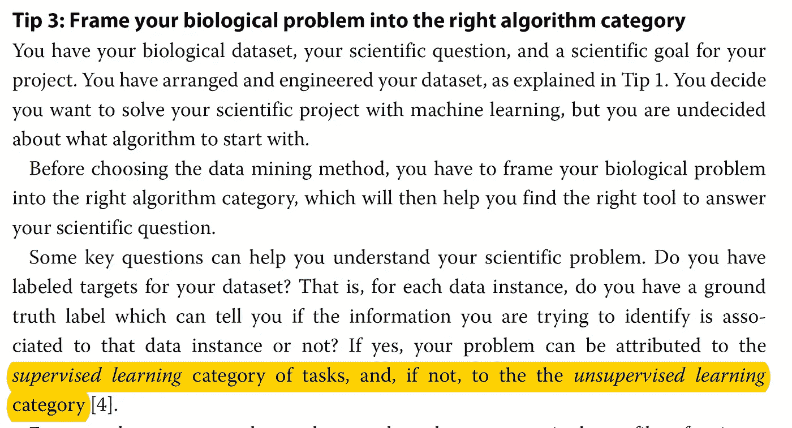

这一部分可以总结为一句话，根据你的数据，你必须选择使用监督学习或无监督学习方法。这是一个有趣的部分，但是我要补充的是，可能有一些问题可以通过生物学中的强化学习或半监督学习来解决。

**技巧四:应该选择哪个算法开始？最简单的一个！**

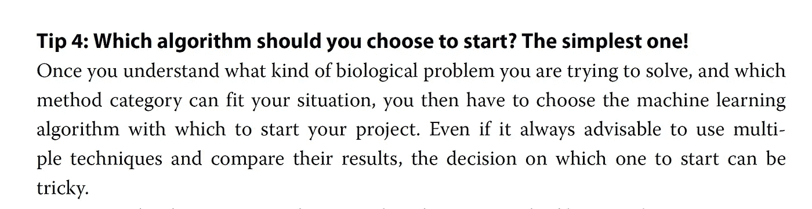

作者推荐使用 K-均值聚类的无监督学习方法，和 K-最近邻的监督学习问题。我也认为最简单的解决方案是最优雅的解决方案。

**提示 5:处理不平衡数据问题**

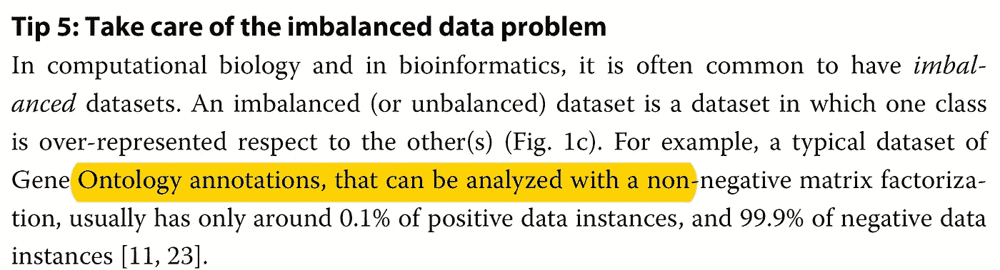

在这里，作者建议确保你的数据集是适当平衡的。如果不是这样，作者也给了我们一个非常简单的规则，可以抵消这种差异。也就是 50%平均法则。

例如，如果你的数据中有 90%的反面例子，10%的正面例子。

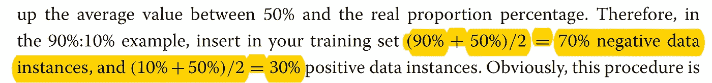

通过使用如上所示的 50%平均规则，您可以获得将多少数据放入您的模型的良好比率。

**提示 6:优化每个超参数**

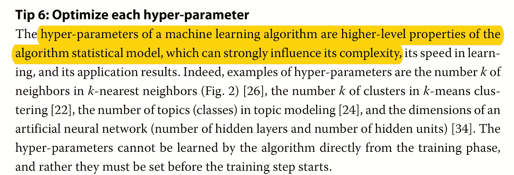

再次总结，用你的数据集做很多实验，选择最佳的超参数。

**提示 7:最小化过度装配**

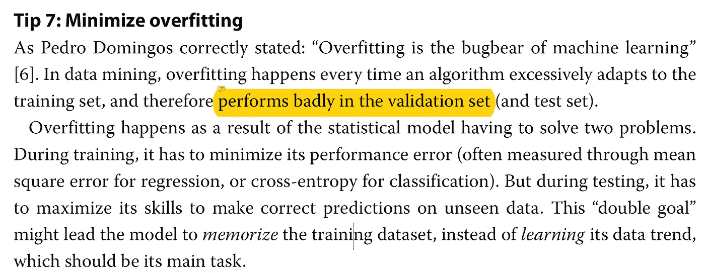

所以，提示的标题说明了一切，要意识到过度合身的问题，并尽量减少它。我的建议是，也要注意不合身。

**提示 8:用马修斯相关系数(MCC)或精确召回曲线**评估你的算法性能

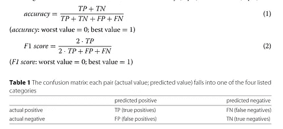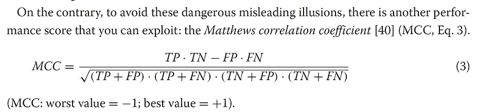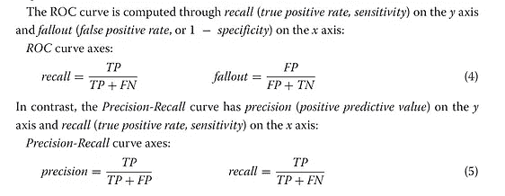

作者建议使用不同的度量系统来正确评估你的算法。这些指标包括准确性、F1 分数、MCC、召回率、脱落率、精确度、ROC 曲线和精确度-召回率曲线。

**提示 9:用开源代码和平台来编写你的软件**

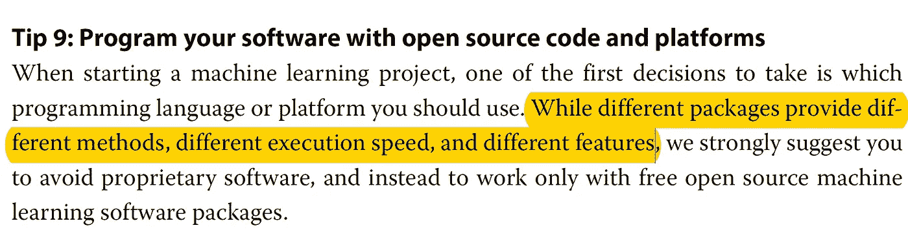

总结:使用 python、R、IBM Spss 等开源软件。

**提示 10:向计算机科学专家或在线社区寻求反馈和帮助**

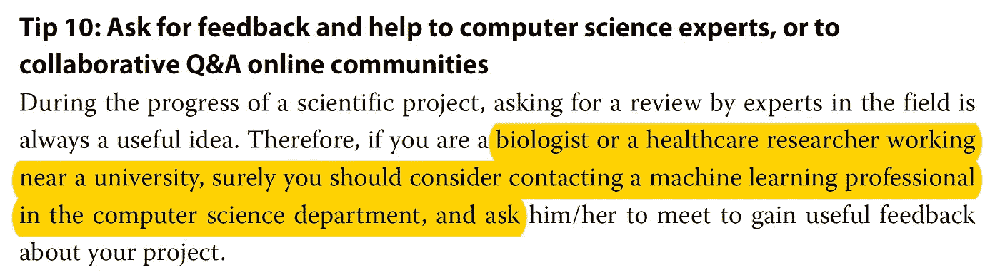

在 Reddit 或任何行业专家领域(甚至在媒体上)询问你的算法在给定数据集上的表现如何。

**最后的话**

这篇文章对于机器学习社区的初学者来说是一个很好的概述。

如果发现任何错误，请发电子邮件到 jae.duk.seo@gmail.com 给我，如果你想看我所有写作的列表，请在这里查看我的网站。

同时，在我的 twitter [这里](https://twitter.com/JaeDukSeo)关注我，并访问[我的网站](https://jaedukseo.me/)，或我的 [Youtube 频道](https://www.youtube.com/c/JaeDukSeo)了解更多内容。如果你感兴趣的话，我还做了解耦神经网络的比较。

**参考**

1.  奇科博士(2017)。计算生物学中机器学习的十个快速技巧。生物数据挖掘，10(1)。doi:10.1186/s 13040–017–0155–3