# 论文复制:使用“MAML”和“爬行动物”进行深度元学习

> 原文：<https://towardsdatascience.com/paper-repro-deep-metalearning-using-maml-and-reptile-fd1df1cc81b0?source=collection_archive---------1----------------------->

Source: [imgur](https://imgur.com/CuE2jCg)

在这篇文章中，我复制了最近在元学习领域的两篇论文: [MAML](https://arxiv.org/abs/1703.03400) 和类似的[爬行动物](https://arxiv.org/abs/1803.02999)。这个复制的完整笔记本可以在[这里](https://github.com/AdrienLE/ANIML/blob/master/ANIML.ipynb)找到。

这两篇论文的目标都是解决 *K-shot* 学习问题。在 K-shot 学习中，我们需要训练一个神经网络来基于非常少量的例子(通常在 10 个左右的数量级)进行归纳，而不是我们在 ImageNet 等数据集中看到的通常成千上万的例子。

然而，在为 K-shot 学习做准备时，你可以就许多类似的 K-shot 问题进行训练，以学习仅基于 K 个示例进行归纳的最佳方式。

这就是*学学*或**元学**。我们已经在我的文章“通过梯度下降学习学习”中看到了元学习，你可以在这里找到:

 [## 论文报告:“通过梯度下降学习”

### 这篇文章是一系列深度学习论文复制文章的第一篇。

becominghuman.ai](https://becominghuman.ai/paper-repro-learning-to-learn-by-gradient-descent-by-gradient-descent-6e504cc1c0de) 

爬行动物和 MAML 的元学习方法都是为神经网络提出一个**初始化**，这个初始化很容易推广到类似的任务。这与“通过梯度下降学习”不同，在“梯度下降学习”中，我们不是在学习初始化，而是在学习优化器。

# 迁移学习

这种方法非常类似于**迁移学习**，其中我们在比如说 ImageNet 上训练一个网络，后来证明，微调这个网络可以很容易地学习另一个数据少得多的图像数据集。事实上，迁移学习可以被视为元学习的一种形式。事实上，它可以用来从非常小的数据集学习，正如你在这里看到的。

这里的区别在于，最初的网络是以易于推广为明确目的进行训练的，而迁移学习只是“偶然”发生作用，因此可能不会最佳地发挥作用。

事实上，很容易找到迁移学习无法学习到好的初始化的例子。为此我们需要看一下 *1D 正弦波回归问题*。

在这个 K-shot 问题中，每个任务包括学习一个修改的正弦函数。具体来说，对于每个任务，底层函数的形式将是 *y = a sin(x + b)* ，随机选择 *a* 和 *b* ，我们的神经网络的目标是学习仅基于 10 (x，y)对找到给定的 *x* 的 *y* 。

让我们绘制几个正弦波任务示例:

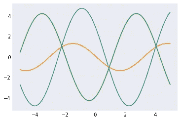

3 random tasks

为了理解为什么这将是迁移学习的一个问题，让我们画出其中的 1000 个:

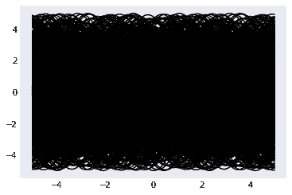

1,000 random tasks

至少可以说，看起来每个 x 值都有很多重叠…

由于跨多个任务的每个 x 有多个可能的值，如果我们训练单个神经网络同时处理多个任务，它的最佳选择将只是返回每个 x 跨所有任务的平均 y 值。

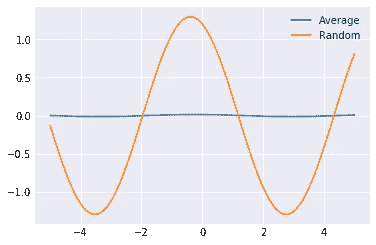

Average value for each x, with random task shown for scale

平均值基本上是 0，这意味着一个经过大量任务训练的神经网络在任何地方都会返回 0！不清楚这是否真的会有很大帮助，然而这个**是**在这种情况下的迁移学习方法…

让我们通过实际实现一个简单的模型来解决这些正弦波任务，并使用迁移学习来训练它，来看看它做得有多好。首先，模型本身:

你会注意到它是以一种奇怪的方式实现的(什么是“可修改模块”？什么是“梯度线性”？).这是因为我们稍后将使用 MAML 来训练它。关于这些类的细节，请查看笔记本，但是现在你可以假设它们类似于 nn。模和线性神经网络。

现在，让我们按顺序对它进行一系列不同的随机任务的训练:

下面是当我们试图将这个转移模型微调到一个特定随机任务时发生的情况:

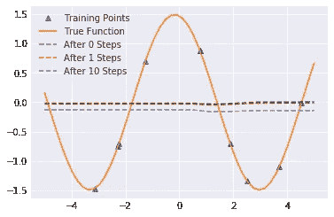

Transfer learning on a specific random task

基本上，看起来我们的传递模型学习了一个常量函数，很难将它微调到更好的状态。甚至不清楚我们的迁移学习是否比随机初始化更好……的确不是！随着时间的推移，随机初始化最终会比微调我们的传输模型获得更好的损失。

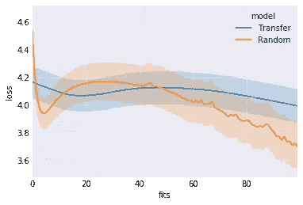

Learning curve for transfer learning vs random initialization

# MAML

我们现在来看 MAML，这是我们今天要看的两个算法中的第一个。

如前所述，我们试图找到一组权重，以便在类似的任务上运行梯度下降可以尽可能快地取得进展。MAML 通过运行梯度下降的一次迭代，然后根据一次迭代朝着真正的任务前进了多少来更新初始权重，非常严格地执行了这个*。更具体地说，它:*

*   创建初始化权重的副本
*   对副本上的随机任务运行梯度下降迭代
*   通过梯度下降的迭代反向传播在*测试*集合上的损失，并返回到初始权重，以便我们可以在它们更容易更新的方向上更新初始权重。

因此我们需要一个梯度的梯度，也就是这个过程中的二阶导数。幸运的是，这是 PyTorch 现在支持的东西，不幸的是，PyTorch 使更新模型的参数变得有点笨拙，我们仍然可以通过它们运行梯度下降(我们已经看到这是“通过梯度下降学习学习”)，这解释了模型编写的奇怪方式。

因为我们将使用二阶导数，我们需要确保允许我们计算原始梯度的计算图保持不变，这就是为什么我们将`create_graph=True`传递给`.backward()`。

那么它是如何在特定的随机任务中发挥作用的呢？

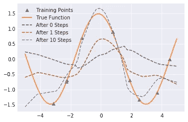

Training on a random function using MAML

哇，那好多了，甚至在梯度下降一步后，正弦形状开始可见，10 步后，波的中心几乎完全正确。这是否反映在学习曲线上？是啊！

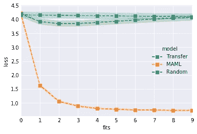

不幸的是，有点烦人的是，我们必须为此使用二阶导数…这迫使代码变得复杂，也使事情变得相当慢(根据论文，大约 33%，这与我们将在这里看到的相符)。

有没有不使用二阶导数的 MAML 近似值？当然啦！我们可以简单地假设，我们用于内部梯度下降的梯度只是凭空出现，因此只是改善初始参数，而不考虑这些二阶导数。让我们为 MAML 训练函数添加一个一阶参数来处理这个问题:

那么这个一阶近似有多好呢？事实证明，它几乎和原来的 MAML 一样好，而且确实快了大约 33%。

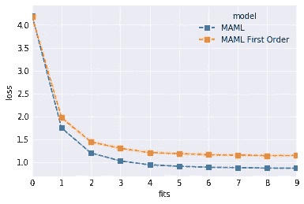

Learning curve of MAML vs MAML first order

# 爬行动物

MAML 的一阶近似告诉我们，一些有趣的事情正在发生:毕竟，梯度是如何产生的似乎应该与一个好的初始化相关，然而它显然不是那么多。

爬虫进一步发展了这个想法，告诉我们做以下事情:在一个给定的任务上对**运行几次**的 SGD 迭代，然后在 SGD 的 k 次迭代后，将你的初始化权重向你获得的权重方向移动一点。一个非常简单的算法，只需要几行伪代码:

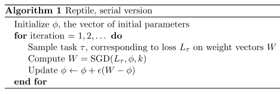

当我第一次读到这里的时候，我很紧张:这不就和在每项任务中交替训练你的重量一样吗，就像在迁移学习中一样？这怎么可能行得通呢？

事实上，爬行动物的论文预见到了这种反应:

> *你可能会想“这不就和训练预期损失* Eτ [Lτ] *一样吗？”然后检查日期是否是 4 月 1 日。*

碰巧的是，我在 4 月 2 日写这篇文章，所以这一切都是严肃的。这是怎么回事？

事实上，如果我们运行 SGD 进行单次迭代，我们会得到与上述迁移学习相同的东西，但我们没有，我们使用了几次迭代，因此我们每次更新的权重实际上间接取决于损失的二阶导数，类似于 MAML。

好吧，但是，为什么会这样呢？爬行动物为此提供了一个令人信服的直觉:对于每项任务，都有最优的权重。事实上，可能有**许多**组权重是最优的。这意味着，如果您承担几项任务，那么应该有一组权重，对于每项任务，这些权重与至少一组最佳权重之间的距离是最小的。这组权重是我们想要初始化我们的网络的地方，因为它可能是对任何任务来说达到最优所必需的最少工作的权重。这是爬行动物发现的一组砝码。

我们可以在下图中直观地看到这一点:两条黑线代表两个不同任务的最优权重集，而灰线代表初始化权重。爬虫试图使初始化权重越来越接近最佳权重彼此最接近的点。

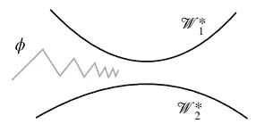

现在让我们实现爬行动物，并将其与 MAML 进行比较:

它如何看待一个随机问题？漂亮:

Reptile performance on a random problem

学习曲线呢？

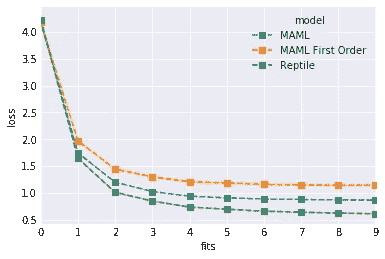

Learning curve of Reptile, MAML and MAML first-order

看起来爬虫确实用一个更简单和更快的算法实现了和 MAML 相似甚至更好的性能！

所有这些都适用于更多的问题，而不仅仅是这个正弦波的玩具例子。要了解更多细节，我真的建议你阅读报纸。在这一点上，你应该有足够的背景来理解他们相当容易。

未来真正有趣的是将这些方法不仅应用于 K-shot 学习问题，还应用于更大的问题:对于基于中等规模数据集(几百或几千个，而不是 K-shot 学习中常见的大约 10 个)的训练模型，迁移学习在图像分类领域非常成功。使用爬行动物训练 resnet 网络会产生比我们现有的模型更适合迁移学习的东西吗？